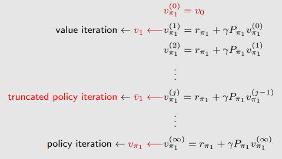

# 值迭代与策略迭代（Value Iteration and Policy Iteration）

##  值迭代

即对贝尔曼最优公式进行迭代求解

### 算法步骤

#### Step 1: 策略更新  policy update

值迭代每轮会根据当前 $v_k$ 计算 $q_k(s,a)$，然后在每个状态选取使 $q_k$ 最大的动作：
$$
q_k(s,a) \;=\; \sum_{r} p(r\mid s,a)\,r \;+\; \gamma \sum_{s'} p(s'\mid s,a)\, v_k(s')\\
a_k^*(s)=\arg\max_{a} q_k(s,a)
$$

据此得到贪心策略（greedy policy）：
$$
\pi_{k+1}(a\mid s)=
\begin{cases}
1, & a=a_k^*(s) \\
0, & a\neq a_k^*(s)
\end{cases}
$$

直观理解：**在每个状态只选当前看来最划算的动作**。

#### Step2: 价值更新 value update

用上一步的贪心选择来更新价值函数。因为策略是贪心且确定性的，所以状态价值直接变为最大 $q$：
$$
v_{k+1}(s)=\max_a q_k(s,a)
$$

这一步就是 Bellman 最优算子的迭代形式：
- 不需要显式“评估”整条策略（不像策略迭代那样要做多轮 policy evaluation）
- 每轮直接做一次“最大化更新”

#### 总结

对每一轮迭代：
1. 用 $v_k$ 计算所有 $q_k(s,a)$
2. 在每个状态选出 $a_k^*(s)=\arg\max_a q_k(s,a)$（得到贪心策略 $\pi_{k+1}$）
3. 价值更新：$v_{k+1}(s)=\max_a q_k(s,a)$
4. 重复直到收敛（例如 $\|v_{k+1}-v_k\|$ 小于阈值）

$$
v_k(s)\;\to\;q_k(s,a)\;\to\;\text{greedy }\pi_{k+1}\;\to\;v_{k+1}(s)=\max_a q_k(s,a)
$$

#### 伪代码

```text
Input:
  - 状态集合 S，动作集合 A(s)
  - 环境模型 p(r|s,a), p(s'|s,a)
  - 折扣因子 γ ∈ [0,1)
  - 收敛阈值 ε > 0

Initialize:
  - 初始化状态价值 v(s)（如全 0 或任意值）

Repeat:
  Δ ← 0
  For each state s ∈ S:
      For each action a ∈ A(s):
          q(a) ← Σ_r p(r|s,a) * r  +  γ * Σ_{s'} p(s'|s,a) * v(s')
      v_new ← max_a q(a)
      Δ ← max(Δ, |v_new - v(s)|)
      v(s) ← v_new
Until Δ < ε

Output:
  - 近似最优价值函数 v(s)
  - 可选：最优策略（由最终 v 贪心导出）
      π*(s) = argmax_a [ Σ_r p(r|s,a) r + γ Σ_{s'} p(s'|s,a) v(s') ]
```

---

## 策略迭代

### 算法描述

给定一个随机的初始策略 $\pi_0$，

- 第一步：策略评估（Policy Evaluation, PE）

  该步骤用于计算策略 $\pi_k$ 的状态价值函数：

$$
v_{\pi_k}=r_{\pi_k}+\gamma P_{\pi_k}v_{\pi_k}.
$$

​	注意，$v_{\pi_k}$ 是一个状态价值函数。

> 通过迭代法或矩阵计算法求贝尔曼公式

- 第二步：策略改进（Policy Improvement, PI）

  通过如下方式更新策略：

$$
\pi_{k+1}
= \arg\max_{\pi}\left(r_{\pi}+\gamma P_{\pi}v_{\pi_k}\right).
$$

其中，上述最大化运算是逐分量（componentwise）进行的。

该算法将产生如下序列：
$$
\pi_0 \xrightarrow{\mathrm{PE}} v_{\pi_0}
\xrightarrow{\mathrm{PI}} \pi_1
\xrightarrow{\mathrm{PE}} v_{\pi_1}
\xrightarrow{\mathrm{PI}} \pi_2
\xrightarrow{\mathrm{PE}} v_{\pi_2}
\xrightarrow{\mathrm{PI}} \cdots
$$

其中，$\mathrm{PE}$ 表示策略评估（policy evaluation），$\mathrm{PI}$ 表示策略改进（policy improvement）。

---

### 算法实现

#### Step1: 策略评估 PE

- 矩阵–向量形式：

$$
v_{\pi_k}^{(j+1)} = r_{\pi_k} + \gamma P_{\pi_k} v_{\pi_k}^{(j)},
\quad j = 0,1,2,\ldots
$$

- 逐元素形式：

$$
v_{\pi_k}^{(j+1)}(s)
= \sum_a \pi_k(a|s)
\left(
\sum_r p(r|s,a)\, r
+ \gamma \sum_{s'} p(s'|s,a)\, v_{\pi_k}^{(j)}(s')
\right),
\quad s \in \mathcal{S}.
$$

当 $j$ 足够大，或 $\lVert v_{\pi_k}^{(j+1)} - v_{\pi_k}^{(j)} \rVert$足够小时，停止迭代。

#### Step2: 策略改进 PI

- 矩阵–向量形式：

$$
\pi_{k+1}
= \arg\max_{\pi}\left(r_{\pi}+\gamma P_{\pi}v_{\pi_k}\right).
$$

- 逐元素形式：

$$
\pi_{k+1}(s)
= \arg\max_{\pi}
\sum_a \pi(a|s)
\left(
\sum_r p(r|s,a)\, r
+ \gamma \sum_{s'} p(s'|s,a)\, v_{\pi_k}(s')
\right),
\quad s \in \mathcal{S}.
$$

这里，
$$
q_{\pi_k}(s,a)
= \sum_r p(r|s,a)\, r
+ \gamma \sum_{s'} p(s'|s,a)\, v_{\pi_k}(s')
$$
表示在策略 $\pi_k$ 下的动作价值函数。

令
$$
a_k^*(s)=\arg\max_a q_{\pi_k}(s,a),
$$
则对应的贪心策略为
$$
\pi_{k+1}(a|s)=
\begin{cases}
1, & a=a_k^*(s), \\
0, & a\neq a_k^*(s).
\end{cases}
$$

#### 伪代码

```
算法：策略迭代（Policy Iteration）

初始化：
    已知奖励概率模型 p(r | s, a) 和状态转移概率模型 p(s' | s, a)
    初始化策略 π₀

目标：
    寻找最优状态价值函数和最优策略

当策略 πₖ 尚未收敛时，对第 k 次迭代，执行：

----------------------------------
1. 策略评估（Policy Evaluation）
----------------------------------

初始化状态价值函数的一个任意猜测 v_{πₖ}^{(0)}(s)

当 v_{πₖ} 尚未收敛时，对第 j 次迭代，执行：

    对每个状态 s ∈ S：
        v_{πₖ}^{(j+1)}(s) =
            Σₐ πₖ(a | s) * [
                Σᵣ p(r | s, a) * r
                + γ * Σ_{s'} p(s' | s, a) * v_{πₖ}^{(j)}(s')
            ]

----------------------------------
2. 策略改进（Policy Improvement）
----------------------------------

对每个状态 s ∈ S：

    对每个动作 a ∈ A：
        q_{πₖ}(s, a) =
            Σᵣ p(r | s, a) * r
            + γ * Σ_{s'} p(s' | s, a) * v_{πₖ}(s')

    计算最优动作：
        aₖ*(s) = arg maxₐ q_{πₖ}(s, a)

    更新策略：
        对每个动作 a ∈ A：
            若 a == aₖ*(s)：
                πₖ₊₁(a | s) = 1
            否则：
                πₖ₊₁(a | s) = 0

----------------------------------
3. 收敛判断
----------------------------------

若 πₖ₊₁ = πₖ：
    停止迭代，输出 πₖ 和 v_{πₖ}
否则：
    k ← k + 1，继续迭代
```

### 分析

接近目标状态的策略会先变好，远离目标状态的策略会后变好

---

## 两算法的比较

**策略迭代：**
$$
  \pi_0 \xrightarrow{PE} v_{\pi_0} \xrightarrow{PI} \pi_1 \xrightarrow{PE} v_{\pi_1} \xrightarrow{PI} \pi_2 \xrightarrow{PE} v_{\pi_2} \xrightarrow{PI} \cdots
$$

**价值迭代：**
$$
  u_0 \xrightarrow{PU} \pi'_1 \xrightarrow{VU} u_1 \xrightarrow{PU} \pi'_2 \xrightarrow{VU} u_2 \xrightarrow{PU} \cdots
$$

  **说明：**

  - PE = 策略评估（Policy Evaluation）  
  - PI = 策略改进（Policy Improvement）  
  - PU = 策略更新（Policy Update）  
  - VU = 价值更新（Value Update）  

|               | **策略迭代算法**                                             | **价值迭代算法**                                        | **备注**                                              |
| ------------- | ------------------------------------------------------------ | ------------------------------------------------------- | ----------------------------------------------------- |
| 1）策略：     | $\pi_0$                                                      | 不适用（N/A）                                           |                                                       |
| 2）价值：     | $v_{\pi_0} = r_{\pi_0} + \gamma P_{\pi_0} v_{\pi_0}$         | $v_0 \approx v_{\pi_0}$                                 |                                                       |
| 3）策略：     | $\pi_1 = \arg\max_{\pi}(r_{\pi} + \gamma P_{\pi} v_{\pi_0})$ | $\pi_1 = \arg\max_{\pi}(r_{\pi} + \gamma P_{\pi} v_0)$  | 两个策略是一样的                                      |
| **4）价值：** | $\color{red}{v_{\pi_1} = r_{\pi_1} + \gamma P_{\pi_1} v_{\pi_1}}$ | $\color{red}{v_1 = r_{\pi_1} + \gamma P_{\pi_1} v_0}$   | $v_{\pi_1} \geq v_1$，因为 $v_{\pi_1} \geq v_{\pi_0}$ |
| 5）策略：     | $\pi_2 = \arg\max_{\pi}(r_{\pi} + \gamma P_{\pi} v_{\pi_1})$ | $\pi'_2 = \arg\max_{\pi}(r_{\pi} + \gamma P_{\pi} v_1)$ |                                                       |
| $\vdots$      | $\vdots$                                                     | $\vdots$                                                | $\vdots$                                              |

---

## 截断策略迭代算法

考虑求解 $v_{\pi_1} = r_{\pi_1} + \gamma P_{\pi_1} v_{\pi_1}$ 的步骤：



- 价值迭代算法只计算 **一次**。

- 策略迭代算法执行 *无限次迭代*（*an infinite number of iterations*）。

- $\textcolor{red}{\text{截断策略迭代算法（truncated policy iteration algorithm）}}$ 执行 *有限次迭代*（例如 $j$ 次）。从 $j$ 到 $\infty$ 的剩余迭代将被截断。

> 策略迭代和价值迭代之间的折中方案

### 命题

考虑用于求解策略评估步骤的迭代算法：

$$
v_{\pi_k}^{(j+1)} = r_{\pi_k} + \gamma P_{\pi_k} v_{\pi_k}^{(j)}, \quad j = 0, 1, 2, \dots
$$

如果初始猜测被设为 $v_{\pi_k}^{(0)} = v_{\pi_{k-1}}$，那么有：

$$
v_{\pi_k}^{(j+1)} \geq v_{\pi_k}^{(j)}
$$

对于每一个 $j = 0, 1, 2, \dots$ 都成立。

### 伪代码

```
初始化：已知所有 (s, a) 对的概率模型 p(r|s, a) 和 p(s'|s, a)，初始策略设为 π₀。

目标：寻找最优的状态价值函数和最优策略。

当 v_k 尚未收敛时，对于第 k 次迭代，执行以下步骤：

  策略评估（Policy evaluation）：
    初始化：设初始值 v_k^(0) = v_(k−1)，最大迭代次数设为 j_truncate。
    当 j < j_truncate 时，执行：
      对于每个状态 s ∈ S，执行：
        v_k^(j+1)(s) = Σₐ π_k(a|s) [Σᵣ p(r|s,a)·r + γ·Σ_{s'} p(s'|s,a)·v_k^(j)(s')]

    设置 v_k = v_k^(j_truncate)

  策略改进（Policy improvement）：
    对于每个状态 s ∈ S，执行：
      对于每个动作 a ∈ A(s)，计算：
        q_k(s, a) = Σᵣ p(r|s,a)·r + γ·Σ_{s'} p(s'|s,a)·v_k(s')

      选取最优动作：
        a_k^*(s) = argmaxₐ q_k(s, a)

      更新策略：
        π_{k+1}(a|s) = 1   如果 a = a_k^*(s)
                        0   否则

```


## 总结

本文方法需要系统模型，因此通常被称为 动态规划算法。
