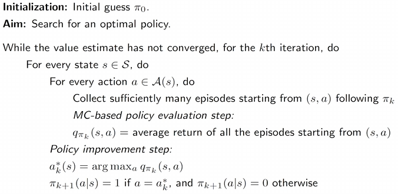
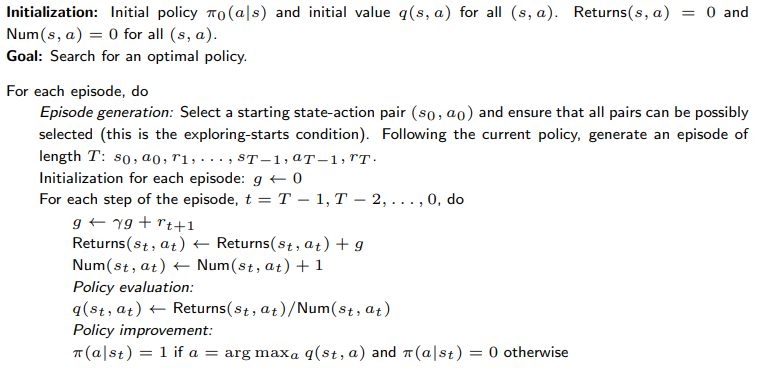
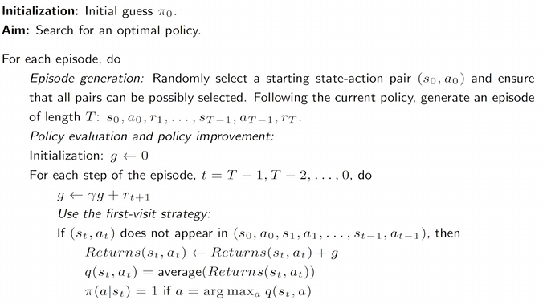
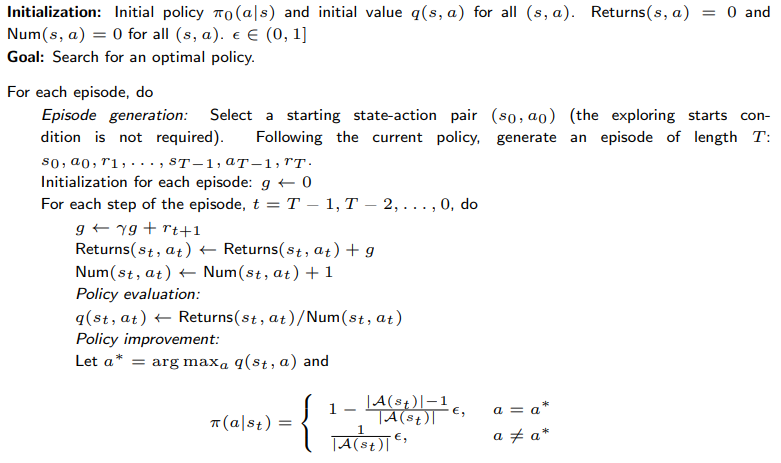

# 蒙特卡罗方法（Monte Carlo）

本文开始介绍无需模型（model-free）的强化学习方法。没有模型就通过数据去找到最优策略。对期望值进行估计。

## MC Basic：最简单的基于蒙特卡洛的算法

通过修改前文的策略迭代算法得到，即将其中的**基于模型的策略评价模块**替换为**无需模型的策略评价模块**。

### 将策略迭代算法转换为无需模型

> 策略迭代算法的核心是计算动作值 $q_{\pi_k}(s,a)$ 。

对于动作值的计算方法：

- 基于模型方法。先求解贝尔曼方程得到状态值 $v_{\pi _k}$ ，再由下式计算：

$$
q_{\pi_k}(s, a) = \sum_r p(r \mid s, a) r + \gamma \sum_{s'} p(s' \mid s, a) v_{\pi_k}(s')
$$

- 无需模型方法。对于原始定义：

$$
q_{\pi_k}(s, a) = \mathbb{E}[G_t \mid S_t = s, A_t = a]
$$

通过蒙特卡洛方法用数据来估计这个期望值：

- 从 $(s, a)$ 开始，按照策略 $\pi_k$ 生成一个完整轨迹（episode）。
- 该轨迹的回报记为 $g(s, a)$，它是 $G_t$ 的一个采样值，满足：

$$
q_{\pi_k}(s, a) = \mathbb{E}[G_t \mid S_t = s, A_t = a]
$$

- 假设我们收集了一组（$N$个）轨迹数据，因此得到一组样本 $\{ g^{(j)}(s, a) \}$。于是，有：

$$
q_{\pi_k}(s, a) = \mathbb{E}[G_t \mid S_t = s, A_t = a] \approx \frac{1}{N} \sum_{i=1}^N g^{(i)}(s, a)
$$

根据大数定律，如果 $N$ 足够大，上面的近似将会足够精确。

### 算法描述

从初始策略 $\pi_0$ 开始，该算法在第 $k$ 次迭代（$k = 0, 1, 2, \dots$）中有两个步骤：

- **Step 1：策略评估**

  这一部分用于估算所有 $(s, a)$ 的 $q_{\pi_k}(s, a)$。具体来说，对于每个 $(s, a)$，从任务轨迹中采样回报，并计算回报的平均值（记作 $q_k(s, a)$），来近似 $q_{\pi_k}(s, a)$。

- **Step 2：策略改进**

  这一部分通过如下公式来更新策略 $\pi$，得到所有 $s \in \mathcal{S}$ 的最优策略：

$$
a_k^*(s) = \arg\max_a q_k(s, a)
$$

$$
\pi_{k+1}(a \mid s) = 
\begin{cases}
1, & \text{若 } a = a_k^*(s) \\
0, & \text{否则}
\end{cases}
$$

> 直接估计动作值，而不是像策略迭代算法一样先估计状态值再估计动作值，这样需要模型。

### 伪代码

### 分析

稀疏奖励：除非到达目标状态，否则无法获得任何正奖励。

回合长度：

- 太短：无法到达目标而获得正奖励
- 太长：没有必要，在价值估计最优前就能找到最优策略

稀疏奖励会降低学习效率，解决办法设计非稀疏奖励或稠密奖励。如，使智能体在靠近目标时就可以获得少量的正奖励。

---

## MC Exploring Starts 算法

### 更高效地利用样本

考虑一个格子世界（grid-world）的例子，在遵循策略 $\pi$ 的情况下，我们可以得到如下一个回合（episode）：

$$
s_1 \xrightarrow{a_2} s_2 \xrightarrow{a_4} s_1 \xrightarrow{a_2} s_2 \xrightarrow{a_3} s_5 \xrightarrow{a_1} \cdots
$$
**访问（Visit）**：每当一个状态–动作对在回合中出现一次，就称该状态–动作对被访问（visit）了一次。

MC Basic 算法对数据采用的方法： **初始访问法（Initial-visit method）**

- 只计算回报（return），并近似 $q_\pi(s_1, a_2)$。
- **缺点：** 没有充分利用数据。

对于一个长的回合，可以被看成很多个从不同 $(s,a)$ 出发的子回合，因此可以估计多个。如下图

可以估计 $q_\pi(s_1, a_2)$，$q_\pi(s_2, a_4)$，$q_\pi(s_2, a_3)$，$q_\pi(s_5, a_1)$，……

**数据高效的方法：**

- 首次访问法（first-visit method）
  - 在**一个回合内**，对于某个状态–动作对 $(s,a)$：**只在第一次出现时**，才用该次出现之后的回报来更新 $q_\pi(s,a)$；该回合中后续再次出现的 $(s,a)$ **全部忽略**。
- 每次访问法（every-visit method）
  - 在**一个回合内**，对于某个状态–动作对 $(s,a)$：**每一次出现**，都使用对应的回报来更新 $q_\pi(s,a)$；同一回合中可以对同一个 $(s,a)$ 更新多次。

### 更高效地更新策略

基于 MC 的强化学习中，还有一个重要方面是**何时更新策略**。主要有两种方法。

- **第一种方法**是在策略评估阶段，收集从某一状态–动作对开始的**所有回合（episodes）**，然后使用**平均回报**来近似动作价值。

  - 这是 MC Basic 算法所采用的方法。
  - 该方法的问题在于，智能体必须**等待直到所有回合都被收集完成**。
- **第二种方法**使用**单个回合（single episode）**的回报来近似动作价值。

  - 通过这种方式，我们可以**按回合（episode-by-episode）地改进策略**。
  - 即使价值估计不够准确，我们仍然可以基于更新策略，属于**广义策略迭代**的范畴

**广义策略迭代（Generalized Policy Iteration, GPI）：**

- 它并不是一个具体的算法。
- 它指的是在**策略评估（policy evaluation）**与**策略改进（policy improvement）**两个过程之间交替进行的一种**总体思想或框架**。
- 许多强化学习算法都可以归入这一框架之中。

### 算法描述

此外可以使用”回溯“的方式，先从回合最后的 $(s,a)$ 开始，慢慢推回最初的  $(s,a)$。

必须具备 **Exploring Starts 条件**

- Exploring Starts 是指：我们需要生成**足够多的回合（episodes）**，并且这些回合**必须从每一个状态–动作对开始**。
  - *starts*：从某个状态–动作对开始  
  - *exploring*：覆盖所有可能的状态–动作对

- 例如，我们需要从$\{(s_1, a_j)\}_{j=1}^5$，$\{(s_2, a_j)\}_{j=1}^5$，$\ldots$，$\{(s_9, a_j)\}_{j=1}^5$ 这些状态–动作对开始的回合。

- 否则，如果不存在从 $(s_i, a_j)$ 开始的回合，那么 $(s_i, a_j)$ 可能**从未被任何回合访问过**，从而
  $q_\pi(s_i, a_j)$ **无法被估计**。

> **MC Basic** 和 **MC Exploring Starts** 都需要这个条件。

▷ **为什么需要考虑探索性起始（Exploring Starts）？**

- 从理论上讲，只有当**每一个状态下的每一个动作价值**都得到了充分探索，我们才能**正确地选择最优动作**。
  
  否则，如果某个动作从未被探索过，而它恰好是最优动作，那么该动作就可能被**遗漏**。
  
- 在实践中，实现探索性起始是**比较困难的**。
  
  对于许多应用，尤其是那些涉及与环境进行**物理交互**的任务，很难收集到**从每一个状态–动作对开始的回合**。

### 伪代码

> every-visit method版

> first-visit method版

---

## MC $\epsilon$-Greedy 算法

### 软策略

我们能否去除对探索性起始的这一要求？ 接下来我们将说明，可以通过使用**软策略（soft policies）**来实现这一点。

▷ **什么是软策略（soft policy）？**

- 如果一个策略对**任意动作采取的概率都是正的**，则称该策略为**软策略**。
  - **确定性策略（deterministic policy）**：例如，贪婪策略（greedy policy）
  - **随机策略（stochastic policy）**：例如，软策略（soft policy）

▷ **为什么要引入软策略？**

- 使用软策略时，只要回合（episode）**足够长**，那么**少量回合**就可以访问到**所有状态–动作对**。
- 因此，我们不再需要从**每一个状态–动作对**开始大量回合。换言之，**对探索性起始（exploring starts）的要求可以被去除**。

### $\epsilon$-Greedy 策略

$$
\pi(a \mid s) =
\begin{cases}
1 - \dfrac{\epsilon}{|A(s)|}\bigl(|A(s)| - 1\bigr), 
& \text{对于贪婪动作（greedy action）}, \\[6pt]
\dfrac{\epsilon}{|A(s)|}, 
& \text{对于其余的 } |A(s)| - 1 \text{ 个动作}.
\end{cases}
$$

其中，$\epsilon \in [0,1]$，$|A(s)|$ 表示状态 $s$ 下可选动作的数量。

**选择贪婪动作的概率始终大于选择其他动作的概率**，因为
$$
1 - \dfrac{\epsilon}{|A(s)|}\bigl(|A(s)| - 1\bigr)
= 1 - \epsilon + \dfrac{\epsilon}{|A(s)|}
\ge \dfrac{\epsilon}{|A(s)|}
$$

> **例子：** 若 $\epsilon = 0.2$，则
> $$
> \dfrac{\epsilon}{|A(s)|} = \dfrac{0.2}{5} = 0.04,
> \qquad
> 1 - \dfrac{\epsilon}{|A(s)|}\bigl(|A(s)| - 1\bigr)
> = 1 - 0.04 \times 4 = 0.84
> $$

$\epsilon$-贪婪策略（$\epsilon$-greedy policies）可以在**利用（exploitation）**与**探索（exploration）**之间取得平衡。

- **当 $\epsilon \to 0$ 时，策略退化为贪婪策略（greedy）**：

$$
\pi(a \mid s) =
\begin{cases}
1 - \dfrac{\epsilon}{|A(s)|}\bigl(|A(s)| - 1\bigr) = 1,
& \text{对于贪婪动作}, \\[6pt]
\dfrac{\epsilon}{|A(s)|} = 0,
& \text{对于其余 } |A(s)| - 1 \text{ 个动作}.
\end{cases}
$$

**更多利用（exploitation），更少探索（exploration）。**

---

- **当 $\epsilon \to 1$ 时，策略变为均匀分布（uniform distribution）**：

$$
\pi(a \mid s) =
\begin{cases}
1 - \dfrac{\epsilon}{|A(s)|}\bigl(|A(s)| - 1\bigr) = \dfrac{1}{|A(s)|},
& \text{对于贪婪动作}, \\[6pt]
\dfrac{\epsilon}{|A(s)|} = \dfrac{1}{|A(s)|},
& \text{对于其余 } |A(s)| - 1 \text{ 个动作}.
\end{cases}
$$

**更多探索（exploration），更少利用（exploitation）。**

### 算法描述

对策略改进步骤进行修改如下：
$$
\pi_{k+1}(s)
= \arg\max_{\pi \in \Pi_\epsilon}
\sum_a \pi(a \mid s)\, q_{\pi_k}(s, a),
$$

其中，$\Pi_\epsilon$ 表示在固定 $\epsilon$ 取值下的**所有 $\epsilon$-贪婪策略的集合**。

> 之前 $\Pi$ 表示所有可能策略的集合

此时得到的最优策略为
$$
\pi_{k+1}(a \mid s) =
\begin{cases}
1 - \dfrac{|A(s)| - 1}{|A(s)|}\,\epsilon,
& a = a_k^*, \\[6pt]
\dfrac{1}{|A(s)|}\,\epsilon,
& a \neq a_k^*.
\end{cases}
$$

### 伪代码

> every-visit method版

### 总结

- **MC $\epsilon$-Greedy** 与 **MC Exploring Starts** 在本质上是相同的，
  
  不同之处在于：前者使用的是 **$\epsilon$-贪婪策略**。
  
- **MC $\epsilon$-Greedy 不再要求探索性起始（exploring starts）**，
  
  但仍然需要以**另一种形式访问所有状态–动作对**。

---

## 探索与利用

▷ **与贪婪策略（greedy policies）相比：**

- **$\epsilon$-greedy 策略的优点**在于：当 $\epsilon$ 较大时，它具有**较强的探索能力**。
  
  - 因此，不再需要满足**探索性起始（exploring starts）**这一条件。
  
- **$\epsilon$-greedy 策略的缺点**在于：一般情况下，它们**并不是全局最优策略**。
  
  - 它们仅在**所有 $\epsilon$-贪婪策略构成的集合 $\Pi_\epsilon$ 中是最优的**。
  
- $\epsilon$ 不能取得过大；  
  
  同时，我们也可以采用**随时间递减的 $\epsilon$（decaying $\epsilon$）**。

### $\epsilon$-Greedy 策略的最优性

“最优”：指在给定 $\epsilon$ 情况下，该策略是在 $\Pi_\epsilon$ 中最优的。

一致性：指不同 $\epsilon$ 下最优 $\epsilon$-Greedy 策略之间的概率最大策略相同。

-  $\epsilon$ 越大：
  - 状态值减小，最优性下降：每个状态选取不合理动作的概率变大，收到奖励变小
  - 一致性下降

