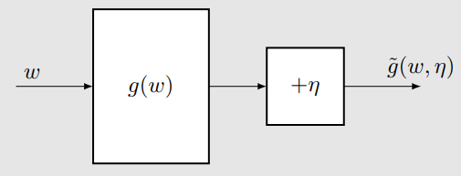

# 随机近似算法（Stochastic Approximation, SA）

- 随机逼近（SA）是指一大类**随机迭代算法**，用于求解**求根问题**或**优化问题**。

- 与许多其他求根算法（例如基于梯度的方法）相比，

  SA 的强大之处在于：**它不需要知道目标函数的具体表达式，也不需要其导数**。

## 算法示例：期望值估计

▷ **如何计算均值 $\bar{x}$？**

$$
\mathbb{E}[X] \approx \bar{x}
:= \frac{1}{N} \sum_{i=1}^{N} x_i .
$$

我们有两种方法。

- **第一种方法**是最直接的：先收集所有样本，然后再计算平均值。
  - 这种方法的**缺点**在于：如果样本是随着时间**逐个收集**的，那么我们必须**等待所有样本都收集完成**之后，才能计算均值。

- **第二种方法**可以避免上述缺点，因为它以一种**增量式（incremental）**、**迭代式（iterative）**的方式来计算平均值。

​	特别地，假设

$$
w_{k+1} = \frac{1}{k} \sum_{i=1}^{k} x_i, \qquad k = 1, 2, \ldots
$$

​	因此，

$$
w_k = \frac{1}{k-1} \sum_{i=1}^{k-1} x_i, \qquad k = 2, 3, \ldots
$$

​	那么，$w_{k+1}$ 可以用 $w_k$ 表示为

$$
\begin{aligned}
w_{k+1}
&= \frac{1}{k} \sum_{i=1}^{k} x_i \\
&= \frac{1}{k} \left( \sum_{i=1}^{k-1} x_i + x_k \right) \\
&= \frac{1}{k} \left( (k-1) w_k + x_k \right) \\
&= w_k - \frac{1}{k} (w_k - x_k).
\end{aligned}
$$

​	因此，我们得到如下**迭代算法**：

$$
w_{k+1} = w_k - \frac{1}{k} (w_k - x_k).
$$

- 该算法的一个**优点**在于它是**增量式（incremental）**的。
  
  一旦接收到一个样本，就可以**立即得到均值的估计**，并且该均值估计可以**立刻用于其他目的**。
  
- 由于在初始阶段样本数量不足，均值估计在一开始并不精确（即 $w_k \neq \mathbb{E}[X]$）。
  
  然而，这种估计**总比没有要好**。随着样本数量的不断增加，估计值可以被**逐步改进**，也就是说，当 $k \to \infty$ 时，
  $$
  w_k \to \mathbb{E}[X].
  $$

此外，考虑一种具有更一般形式的算法：

$$
w_{k+1} = w_k - \alpha_k (w_k - x_k),
$$

其中，用 $\alpha_k > 0$ 替代了 $\frac{1}{k}$。

- 该算法是否仍然收敛到均值 $\mathbb{E}[X]$？
  
  我们将证明：如果 $\{\alpha_k\}$ 满足一些**较弱的条件**，那么答案是**肯定的**。
  
- 我们还将说明，该算法是一个**特殊的随机逼近（stochastic approximation, SA）算法**，同时也是一个**特殊的随机梯度下降（stochastic gradient descent）算法**。

- 在下一讲中，我们将看到**时序差分（temporal-difference, TD）算法**具有**类似但更为复杂的表达形式**。

---

## Robbins-Monro（RM）算法

- 这是随机逼近领域中的一项**开创性（pioneering）工作**。

- 著名的**随机梯度下降（stochastic gradient descent, SGD）算法**是 RM 算法的一种**特殊形式**。

- RM 算法还可以用于**分析前面介绍的均值估计算法**。

### 问题描述（Problem statement）

假设我们希望求解如下方程的根：

$$
g(w) = 0,
$$

其中，$w \in \mathbb{R}$ 是需要求解的变量，$g : \mathbb{R} \to \mathbb{R}$ 是一个函数。

- 许多问题最终都可以被转化为这样的**求根问题**。  
  例如，假设 $J(w)$ 是一个需要被最小化的目标函数，那么该优化问题可以等价地转化为
  $$
  g(w) = \nabla_w J(w) = 0.
  $$
  
- 需要注意的是，形如 $g(w) = c$（其中 $c$ 为常数）的方程，也可以通过将 $g(w) - c$ 视为一个新的函数，从而转化为上述形式的方程。

### 求解问题

- **基于模型的方法（Model-based）：**
  
  如果函数 $g$ 的表达式是已知的，那么可以使用许多**数值算法**来求解该问题。
  
- **无模型的方法（Model-free）：**
  
  如果函数 $g$ 的表达式是未知的，该怎么办？
  
  例如，函数可能由一个**人工神经网络**来表示。

能够求解上述问题的 **Robbins–Monro（RM）算法**如下所示：

$$
w_{k+1} = w_k - a_k \,\tilde{g}(w_k, \eta_k), 
\qquad k = 1, 2, 3, \ldots
$$

其中：

- $w_k$ 是第 $k$ 次对方程根的估计值。

- $\tilde{g}(w_k, \eta_k) = g(w_k) + \eta_k$ 是第 $k$ 次的**带噪观测**。
  - 为什么这里会有噪声？  
    例如，可以将其理解为：对随机变量 $X$ 进行一次随机采样 $x$ 所带来的随机性。

- $a_k$ 是一个**正的系数**（步长）。

该算法依赖于数据而非模型：

- **输入序列（Input sequence）：** $\{ w_k \}$

- **输出序列（含噪声）（Output sequence, noisy）：**
  $\{ \tilde{g}(w_k, \eta_k) \}$

**核心思想（Philosophy）：没有模型，就需要数据！**

- 函数 $g(w)$ 被视为一个**黑箱（black box）**。

- 这里所说的“模型”，指的是**函数的解析表达式**。

### 收敛性质

#### 直观示例

- 设
  $$
  g(w) = \tanh(w - 1).
  $$

- 方程 $g(w) = 0$ 的真实根为
  $$
  w^* = 1.
  $$

- 参数设定：
  $$
  w_1 = 3, \qquad a_k = \frac{1}{k}, \qquad \eta_k \equiv 0
  $$
  :::info
  为简化起见，此处不考虑噪声
  :::

在这种情况下，Robbins–Monro（RM）算法为

$$
w_{k+1} = w_k - a_k\, g(w_k),
$$

因为当 $\eta_k = 0$ 时，有 $\tilde{g}(w_k, \eta_k) = g(w_k)$。

##### 仿真结果（Simulation result）

$w_k$ 收敛到真实根 $w^* = 1$。

##### 直觉解释（Intuition）

$w_{k+1}$ 比 $w_k$ **更接近** $w^*$。

- 当 $w_k > w^*$ 时，有 $g(w_k) > 0$。此时 $w_{k+1} = w_k - a_k g(w_k) < w_k,$ 因而 $w_{k+1}$ 比 $w_k$ 更接近 $w^*$。

- 当 $w_k < w^*$ 时，有 $g(w_k) < 0$。此时 $w_{k+1} = w_k - a_k g(w_k) > w_k,$ 因而 $w_{k+1}$ 比 $w_k$ 更接近 $w^*$。

上述分析是直观的，但并不严格。下面给出一个**严格的收敛性结果**。

#### Robbins–Monro 定理

在 Robbins–Monro 算法中，若满足以下条件：

1. 对所有 $w$，有
   $$
   0 < c_1 \le \nabla_w g(w) \le c_2 ;
   $$

2. 步长序列 $\{a_k\}$ 满足
   $$
   \sum_{k=1}^{\infty} a_k = \infty,
   \qquad
   \sum_{k=1}^{\infty} a_k^2 < \infty ;
   $$

3. 噪声序列 $\{\eta_k\}$ 满足
   $$
   \mathbb{E}[\eta_k \mid \mathcal{H}_k] = 0,
   \qquad
   \mathbb{E}[\eta_k^2 \mid \mathcal{H}_k] < \infty ;
   $$

其中 $\mathcal{H}_k = \{ w_k, w_{k-1}, \ldots \},$ 则序列 $\{w_k\}$ **以概率 1（w.p.1）** 收敛到满足 $g(w^*) = 0$ 的根 $w^*$。

##### 三个条件的解释

- **条件 1：** 对所有 $w$，有
  $$
  0 < c_1 \le \nabla_w g(w) \le c_2
  $$

  - 函数 $g$ 应当是**单调递增的（monotonically increasing）**，这保证了方程 $g(w) = 0$ 的根**存在且唯一**。
  
  - 梯度在上方是**有界的**。
  
  - 该条件并不是非常严格。
    
    例如，考虑 $g(w) = \nabla_w J(w)$ 的情形，此时该条件等价于要求 $g(w)$（或 $J(w)$）是**凸的（convex）**。

- **条件 2：**
  $$
  \sum_{k=1}^{\infty} a_k = \infty,
  \qquad
  \sum_{k=1}^{\infty} a_k^2 < \infty
  $$

  - $\sum_{k=1}^{\infty} a_k^2 < \infty$ 保证了当 $k \to \infty$ 时，$a_k \to 0$。
  - $\sum_{k=1}^{\infty} a_k = \infty$ 保证了 $a_k$ **不会过快地收敛到 0**。

- **条件 3：**
  $$
  \mathbb{E}[\eta_k \mid \mathcal{H}_k] = 0,
  \qquad
  \mathbb{E}[\eta_k^2 \mid \mathcal{H}_k] < \infty
  $$

  :::info
  相当于均值为0，方差有界
  :::

  - 一个特殊但常见的情形是：$\{\eta_k\}$ 是一个 **iid 随机序列**，满足
    $$
    \mathbb{E}[\eta_k] = 0,
    \qquad
    \mathbb{E}[\eta_k^2] < \infty .
    $$
  - 观测误差 $\eta_k$ **不要求服从高斯分布**。

##### 更深入地考察条件 2

首先，$\sum_{k=1}^{\infty} a_k^2 < \infty$ 表明当 $k \to \infty$ 时，$a_k \to 0$。

- **为什么这个条件重要？**

  因为
  $$
  w_{k+1} - w_k = - a_k \tilde{g}(w_k, \eta_k).
  $$

  - 若 $a_k \to 0$，则 $a_k \tilde{g}(w_k, \eta_k) \to 0$，从而
    $$
    w_{k+1} - w_k \to 0.
    $$

  - 如果 $w_k$ 最终收敛，我们就需要 $w_{k+1} - w_k \to 0$ 这一事实成立。

  - 当 $w_k \to w^*$ 时，有 $g(w_k) \to 0$，此时 $\tilde{g}(w_k, \eta_k)$ 将主要由噪声 $\eta_k$ 所主导。

其次，$\sum_{k=1}^{\infty} a_k = \infty$ 表明 $a_k$ **不能过快地收敛到 0**。

- **为什么这个条件重要？**

  将
  $$
  w_2 = w_1 - a_1 \tilde{g}(w_1, \eta_1), \quad
  w_3 = w_2 - a_2 \tilde{g}(w_2, \eta_2), \ \ldots,
  $$
  以及
  $$
  w_{k+1} = w_k - a_k \tilde{g}(w_k, \eta_k)
  $$
  累加起来，可以得到
  $$
  w_1 - w_\infty = \sum_{k=1}^{\infty} a_k \tilde{g}(w_k, \eta_k).
  $$

  假设 $w_\infty = w^*$。如果
  $$
  \sum_{k=1}^{\infty} a_k < \infty,
  $$
  那么 $\sum_{k=1}^{\infty} a_k \tilde{g}(w_k, \eta_k)$ 可能是有界的。  
  此时，如果初始值 $w_1$ 被选取得距离 $w^*$ 很远，则上述等式将无法成立。

##### 哪些 $\{a_k\}$ 同时满足这两个条件？

一种典型的选择是

$$
a_k = \frac{1}{k}.
$$

- 有如下结论成立：
  $$
  \lim_{n \to \infty}
  \left(
  \sum_{k=1}^{n} \frac{1}{k} - \ln n
  \right)
  = \kappa,
  $$

  其中 $\kappa \approx 0.577$ 被称为 **Euler–Mascheroni 常数**（也称为 **Euler 常数**）。
  
- 还值得注意的是：
  $$
  \sum_{k=1}^{\infty} \frac{1}{k^2}
  = \frac{\pi^2}{6}
  < \infty.
  $$

  级数 $\sum_{k=1}^{\infty} \frac{1}{k^2}$ 在数论中有一个专门的名字，称为 **巴塞尔问题（Basel problem）**。

在实际中，通常选择一个小的正数。此时$\sum_{k=1}^{\infty} a_k = \infty$ 仍然成立，但$\sum_{k=1}^{\infty} a_k^2 < \infty$ 不再成立。选择这个的原因是它能很好地利用后面（k比较大时）得到的样本。实际上算法仍然在某种意义上收敛，可以应对时变系统。

### RM算法在期望值估计中的应用

1）考虑如下函数：
$$
g(w) \triangleq w - \mathbb{E}[X].
$$

我们的目标是求解 $g(w) = 0$。如果能够做到这一点，那么就可以得到 $\mathbb{E}[X]$。

- **均值估计**（即求 $\mathbb{E}[X]$）可以被表述为一个**求根问题**（即求解 $g(w) = 0$）。

2）我们能够获得的观测为

$$
\tilde{g}(w, x) \triangleq w - x,
$$

因为我们只能获得随机变量 $X$ 的样本。注意到

$$
\begin{aligned}
\tilde{g}(w, \eta)
&= w - x \\
&= w - x + \mathbb{E}[X] - \mathbb{E}[X] \\
&= (w - \mathbb{E}[X]) + (\mathbb{E}[X] - x) \\
&= g(w) + \eta,
\end{aligned}
$$

其中噪声项 $\eta = \mathbb{E}[X] - x$。

3）用于求解 $g(w) = 0$ 的 RM 算法为
$$
w_{k+1}
= w_k - \alpha_k \tilde{g}(w_k, \eta_k)
= w_k - \alpha_k (w_k - x_k),
$$

这**恰好就是均值估计算法本身**。因此，其收敛性也就**自然得到了保证**。

---

## Dvoretsky 定理

考虑如下随机过程：

$$
w_{k+1} = (1 - \alpha_k)\, w_k + \beta_k \eta_k,
$$

其中 $\{\alpha_k\}_{k=1}^{\infty}$、$\{\beta_k\}_{k=1}^{\infty}$、$\{\eta_k\}_{k=1}^{\infty}$ 为随机序列，并且对所有 $k$ 有 $\alpha_k \ge 0$、$\beta_k \ge 0$。

若满足以下条件，则 $w_k$ **以概率 1（w.p.1）收敛到 0**：

1. 
   $$
   \sum_{k=1}^{\infty} \alpha_k = \infty, 
   \qquad
   \sum_{k=1}^{\infty} \alpha_k^2 < \infty,
   \qquad
   \sum_{k=1}^{\infty} \beta_k^2 < \infty
   \quad \text{（以概率 1 一致成立）};
   $$

2. 
   $$
   \mathbb{E}[\eta_k \mid \mathcal{H}_k] = 0,
   \qquad
   \mathbb{E}[\eta_k^2 \mid \mathcal{H}_k] \le C
   \quad \text{（以概率 1）},
   $$

其中
$$
\mathcal{H}_k = \{ w_k, w_{k-1}, \ldots, \eta_{k-1}, \ldots, \alpha_{k-1}, \ldots, \beta_{k-1}, \ldots \}.
$$

- 该结果**比 Robbins–Monro（RM）定理更一般**。
  - 它可以用于**证明 RM 定理**；
  - 它可以用于**分析均值估计问题**；
  - 其推广形式还可用于**分析 Q-learning 与 TD 学习算法**。

---

## 随机梯度下降（Stochastic gradient descent, SGD）

- SGD 在机器学习领域以及强化学习（RL）中被广泛使用。
  - SGD 是一种**特殊的 Robbins–Monro（RM）算法**。
  - 均值估计算法是 **SGD 的一个特殊情形**。

### 问题设定（Problem setup）

假设我们希望求解如下**优化问题**：

$$
\min_{w} \; J(w) = \mathbb{E}[f(w, X)] .
$$

- $w$ 是需要被优化的参数。
- $X$ 是一个随机变量，期望是对 $X$ 取的。
- $w$ 和 $X$ 都可以是标量或向量，而函数 $f(\cdot)$ 是一个标量函数。

### 求解问题

#### 方法 1：梯度下降（Gradient Descent, GD）

$$
w_{k+1}
= w_k - \alpha_k \nabla_w \mathbb{E}[f(w_k, X)]
= w_k - \alpha_k \mathbb{E}[\nabla_w f(w_k, X)] .
$$

**缺点：** 计算期望需要知道随机变量 $X$ 的分布。

:::info
要模型
:::

#### 方法 2：批量梯度下降（Batch Gradient Descent, BGD）

$$
\mathbb{E}[\nabla_w f(w_k, X)]
\approx
\frac{1}{n} \sum_{i=1}^{n} \nabla_w f(w_k, x_i) .
$$

因此，

$$
w_{k+1}
= w_k - \alpha_k \frac{1}{n}
\sum_{i=1}^{n} \nabla_w f(w_k, x_i) .
$$

**缺点：** 对于每一次迭代、每一个 $w_k$，都需要使用**大量样本**。

#### 方法 3：随机梯度下降（Stochastic Gradient Descent, SGD）

$$
w_{k+1}
= w_k - \alpha_k \nabla_w f(w_k, x_k) .
$$

- **与梯度下降（GD）相比：**
  - 用**随机梯度** $\nabla_w f(w_k, x_k)$ 替代真实梯度 $\mathbb{E}[\nabla_w f(w_k, X)]$。
  
- **与批量梯度下降（BGD）相比：**
  - 令批量大小 $n = 1$。

### SGD的收敛性

SGD 的思想（Idea of SGD）：用**随机梯度** $\nabla_w f(w_k, x_k)$替代了**真实梯度** $\mathbb{E}[\nabla_w f(w_k, X)]$。

由于
$$
\nabla_w f(w_k, x_k) \neq \mathbb{E}[\nabla_w f(w, X)],
$$
那么，使用 SGD 时，当 $k \to \infty$，是否有 $w_k \to w^*$？

#### 观察

随机梯度是真实梯度的一个**带噪观测**：

$$
\nabla_w f(w_k, x_k)
= \mathbb{E}[\nabla_w f(w, X)]
+ \bigl(
\nabla_w f(w_k, x_k)
- \mathbb{E}[\nabla_w f(w, X)]
\bigr),
$$

其中括号中的部分记为噪声 $\eta$。

SGD 是一种特殊的 Robbins–Monro（RM）算法**，因此其收敛性可以自然推出。

#### SGD 的收敛性定理

在 SGD 算法中，若满足：

1. 对所有 $w$，$0 < c_1 \le \nabla_w^2 f(w, X) \le c_2 ;$

2.  $
   \sum_{k=1}^{\infty} a_k = \infty,
   \,
   \sum_{k=1}^{\infty} a_k^2 < \infty ;
   $

3. 样本序列 $\{x_k\}_{k=1}^{\infty}$ 是 **iid**；

则$w_k$**以概率 1 收敛到** $\nabla_w \mathbb{E}[f(w, X)] = 0$的解。

证明略

### BGD, MBGD, 与SGD

假设我们希望在给定随机样本集合
$\{x_i\}_{i=1}^n$
的情况下，最小化 $J(w) = \mathbb{E}[f(w, X)].$

分别用于求解该问题的 **BGD、SGD 与 MBGD 算法**如下：

**批量梯度下降（Batch Gradient Descent, BGD）：**

$$
w_{k+1}
= w_k - \alpha_k \frac{1}{n}
\sum_{i=1}^{n} \nabla_w f(w_k, x_i),
\qquad (\text{BGD})
$$

**小批量梯度下降（Mini-batch Gradient Descent, MBGD）：**
$$
w_{k+1}
= w_k - \alpha_k \frac{1}{m}
\sum_{j \in \mathcal{I}_k} \nabla_w f(w_k, x_j),
\qquad (\text{MBGD})
$$

**随机梯度下降（Stochastic Gradient Descent, SGD）：**

$$
w_{k+1}
= w_k - \alpha_k \nabla_w f(w_k, x_k),
\qquad (\text{SGD})
$$

- **在 BGD 算法中**，每一次迭代都会使用**全部样本**。当 $n$ 较大时，$\frac{1}{n} \sum_{i=1}^{n} \nabla_w f(w_k, x_i)$会非常接近真实梯度 $\mathbb{E}[\nabla_w f(w_k, X)].$
  
- **在 MBGD 算法中**，$\mathcal{I}_k$ 是集合 $\{1, \ldots, n\}$ 的一个子集，其大小为 $|\mathcal{I}_k| = m.$集合 $\mathcal{I}_k$ 由 **$m$ 次独立同分布（iid）采样**得到。

- **在 SGD 算法中**，在第 $k$ 次迭代时，$x_k$是从样本集合 $\{x_i\}_{i=1}^n$ 中**随机抽取**的一个样本。

