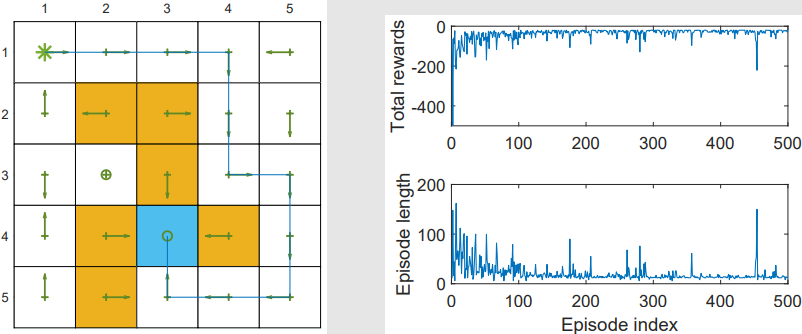

# 时序差分方法（temporal-difference（TD）learning）

TD算法与MC算法最大的不同在于它是增量式的。

TD算法指一大类强化学习算法，也指一个特殊的进行状态值估计的算法 

## 状态值估计：最基础的时序差分方法

### 问题陈述

- 给定策略 $\pi$，目标是估计在策略 $\pi$ 下的状态价值 $\{v_{\pi}(s)\}_{s \in \mathcal{S}}$。
- 经验样本为：${\color{blue}(s_0, r_1, s_1, \ldots, s_t, r_{t+1}, s_{t+1}, \ldots)}$  或  ${\color{blue}\{(s_t, r_{t+1}, s_{t+1})\}_t}$ 它们是由策略 $\pi$ 生成的。

$$
v(s) \longrightarrow v_{\pi}(s)\\
\Downarrow \\
v(s_t) \longrightarrow v_{\pi}(s_t)\\
\Downarrow \\
v_t(s_t) \longrightarrow v_{\pi}(s_t)
$$

### 算法描述

```math
v_{t+1}(s_t) = v_t(s_t) - \alpha_t(s_t) \left[ v_t(s_t) - \left( r_{t+1} + \gamma v_t(s_{t+1}) \right) \right], \tag{1}
```

```math
v_{t+1}(s) = v_t(s), \quad \forall s \ne s_t, \tag{2}
```

其中 $t = 0, 1, 2, \ldots$。

这里，$v_t(s_t)$ 是对 $v_{\pi}(s_t)$ 的估计；$\alpha_t(s_t)$ 是状态 $s_t$ 在时间 $t$ 的学习率。

- 在时间 $t$，仅更新访问到的状态 $s_t$ 的价值，而未访问状态 $s \ne s_t$ 的值保持不变。
- 式 $(2)$ 的更新将在上下文清晰时省略。

**相当于在没有模型的情况下求解贝尔曼公式**

### 算法性质

TD算法可以标注为：

```math
\underbrace{v_{t+1}(s_t)}_{\text{new estimate}} = 
\underbrace{v_t(s_t)}_{\text{current estimate}} 
- \alpha_t(s_t) \underbrace{[ v_t(s_t) - \underbrace{\left( r_{t+1} + \gamma v_t(s_{t+1}) \right)}_{\text{TD target } \bar{v}_t} ]}_{\text{TD error } \delta_t}
\tag{3}
```

这里：

```math
\bar{v}_t \doteq r_{t+1} + \gamma v_t(s_{t+1})
```

称为 **TD目标**（TD target）。

```math
\delta_t \doteq v_t(s_t) - \left[ r_{t+1} + \gamma v_t(s_{t+1}) \right] = v_t(s_t) - \bar{v}_t
```

称为 **TD误差**（TD error）。

新估计 $v_{t+1}(s_t)$ 是当前估计 $v_t(s_t)$ 和 TD误差 的组合。

**为什么 $\bar{v}_t$ 被称为 TD目标？**

因为算法会将 $v(s_t)$ 推动向 $\bar{v}_t$。
$$
\bar{v}_t \doteq r_{t+1} + \gamma v_t(s_{t+1})
$$
为了解释这个过程：
$$
\begin{aligned}
&v_{t+1}(s_t) = v_t(s_t) - \alpha_t(s_t)\left[ v_t(s_t) - \bar{v}_t \right] \\
\Rightarrow \quad &v_{t+1}(s_t) - \bar{v}_t = v_t(s_t) - \bar{v}_t - \alpha_t(s_t) \left[ v_t(s_t) - \bar{v}_t \right] \\
\Rightarrow \quad &v_{t+1}(s_t) - \bar{v}_t = \left[1 - \alpha_t(s_t)\right] \left[ v_t(s_t) - \bar{v}_t \right] \\
\Rightarrow \quad &|v_{t+1}(s_t) - \bar{v}_t| = |1 - \alpha_t(s_t)| \cdot |v_t(s_t) - \bar{v}_t|
\end{aligned}
$$
因为 $\alpha_t(s_t)$ 是一个较小的正数，有：

```math
0 < 1 - \alpha_t(s_t) < 1
```

因此：

```math
|v_{t+1}(s_t) - \bar{v}_t| \leq |v_t(s_t) - \bar{v}_t|
```

这意味着 $v(s_t)$ 被逐渐拉近到 $\bar{v}_t$！

**TD误差的解释是什么？**

```math
\delta_t = v_t(s_t) - \left[ r_{t+1} + \gamma v_t(s_{t+1}) \right]
```

- 它反映了**两个时间步之间的差异**。
- 它反映了 $v_t$ 和 $v_\pi$ 之间的差异。为说明这点，定义：

```math
\delta_{\pi,t} \doteq v_\pi(s_t) - \left[ r_{t+1} + \gamma v_\pi(s_{t+1}) \right]
```

注意：

```math
\mathbb{E}[\delta_{\pi,t} \mid S_t = s_t] = v_\pi(s_t) - \mathbb{E}[R_{t+1} + \gamma v_\pi(S_{t+1}) \mid S_t = s_t] = 0
```

- 如果 $v_t = v_\pi$，那么 $\delta_t$ 应该为 0（在期望意义上）。
- 因此，如果 $\delta_t \ne 0$，那么 $v_t$ 不等于 $v_\pi$。

- TD误差可以被解释为**新息**（innovation），代表从经验 $(s_t, r_{t+1}, s_{t+1})$ 中获取的新信息。

**其他性质**

- 公式(3)中的 TD算法**只估计给定策略的状态价值**。
  - **不会估计动作价值（action value）**
  - **不会搜索最优策略（optimal policy）**

- 本算法将在后续被扩展以估计动作价值并用于搜索最优策略。
- 公式(3)中的 TD算法是理解更复杂 TD算法的基础。

### TD算法的推导

首先，这是一个**无模型（model-free）**的算法，用于求解给定策略 $\pi$ 的 Bellman 方程。

- 第二章中介绍了**有模型（model-based）**的方法求解 Bellman 方程：解析解 + 迭代算法。

**第一步，Bellman方程的新表达式**

策略 $\pi$ 的状态值定义为：

```math
v_\pi(s) = \mathbb{E} \left[ R + \gamma G \mid S = s \right], \quad s \in \mathcal{S}
\tag{4}
```

其中 $G$ 是折扣回报。由于：

```math
\mathbb{E}[G \mid S = s] = \sum_a \pi(a|s) \sum_{s'} p(s'|s,a) v_\pi(s') = \mathbb{E}[v_\pi(S') \mid S = s]
```

其中 $S'$ 是下一个状态，因此我们可以将公式 (4) 改写为：

```math
v_\pi(s) = \mathbb{E} \left[ R + \gamma v_\pi(S') \mid S = s \right], \quad s \in \mathcal{S}
\tag{5}
```

公式 (5) 是 Bellman 方程的另一种形式，通常称为 **Bellman 期望方程（Bellman expectation equation）**，是设计与分析 TD 算法的重要工具。

**第二步，使用RM算法求解公式 (5) 中的 Bellman 方程**

特别地，我们定义：

```math
g(v(s)) = v(s) - \mathbb{E}[R + \gamma v_\pi(S') \mid s]
```

可以将公式 (5) 改写为：

```math
g(v(s)) = 0
```

由于我们只能获取 $R$ 和 $S'$ 的样本 $r$ 和 $s'$，所以我们能观测到的带噪表达为：
$$
\begin{aligned}
\tilde{g}(v(s)) &= v(s) - [r + \gamma v_\pi(s')] \\
&= \underbrace{\left( v(s) - \mathbb{E}[R + \gamma v_\pi(S') \mid s] \right)}_{g(v(s))}
+ \underbrace{\left( \mathbb{E}[R + \gamma v_\pi(S') \mid s] - [r + \gamma v_\pi(s')] \right)}_{\eta}
\end{aligned}
$$
因此，RM 算法用于求解 $g(v(s)) = 0$ 的迭代过程为：

```math
v_{k+1}(s) = v_k(s) - \alpha_k \tilde{g}(v_k(s)) 
= v_k(s) - \alpha_k \left( v_k(s) - [r_k + \gamma v_\pi(s_k')] \right), \quad k = 1,2,3,\ldots
\tag{6}
```

其中 $v_k(s)$ 是第 $k$ 步对 $v_\pi(s)$ 的估计；$r_k, s_k'$ 是第 $k$ 步采样得到的 $R, S'$。

#### 对比 RM 算法 和 TD 算法

公式 (6) 中的 **RM算法** 与 **TD算法** 形式非常相似，但它们之间有两个主要区别：

- **区别 1：** RM 算法需要样本 $\{(s, r_k, s_k')\}$，$k = 1, 2, 3, \dots$  
  - 修改为：$\{(s_t, r_{t+1}, s_{t+1})\}$，以便算法能够使用完整序列样本。

- **区别 2：** RM算法使用 $v_\pi(s_k')$  
  - 修改为：使用当前估计 $v_t(s_{t+1})$ 替代。

应用以上两点修改后，RM算法就完全等价于TD算法。

### 收敛性

定理：

由 TD 算法 (1)，当 $t \to \infty$ 且 $\sum_t \alpha_t(s) = \infty$ 且 $\sum_t \alpha_t^2(s) < \infty$ 对所有 $s \in \mathcal{S}$ 成立时，$v_t(s)$ 以概率 1 收敛到 $v_\pi(s)$。

> 证明略

**Remarks**

- 此定理说明，在给定策略 $\pi$ 下，状态价值可以通过 TD 算法估计出来。
- 条件 $\sum_t \alpha_t(s) = \infty$ 且 $\sum_t \alpha_t^2(s) < \infty$ 必须对所有 $s \in \mathcal{S}$ 成立：
  - 对于 $\sum_t \alpha_t(s) = \infty$：在时间步 $t$，
    - 若 $s = s_t$，则 $\alpha_t(s) > 0$
    - 若 $s \ne s_t$，则 $\alpha_t(s) = 0$

    因此，$\sum_t \alpha_t(s) = \infty$ 要求每个状态都必须被访问无限次（或足够多次）。

  - 对于 $\sum_t \alpha_t^2(s) < \infty$：实际中，学习率 $\alpha$ 常被设置为一个**小常数**。此时该条件不再满足。

    但当 $\alpha$ 是常数时，仍可证明算法在**期望意义上**收敛。

### TD 学习 vs MC 学习 的对比

| **TD/Sarsa 学习**                                            | **MC 学习**                                                  |
| ------------------------------------------------------------ | ------------------------------------------------------------ |
| **在线学习（Online）**：TD是在线算法，在获得奖励后即可更新状态/动作价值。 | **离线学习（Offline）**：MC是离线算法，需等待整个回合结束后才能更新。 |
| **可处理持续任务（Continuing tasks）**：由于 TD 是在线的，它既能处理回合任务，也能处理持续任务。 | **仅适用于回合任务（Episodic tasks）**：MC 只能处理有终止状态的任务。 |
| **自举（Bootstrapping）**：TD的更新依赖于之前的估计值，因此需要初始猜测。 | **非自举（Non-bootstrapping）**：MC不需要初始值，直接通过样本估计状态/动作价值。 |
| **估计方差低（Low variance）**：TD 所需的随机变量更少，例如 Sarsa 只需 $R_{t+1}, S_{t+1}, A_{t+1}$。 | **估计方差高（High variance）**：如需估计 $q_\pi(s_t, a_t)$，需多个奖励序列样本。假设每个回合长度为 $L$，动作空间为 $\mathcal{A}$，则有 $|\mathcal{A}|^L$ 个可能的序列。 |

---

## 动作值估计：Sarsa

目标是估计给定策略 $\pi$ 的**动作价值**

### 算法描述

假设我们有一些经验样本： ${\color{blue} \{(s_t, a_t, r_{t+1}, s_{t+1}, a_{t+1})\}_t}$

我们可以使用以下 Sarsa 算法来估计动作价值：
$$
q_{t+1}(s_t, a_t) = q_t(s_t, a_t) - \alpha_t(s_t, a_t) \left[ q_t(s_t, a_t) - \left( r_{t+1} + \gamma q_t(s_{t+1}, a_{t+1}) \right) \right] \\
q_{t+1}(s, a) = q_t(s, a), \quad \forall (s, a) \ne (s_t, a_t)
$$
其中 $t = 0, 1, 2, \dots$

- $q_t(s_t, a_t)$ 是 $q_\pi(s_t, a_t)$ 的估计值；
- $\alpha_t(s_t, a_t)$ 是依赖于 $(s_t, a_t)$ 的学习率。

- **为什么这个算法叫做 Sarsa？**  
  
  因为算法每一步使用的是 $(s_t, a_t, r_{t+1}, s_{t+1}, a_{t+1})$。 
  Sarsa 是 state-action-reward-state-action 的缩写。
  
- **Sarsa 与之前的 TD 学习算法有何关系？** 
  
  我们可以将 TD 算法中的状态价值 $v(s)$ 替换为动作价值 $q(s, a)$，从而得到 Sarsa。 
  **因此，Sarsa 是 TD 算法的动作价值版本。**
  
- **Sarsa 算法在数学上是做什么的？** 
  
  Sarsa 表示它是一个随机近似算法，用于求解如下方程：
  $$
  q_\pi(s, a) = \mathbb{E} \left[ R + \gamma q_\pi(S', A') \mid s, a \right], \quad \forall s, a
  $$

这是 **Bellman 方程在动作价值下的另一种表达方式**。

### 收敛性

**定理：**

通过 Sarsa 算法，当 $t \to \infty$ 且 $\sum_t \alpha_t(s, a) = \infty$ 且 $\sum_t \alpha_t^2(s, a) < \infty$ 对所有 $(s, a)$ 成立时，$q_t(s, a)$ 以概率 1 收敛到 $q_\pi(s, a)$。

**Remarks**

- 这个定理说明：在给定策略 $\pi$ 的前提下，Sarsa 可以估计出动作价值。

### 伪代码

强化学习（RL）的终极目标是找到最优策略。

为实现这一目标，我们可以将 **Sarsa** 与一个**策略改进步骤**相结合。这个组合后的算法仍然被称为 **Sarsa**。


**Remarks**

- 在 $q(s_t, a_t)$ 被更新后，策略会**立即更新**。
  这是基于**广义策略迭代（generalized policy iteration）**的思想。

- 策略采用的是 $\varepsilon$-贪婪（$\varepsilon$-greedy）而不是纯贪婪策略，
  以在**利用（exploitation）**与**探索（exploration）**之间取得良好平衡。

- **核心思想很简单：** 就是使用一个算法来求解**给定策略**下的 Bellman 方程。

- **复杂性出现于：** 我们尝试寻找最优策略并高效执行时。

### 案例

- 本任务的目标是：**从一个特定的起始状态到达目标状态的一条好路径**。 
  （区别于之前需要为所有状态找到最优策略的任务）
  - 这个任务不同于之前所有任务 —— 之前需要为每个状态都找出最优策略。
  - 每一回合从左上角的状态开始，终止于目标状态。
  - 请在未来注意任务的具体定义！
  
- 奖励设定如下：
  - $r_{\text{target}} = 0$
  - $r_{\text{forbidden}} = r_{\text{boundary}} = -10$
  - $r_{\text{other}} = -1$

- 学习率设为 $\alpha = 0.1$，$\varepsilon$ 的取值为 $0.1$。

#### 结果



- 左图展示了最终由 **Sarsa** 学得的策略（policy）：
  - ⚠️ 并**不是所有状态都获得了最优策略**。  
    （可能因为某些状态未被充分探索）

- 右图展示了：
  - 每一回合的 **总奖励（total reward）**
  - 每一回合的 **长度（episode length）**

  - ✅ 之后我们将频繁使用的指标是：**每回合总奖励（total reward per episode）**

---

 ## 动作值估计：Expected Sarsa

### 算法描述

该算法更新规则如下：
$$
q_{t+1}(s_t, a_t) = q_t(s_t, a_t) - \alpha_t(s_t, a_t) \left[ q_t(s_t, a_t) - \left( r_{t+1} + \gamma \mathbb{E}[q_t(s_{t+1}, A)] \right) \right] \\
q_{t+1}(s, a) = q_t(s, a), \quad \forall (s, a) \ne (s_t, a_t)
$$
其中：
$$
\mathbb{E}[q_t(s_{t+1}, A)] = \sum_a \pi_t(a \mid s_{t+1}) q_t(s_{t+1}, a) \doteq v_t(s_{t+1})
$$
表示在策略 $\pi_t$ 下，对 $q_t(s_{t+1}, a)$ 的期望。

#### 与标准 Sarsa 的对比

- **TD目标改变了**：从 Sarsa 中的 $r_{t+1} + \gamma q_t(s_{t+1}, a_{t+1})$  
  
  变为 Expected Sarsa 中的 $r_{t+1} + \gamma \mathbb{E}[q_t(s_{t+1}, A)]$
  
- 需要**更多计算**，但这样做的好处是可以**减少估计的方差**， 
  
  因为它**减少了 Sarsa 中的随机变量数量**。
  
- 使用的数据也略有不同： 
  
  从 $\{s_t, a_t, r_{t+1}, s_{t+1}, a_{t+1}\}$ 简化为 $\{s_t, a_t, r_{t+1}, s_{t+1}\}$。

#### 数学上 Expected Sarsa 做了什么？

Expected Sarsa 是一个用于求解如下方程的**随机近似算法**：
$$
q_\pi(s, a) = \mathbb{E} \left[ R_{t+1} + \gamma \mathbb{E}_{A_{t+1} \sim \pi(s_{t+1})} \left[ q_\pi(S_{t+1}, A_{t+1}) \right] \mid S_t = s, A_t = a \right], \quad \forall s, a
$$
上述方程是 Bellman 方程在动作价值上的另一种表达方式。

进一步简化为：
$$
q_\pi(s, a) = \mathbb{E} \left[ R_{t+1} + \gamma v_\pi(S_{t+1}) \mid S_t = s, A_t = a \right]
$$
其中 $v_\pi(S_{t+1}) = \mathbb{E}_{a \sim \pi(S_{t+1})}[q_\pi(S_{t+1}, a)]$

---

## 动作值估计：$n$-Step Sarsa

**可以统一 Sarsa 与 MC learning**

动作价值的定义为：

$$
q_\pi(s, a) = \mathbb{E}[G_t \mid S_t = s, A_t = a]
$$

折扣回报 $G_t$ 可以有多种形式：

- **Sarsa:**

$$
G_t^{(1)} = R_{t+1} + \gamma q_\pi(S_{t+1}, A_{t+1})
$$

- **2-step Sarsa:**

$$
G_t^{(2)} = R_{t+1} + \gamma R_{t+2} + \gamma^2 q_\pi(S_{t+2}, A_{t+2})
$$

- **$n$-step Sarsa:**

$$
G_t^{(n)} = R_{t+1} + \gamma R_{t+2} + \cdots + \gamma^n q_\pi(S_{t+n}, A_{t+n})
$$

- **MC (Monte Carlo):**

$$
G_t^{(\infty)} = R_{t+1} + \gamma R_{t+2} + \gamma^2 R_{t+3} + \cdots
$$

⚠️ 注意：$G_t = G_t^{(1)} = G_t^{(2)} = \cdots = G_t^{(n)} = G_t^{(\infty)}$，只是分解结构不同。

**不同算法的目标**

- **Sarsa 旨在求解：**

$$
q_\pi(s, a) = \mathbb{E}[G_t^{(1)} \mid s, a] = \mathbb{E}[R_{t+1} + \gamma q_\pi(S_{t+1}, A_{t+1}) \mid s, a]
$$

- **MC 学习旨在求解：**

$$
q_\pi(s, a) = \mathbb{E}[G_t^{(\infty)} \mid s, a] = \mathbb{E}[R_{t+1} + \gamma R_{t+2} + \gamma^2 R_{t+3} + \cdots \mid s, a]
$$

- **$n$-step Sarsa 旨在求解：**

$$
q_\pi(s, a) = \mathbb{E}[G_t^{(n)} \mid s, a] = \mathbb{E}[R_{t+1} + \gamma R_{t+2} + \cdots + \gamma^n q_\pi(S_{t+n}, A_{t+n}) \mid s, a]
$$

### 算法描述

$$
q_{t+1}(s_t, a_t) = q_t(s_t, a_t)
- \alpha_t(s_t, a_t) \left[ q_t(s_t, a_t) - \left( r_{t+1} + \gamma r_{t+2} + \cdots + \gamma^n q_t(s_{t+n}, a_{t+n}) \right) \right]
$$

- 当 $n = 1$，$n$-step Sarsa 等价于 **Sarsa**
- 当 $n = \infty$，$n$-step Sarsa 等价于 **Monte Carlo**

### 数据需求与延迟更新

- $n$-step Sarsa 需要的数据是：
  ```
  (s_t, a_t, r_{t+1}, s_{t+1}, a_{t+1}, ..., r_{t+n}, s_{t+n}, a_{t+n})
  ```

- 在 $t$ 时刻，$(r_{t+n}, s_{t+n}, a_{t+n})$ 尚未可得，因此需要等待到 **$t+n$ 时刻** 才能更新：

$$
q_{t+n}(s_t, a_t) = q_{t+n-1}(s_t, a_t)
- \alpha_{t+n-1}(s_t, a_t) \left[ q_{t+n-1}(s_t, a_t) - \left( r_{t+1} + \gamma r_{t+2} + \cdots + \gamma^n q_{t+n-1}(s_{t+n}, a_{t+n}) \right) \right]
$$

### 分析

$n$-step Sarsa 介于 Sarsa 和 MC 两极之间，因此它的性能是两者的折中：

- 如果 **$n$ 很大**，它接近 MC，**方差大、偏差小**
- 如果 **$n$ 很小**，它接近 Sarsa，**方差小、偏差大**

### 用途

- $n$-step Sarsa 也可用于 **策略评估（policy evaluation）**
- 它可以结合 **策略改进步骤（policy improvement）** 用于寻找最优策略

---

## 最优动作值估计：Q-learning

- 这是最广泛使用的强化学习算法之一。
- Sarsa 可以估计**给定策略的动作价值**，它必须与策略改进步骤结合，才能找到最优策略。
- Q-learning 可以直接估计**最优动作价值**，从而获得最优策略。

### 算法描述

$$
q_{t+1}(s_t, a_t) = q_t(s_t, a_t) - \alpha_t(s_t, a_t) \left[ q_t(s_t, a_t) - \left( r_{t+1} + \gamma \max_{a \in \mathcal{A}} q_t(s_{t+1}, a) \right) \right],
$$

$$
q_{t+1}(s, a) = q_t(s, a), \quad \forall (s, a) \ne (s_t, a_t),
$$

$\max_{a \in \mathcal{A}} q_t(s_{t+1}, a)$：在下一个状态能获得的最大Q值

Q-learning 与 Sarsa 非常相似，它们的唯一区别在于 TD 目标：

- Q-learning 的 TD 目标是 $r_{t+1} + \gamma \max_{a \in \mathcal{A}} q_t(s_{t+1}, a)$
- Sarsa 的 TD 目标是 $r_{t+1} + \gamma q_t(s_{t+1}, a_{t+1})$

#### **Q-learning 在数学上做了什么？**

它的目标是求解：

$$
q(s, a) = \mathbb{E} \left[ R_{t+1} + \gamma \max_a q(S_{t+1}, a) \mid S_t = s, A_t = a \right], \quad \forall s, a.
$$

这就是用**动作价值**形式表达的**Bellman 最优方程**。  

因此，Q-learning 可以直接估计**最优动作价值**，而不是给定策略的动作价值。

### Off-policy vs on-policy

在进一步学习 Q-learning 之前，首先介绍两个重要概念：**on-policy（同策略学习）** 和 **off-policy（异策略学习）**。

在时序差分（TD）学习任务中，存在两种策略：
- **行为策略**（behavior policy）用于生成经验样本；
- **目标策略**（target policy）则不断朝着最优策略方向更新。

**On-policy 与 off-policy 的区别：**

- **当行为策略与目标策略相同时**，这种学习被称为 on-policy 学习。
- **当二者不同时**，则称为 off-policy 学习。

**Off-policy 学习的优势：**

- 它可以基于**由其他任意策略生成的经验样本**来寻找最优策略。
- 举例：行为策略是**探索性的**（exploratory），这样我们可以生成的轨迹能充分访问每一个状态-动作对。


**如何判断一个 TD 算法是 on-policy 还是 off-policy？**

- 首先，检查该算法旨在解决的**数学问题**；
- 其次，检查该算法所依赖的**经验样本来源**。

#### 算法分类

- Sarsa 旨在评估给定策略 $\pi$，通过求解如下方程：

$$
q_\pi(s, a) = \mathbb{E} \left[ R + \gamma q_\pi(S', A') \mid s, a \right], \quad \forall s, a,
$$

其中 $R \sim p(R \mid s, a)$，$S' \sim p(S' \mid s, a)$，$A' \sim \pi(A' \mid S')$。

- Monte Carlo (MC) 方法也评估给定策略 $\pi$，通过求解：

$$
q_\pi(s, a) = \mathbb{E} \left[ R_{t+1} + \gamma R_{t+2} + \dots \mid S_t = s, A_t = a \right], \quad \forall s, a.
$$

其中经验样本由策略 $\pi$ 生成。

**Sarsa 和 MC 都属于 on-policy 方法。**

- 策略 $\pi$ 是**行为策略**，因为我们需要由 $\pi$ 生成的经验样本来估计它自己的动作价值。
- 同时，$\pi$ 也是**目标策略**，因为它被持续更新，以接近最优策略。

**Q-learning 是 off-policy 方法。**

- 首先，Q-learning 旨在求解 Bellman 最优方程：

$$
q(s, a) = \mathbb{E} \left[ R_{t+1} + \gamma \max_a q(S_{t+1}, a) \mid S_t = s, A_t = a \right], \quad \forall s, a.
$$

- 其次，其算法如下：

$$
q_{t+1}(s_t, a_t) = q_t(s_t, a_t) - \alpha_t(s_t, a_t) \left[ q_t(s_t, a_t) - \left( r_{t+1} + \gamma \max_{a \in \mathcal{A}} q_t(s_{t+1}, a) \right) \right]
$$

该算法所需的样本是 $(s_t, a_t, r_{t+1}, s_{t+1})$。

- 行为策略负责在 $s_t$ 中生成 $a_t$，它可以是任意策略。

### 伪代码

由于 Q-learning 是 off-policy 的，但它也可以以 **off-policy 或 on-policy** 的方式实现。


### 分析

- Q-learning学习到的是最优策略。
- 由于采用自举方法，算法需要选取合适的初始动作值，能加快收敛速度。
- 当行为策略的探索性较差时，学习效率明显下降。

## 总结

我们在本节中介绍的所有算法都可以表示为统一的表达式：

$$
q_{t+1}(s_t, a_t) = q_t(s_t, a_t) - \alpha_t(s_t, a_t) \left[ q_t(s_t, a_t) - \bar{q}_t \right]
$$

其中，$\bar{q}_t$ 是 **TD 目标（TD target）**。

不同的 TD 算法具有不同的 $\bar{q}_t$ 表达形式：

| 算法         | $\bar{q}_t$ 的表达式                                         |
| ------------ | ------------------------------------------------------------ |
| Sarsa        | $\bar{q}_t = r_{t+1} + \gamma q_t(s_{t+1}, a_{t+1})$         |
| $n$ 步 Sarsa | $\bar{q}_t = r_{t+1} + \gamma r_{t+2} + \cdots + \gamma^n q_t(s_{t+n}, a_{t+n})$ |
| Q-learning   | $\bar{q}_t = r_{t+1} + \gamma \max_a q_t(s_{t+1}, a)$        |
| Monte Carlo  | $\bar{q}_t = r_{t+1} + \gamma r_{t+2} + \cdots$              |

> MC 方法也可以写成这种统一形式，只需将 $\alpha_t(s_t, a_t) = 1$。 
>
> 特别地，此时的表达式为：$q_{t+1}(s_t, a_t) = \bar{q}_t$。

所有 TD 算法都可以看作是用随机近似方法求解贝尔曼方程或贝尔曼最优方程：

| 算法         | 求解的方程                                                   |
| ------------ | ------------------------------------------------------------ |
| Sarsa        | **BE:** $q_\pi(s, a) = \mathbb{E} \left[ R_{t+1} + \gamma q_\pi(S_{t+1}, A_{t+1}) \mid S_t = s, A_t = a \right]$ |
| $n$ 步 Sarsa | **BE:** $q_\pi(s, a) = \mathbb{E} \left[ R_{t+1} + \gamma R_{t+2} + \cdots + \gamma^n q_\pi(s_{t+n}, a_{t+n}) \mid S_t = s, A_t = a \right]$ |
| Q-learning   | **BOE:** $q(s, a) = \mathbb{E} \left[ R_{t+1} + \gamma \max_a q(S_{t+1}, a) \mid S_t = s, A_t = a \right]$ |
| Monte Carlo  | **BE:** $q_\pi(s, a) = \mathbb{E} \left[ R_{t+1} + \gamma R_{t+2} + \cdots \mid S_t = s, A_t = a \right]$ |

说明：
- **BE** 表示贝尔曼方程（Bellman Equation），用于策略评估；
- **BOE** 表示贝尔曼最优方程（Bellman Optimality Equation），用于最优策略学习。
