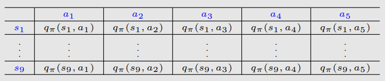
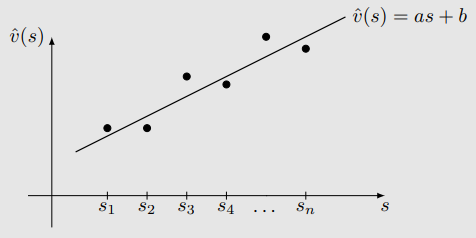
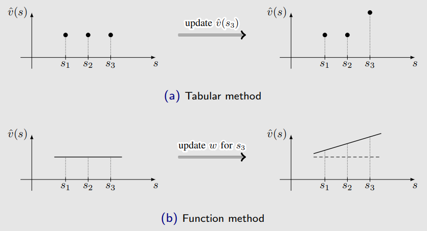
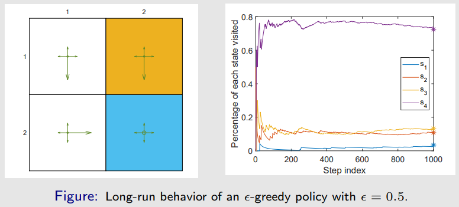
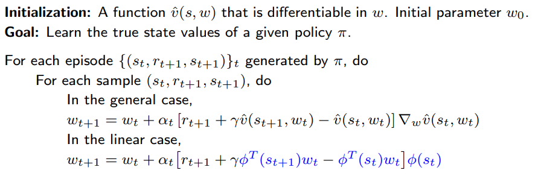

# 值函数方法（Value Function Methods）

## 价值表示：从表格到函数

  由表格转为函数，由离散转为连续。用函数拟合连续的状态价值

$$
\hat{v}(s) = as + b
$$

假设直线的方程为：

$$
\hat{v}(s, w) = as + b = \begin{bmatrix}s & 1\end{bmatrix} \begin{bmatrix} a \\ b \end{bmatrix} = \phi^T(s) w
$$

其中：

- $w$ 是**参数向量**
- $\phi(s)$ 是状态 $s$ 的**特征向量**
- $\hat{v}(s, w)$ 关于 $w$ 是线性的

### 两者差异

**差异 1：如何获取状态值**

- 当状态值是**用表格表示**时，我们可以直接从表中读取值；
- 当状态值是**用函数表示**时，我们需要将状态索引 $s$ 输入函数，并计算其函数值：

例如：  $s \rightarrow \phi(s) \rightarrow \phi^T(s) w = \hat{v}(s, w)$

- **优势：存储节省。**我们不需要存储 $|\mathcal{S}|$ 个状态值，只需存储低维参数向量 $w$。

**差异 2：如何更新状态值**

- 当状态值是**用表格表示**时，我们可以**直接**修改表中对应值；
- 当状态值是**用函数表示**时，我们必须**间接**地通过更新 $w$ 来改变值。

**优势：泛化能力（generalization ability）**

当我们通过更新 $w$ 来改变 $\hat{v}(s, w)$ 时，相邻状态的值也会被相应更新。

### 代价

函数逼近的好处**不是免费的**，它也带来了**代价**：状态值无法被完全准确表示。 

因此，这种方法被称为**逼近（approximation）**。

我们可以使用更高阶的曲线拟合点：

$$
\hat{v}(s, w) = as^2 + bs + c = \begin{bmatrix} s^2 & s & 1 \end{bmatrix} \begin{bmatrix} a \\ b \\ c \end{bmatrix} = \phi^T(s) w
$$

在这种情况下：

- $w$ 和 $\phi(s)$ 的维度将增加，拟合可能会更加精确；

- 尽管 $\hat{v}(s, w)$ 关于 $s$ 是**非线性**的，但它仍然是关于 $w$ 的**线性函数**。 
  
  非线性被封装在 $\phi(s)$ 中。

### 总结

- **核心思想：** 
  使用**参数化函数**来逼近状态值和动作值：$\hat{v}(s, w) \approx v_\pi(s)$，其中 $w \in \mathbb{R}^m$ 是参数向量。

- **关键区别：** 
  如何获取和修改 $v(s)$ 的值。

- **优点：**
  1. **存储效率：** $w$ 的维度可能远小于 $|\mathcal{S}|$
  2. **泛化能力：** 一旦状态 $s$ 被访问，参数 $w$ 被更新，其他未访问状态的值也可能被间接更新。

---

## 基于值函数的TD算法：状态值估计

以更正式的方式引入：

- 设 $v_\pi(s)$ 和 $\hat{v}(s, w)$ 分别为**真实状态价值**与**估计状态价值**。
- 我们的目标是找到一个**最优的参数 $w$**，使得 $\hat{v}(s, w)$ 能尽可能逼近 $v_\pi(s)$，对所有状态 $s$ 成立。
- 这是一个**策略评估问题（policy evaluation problem）**。

为了找到最优的 $w$，我们需要 **两个步骤**：

- 第一步是**定义目标函数**（objective function）。
- 第二步是**推导优化该目标函数的算法**。

### 目标函数

**目标函数（Objective Function）** 定义为：

$$
J(w) = \mathbb{E} \left[ (v_\pi(S) - \hat{v}(S, w))^2 \right]
$$

- 我们的目标是找到最优的 $w$，使得 $J(w)$ 最小。
- 这个期望是对随机变量 $S \in \mathcal{S}$ 的分布而言的。

:::info
详见理论分析，有扩展
:::

#### $S$ 的概率分布是什么？

- 这是新的内容。我们此前还没有讨论过状态的概率分布。
- 实际上，有**多种方式**可以定义状态 $S$ 的概率分布。

**方法一：使用均匀分布（uniform distribution）**

- 即认为所有状态**同等重要**，将每个状态的概率设置为 $1 / |\mathcal{S}|$。
- 此时目标函数为：

$$
J(w) = \mathbb{E}[(v_\pi(S) - \hat{v}(S, w))^2] = \frac{1}{|\mathcal{S}|} \sum_{s \in \mathcal{S}} (v_\pi(s) - \hat{v}(s, w))^2
$$

- **缺点：**
  - 状态可能**并不等重要**。例如某些状态在策略下几乎不会被访问，这种方式无法体现马尔可夫过程中的真实动态。

**方法二：使用平稳分布（stationary distribution）**

- 平稳分布是本课程中将频繁使用的重要概念，描述的是马尔可夫过程的**长期行为**（long-run behavior）。
- 设 $\{d_\pi(s)\}_{s \in \mathcal{S}}$ 为策略 $\pi$ 下马尔可夫过程的平稳分布，满足：

$$
d_\pi(s) \geq 0, \quad \sum_{s \in \mathcal{S}} d_\pi(s) = 1
$$

- 目标函数可重写为：

$$
J(w) = \mathbb{E}[(v_\pi(S) - \hat{v}(S, w))^2] = \sum_{s \in \mathcal{S}} d_\pi(s)(v_\pi(s) - \hat{v}(s, w))^2
$$

- 该函数是**加权平方误差**（weighted squared error）

- 由于经常被访问的状态具有较大的 $d_\pi(s)$，因此在目标函数中的权重也更高。

更多说明：

- **Distribution**：指状态的分布；
- **Stationary**：表示长期行为；
- **总结**：当智能体在策略下运行足够长时间后，任意时刻其处于某状态的概率由该分布描述。

:::info
- 平稳分布也称为**稳态分布（steady-state distribution）**或**极限分布（limiting distribution）**
- 它是理解**值函数方法（value function method）**的关键；
- 它对下一讲中的**策略梯度方法（policy gradient method）**也非常重要。
:::

**平稳分布的估计方法示例**

- 给定一策略（图中已示意）；
- 设 $n_\pi(s)$ 表示状态 $s$ 在策略 $\pi$ 下生成的一个很长 episode 中被访问的次数；
- 那么 $d_\pi(s)$ 可近似为：

$$
d_\pi(s) \approx \frac{n_\pi(s)}{\sum_{s' \in \mathcal{S}} n_\pi(s')}
$$

**平稳分布的精确解法（通过转移矩阵）**

- 收敛的状态概率可以预测，因为它们是平稳分布 $d_\pi$ 的组成部分：

$$
d_\pi^T = d_\pi^T P_\pi
$$

- 示例中，转移矩阵 $P_\pi$ 为：

$$
P_\pi = \begin{bmatrix}
0.3 & 0.1 & 0.6 & 0 \\
0.1 & 0.3 & 0 & 0.6 \\
0.1 & 0 & 0.3 & 0.6 \\
0 & 0.1 & 0.1 & 0.8
\end{bmatrix}
$$

- 可计算出对应特征值为 1 的**左特征向量**为：

$$
d_\pi = \begin{bmatrix}
0.0345, \quad 0.1084, \quad 0.1330, \quad 0.7241
\end{bmatrix}^T
$$

### 优化算法

当我们得到了目标函数后，下一步就是优化它。

- 为了最小化目标函数 $J(w)$，我们可以使用**梯度下降法（gradient descent）**：

$$
w_{k+1} = w_k - \alpha_k \nabla_w J(w_k)
$$

**真实梯度为：**
$$
\begin{aligned}
\nabla_w J(w) &= \nabla_w \mathbb{E}[(v_\pi(S) - \hat{v}(S, w))^2] \\
&= \mathbb{E}[\nabla_w (v_\pi(S) - \hat{v}(S, w))^2] \\
&= 2 \mathbb{E}[(v_\pi(S) - \hat{v}(S, w))(-\nabla_w \hat{v}(S, w))] \\
&= -2 \mathbb{E}[(v_\pi(S) - \hat{v}(S, w)) \nabla_w \hat{v}(S, w)]
\end{aligned}
$$

:::info
该梯度表达式中涉及对状态分布的期望。
:::

我们可以用**随机梯度（stochastic gradient）**来代替真实梯度：

$$
w_{k+1} = w_k + \alpha_k \mathbb{E}[(v_\pi(S) - \hat{v}(S, w)) \nabla_w \hat{v}(S, w)] \\
⇓\text{（用采样近似期望）}\\
w_{t+1} = w_t + \alpha_t (v_\pi(s_t) - \hat{v}(s_t, w_t)) \nabla_w \hat{v}(s_t, w_t)
$$

其中 $s_t$ 是从 $S$ 中采样得到的状态，$2\alpha_t$ 被吸收进了新的学习率 $\alpha_t$。

- 理论上，采样应满足平稳分布。但实际中未必成立；
- 该算法**不可实现（not implementable）**，因为它需要真实值 $v_\pi(s_t)$，而这正是我们要估计的；
- 可以用对 $v_\pi(s_t)$ 的估计值来替代，从而使算法**可实现**。

**两种可实现的近似方法**

**1. Monte Carlo 函数逼近方法**

令 $g_t$ 为从 $s_t$ 开始的折扣回报，则可以用 $g_t$ 来近似 $v_\pi(s_t)$。算法更新为：

$$
w_{t+1} = w_t + \alpha_t (g_t - \hat{v}(s_t, w_t)) \nabla_w \hat{v}(s_t, w_t)
$$
**2. TD 学习函数逼近方法**

根据 TD 学习的思想，用 **TD目标** 作为 $v_\pi(s_t)$ 的近似：

$$
r_{t+1} + \gamma \hat{v}(s_{t+1}, w_t)
$$

于是算法变为：

$$
w_{t+1} = w_t + \alpha_t \left[ r_{t+1} + \gamma \hat{v}(s_{t+1}, w_t) - \hat{v}(s_t, w_t) \right] \nabla_w \hat{v}(s_t, w_t)
$$

#### 伪代码

TD 学习 + 函数逼近

:::info
该算法只能估计给定策略下的状态价值函数。理解它对于之后学习其他更复杂的算法是非常重要的。
:::

### 选择值函数

- 第一种方法，也就是**以前广泛使用的方法**，是使用一个**线性**函数：
  
  $$
  \hat{v}(s, w) = \phi^T(s)w
  $$

  其中，$\phi(s)$ 是特征向量，可以是多项式基函数、傅里叶基函数等。

- 第二种方法，也就是**现在广泛使用的方法**，是使用神经网络作为**非线性**函数逼近器。

  - 例如，输入是 $s$，输出是 $\hat{v}(s, w)$，参数是 $w$。

在**线性**情况下，$\hat{v}(s, w) = \phi^T(s)w$，我们有：

$$
\nabla_w \hat{v}(s, w) = \phi(s)
$$

将该梯度代入TD算法：

$$
w_{t+1} = w_t + \alpha_t \left[ r_{t+1} + \gamma \hat{v}(s_{t+1}, w_t) - \hat{v}(s_t, w_t) \right] \nabla_w \hat{v}(s_t, w_t)
$$

得：

$$
w_{t+1} = w_t + \alpha_t \left[ r_{t+1} + \gamma \phi^T(s_{t+1})w_t - \phi^T(s_t)w_t \right] \phi(s_t)
$$

这是使用线性函数逼近的TD学习算法。在本文中，这个算法被称为 **TD-Linear**。

- **线性函数方法的缺点**：
  - 难以选择合适的特征向量。

- **线性函数方法的优点**：
  - **TD算法**在线性情形下的**理论性质**比非线性情形更容易理解。
  - 线性函数逼近仍然非常有用，因为**表格表示（tabular representation）是线性函数表示的一种特殊情况**。

#### 表格表示是线性函数表示的一个特例

:::info
表格与函数表示**统一了**！
:::

- 考虑状态 $s$ 的一个**特殊特征向量**：

  $$
  \phi(s) = e_s \in \mathbb{R}^{|S|}
  $$

  其中 $e_s$ 是一个向量，其第 $s$ 项为1，其它为0。

- 在这种情况下：

  $$
  \hat{v}(s, w) = \phi^T(s)w = e_s^T w = w(s)
  $$

  其中 $w(s)$ 是向量 $w$ 的第 $s$ 项。

回顾 TD-Linear 算法：

$$
w_{t+1} = w_t + \alpha_t \left[ r_{t+1} + \gamma \phi^T(s_{t+1})w_t - \phi^T(s_t)w_t \right] \phi(s_t)
$$

- 当 $\phi(s_t) = e_{s_t}$，上述算法变为：

  $$
  w_{t+1} = w_t + \alpha_t \left( r_{t+1} + \gamma w_t(s_{t+1}) - w_t(s_t) \right) e_{s_t}
  $$

  这是一个向量更新公式，仅更新 $w_t$ 的第 $s_t$ 项。

- 在等式两边同时乘以 $e_{s_t}^T$ 得：

  $$
  w_{t+1}(s_t) = w_t(s_t) + \alpha_t \left( r_{t+1} + \gamma w_t(s_{t+1}) - w_t(s_t) \right)
  $$

这正是表格形式的 TD 算法（此处称为 **TD-Table**）。

**总结：TD-Linear 在选择了特殊特征向量的情况下变成 TD-Table。**

### 理论分析（节选）

#### 收敛性分析

略

#### TD-Linear 算法优化的是投影贝尔曼误差

- **该算法**：

  $$
  w_{t+1} = w_t + \alpha_t \left[ r_{t+1} + \gamma \hat{v}(s_{t+1}, w_t) - \hat{v}(s_t, w_t) \right] \nabla_w \hat{v}(s_t, w_t)
  $$

  **并不会**最小化以下目标函数：

  $$
  J(w) = \mathbb{E} \left[ \left( v_\pi(S) - \hat{v}(S, w) \right)^2 \right]
  $$

**不同的目标函数（Objective Functions）**：

- **目标函数 1：真实值误差（True value error）**
  $$
  J_E(w) = \mathbb{E} \left[ \left( v_\pi(S) - \hat{v}(S, w) \right)^2 \right] = \| \hat{v}(w) - v_\pi \|_D^2
  $$
  
- **目标函数 2：Bellman误差**
  $$
  J_{BE}(w) = \left\| \hat{v}(w) - \left( r_\pi + \gamma P_\pi \hat{v}(w) \right) \right\|_D^2 = \left\| \hat{v}(w) - T_\pi( \hat{v}(w) ) \right\|_D^2
  $$
  
  其中，$T_\pi(·)$是贝尔曼算子：
  
  $$
  T_\pi(x) \doteq r_\pi + \gamma P_\pi x
  $$
  
- **目标函数 3：投影 Bellman 误差（Projected Bellman error）**
$$
  J_{PBE}(w) = \left\| \hat{v}(w) - M T_\pi( \hat{v}(w) ) \right\|_D^2
$$

其中 $M$ 是一个正交投影矩阵，它在几何上将任意向量投影到函数能够近似的值空间上。

- **TD-Linear 算法最小化的是投影 Bellman 误差。**

---

## 基于值函数的TD算法：动作值估计

到目前为止，我们只是考虑了**状态值估计**（state value estimation），即：

$$
\hat{v}(s) \approx v_\pi(s), \quad s \in \mathcal{S}
$$

但为了搜索最优策略，我们需要估计的是**动作值**（action values）。

### 基于值函数的Sarsa

使用值函数逼近的 **Sarsa 算法**（SARSA with function approximation）如下：

$$
w_{t+1} = w_t + \alpha_t \left[ r_{t+1} + \gamma \hat{q}(s_{t+1}, a_{t+1}, w_t) - \hat{q}(s_t, a_t, w_t) \right] \nabla_w \hat{q}(s_t, a_t, w_t)
$$

这和之前我们介绍的算法几乎一样，唯一的区别是将 $\hat{v}$ 替换成了 $\hat{q}$（状态估计值）。

为了搜索最优策略，我们可以结合 **策略评估（policy evaluation）** 和 **策略改进（policy improvement）**。

#### 伪代码

总结：这是一个典型的**基于值函数的策略迭代过程**，在每一步：

- 利用当前策略采样轨迹（policy evaluation）
- 用 q 值更新策略（policy improvement）

### 基于值函数的Q-learning

与 Sarsa 类似，**表格型 Q-learning** 也可以扩展到 **值函数逼近** 的情形。

Q 值的更新规则如下：

$$
w_{t+1} = w_t + \alpha_t \left[ r_{t+1} + \gamma \max_{a \in \mathcal{A}(s_{t+1})} \hat{q}(s_{t+1}, a, w_t) - \hat{q}(s_t, a_t, w_t) \right] \nabla_w \hat{q}(s_t, a_t, w_t)
$$

这和 **Sarsa 算法** 几乎一样，唯一的区别在于：

$$
\hat{q}(s_{t+1}, a_{t+1}, w_t)
\quad \text{被替换为} \quad
\max_{a \in \mathcal{A}(s_{t+1})} \hat{q}(s_{t+1}, a, w_t)
$$

**中文解释：**

- Sarsa 是**on-policy（同策略）**方法，用的是**实际采取的 $a_{t+1}$**
- Q-learning 是**off-policy（异策略）**方法，用的是**当前估计下最优动作对应的 Q 值**，即对 $a$ 取最大值
- 两者都使用近似函数 $\hat{q}(s, a, w)$ 来估计 Q 值，参数更新公式的结构相同，区别只在于目标值（target）

#### 伪代码

Q-learning with function approximation (on-policy version)

## Deep Q-learning（DQN）

- 是最早期且最成功的将深度神经网络引入强化学习的算法之一。
- 神经网络的作用是作为一个非线性函数逼近器。
- 它与以下算法不同：

  $$
  w_{t+1} = w_t + \alpha_t \left[ r_{t+1} + \gamma \max_{a \in \mathcal{A}(s_{t+1})} \hat{q}(s_{t+1}, a, w_t) - \hat{q}(s_t, a_t, w_t) \right] \nabla_w \hat{q}(s_t, a_t, w_t)
  $$

  不同之处在于训练神经网络的方式。

### 目标函数

目标是最小化如下目标函数/损失函数：
$$
w_{t+1} = w_t + \alpha_t \left[ r_{t+1} + \gamma \max_{a \in \mathcal{A}(s_{t+1})} \hat{q}(s_{t+1}, a, w_t) - \hat{q}(s_t, a_t, w_t) \right] \nabla_w \hat{q}(s_t, a_t, w_t) \\
\Downarrow \\
J(w) = \mathbb{E} \left[ \left( R + \gamma \max_{a \in \mathcal{A}(S')} \hat{q}(S', a, w) - \hat{q}(S, A, w) \right)^2 \right]
$$

其中 $(S, A, R, S')$ 是随机变量。

### 如何最小化目标函数？使用梯度下降！

- 如何计算目标函数的梯度？——**很棘手！**
- 这是因为，在该目标函数中：

  $$
  J(w) = \mathbb{E} \left[ \left( R + \gamma \max_{a \in \mathcal{A}(S')} \hat{q}(S', a, w) - \hat{q}(S, A, w) \right)^2 \right]
  $$

  参数 $w$ 不仅出现在 $\hat{q}(S, A, w)$ 中，还出现在：

  $$
  y \doteq R + \gamma \max_{a \in \mathcal{A}(S')} \hat{q}(S', a, w)
  $$

- 由于最优动作 $a$ 依赖于 $w$，

  $$
  \nabla_w y \ne \gamma \max_{a \in \mathcal{A}(S')} \nabla_w \hat{q}(S', a, w)
  $$

- 为了解决这个问题，我们可以假设在计算梯度时，$y$ 中的 $w$ 是固定的（至少在一段时间内）。

为此，我们可以引入两个网络。

- 一个是主网络（main network），表示 $\hat{q}(s, a, w)$
- 另一个是目标网络（target network），$\hat{q}(s, a, w_T)$

在这种情况下，目标函数简化为：

$$
J = \mathbb{E} \left[ \left( R + \gamma \max_{a \in \mathcal{A}(S')} \hat{q}(S', a, w_T) - \hat{q}(S, A, w) \right)^2 \right]
$$

其中 $w_T$ 是目标网络的参数。

当 $w_T$ 被固定时，$J$ 的梯度可以简单计算为：

$$
\nabla_w J = \mathbb{E} \left[ \left( R + \gamma \max_{a \in \mathcal{A}(S')} \hat{q}(S', a, w_T) - \hat{q}(S, A, w) \right) \nabla_w \hat{q}(S, A, w) \right]
$$

- Deep Q-learning 的基本思想是使用梯度下降算法来最小化该目标函数。
- 然而，这样的优化过程涉及一些重要的技巧，值得特别关注。

### Technique 1：两个网络：主网络与目标网络

实现细节：

- 令 $w$ 和 $w_T$ 分别表示主网络与目标网络的参数。它们最初被设置为相同。
- 在每一次迭代中，我们从 replay buffer（回放缓冲区，见下文） 中抽取一个 mini-batch 样本 $\{(s, a, r, s')\}$。
- 对于每个 $(s, a, r, s')$，我们可以计算期望的输出：

  $$
  y_T \doteq r + \gamma \max_{a \in \mathcal{A}(s')} \hat{q}(s', a, w_T)
  $$

- 因此，我们得到一个 mini-batch 数据：

  $$
  \{(s, a, y_T)\}
  $$

- 使用 $\{(s, a, y_T)\}$ 来训练网络，从而最小化：

  $$
  \left(y_T - \hat{q}(s, a, w)\right)^2
  $$

### Technique 2：经验回放（Experience replay）

- 当我们收集了一些经验样本之后，我们**不会按它们被收集的顺序使用它们**。
- 相反，我们将它们存储在一个集合中，称为 replay buffer：

  $$
  \mathcal{B} \doteq \{(s, a, r, s')\}
  $$

- 每次训练神经网络时，我们可以从 replay buffer 中随机抽取一个 mini-batch 样本。
- 抽样过程（也叫经验回放 experience replay）应遵循**均匀分布（uniform distribution）**。

**问题：为什么经验回放在 deep Q-learning 中是必要的？为什么 replay 必须服从均匀分布？**

**解答：**

答案可以从目标函数中看出：

$$
J = \mathbb{E} \left[ \left( R + \gamma \max_{a \in \mathcal{A}(S')} \hat{q}(S', a, w) - \hat{q}(S, A, w) \right)^2 \right]
$$

- $R \sim p(R|S,A)$，$S' \sim p(S'|S,A)$：$R$ 和 $S$ 是由系统模型决定的。
- $(S, A) \sim d$：$(S, A)$ 是一个索引，被看作一个单独的随机变量。
- 状态-动作对 $(S, A)$ 的分布被假设为**均匀的**。

  - 为什么要均匀分布？因为我们没有先验知识（no prior knowledge）。
  - 我们能像之前那样使用平稳分布吗？不能，因为没有给定策略。

- 然而，**样本并不是均匀采样的**，因为它们是由某个策略连续生成的。

- 为了**打破连续样本之间的相关性**，我们可以使用经验回放技术，从 replay buffer 中**均匀地采样**。
- 这就是**数学上的原因**，说明了为什么经验回放是必要的，为什么它必须是均匀的。

**回顾表格形式的 Q-learning：**

- **问题：**为什么表格 Q-learning 不需要经验回放？
  
  - **回答：**因为它不需要对 $S$ 或 $A$ 进行分布建模。
  
- **问题：**为什么 Deep Q-learning 涉及分布问题？
  - **回答：**因为我们需要定义一个标量目标函数：

    $$
    J(w) = \mathbb{E}[\ast]
    $$

    其中期望是对所有 $(S, A)$ 取的。

  - 表格形式旨在解一组关于所有 $(s, a)$ 的方程（Bellman 最优性方程），而 deep Q-learning 是优化一个标量目标函数。

- **问题：**我们能在表格 Q-learning 中使用经验回放吗？
  - **回答：**是的，我们可以，而且可以提高样本效率。

**总结：**

- 表格法不用经验回放，是因为它没有“泛化”和“梯度不稳定”的问题；
-  DQN 必须用经验回放，是因为神经网络对数据分布、相关性、非平稳性极其敏感。

### 伪代码

Deep Q-learning (off-policy version)

Remarks：

- 策略由最终的动作值决定（贪婪），不需要策略更新。
- 该网络的输入输出和原始论文不一致
  - 这个伪代码用的是：$(s,a)→Q(s,a)$
  - 而原论文用的是：$s→[Q(s,a1),...,Q(s,an)]$

### 示例

- 我们需要**为每一个状态-动作对学习最优动作价值**（learn optimal action values for every state-action pair）。
- 一旦获得最优动作价值，最优的贪婪策略（greedy policy）可以立即获得。

Setup：

- 使用**单个 episode** 来训练神经网络。
- 该 episode 是通过图(a)中展示的一个**探索性行为策略（exploratory behavior policy）**生成的。
- 该 episode 仅有 **1000 步！**（而表格型 Q-learning 需要 **100,000 步**）。
- 一个具有单个隐藏层的浅层神经网络被用作 $\hat{q}(s, a, w)$ 的非线性逼近器。
  - 该隐藏层包含 **100 个神经元（neurons）**。

