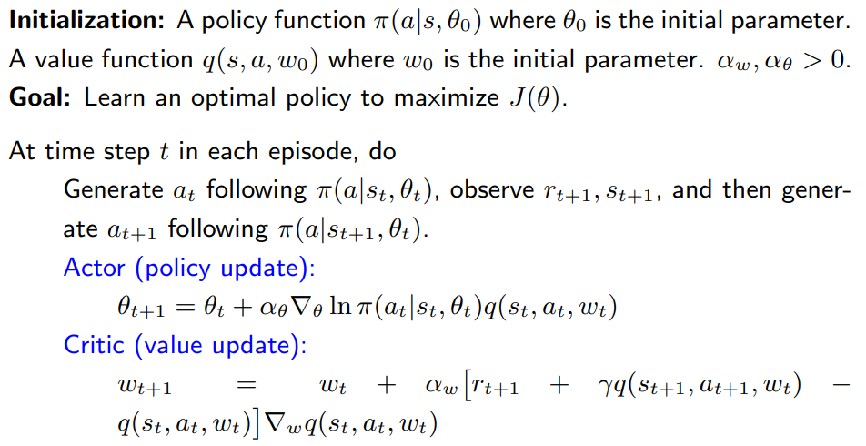
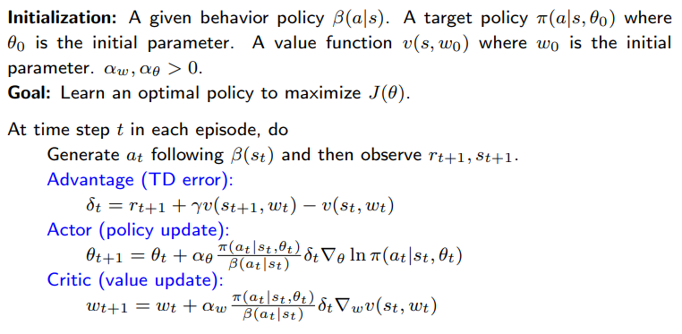

# 演员-评论家方法（Actor-Critic Methods）

**Actor-critic 方法仍然属于策略梯度方法。**

- 它们强调将策略梯度方法与价值函数方法相结合的结构。

**什么是“actor”和“critic”？**

- 这里，“actor”指的是**策略更新（policy update）**。之所以称为 actor，是因为策略将被用于选择动作。

- 这里，“critic”指的是**策略评估（policy evaluation）**或**价值估计（value estimation）**。之所以称为 critic，是因为它通过评估策略来“批评”策略。

## 最简单的演员-评论家方法：QAC

回顾上一讲中介绍的策略梯度思想：

1）一个标量度量 $J(\theta)$，可以是 $\bar{v}_\pi$ 或 $\bar{r}_\pi$。

2）用于最大化 $J(\theta)$ 的梯度上升算法是：

$$
\begin{aligned}
\theta_{t+1} &= \theta_t + \alpha \nabla_\theta J(\theta_t) \\
&= \theta_t + \alpha \mathbb{E}_{S \sim \eta, A \sim \pi} \left[ \nabla_\theta \ln \pi(A|S, \theta_t) q_\pi(S, A) \right]
\end{aligned}
$$
3）随机梯度上升算法是：
$$
\boxed{
\theta_{t+1} = \theta_t + \alpha \nabla_\theta \ln \pi(a_t|s_t, \theta_t) q_t(s_t, a_t)
}
$$

这个公式非常重要！我们可以直接从中看到“actor”（执行者）和“critic”（评价者）：

- 这个表达式对应于 actor
- 用于估计 $q_t(s,a)$ 的算法对应于 critic

### 如何获得 $q_t(s_t, a_t)$？

到目前为止，我们学习了**两种方法**来估计动作价值：

- **蒙特卡洛学习（Monte Carlo learning）：** 如果使用 MC，其对应的算法称为  
  
  **REINFORCE** 或 **蒙特卡洛策略梯度（Monte Carlo policy gradient）**。

  - 上文我们已经介绍过。
  
- **时序差分学习（Temporal-difference learning）：** 如果使用 TD，这类算法通常被称为 **actor-critic**。
  - 我们将在本文中介绍。
  - 此处最简单的使用 `SARSA + 价值函数逼近`。

### 伪代码

**备注：**

- *critic* 对应于 “SARSA + 价值函数逼近”。

- *actor* 对应于策略更新算法。

- 这个特定的 actor-critic 算法有时被称为 **Q Actor-Critic (QAC)**。

- 虽然简单，但这个算法揭示了 actor-critic 方法的核心思想。 
  
  它可以扩展为许多其他算法，如后面所示。

---

## 优势演员-评论家 advantage actor-critic (A2C)

接下来，我们将 QAC 扩展为优势 actor-critic（A2C）

- **核心思想** 是**引入一个基线以降低方差**。

### 基准不变性

**性质：策略梯度对额外的基准不变**
$$
\begin{aligned}
\nabla_\theta J(\theta) &= \mathbb{E}_{S \sim \eta, A \sim \pi} \left[ \nabla_\theta \ln \pi(A|S, \theta_t) q_\pi(S, A) \right] \\
&= \mathbb{E}_{S \sim \eta, A \sim \pi} \left[ \nabla_\theta \ln \pi(A|S, \theta_t)(q_\pi(S, A) - b(S) ) \right]
\end{aligned}
$$

这里，额外的基准 $b(S)$ 是 $S$ 的一个标量函数。

**首先，为什么它是合法的？**

因为

$$
\mathbb{E}_{S \sim \eta, A \sim \pi} \left[ \nabla_\theta \ln \pi(A|S, \theta_t) b(S) \right] = 0
$$

详细推导如下：

$$
\begin{aligned}
\mathbb{E}_{S \sim \eta, A \sim \pi} \left[ \nabla_\theta \ln \pi(A|S, \theta_t) b(S) \right] &= 
\sum_{s \in \mathcal{S}} \eta(s) \sum_{a \in \mathcal{A}} \pi(a|s, \theta_t) \nabla_\theta \ln \pi(a|s, \theta_t) b(s) \\
&= \sum_{s \in \mathcal{S}} \eta(s) \nabla_\theta \sum_{a \in \mathcal{A}} \pi(a|s, \theta_t) b(s)\\
&= \sum_{s \in \mathcal{S}} \eta(s) b(s) \nabla_\theta \sum_{a \in \mathcal{A}} \pi(a|s, \theta_t)\\
&= \sum_{s \in \mathcal{S}} \eta(s) b(s) \nabla_\theta 1 = 0
\end{aligned}
$$

**其次，为什么这个基准有用？**

梯度为 $\nabla_\theta J(\theta) = \mathbb{E}[X]$，其中：

$$
X(S, A) \doteq \nabla_\theta \ln \pi(A|S, \theta_t) [q_\pi(S, A) - b(S)]
$$

我们有：

- $\mathbb{E}[X]$ 对 $b(S)$ 不变。
- $\mathrm{var}(X)$ 对 $b(S)$ 改变。

  - 为什么？因为 $\mathrm{tr}(\mathrm{var}(X)) = \mathbb{E}[X^T X] - \bar{x}^T \bar{x}$，并且：

$$
\begin{aligned}
\mathbb{E}[X^T X] &= \mathbb{E} \left[ \left( \nabla_\theta \ln \pi \right)^T \left( \nabla_\theta \ln \pi \right) (q_\pi(S, A) - b(S))^2 \right] \\
&= \mathbb{E} \left[ \| \nabla_\theta \ln \pi \|^2 (q_\pi(S, A) - b(S))^2 \right]
\end{aligned}
$$

**我们的目标：**选择一个**最优基准** $b$ 来最小化 $\mathrm{var}(X)$

- **好处：** 当我们使用一个随机样本来近似 $\mathbb{E}[X]$ 时，估计的方差也会变小。

在 REINFORCE 和 QAC 算法中：

- 没有基线。
- 或者 $b = 0$，这**不一定是一个好的基准**。

- 能够最小化 $\mathrm{var}(X)$ 的**最优基准** 对于任意 $s \in \mathcal{S}$ 是：

$$
b^*(s) = \frac{\mathbb{E}_{A \sim \pi} \left[ \| \nabla_\theta \ln \pi(A|s, \theta_t) \|^2 q_\pi(s, A) \right]}
{\mathbb{E}_{A \sim \pi} \left[ \| \nabla_\theta \ln \pi(A|s, \theta_t) \|^2 \right]}
$$

- 虽然这个基准是最优的，但计算复杂。
- 我们可以移除权重 $\| \nabla_\theta \ln \pi(A|s, \theta_t) \|^2$，选择一个次优基准：

$$
b(s) = \mathbb{E}_{A \sim \pi}[q_\pi(s, A)] = v_\pi(s)
$$

它就是状态 $s$ 的价值函数！

### 算法描述

当 $b(s) = v_\pi(s)$ 时：

- 梯度上升算法为：

$$
\theta_{t+1} = \theta_t + \alpha \mathbb{E} \left[ \nabla_\theta \ln \pi(A|S, \theta_t) [q_\pi(S, A) - v_\pi(S)] \right]
\doteq \theta_t + \alpha \mathbb{E} \left[ \nabla_\theta \ln \pi(A|S, \theta_t) \delta_\pi(S, A) \right]
$$

其中，

$$
\delta_\pi(S, A) \doteq q_\pi(S, A) - v_\pi(S)
$$

称为**优势函数**（advantage function）

为什么叫 advantage？：反映了在特定状态 $s$ 下，选择某个动作 $a$ **相比于平均水平**（即在该状态下按策略行动的期望值）来说，是否更“有优势”

- 随机版本为：

$$
\theta_{t+1} = \theta_t + \alpha \nabla_\theta \ln \pi(a_t | s_t, \theta_t) [q_t(s_t, a_t) - v_t(s_t)]
= \theta_t + \alpha \nabla_\theta \ln \pi(a_t | s_t, \theta_t) \delta_t(s_t, a_t)
$$

此外，优势函数可以用 TD 误差近似：

$$
\delta_t = q_t(s_t, a_t) - v_t(s_t) \color{blue}\rightarrow r_{t+1} + \gamma v_t(s_{t+1}) - v_t(s_t)
$$

- 这个近似是合理的，因为：

$$
\mathbb{E}[q_\pi(S, A) - v_\pi(S) | S = s_t, A = a_t] = \mathbb{E}[R + \gamma v_\pi(S') - v_\pi(S) | S = s_t, A = a_t]
$$

- **优点：** 只需要一个网络去逼近 $v_\pi(s)$，而不是分别为 $q_\pi(s, a)$ 和 $v_\pi(s)$ 建两个网络。

**A2C 算法的解释：**
$$
\begin{aligned}
\theta_{t+1} &= \theta_t + \alpha \nabla_\theta \ln \pi(a_t | s_t, \theta_t) \delta_t(s_t, a_t) \\
&= \theta_t + \alpha \frac{\nabla_\theta \pi(a_t | s_t, \theta_t)}{\pi(a_t | s_t, \theta_t)} \delta_t(s_t, a_t) \\
&= \theta_t + \alpha \underbrace{\left( \frac{\delta_t(s_t, a_t)}{\pi(a_t | s_t, \theta_t)} \right)}_{\beta_t} \nabla_\theta \pi(a_t | s_t, \theta_t)
\end{aligned}
$$

于是：

- $\delta_t(s_t, a_t)$ 越大 $\Rightarrow$ $\beta_t$ 越大 $\Rightarrow$ $\pi(a_t | s_t, \theta_{t+1})$ 越大
- $\pi(a_t | s_t, \theta_t)$ 越小 $\Rightarrow$ $\beta_t$ 越大 $\Rightarrow$ $\pi(a_t | s_t, \theta_{t+1})$ 越大

详见上一讲中类似情况的分析。

- 它可以很好地**平衡探索与利用**。
- 重要的是**$\delta_t$ 的相对值**，而不是 $q_t$ 的绝对值，这更加合理。

### 伪代码

这是一个**on-policy（同策略）**方法。

由于策略 $\pi(\theta_t)$ 是**随机的**，因此**无需使用类似 $\varepsilon$-greedy 的探索技巧**。

---

## 异策略演员-评论家 off-policy policy gradient

### 引子

考虑一个随机变量 $X \in \mathcal{X} = \{+1, -1\}$。

如果 $X$ 的概率分布是 $p_0$，则有：

$$
p_0(X = +1) = 0.5, \quad p_0(X = -1) = 0.5
$$

那么 $X$ 的期望为：

$$
\mathbb{E}_{X \sim p_0}[X] = (+1) \cdot 0.5 + (-1) \cdot 0.5 = 0
$$
**问题：如何使用一些样本 $\{x_i\}$ 来估计 $\mathbb{E}[X]$？**

**情况 1：**

- 样本 $\{x_i\}$ 是根据分布 $p_0$ 生成的：

$$
\mathbb{E}[x_i] = \mathbb{E}[X], \quad \mathrm{var}[x_i] = \mathrm{var}[X]
$$

- 那么平均值可以收敛到期望：

$$
\bar{x} = \frac{1}{n} \sum_{i=1}^n x_i \rightarrow \mathbb{E}[X], \quad \text{当 } n \rightarrow \infty
$$

:::info
见大数定律。
:::

**情况 2：**

- 样本 $\{x_i\}$ 是根据**另一个分布** $p_1$ 生成的：

$$
p_1(X = +1) = 0.8, \quad p_1(X = -1) = 0.2
$$

- 那么期望是：

$$
\mathbb{E}_{X \sim p_1}[X] = (+1) \cdot 0.8 + (-1) \cdot 0.2 = 0.6
$$

- 如果我们使用样本的平均值，那么不出意外地：

$$
\bar{x} = \frac{1}{n} \sum_{i=1}^n x_i \rightarrow \mathbb{E}_{X \sim p_1}[X] = 0.6 \ne \mathbb{E}_{X \sim p_0}[X] = 0
$$

因此，直接使用平均值会**偏离我们真正想要的期望**，这是引入**重要性采样**的动机。

**问题：我们可以使用 $\{x_i\} \sim p_1$ 来估计 $\mathbb{E}_{x \sim p_0}[X]$ 吗？**

- **为什么要这么做？** 
  我们可能希望估计 $\mathbb{E}_{A \sim \pi}[*]$，其中 $\pi$ 是**目标策略（target policy）**，但样本来自某个**行为策略（behavior policy）** $\beta$。

- **怎么做？**

  - 如果直接使用 $\bar{x}$ 是无法实现的：

    $$
    \bar{x} \rightarrow \mathbb{E}_{X \sim p_1}[X] = 0.6 \ne \mathbb{E}_{X \sim p_0}[X] = 0
    $$

  - 我们可以通过使用**重要性采样（importance sampling）**技术来实现。

###  重要性采样

注意到：

$$
\mathbb{E}_{X \sim p_0}[X] = \sum_x p_0(x) x = \sum_x p_1(x) \underbrace{\frac{p_0(x)}{p_1(x)}}_{f(x)} x = \mathbb{E}_{X \sim p_1}[f(X)]
$$

- 因此，我们可以通过估计 $\mathbb{E}_{X \sim p_1}[f(X)]$ 来估计 $\mathbb{E}_{X \sim p_0}[X]$。
- 如何估计 $\mathbb{E}_{X \sim p_1}[f(X)]$？很简单，令：

$$
\bar{f} \doteq \frac{1}{n} \sum_{i=1}^n f(x_i), \quad \text{其中 } x_i \sim p_1
$$

那么，

$$
\bar{f} \rightarrow \mathbb{E}_{X \sim p_1}[f(X)], \quad \text{当 } n \rightarrow \infty
$$
因此，$\bar{f}$ 是 $\mathbb{E}_{X \sim p_0}[X]$ 的一个良好近似：

$$
\mathbb{E}_{X \sim p_0}[X] \approx \bar{f} = \frac{1}{n} \sum_{i=1}^n f(x_i) = \frac{1}{n} \sum_{i=1}^n \frac{p_0(x_i)}{p_1(x_i)} x_i
$$

- $\frac{p_0(x_i)}{p_1(x_i)}$ 被称为**重要性权重（importance weight）**。

  - 若 $p_1(x_i) = p_0(x_i)$，重要性权重为 $1$，$\bar{f}$ 就退化为普通平均 $\bar{x}$。
  - 若 $p_0(x_i) \ge p_1(x_i)$，说明 $x_i$ 被 $p_0$ 采样的概率更高，重要性权重大于 $1$，**强调该样本的重要性**。

你可能会问：既然

$$
\bar{f} = \frac{1}{n} \sum_{i=1}^n \frac{p_0(x_i)}{p_1(x_i)} x_i
$$

需要知道 $p_0(x)$，那么我都知道 $p_0(x)$ 了，为啥不直接算期望？

**回答：** 

我们可能**只能在给定某个具体 $x$ 时获得 $p_0(x)$ 的值**，而不是知道所有 $x$ 的完整分布。

- 例如在**连续情况**中、$p_0$ 的表达式很复杂，或者 $p_0$ 没有显式表达式（如由神经网络表示）时。

### Off-policy 策略梯度定理

就像之前的 on-policy 情况一样，我们现在需要在 **off-policy** 情况下推导策略梯度。

- 假设 $\beta$ 是**行为策略（behavior policy）**，用来生成经验样本。
- 我们的目标是利用这些样本来更新**目标策略（target policy）** $\pi(\theta)$，以优化如下度量：

$$
J(\theta) = \sum_{s \in \mathcal{S}} d_\beta(s) v_\pi(s) = \mathbb{E}_{S \sim d_\beta} [v_\pi(S)]
$$

其中，$d_\beta$ 是在策略 $\beta$ 下的**平稳分布（stationary distribution）**。

**定理（Off-policy 策略梯度定理）：**

在折扣因子 $\gamma \in (0,1)$ 的情形下，$J(\theta)$ 的梯度为：

$$
\begin{aligned}
\nabla_\theta J(\theta) &= \mathbb{E}_{S \sim \rho, \color{blue}A \sim \pi} \left[ \nabla_\theta \ln \pi(A|S, \theta) q_\pi(S, A) \right]\\
&= \mathbb{E}_{S \sim \rho, \color{blue}A \sim \beta} \left[ \color{red}\frac{\pi(A|S, \theta)}{\beta(A|S)}\color{black} \nabla_\theta \ln \pi(A|S, \theta) q_\pi(S, A) \right]
\end{aligned}
$$

其中：

- $\beta$ 是行为策略（behavior policy）；
- $\rho$ 是状态分布。

### 算法描述

**off-policy 策略梯度**同样**对基线 $b(s)$ 不变（invariant）**。

- 特别地，我们有：

$$
\nabla_\theta J(\theta) = \mathbb{E}_{S \sim \rho, A \sim \beta} \left[ \frac{\pi(A|S, \theta)}{\beta(A|S)} \nabla_\theta \ln \pi(A|S, \theta) \left( q_\pi(S, A) - b(S) \right) \right]
$$

- 为了减少估计方差，我们可以选择基线为 $b(S) = v_\pi(S)$，于是得到：

$$
\nabla_\theta J(\theta) = \mathbb{E} \left[ \frac{\pi(A|S, \theta)}{\beta(A|S)} \nabla_\theta \ln \pi(A|S, \theta) \left( q_\pi(S, A) - v_\pi(S) \right) \right]
$$

对应的**随机梯度上升算法**为：

$$
\theta_{t+1} = \theta_t + \alpha_\theta \frac{\pi(a_t|s_t, \theta_t)}{\beta(a_t|s_t)} \nabla_\theta \ln \pi(a_t|s_t, \theta_t) \left( q_t(s_t, a_t) - v_t(s_t) \right)
$$

类似于 on-policy 情况，有：

$$
q_t(s_t, a_t) - v_t(s_t) \approx r_{t+1} + \gamma v_t(s_{t+1}) - v_t(s_t) \doteq \delta_t(s_t, a_t)
$$

因此算法变为：

$$
\theta_{t+1} = \theta_t + \alpha_\theta \frac{\pi(a_t|s_t, \theta_t)}{\beta(a_t|s_t)} \nabla_\theta \ln \pi(a_t|s_t, \theta_t) \delta_t(s_t, a_t)
$$

这个更新可以进一步化简为：

$$
\theta_{t+1} = \theta_t + \alpha_\theta \left( \frac{\delta_t(s_t, a_t)}{\beta(a_t|s_t)} \right) \nabla_\theta \pi(a_t|s_t, \theta_t)
$$

### 伪代码

---

## 确定性演员-评论家 deterministic policy gradient（DPG）

到目前为止，策略梯度方法中使用的策略都是**随机策略（stochastic）**， 
因为对所有的 $(s, a)$ 都有 $\pi(a|s, \theta) > 0$。

我们能否在策略梯度方法中使用**确定性策略（deterministic policies）**？

- **好处：** 可以处理**连续动作空间**。

**表示策略的方式：**

- 到目前为止，一个通用策略记作 $\pi(a|s, \theta) \in [0, 1]$，可以是随机的，也可以是确定的。

- 现在，确定性策略**特别表示**为：

$$
a = \mu(s, \theta) \doteq \mu(s)
$$

- $\mu$ 是从状态空间 $\mathcal{S}$ 到动作空间 $\mathcal{A}$ 的一个映射。

- $\mu$ 可以用一个函数（例如神经网络）表示，输入为 $s$，输出为 $a$，参数为 $\theta$。

- 我们有时会简写 $\mu(s, \theta)$ 为 $\mu(s)$。

### 确定性策略梯度定理

- 此前介绍的策略梯度定理**仅适用于随机策略（stochastic policies）**。
- 如果使用的是**确定性策略（deterministic policy）**，我们就必须推导一个**新的策略梯度定理**。
- 不过，整体的思想和推导流程是类似的。

考虑折扣情况下平均状态价值的度量函数：

$$
J(\theta) = \mathbb{E}[v_\mu(s)] = \sum_{s \in \mathcal{S}} d_0(s) v_\mu(s)
$$

其中，$d_0(s)$ 是一个概率分布，满足 $\sum_{s \in \mathcal{S}} d_0(s) = 1$。

- 我们选择 $d_0$ **与策略 $\mu$ 无关**，这样更容易计算梯度。

- 有两种特殊但重要的 $d_0$ 选择方式：

  1. $d_0(s_0) = 1$ 且 $d_0(s \ne s_0) = 0$，适用于我们关注某个初始状态 $s_0$ 的情形；
  2. $d_0$ 是一个行为策略（与 $\mu$ 不同）的**平稳分布**。

**定理（折扣情形下的确定性策略梯度定理）：**

在折扣因子 $\gamma \in (0, 1)$ 的情况下，$J(\theta)$ 的梯度为：

$$
\begin{aligned}
\nabla_\theta J(\theta) &= \sum_{s \in \mathcal{S}} \rho_\mu(s) \nabla_\theta \mu(s) \left( \nabla_a q_\mu(s, a)\right) \big|_{a = \mu(s)} \\
&= \mathbb{E}_{S \sim \rho_\mu} \left[ \nabla_\theta \mu(S) \left( \nabla_a q_\mu(S, a)\right) \big|_{a = \mu(S)}  \right]
\end{aligned}
$$

其中，$\rho_\mu$ 是状态分布。

:::info
证明略，且此定理适用于两个目标函数以及各种折扣情况
:::

**与随机策略的一个重要区别：**

- 梯度中**不涉及动作 $A$ 的概率分布**（为什么？因为是确定性的，没有概率分布）。
- 因此，确定性策略梯度方法**天然是 off-policy 的**。

### 算法描述

基于策略梯度，最大化 $J(\theta)$ 的梯度上升算法为：

$$
\theta_{t+1} = \theta_t + \alpha_\theta \mathbb{E}_{S \sim \rho_\mu} \left[ \nabla_\theta \mu(S) \left( \nabla_a q_\mu(S, a) \right)\big|_{a = \mu(S)}  \right]
$$

对应的**随机梯度上升算法**为：

$$
\theta_{t+1} = \theta_t + \alpha_\theta \nabla_\theta \mu(s_t) \left( \nabla_a q_\mu(s_t, a)\right) \big|_{a = \mu(s_t)} 
$$

### 伪代码

**备注：**

- 这是一个 **off-policy 实现**，其中行为策略 $\beta$ 可以不同于目标策略 $\mu$。
- $\beta$ 也可以用 $\mu + \text{noise}$ 来表示。

**如何选择表示 $q(s, a, w)$ 的函数？**

- **线性函数：**

  $$
  q(s, a, w) = \phi^T(s, a) w
  $$

  其中 $\phi(s, a)$ 是特征向量，详见 DPG 论文。

- **神经网络：**

  使用**深度确定性策略梯度（DDPG）**方法表示。

