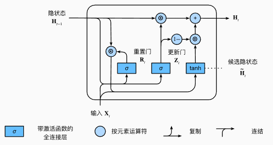

# 门控循环神经网络 GRU

Gate Recurrent Unit（GRU）是一种**门控循环神经网络**，由 Cho 等人在提出 Seq2Seq 模型时引入。

设计目标是：  
**在缓解传统 RNN 梯度消失问题的同时，保持比 LSTM 更简单的结构与更高的训练效率。**

核心思想：  
**通过门控机制直接在隐藏状态上进行更新，不再区分“记忆单元”和“隐状态”。**

---

## GRU 相比 RNN / LSTM 的特点

### 相比普通 RNN

- 引入门控结构，缓解梯度消失
- 使用加权加法路径，稳定梯度传播

### 相比 LSTM

- **无独立记忆单元 $c_t$**
- 门数量更少（2 个）
- 参数更少、计算更快
- 表达能力略弱，但在很多任务上效果接近甚至相同

---

## 结构组成

GRU 仅维护一个状态：

- **隐藏状态（Hidden State）**：$h_t$

包含两个门控单元：

- 更新门（Update Gate）
- 重置门（Reset Gate）

---

## 前向传播流程（Forward Pass）

### （1）更新门 Update Gate

$$
z_t = \sigma(W_z x_t + U_z h_{t-1} + b_z)
$$

作用：

- 决定**旧状态与新状态的融合比例**
- 控制长期依赖的保留程度

直观理解：

- $z_t \approx 1$ ：更偏向更新为新状态  
- $z_t \approx 0$ ：更偏向保留旧状态  

更新门在功能上相当于 LSTM 中的：

> **遗忘门 + 输入门的合体**

---

### （2）重置门 Reset Gate

$$
r_t = \sigma(W_r x_t + U_r h_{t-1} + b_r)
$$

作用：

- 决定在计算候选状态时，**历史信息参与的程度**
- 对捕捉**短期依赖**尤其重要

直观理解：

- $r_t \approx 0$ ：几乎忽略过去（强重置）
- $r_t \approx 1$ ：充分利用历史状态

---

### （3）候选隐藏状态 Candidate State

$$
\tilde{h}_t = \tanh\big(W x_t + U (r_t \odot h_{t-1}) + b\big)
$$

作用：

- 在重置门控制下
- 基于当前输入和“筛选后的历史信息”
- 生成一个**新的候选状态**

关键点：

- 重置门只作用在**候选状态的计算阶段**
- 不直接影响最终状态融合比例

---

### （4）最终隐藏状态更新（核心公式）

$$
h_t = (1 - z_t) \odot h_{t-1} + z_t \odot \tilde{h}_t
$$

这是 GRU 的**核心更新公式**：

- 第一项：保留旧状态
- 第二项：引入新候选状态
- 更新门 $z_t$ 决定二者的权重

梯度视角：

- 当 $z_t$ 较小，梯度主要沿 $h_{t-1}$ 传播
- 加法路径使梯度在时间维度上更稳定

---

## 信息流动视角

- **单一状态 $h_t$ 同时承担**
  - 长期记忆
  - 短期表达
- 更新门：控制“时间维度上的记忆更新”
- 重置门：控制“历史信息对当前计算的影响”

---

## 参数维度说明

设：
- 输入维度：$d_x$
- 隐状态维度：$d_h$

则：
- $W_z, W_r, W \in \mathbb{R}^{d_h \times d_x}$
- $U_z, U_r, U \in \mathbb{R}^{d_h \times d_h}$
- 偏置项：$b_z, b_r, b \in \mathbb{R}^{d_h}$

相比 LSTM：

- 参数量约减少 **25%～30%**

---

## GRU 的特点总结

### 优点

- 结构简单，参数更少
- 训练速度快、收敛稳定
- 能有效建模中长程依赖
- 在小数据集上更不易过拟合

### 缺点

- 无显式长期记忆单元
- 表达能力略弱于 LSTM
- 在极长序列上可能不如 LSTM 稳定

---

## GRU 与 LSTM 对比（总结）

| 对比项 | GRU | LSTM |
|------|-----|------|
| 门数量 | 2 | 3 |
| 独立记忆单元 | 无 | 有 |
| 参数量 | 少 | 多 |
| 训练速度 | 快 | 较慢 |
| 长期依赖建模 | 较强 | 很强 |

经验选择：

- **资源受限 / 快速实验 → GRU**
- **超长依赖 / 表达要求高 → LSTM**

---

## 常见应用场景

- 语言建模、文本分类
- 语音识别
- 时间序列预测
- 低资源 NLP 任务

---

## 总结

**GRU 通过更新门与重置门，在单一隐藏状态上实现信息选择与梯度稳定传播，是 LSTM 的高效简化版本。**
