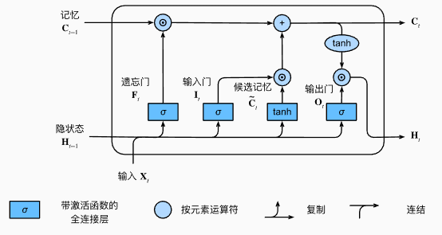

# 长短时记忆网络 LSTM

Long Short-Term Memory（LSTM）是一种**门控循环神经网络（Gated RNN）**，由 Hochreiter & Schmidhuber 提出，用于解决普通 RNN 在处理**长序列依赖**时的**梯度消失 / 梯度爆炸**问题。

核心思想：  
**通过显式的记忆单元（cell state）和门控机制，控制信息的写入、保留与输出。**

---

## LSTM 相比普通 RNN 的改进点

普通 RNN：
$$
h_t = \tanh(W_h h_{t-1} + W_x x_t + b)
$$

- 隐状态既承担**记忆**又承担**输出表达**
- 多步连乘导致梯度指数级衰减或爆炸

LSTM：
- 引入**独立的记忆状态 $c_t$**
- 通过**加法路径**而非纯乘法传播长期信息
- 使用门控结构进行信息选择

---

## 结构组成

- **记忆元（Cell State）**：$c_t$，负责长期信息存储
- **隐状态（Hidden State）**：$h_t$，对外输出、短期表达
- **三个门控单元**
  - 遗忘门（Forget Gate）
  - 输入门（Input Gate）
  - 输出门（Output Gate）

:::info
- Sigmoid 输出范围：$[0,1]$
- Tanh 输出范围：$[-1,1]$
:::

---

## 前向传播流程（Forward Pass）

### （1）遗忘门 Forget Gate

决定**历史记忆 $c_{t-1}$ 中哪些需要被保留**

$$
f_t = \sigma(W_f [h_{t-1}, x_t] + b_f)
$$

- $f_t \approx 1$：长期记忆几乎无衰减  
- $f_t \approx 0$：对应维度的历史信息被清空  

---

### （2）输入门 Input Gate

决定**当前输入信息写入多少**

$$
i_t = \sigma(W_i [h_{t-1}, x_t] + b_i)
$$

---

### （3）候选记忆生成

$$
\tilde{c}_t = \tanh(W_c [h_{t-1}, x_t] + b_c)
$$

- $\tilde{c}_t$：当前时刻可写入的候选记忆

---

### （4）更新记忆状态（核心公式）

$$
c_t = f_t \odot c_{t-1} + i_t \odot \tilde{c}_t
$$

- 第一项：保留历史信息  
- 第二项：写入当前信息  

梯度视角：
$$
\frac{\partial c_t}{\partial c_{t-1}} = f_t
$$

---

### （5）输出门 Output Gate

决定**当前记忆中哪些信息对外可见**

$$
o_t = \sigma(W_o [h_{t-1}, x_t] + b_o)
$$

$$
h_t = o_t \odot \tanh(c_t)
$$

- $c_t$：内部长期记忆  
- $h_t$：对外输出的隐状态  

---

## 信息流动视角

- $c_t$：沿时间维度传播（长期记忆）
- $h_t$：沿网络层级传播（短期表达）
- 门控机制调节二者的交互强度

---

## 参数维度说明

设：
- 输入维度：$d_x$
- 隐状态维度：$d_h$

则：
- $W_f, W_i, W_c, W_o \in \mathbb{R}^{d_h \times (d_h + d_x)}$
- $b_f, b_i, b_c, b_o \in \mathbb{R}^{d_h}$

---

## LSTM 的特点

### 优点

- 能有效建模长期依赖
- 梯度传播稳定
- 记忆与输出适度分离

### 缺点

- 参数量大
- 计算开销高
- 结构相对复杂

---

## LSTM 与 GRU 对比

| 对比项 | LSTM | GRU |
|------|------|-----|
| 门数量 | 3 | 2 |
| 独立记忆单元 | 有 | 无 |
| 参数量 | 大 | 较小 |
| 表达能力 | 强 | 略弱 |

---

## 常见应用

- 语言模型、机器翻译
- 语音识别
- 时间序列预测
- 生物序列建模

---

## 总结

**LSTM 通过门控机制与加法记忆通道，使梯度能够在时间维度上稳定传播，从而有效建模长程依赖。**
