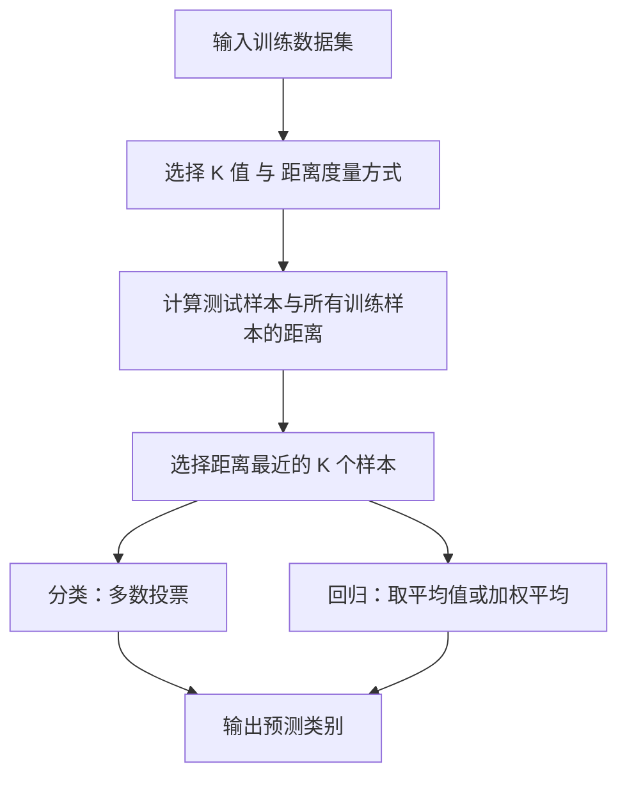
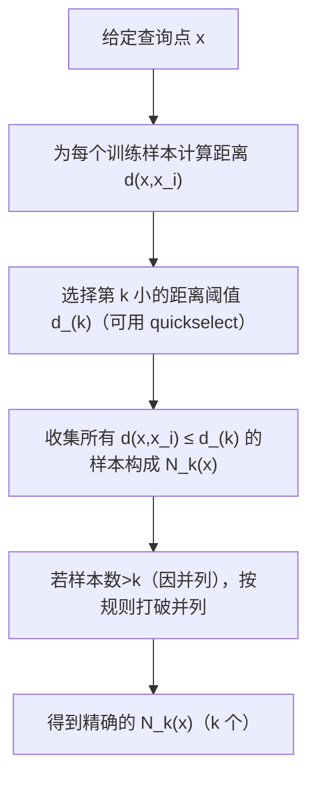

# K近邻算法（KNN）

## 一、算法概述

**KNN（K-Nearest Neighbors，K 最近邻算法）** 是一种基于实例的监督学习算法，用于**分类**和**回归**问题。

核心思想：
> “物以类聚”——一个样本的类别大概率与它距离最近的样本类别相同。

KNN 不构建显式模型，而是直接利用训练样本进行预测，因此属于：
- **监督学习（Supervised Learning）**
- **非参数模型（Non-parametric Model）**
- **惰性学习（Lazy Learning）**

---

## 二、算法基本思想

给定训练集：

$$
D = \{(x_1, y_1), (x_2, y_2), \dots, (x_n, y_n)\}
$$

对于新的输入样本 $x$：

1. 计算 $x$ 与训练集中每个样本 $x_i$ 的距离；
2. 选取距离最近的 $k$ 个样本（称为“$k$ 近邻”）；
3. **分类问题**：采用多数表决；
   $$
   f(x) = \arg\max_y \sum_{x_i \in N_k(x)} I(y_i = y)
   $$
4. **回归问题**：取邻居的平均值；
   $$
   \hat{y}(x) = \frac{1}{k}\sum_{x_i \in N_k(x)} y_i
   $$

---

## 三、算法流程图

## 四、数学原理推导

> 目标：在不知道真实分布 $P(Y|X)$ 的情况下，用**局部样本**近似最优的贝叶斯分类器。

### 4.1 记号与目标
- 输入空间：$\mathcal{X}\subset\mathbb{R}^d$；类别集合：$\mathcal{Y}=\{1,\dots,C\}$  
- 训练集：$D=\{(x_i,y_i)\}_{i=1}^n$，$y_i\in\mathcal{Y}$  
- 最优贝叶斯分类器：  
  $$f^*(x)=\arg\max_{y\in\mathcal{Y}}P(Y=y\mid X=x)$$

我们估计 $P(Y=y\mid X=x)$ 的思路是 **“在 $x$ 附近的邻域里统计频率”**。

### 4.2 $k$ 近邻的局部频率估计
令 $N_k(x)$ 表示 $x$ 的 $k$ 个最近邻样本集合。用指示函数 $I(\cdot)$ 计数类别 $y$ 的出现次数：
$$
\widehat{P}(Y=y\mid X=x)=\frac{1}{k}\sum_{x_i\in N_k(x)}I(y_i=y)
$$
于是 KNN 分类器：
$$
f(x)=\arg\max_{y\in\mathcal{Y}}\sum_{x_i\in N_k(x)}I(y_i=y)
$$

### 4.3 与密度估计/核方法的关系
把 $N_k(x)$ 看作一个“自适应体积”的邻域，其体积 $V_k(x)$ 随数据密度自适应变化。对于某类 $y$：
- 类条件密度近似：$\widehat{p}(x\mid y)\approx \dfrac{\#\{x_i\in N_k(x):y_i=y\}}{n_y\cdot V_k(x)}$
- 先验近似：$\widehat{P}(y)\approx \dfrac{n_y}{n}$

代入贝叶斯公式后，$V_k(x)$ 抵消，得到与上式一致的**局部频率投票**。  
这等价于使用**均匀核（uniform kernel）**在 $N_k(x)$ 内做核密度估计；若用距离递减的权重（见 §7），相当于换成高斯/指数等核函数。

### 4.4 一致性与极限性质（直观）
当 $n\to\infty$，$k\to\infty$ 且 $k/n\to 0$ 时，$N_k(x)$ 会缩到 $x$ 的无限小邻域，KNN 的经验后验 $\widehat{P}(Y\mid X=x)$ 收敛到真实 $P(Y\mid X=x)$，因此**渐近一致**；$1$-NN 的误差上界与贝叶斯误差成常数关系（直观理解：近邻“代表”了 $x$ 所在类别的局部真分布）。

---

## 五、距离度量与特征工程

### 5.1 常用距离
- 欧氏：$d_2(x,x_i)=\sqrt{\sum_j(x_j-x_{ij})^2}$（连续特征、各维度同尺度）
- 曼哈顿：$d_1(x,x_i)=\sum_j|x_j-x_{ij}|$（对异常值更稳健）
- 闵可夫斯基：$d_p(x,x_i)=\big(\sum_j|x_j-x_{ij}|^p\big)^{1/p}$（$p=1,2$常见）
- 余弦“距离”：$d_{\cos}(x,x_i)=1-\dfrac{x\cdot x_i}{\|x\|\|x_i\|}$（文本/高维稀疏向量）
- 马氏距离（相关性显著时）：$d_M(x,x_i)=\sqrt{(x-x_i)^\top \Sigma^{-1}(x-x_i)}$

### 5.2 特征缩放（必须重视）
若不缩放，量纲大的特征会“主导”距离。常见做法：
- 标准化：$z=(x-\mu)/\sigma$
- 区间缩放：$x\mapsto (x-\min)/(\max-\min)$  
> **注意**：缩放参数必须仅用**训练集**拟合，避免数据泄露（在 sklearn 用 Pipeline）。

### 5.3 类别/文本/集合特征
- 类别型：独热编码（one-hot）后配合欧氏/曼哈顿；或用**汉明距离**  
- 文本：TF-IDF + 余弦相似  
- 集合/二值稀疏：Jaccard 距离优先

### 5.4 缺失值与异常值
- 缺失：先用训练集的**统计量/模型**插补；或用“可比较维度”的加权距离  
- 异常：鲁棒缩放（如 IQR）或使用 $L_1$ 距离

---

## 六、如何计算第 $k$ 近邻

## 编写中