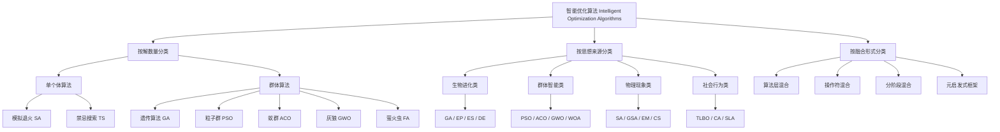

# 智能优化算法的分类

智能优化算法（Intelligent Optimization Algorithms, IOAs）是一类基于自然启发与智能机制的全局优化方法。根据不同的分类依据，可以从算法运行特征、设计思想来源以及算法融合形式等角度进行系统划分。

---

## 一、按算法运行过程中维持的解的数量分类

智能优化算法在运行时维护的“解的数量”不同，可分为 **单个体算法** 与 **群体算法** 两大类。

### 1. 单个体智能优化算法（Single-solution based）

这类算法在搜索过程中仅维护一个候选解，通过邻域搜索或扰动不断改进该解。  
其特点是结构简单、计算量小，但容易陷入局部最优。

**代表算法：**

- 模拟退火算法（Simulated Annealing, SA）  
- 禁忌搜索算法（Tabu Search, TS）  
- 山爬算法（Hill Climbing, HC）  
- 蚁狮优化算法（单体版本）

---

### 2. 群体智能优化算法（Population-based）

群体算法在搜索过程中维持多个候选解（即“种群”或“群体”），通过个体间的信息交流和协作推动搜索进程。  
该类算法全局搜索能力强、鲁棒性好，但计算代价相对较高。

**代表算法：**
- 遗传算法（GA）  
- 粒子群优化（PSO）  
- 蚁群优化（ACO）  
- 萤火虫算法（FA）  
- 灰狼优化（GWO）  
- 蝙蝠算法（BA）  
- 蜜蜂算法（BA）等。

---

## 二、按算法设计思想来源分类

智能优化算法的设计灵感通常来自自然界的演化与群体行为，也包括物理和社会现象。常见可分为以下几大类：

### 1. 生物进化类（Evolutionary-based）

模拟自然界的繁殖、变异、竞争和选择机制。

**代表算法：**
- 遗传算法（GA）  
- 进化规划（EP）  
- 进化策略（ES）  
- 遗传规划（GP）  
- 差分进化（DE）

---

### 2. 群体智能类（Swarm Intelligence-based）

模仿动物群体的协作与自组织行为，如鸟群、鱼群、蚁群等。

**代表算法：**
- 粒子群优化（PSO）  
- 蚁群优化（ACO）  
- 萤火虫算法（FA）  
- 灰狼优化（GWO）  
- 蝙蝠算法（BA）  
- 鲸鱼算法（WOA）  
- 蜜蜂算法（Bee Algorithm）

---

### 3. 物理现象类（Physics-based）

借鉴自然界中的物理机制，如能量变化、引力、电磁力、热传导等。

**代表算法：**
- 模拟退火算法（SA）  
- 引力搜索算法（GSA）  
- 布谷鸟搜索（CS）  
- 电磁优化算法（EM）  
- 混沌搜索（Chaos Search）

---

### 4. 社会行为类（Social and cultural-based）

从人类社会、教育和文化进化中获得启发。

**代表算法：**
- 教学优化算法（TLBO）  
- 社会学习算法（SLA）  
- 文化算法（CA）  
- 人群优化算法（HBO）

---

## 三、按算法融合与扩展形式分类（混合型算法）

随着问题复杂度的提升，研究者常将不同算法进行组合，形成 **混合型智能优化算法（Hybrid Intelligent Optimization Algorithms）**，以充分利用各算法的优势。

### 1. 算法层面的混合
将两种或多种算法在结构上结合，互补优缺点。  
例如：
- 遗传算法 + 模拟退火（GA-SA）  
- 粒子群优化 + 差分进化（PSO-DE）

### 2. 操作符层面的混合
在单一算法中引入其他算法的算子。  
例如：
- 在PSO中加入GA的交叉与变异操作；  
- 在ACO中加入局部优化算子。

### 3. 分阶段混合
不同算法用于不同阶段的搜索。  
例如：
- 前期用全局算法（如GA）确定搜索区域；  
- 后期用局部算法（如SA或TS）进行精细寻优。

### 4. 元启发式框架融合
在更高层级上建立混合控制机制，如：
- 多种群协同优化（CCEA）  
- 自适应混合框架（Adaptive Hybrid Framework）

---

## 四、小结表格

| 分类依据 | 类别 | 代表算法 | 主要特征 |
|-----------|--------|-------------|------------|
| **维持解数量** | 单个体算法 | SA、TS | 邻域搜索、局部优化 |
| | 群体算法 | GA、PSO、ACO、GWO | 群体协作、全局优化 |
| **设计思想来源** | 生物进化类 | GA、EP、ES、DE | 繁殖演化、适者生存 |
| | 群体智能类 | PSO、ACO、FA、GWO | 自组织、信息共享 |
| | 物理现象类 | SA、GSA、EM、CS | 能量变化、动力平衡 |
| | 社会行为类 | TLBO、CA、SLA | 教学学习、文化传递 |
| **混合形式** | 算法级混合 | GA-SA、PSO-DE | 全局+局部融合 |

---

## 五、智能优化算法分类图

✅ 总结：
智能优化算法的发展呈现出“多样化、融合化、智能化”的趋势。从单解搜索到群体协作，从自然仿生到社会启发，再到混合优化框架，其目标始终是：在复杂空间中高效逼近全局最优解。
