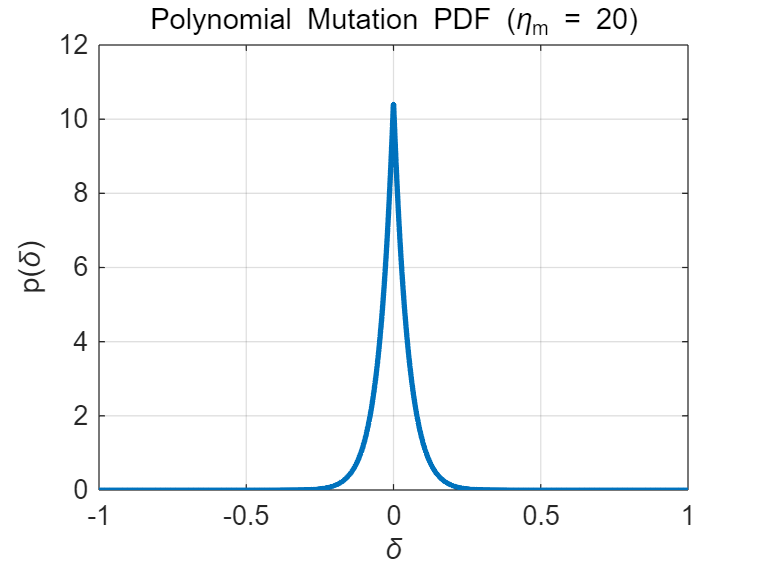

# 多项式变异

## 一、概念与作用

多项式变异（Polynomial Mutation）是一种连续变量的**变异算子**，广泛应用于进化算法（如 NSGA-II、MOEA/D）中。  
其主要思想是：

> 通过一个可调的多项式分布实现“小扰动概率高，大扰动概率低”的变异机制，  
> 以维持种群多样性并防止早熟收敛。

---

## 二、基本形式

设个体的第 $i$ 个决策变量为 $x_i$，定义域为 $[x_i^{(L)}, x_i^{(U)}]$。  
变异操作为：

$$
x_i' = x_i + \delta_i \cdot (x_i^{(U)} - x_i^{(L)})
$$

其中 $\delta_i$ 是根据多项式分布生成的**扰动因子**，满足 $\delta_i \in [-1,1]$。

---

## 三、扰动因子的推导

### 3.1 设计原则

扰动因子 $\delta$ 应满足以下条件：

1. **对称性**：正负方向等概率；
2. **有界性**：$\delta \in [-1,1]$；
3. **可调性**：通过参数控制扰动大小分布。

为此，选择如下形式的分布函数：

$$
f(\delta) \propto (1 - |\delta|)^{\eta_m}, \quad \delta \in [-1,1]
$$

其中 $\eta_m$ 为**分布指数（mutation distribution index）**，  
控制分布的尖锐程度。

---

### 3.2 概率密度函数（PDF）

归一化条件：
$$
\int_{-1}^{1} f(\delta)\, d\delta = 1
$$

由对称性，有：
$$
2 \int_0^1 C (1 - \delta)^{\eta_m} d\delta = 1
$$

解得归一化系数：
$$
C = \frac{\eta_m + 1}{2}
$$

于是 PDF 为：

$$
p(\delta) = \frac{\eta_m + 1}{2} (1 - |\delta|)^{\eta_m}, \quad \delta \in [-1,1]
$$



---

### 3.3 累积分布函数（CDF）

由定义：
$$
F(\delta) = \int_{-1}^{\delta} p(t)\,dt
$$

#### 当 $\delta \in [-1, 0]$：
$$
F(\delta) = \frac{1}{2}(1 + \delta)^{\eta_m + 1}
$$

#### 当 $\delta \in [0, 1]$：
$$
F(\delta) = 1 - \frac{1}{2}(1 - \delta)^{\eta_m + 1}
$$

由此可得整体的分段形式：

$$
F(\delta) =
\begin{cases}
\frac{1}{2}(1 + \delta)^{\eta_m + 1}, & \delta \in [-1, 0], \\[6pt]
1 - \frac{1}{2}(1 - \delta)^{\eta_m + 1}, & \delta \in [0, 1].
\end{cases}
$$

---

### 3.4 逆变换采样（Inverse Transform Sampling）

令 $u \sim U(0,1)$ 为均匀随机数，  
根据 $u = F(\delta)$ 反解得到 $\delta$。

#### 当 $u < 0.5$：
$$
u = \frac{1}{2}(1 + \delta)^{\eta_m + 1}
\Rightarrow
\delta = (2u)^{\frac{1}{\eta_m + 1}} - 1
$$

#### 当 $u \ge 0.5$：
$$
u = 1 - \frac{1}{2}(1 - \delta)^{\eta_m + 1}
\Rightarrow
\delta = 1 - [2(1 - u)]^{\frac{1}{\eta_m + 1}}
$$

---

### 3.5 最终扰动因子定义

$$
\boxed{
\delta =
\begin{cases}
(2u)^{1/(1+\eta_m)} - 1, & u < 0.5, \\[6pt]
1 - [2(1 - u)]^{1/(1+\eta_m)}, & u \ge 0.5.
\end{cases}
}
$$


---

## 四、边界处理与截断机制

### 4.1 基本 min–max 截断

为保证 $x_i'$ 不超出可行域 $[x_i^{(L)}, x_i^{(U)}]$，可采用简单裁剪：

$$
x_i' = \min(\max(x_i', x_i^{(L)}), x_i^{(U)}).
$$

这种方式直接截断越界结果，简单可靠。  
但当 $x_i$ 靠近边界时，可行扰动区间明显不对称，  
仍然按原始对称分布采样会造成**无效扰动比例高**。

---

### 4.2 NSGA-II 条件截断采样（精确推导）

为在靠近边界时仍保持**正确分布与对称采样概率**，  
NSGA-II 在每个变量上重新计算可行扰动范围，并对分布进行**条件化**。

#### （1）定义可行区间

设：
$$
\delta_1 = \frac{x_i - x_i^{(L)}}{x_i^{(U)} - x_i^{(L)}}, \quad
\delta_2 = \frac{x_i^{(U)} - x_i}{x_i^{(U)} - x_i^{(L)}}.
$$

则扰动 $\delta$ 的可行范围为：
$$
\delta \in [-\delta_1, \delta_2].
$$

#### （2）截断分布归一化

原始分布 $p(\delta)\propto(1-|\delta|)^{\eta_m}$ 被截到 $[-\delta_1,\delta_2]$。  
归一化常数为：
$$
Z = 1 - \frac{1}{2}\Big[(1 - \delta_1)^{\eta_m + 1} + (1 - \delta_2)^{\eta_m + 1}\Big].
$$

左、右两侧概率质量分别为：
$$
p_{\text{left}} = \frac{1 - (1 - \delta_1)^{\eta_m + 1}}{2Z}, \quad
p_{\text{right}} = 1 - p_{\text{left}}.
$$

#### （3）分段逆变换采样

令 $u \sim U(0,1)$，若 $u < p_{\text{left}}$，则 $\delta \in [-\delta_1, 0]$；  
否则 $\delta \in [0, \delta_2]$。

**左侧：**
$$
u' = \frac{u}{p_{\text{left}}}, \quad
\delta = \bigl[(1 - \delta_1)^{\eta_m + 1} + \bigl(1 - (1 - \delta_1)^{\eta_m + 1}\bigr)u'\bigr]^{\frac{1}{\eta_m + 1}} - 1.
$$

**右侧：**
$$
u' = \frac{u - p_{\text{left}}}{p_{\text{right}}}, \quad
\delta = 1 - \bigl[(1 - \delta_2)^{\eta_m + 1} + \bigl(1 - (1 - \delta_2)^{\eta_m + 1}\bigr)(1 - u')\bigr]^{\frac{1}{\eta_m + 1}}.
$$

这样可确保：
- 当 $x_i$ 靠近边界时，有效扰动自动压缩；
- 当 $x_i$ 处于中间区间时，恢复到标准多项式变异分布。

#### （4）工程化写法（NSGA-II 常见实现）

实际中常用的 NSGA-II 实现，将条件截断的采样写成一个紧凑形式。  
设：

$$
\text{mut\_pow} = \frac{1}{\eta_m + 1}, \quad
\delta_1 = \frac{x_i - x_i^{(L)}}{x_i^{(U)} - x_i^{(L)}}, \quad
\delta_2 = \frac{x_i^{(U)} - x_i}{x_i^{(U)} - x_i^{(L)}}.
$$

随机生成 $u \sim U(0,1)$，则扰动 $\Delta q$ 的计算为：

$$
\Delta q =
\begin{cases}
\left[\,2u + (1 - 2u)(1 - \delta_1)^{\eta_m + 1}\,\right]^{\text{mut\_pow}} - 1, & u \le 0.5, \\[8pt]
1 - \left[\,2(1 - u) + 2(u - 0.5)(1 - \delta_2)^{\eta_m + 1}\,\right]^{\text{mut\_pow}}, & u > 0.5.
\end{cases}
$$

最终得到变异后的变量：

$$
x_i' = x_i + \Delta q \cdot (x_i^{(U)} - x_i^{(L)}),
$$

并进行边界裁剪（防止舍入误差或极端边界情况）：

$$
x_i' = \min\!\bigl(\max(x_i',\, x_i^{(L)}),\, x_i^{(U)}\bigr).
$$

> ✅ 该形式与严格推导的条件截断采样等价，  
> 其中 $\delta_1$、$\delta_2$ 自动约束可行变异范围，  
> 从而实现数值稳定、结构简单的多项式变异。

---

## 五、参数含义与影响

| 参数                   | 含义     | 典型取值        | 影响       |
| -------------------- | ------ | ----------- | -------- |
| $\eta_m$             | 变异分布指数 | 10～50       | 控制扰动幅度分布 |
| $P_m$                | 变异概率   | $1/n$ 或 0.1 | 控制变异频率   |
| $\delta_1, \delta_2$ | 相对边界位置 | (0,1)       | 控制可行变异范围 |


---

## 六、MATLAB 实现示例

```matlab
function x_new = polynomial_mutation(x, lower, upper, eta_m, p_m)
    n = numel(x);
    x_new = x;
    for i = 1:n
        if rand < p_m
            xl = lower(i); xu = upper(i);
            delta1 = (x(i) - xl) / (xu - xl);
            delta2 = (xu - x(i)) / (xu - xl);
            u = rand; mut_pow = 1 / (eta_m + 1);
            if u <= 0.5
                xy = 1 - delta1;
                val = 2*u + (1 - 2*u)*xy^(eta_m + 1);
                deltaq = val^mut_pow - 1;
            else
                xy = 1 - delta2;
                val = 2*(1 - u) + 2*(u - 0.5)*xy^(eta_m + 1);
                deltaq = 1 - val^mut_pow;
            end
            x_new(i) = x(i) + deltaq * (xu - xl);
            x_new(i) = min(max(x_new(i), xl), xu);
        end
    end
end
```

## 七、小结

| 项目       | 内容                                |
| -------- | --------------------------------- |
| **核心思想** | 小变异多，大变异少                         |
| **扰动控制** | 通过 $\eta_m$ 调整分布陡峭度               |
| **生成方式** | 逆变换采样（Inverse Transform Sampling） |
| **边界处理** | min–max 裁剪（或更高级的条件截断）             |
| **常见用途** | 连续变量优化（NSGA-II、MOEA/D 等）          |
