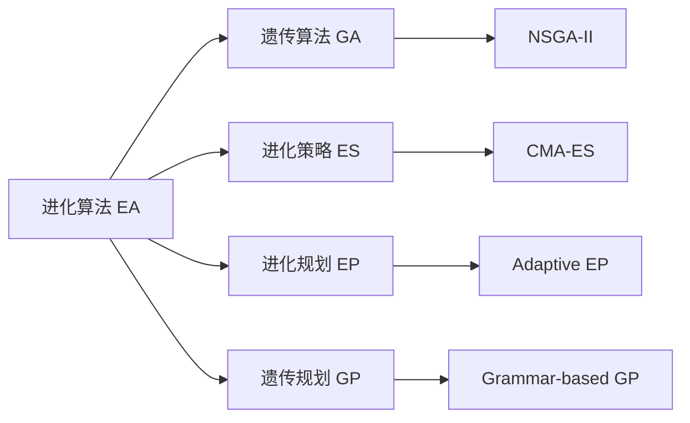

# 进化算法导论（EA）

<Catalog />

进化算法（Evolutionary Algorithm，EA） 是一类基于自然界生物进化机制的随机优化算法，属于智能优化算法的重要分支。它通过 **“选择—重组—变异”** 等操作，模拟自然进化过程，用来寻找复杂问题的最优或近优解。

## 一、目前典型算法

- 遗传算法（GA）
- 进化策略（ES）
- 进化规划（EP）
- 遗传规划（GP）

## 二、各算法比较

### 核心思想概览

| 算法           | 主要优化对象   | 代表特征                  |
| ------------ | -------- | --------------------- |
| **GA（遗传算法）** | 通用优化问题   | 二进制编码 + 交叉为主          |
| **ES（进化策略）** | 连续优化问题   | 实数编码 + 高斯变异 + 自适应步长   |
| **EP（进化规划）** | 状态机与连续优化 | 无交叉 + 自适应变异 + 竞争选择    |
| **GP（遗传规划）** | 程序/表达式结构 | 树结构编码 + 子树交叉 + 自动生成程序 |

### 结构与操作机制对比

| 特征        | GA         | ES             | EP         | GP            |
| --------- | ---------- | -------------- | ---------- | ------------- |
| **编码方式**  | 二进制/实数向量   | 实数向量           | 实数向量       | 树结构（表达式）      |
| **适用问题**  | 离散/组合优化    | 连续优化           | 连续优化/噪声优化  | 程序、表达式生成      |
| **种群规模**  | 中          | 小-中            | 小          | 中             |
| **主要算子**  | 交叉 + 变异    | 变异（高斯噪声）       | 变异（高斯噪声）   | 子树交叉 + 变异     |
| **交叉操作**  | 关键操作       | 可选             | 无          | 树级交叉（核心）      |
| **变异操作**  | 位翻转 / 实数扰动 | 高斯扰动（含自适应）     | 高斯扰动（含自适应） | 子树替换          |
| **选择策略**  | 轮盘赌 / 锦标赛  | (μ, λ) 或 (μ+λ) | 随机竞争       | 轮盘赌 / 精英保留    |
| **参数自适应** | 弱（人工设定）    | 强（全局 + 局部）     | 强（个体自适应）   | 无固定参数，可自动学习结构 |
| **编码层级**  | 基因层        | 参数层            | 个体层        | 结构层           |

### 典型应用领域对比

| 特征        | GA         | ES             | EP         | GP            |
| --------- | ---------- | -------------- | ---------- | ------------- |
| **编码方式**  | 二进制/实数向量   | 实数向量           | 实数向量       | 树结构（表达式）      |
| **适用问题**  | 离散/组合优化    | 连续优化           | 连续优化/噪声优化  | 程序、表达式生成      |
| **种群规模**  | 中          | 小-中            | 小          | 中             |
| **主要算子**  | 交叉 + 变异    | 变异（高斯噪声）       | 变异（高斯噪声）   | 子树交叉 + 变异     |
| **交叉操作**  | 关键操作       | 可选             | 无          | 树级交叉（核心）      |
| **变异操作**  | 位翻转 / 实数扰动 | 高斯扰动（含自适应）     | 高斯扰动（含自适应） | 子树替换          |
| **选择策略**  | 轮盘赌 / 锦标赛  | (μ, λ) 或 (μ+λ) | 随机竞争       | 轮盘赌 / 精英保留    |
| **参数自适应** | 弱（人工设定）    | 强（全局 + 局部）     | 强（个体自适应）   | 无固定参数，可自动学习结构 |
| **编码层级**  | 基因层        | 参数层            | 个体层        | 结构层           |
