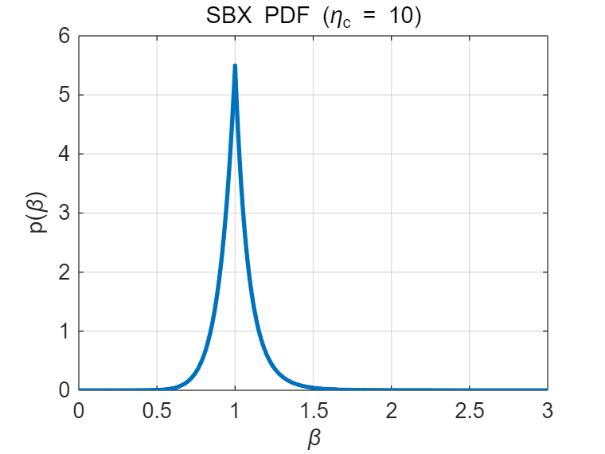
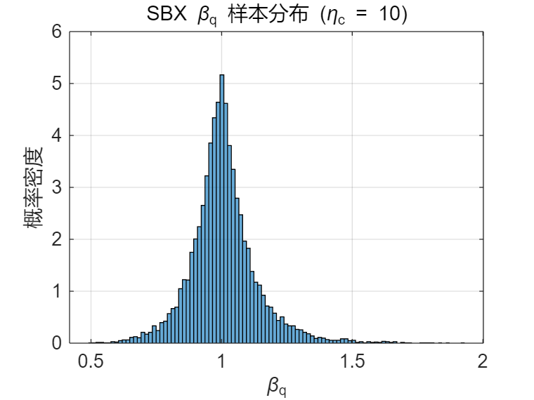

# 模拟二进制交叉算子（SBX）

## 一、背景与动机

传统遗传算法多使用**二进制编码**与**单点交叉**。  
但在实际优化问题中，更自然的表示通常是**实数编码**。  
因此，需要一种方法让实数编码的交叉操作仍然具备二进制交叉的特性。

> **SBX（Simulated Binary Crossover）** 由 Deb 和 Agrawal（1995）提出，  
> 其目标是在实数空间中模拟二进制交叉的“统计行为”。

---

## 二、基本思想

SBX 在每个维度上以两个父代个体 $x_1$ 和 $x_2$ 为基础（假设 $x_1 \le x_2$），  
生成两个子代 $c_1$ 与 $c_2$：

$$
\begin{aligned}
c_1 &= 0.5\left[(1+\beta_q)x_1 + (1-\beta_q)x_2\right], \\
c_2 &= 0.5\left[(1-\beta_q)x_1 + (1+\beta_q)x_2\right].
\end{aligned}
$$

可以验证：
$$
c_1 + c_2 = x_1 + x_2,
$$
即 **保持父代均值不变**（无系统偏移）。

---

## 三、关键参数：扩张因子 $\beta_q$

$\beta_q$ 控制子代相对父代的分布范围：

- $\beta_q < 1$：子代在父母之间；
- $\beta_q = 1$：子代正好在中间；
- $\beta_q > 1$：子代超出父代范围（外推）。

$\beta_q$ 的分布决定了交叉算子的搜索行为。

---

## 四、SBX 的概率分布定义

SBX 使用一个**分段幂律分布**来采样 $\beta_q$，  
由参数 $\eta_c > 0$（distribution index）控制分布形状。



### PDF（概率密度函数）

$$
p(\beta)=
\begin{cases}
\dfrac{1}{2}(\eta_c+1)\beta^{\eta_c}, & 0\le \beta \le 1,\\[6pt]
\dfrac{1}{2}(\eta_c+1)\beta^{-(\eta_c+2)}, & \beta > 1.
\end{cases}
$$

### CDF（累积分布函数）

$$
F(\beta)=
\begin{cases}
\dfrac{1}{2}\beta^{\eta_c+1}, & 0\le \beta \le 1,\\[6pt]
1-\dfrac{1}{2}\beta^{-(\eta_c+1)}, & \beta > 1.
\end{cases}
$$

---

## 五、逆变换采样生成 $\beta_q$

为从该分布中采样，SBX 使用**逆变换采样法**：

令 $u \sim U(0,1)$，则：

$$\beta = F^{-1}(u)$$

当 $u \le 0.5$
$$
u = \frac{1}{2}\beta^{\eta_c + 1}
=>
2u = \beta^{\eta_c + 1}
=>
\boxed{\beta = (2u)^{\frac{1}{\eta_c + 1}}}
$$


当 $u > 0.5$
$$
u = 1 - \frac{1}{2}\beta^{-(\eta_c + 1)}
=>
1 - u = \frac{1}{2}\beta^{-(\eta_c + 1)}
=>
2(1 - u) = \beta^{-(\eta_c + 1)}
=>
\frac{1}{2(1 - u)} = \beta^{\eta_c + 1}
=>
\boxed{\beta = \left[\frac{1}{2(1 - u)}\right]^{\frac{1}{\eta_c + 1}}}
$$

综上：
$$
\beta_q =
\begin{cases}
(2u)^{1/(\eta_c+1)}, & u \le 0.5,\\[6pt]
\left[\dfrac{1}{2(1-u)}\right]^{1/(\eta_c+1)}, & u > 0.5.
\end{cases}
$$

> 这保证了：
> - 一半概率生成 $\beta_q \le 1$（子代在父代区间内）；
> - 一半概率生成 $\beta_q > 1$（子代在父代区间外）。



---

## 六、分布特性与参数影响

| 参数 $\eta_c$ | 分布特征 | 搜索特性 |
|----------------|------------|-----------|
| 小（2~5） | 分布平坦，尾部长 | 探索性强，外推多 |
| 中（10~20） | 中心集中，尾部适中 | 平衡探索与开发 |
| 大（30~50） | 分布尖锐，接近 $\beta=1$ | 开发性强，子代接近父代 |

特点总结：
- **对称性**：内外区域各占 50%，模拟二进制交叉的随机性；
- **均值保持**：$c_1+c_2=x_1+x_2$；
- **自适应尺度**：父代越近，子代变化越小；
- **长尾探索**：幂律尾部允许偶尔“跳出”父代范围。

---

## 七、与其他交叉算子的对比

| 算子 | 分布特征 | 外推能力 | 均值保持 | 特点 |
|------|------------|-------------|------------|------|
| 算术交叉 | 固定加权平均 | 无 | 是 | 简单但探索性差 |
| BLX-$\alpha$ | 均匀分布 | 有（$\alpha$ 控制） | 否 | 随机性高但偏移大 |
| SBX | 幂律分布（对称） | 有 | 是 | 兼顾稳定与探索，模拟二进制特性 |

---

## 八、伪代码实现

```
for each dimension j:
    if rand() < p_crossover:
        u = rand(0,1)
        if u <= 0.5:
            beta = (2*u)^(1/(ηc+1))
        else:
            beta = (1/(2*(1-u)))^(1/(ηc+1))
        c1[j] = 0.5*((1+beta)*x1[j] + (1-beta)*x2[j])
        c2[j] = 0.5*((1-beta)*x1[j] + (1+beta)*x2[j])
    else:
        c1[j] = x1[j]
        c2[j] = x2[j]
# 修正越界：clip 到允许范围
```

## 九、总结

SBX 算子（Simulated Binary Crossover）是实数编码遗传算法中最经典、最常用的交叉算子之一。
它通过一个受控的幂律分布模拟二进制交叉的统计特征，兼顾局部开发与全局探索，并且保持父代均值不偏移。

关键思想：

- 用分布指数 $\eta_c$ 控制扰动强度；
- 通过逆变换采样精确生成 $\beta_q$；
- 在实数空间实现二进制交叉的“统计等价性”。
