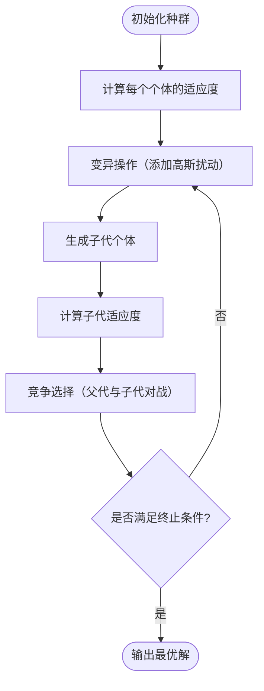

# 进化规划（EP）

进化规划（Evolutionary Programming, EP）是**进化算法家族**中的重要成员，  
由美国学者 **Lawrence J. Fogel** 在 1960 年代提出，  
最初用于**自动生成有限状态机**，后来扩展为一种**通用连续优化算法**。

## 一、算法基本思想

::: info 生物启发
EP 模拟生物在进化过程中个体**变异与选择**的自然过程，  
核心思想是：
> “随机变异 + 竞争选择 = 逐步适应环境。”
:::

与 GA、ES 的主要区别：

| 对比项 | 遗传算法（GA） | 进化策略（ES） | 进化规划（EP） |
|---------|----------------|----------------|----------------|
| 编码 | 二进制/实数 | 实数 | 实数 |
| 核心操作 | 交叉 + 变异 | 变异 | 变异 |
| 选择机制 | 适应度比例 | 排序/淘汰 | 随机竞争（tournament） |
| 自适应性 | 弱 | 强（步长自适应） | 强（变异参数自学习） |

---

## 二、算法流程图



## 三、伪代码示例

``` :no-line-numbers
Algorithm EvolutionaryProgramming
Input: 种群规模 N, 最大代数 T
Output: 最优个体 best

1: 初始化种群 Xi 及其变异参数 σi
2: 计算每个个体的适应度 f(Xi)
3: for t = 1 to T do
4:     for each Xi do
5:         生成子代 Yi：
                Yi = Xi + σi * N(0, 1)
                σi' = σi * exp(τ * N(0,1))
6:     计算所有子代适应度 f(Yi)
7:     将父代与子代合并
8:     使用随机锦标赛选择 N 个最优个体组成新种群
9: end for
10: 返回最优解 best
```

## 四、关键机制详解

### 4.1 个体表示（Representation）

同ES：
$$
X_i=(\mathbf{x}_i, \sigma_i)
$$

### 4.2 变异操作（Mutation）

EP 的搜索主要靠变异进行：
$$
\mathbf{x'} = \mathbf{x}+\sigma\cdot N(0,1)
$$
并引入步长自适应机制：
$$
\sigma' = \sigma\cdot e^{\tau\cdot N(0,1)}
$$

- $\sigma$ 控制变异强度；
- 随代数变化，算法能自动调整搜索尺度。

::: tip
EP 的变异是多维高斯分布扰动，与 ES 十分类似，
但它没有固定的(μ,λ)选择机制。
:::

### 4.3 竞争选择（Tournament Selection）

EP 的选择方式独具特色——**随机竞争选择**：

1. 将父代和子代合并，共 $2N$ 个体；
2. 每个个体随机与 $q$ 个其他个体竞争（通常 $q=10$）；
3. 统计胜利次数，按胜场数排序；
4. 选取前 $N$ 个作为下一代。

这种机制具有**强鲁棒性和全局搜索能力**，可以避免早熟收敛。

### 4.4 自适应机制（Self-Adaptation）

每个个体的 $\sigma$ 参数会随着进化自动调整：

- 若大步长变异有助于提高适应度，则 $\sigma$ 会增大；
- 若小步长更有效，则 $\sigma$ 会逐步减小。

这使得 EP 能自我学习搜索策略，无需人工调参。

## 五、常见变种

| 变体                | 说明                   |
| ----------------- | -------------------- |
| **原始 EP**         | 用于有限状态机演化            |
| **实数编码 EP (REP)** | 适合连续优化问题             |
| **自适应 EP (AEP)**  | 变异参数自动调整             |
| **混合 EP**         | 与局部搜索算法结合（如 SA, PSO） |

## 六、优缺点

| 优点        | 缺点        |
| --------- | --------- |
| 结构简单，参数少  | 收敛速度较慢    |
| 无需梯度信息    | 对维度高问题较慢  |
| 适应连续与噪声问题 | 参数自适应不易控制 |
| 竞争选择鲁棒性强  | 不适合离散编码问题 |
