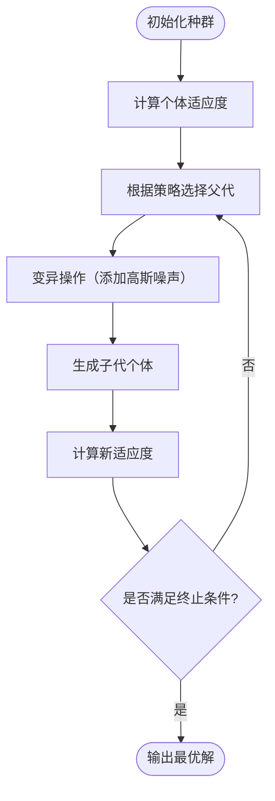

# 进化策略（ES）

进化策略（Evolution Strategy, ES）是一类基于**自然进化原理**的优化算法，  
与遗传算法（GA）同属进化计算（EA）范畴。  

ES 最初由德国学者 **Ingo Rechenberg** 和 **Hans-Paul Schwefel** 在 1960s 年代提出，  
主要用于**连续参数优化问题**，后来发展出多种形式（如 $(1+1)$-ES、$(μ,λ)$-ES、CMA-ES 等）。

---

## 一、算法基本思想

::: info 生物启发
进化策略强调“**变异驱动搜索、选择引导进化**”的思想。  
它模拟生物群体中个体通过**随机变异**、**自然选择**逐步适应环境的过程。
:::

与遗传算法不同，ES 更注重：

- **个体自适应能力**：每个个体可携带自身的“变异步长”参数；
- **连续搜索空间**：适合实数优化；
- **无交叉或弱交叉机制**：主要依靠变异与选择。

---

## 二、算法总体流程



## 三、伪代码示例

``` :no-line-numbers
Algorithm EvolutionStrategy
Input: 种群规模 μ, 子代数量 λ, 最大代数 T
Output: 最优个体 best

1: 初始化 μ 个个体 Xi 及其步长 σi
2: for t = 1 to T do
3:     选择 μ 个父代
4:     对每个父代进行变异，生成 λ 个子代：
           X' = X + σ * N(0, I)
           σ' = σ * exp(τ * N(0,1))
5:     计算所有个体的适应度
6:     根据策略选择新一代：
           - (μ, λ)-ES：从子代中选前 μ 个最优
           - (μ + λ)-ES：从父代与子代中选前 μ 个最优
7: end for
8: 输出最优解 best
```

## 四、关键机制详解

### 4.1 个体表示（Representation）

每个个体由两部分组成：
$$
X_i=(\mathbf{x}_i, \sigma_i)
$$

- $\mathbf{x}_i$：解向量（即问题的变量）
- $\sigma_i$：变异强度（步长），控制搜索尺度

::: tip
相比 GA，ES 中的个体同时携带自适应参数（σ），
使得搜索范围可自动调整。
:::

### 4.2 变异操作（Mutation）

变异是 ES 的核心。
通过在个体上添加高斯噪声来生成新解：
$$
\mathbf{x'} = \mathbf{x}+\sigma\cdot N(0,1)
$$
步长 $\sigma$ 也进行自适应调整：
$$
\sigma' = \sigma\cdot e^{\tau'\cdot N(0,1)+\tau\cdot N_i(0,1)}
$$
其中：

- $\tau', \tau$ 为学习率参数；
- $N(0,1)$ 为标准正态随机变量；
- $n$ 为问题维度。

::: info
这种“自适应步长变异”机制使算法能自动学习合适的搜索范围，
早期粗略搜索、后期精细探索。
:::

### 4.3 选择策略（Selection）

ES 常见两种选择模型：

| 策略               | 说明                          | 特点          |
| ---------------- | --------------------------- | ----------- |
| **$(μ, λ)$-ES**  | 从 λ 个子代中选出最优的 μ 个个体         | 强选择压力，探索性强  |
| **$(μ + λ)$-ES** | 从父代与子代共 $(μ+λ)$ 个体中选最优的 μ 个 | 保留精英个体，收敛更稳 |

::: tip

- $(μ, λ)$ 模式 → 适合探索性问题
- $(μ + λ)$ 模式 → 适合需要保留优秀个体的情况
:::

### 4.4 重组操作（Recombination, 可选）

尽管 ES 主要依靠变异，但也可使用简单的“重组”操作：

- 中值重组（Intermediate）
   $\mathbf{x'}=\frac{1}{\mu}\sum^\mu_{i=1}\mathbf{x_i}$
- 离散重组（Discrete）
   每个维度随机从不同父代中取值。

作用：**融合多个父代信息，提高搜索质量**。

## 五、常见变种

| 算法                   | 含义          | 特点            |
| -------------------- | ----------- | ------------- |
| **(1+1)-ES**         | 单父单子进化策略    | 简单、理论分析充分     |
| **(μ,λ)-ES**         | 多父多子策略      | 群体搜索能力强       |
| **CMA-ES**           | 协方差矩阵自适应 ES | 自动学习搜索方向，性能最强 |
| **Self-Adaptive ES** | 自适应进化策略     | 步长参数自动调整      |

## 六、优缺点

| 优点       | 缺点       |
| -------- | -------- |
| 适合连续优化问题 | 不适用于离散问题 |
| 参数自适应能力强 | 参数设置相对复杂 |
| 理论分析成熟   | 计算代价较高   |
| 收敛平稳稳定   | 可能陷入局部极值 |
