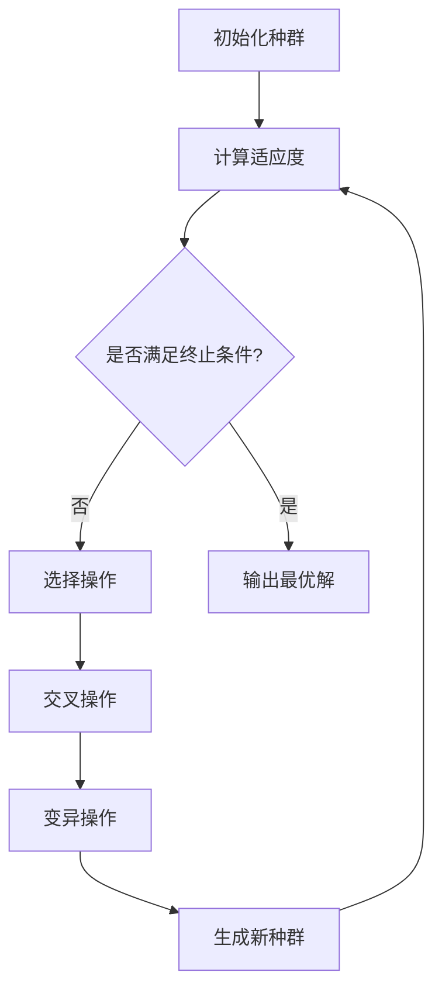

# 遗传算法（GA）

遗传算法（Genetic Algorithm, GA）是一种基于 **达尔文进化论** 和 **遗传学原理** 的随机优化方法。  
它通过**自然选择、交叉与变异**等操作，在问题解空间中不断进化，最终获得最优或近似最优解。

## 一、基本思想

GA 的核心思想是：

::: info 生物启发
“适者生存，优胜劣汰。”
:::

通过模拟生物的进化过程（选择、交叉、变异），遗传算法不断优化个体的适应度，从而逼近全局最优解。

## 二、算法流程

遗传算法的基本执行过程如下：

1. **初始化种群**  
   随机生成若干个个体（候选解），形成初始种群。

2. **适应度评价**  
   使用目标函数计算每个个体的适应度值。

3. **选择操作（Selection）**  
   根据适应度值，选择优秀个体进入下一代（常用轮盘赌、锦标赛等方法）。

4. **交叉操作（Crossover）**  
   模拟基因重组，将两个个体的信息交换生成新个体。

5. **变异操作（Mutation）**  
   模拟基因突变，对个体的部分基因随机改变，以维持种群多样性。

6. **终止条件判断**  
   若达到最大代数或适应度收敛，则终止算法，输出最优解。

---

## 三、算法流程图



## 四、伪代码示例

``` :no-line-numbers
Algorithm GeneticAlgorithm
Input: 种群规模 N, 最大迭代次数 T, 交叉概率 Pc, 变异概率 Pm
Output: 最优个体 best

1: 初始化种群 P(0)
2: 计算每个个体的适应度 f(x)
3: t ← 0
4: while t < T do
5:     选择操作：从 P(t) 中按适应度选择个体
6:     交叉操作：以概率 Pc 对个体进行交叉，生成新个体
7:     变异操作：以概率 Pm 对个体进行基因突变
8:     计算新个体的适应度
9:     更新种群 P(t+1)
10:    t ← t + 1
11: end while
12: 返回最优个体 best
```

## 五、关键操作详解

### 5.1 编码方式（Encoding）

遗传算法的第一步，是将问题的解空间**映射为基因序列（染色体）**，  
以便计算机能对“个体”进行遗传操作（选择、交叉、变异等）。  
编码方式的选择直接影响搜索空间结构和算法性能。

---

#### 5.1.1 二进制编码（Binary Encoding）

**定义：**  
最经典的编码方式，用 `0` 和 `1` 比特串表示染色体。  
每个变量由固定长度的二进制序列组成。  
这种编码有两类典型用途：

1️⃣ **数值映射型二进制编码**  
用于将连续或离散变量映射为比特串：

- **确定编码长度：**
  $$
  2^L - 1 \geq \frac{x_{\max} - x_{\min}}{\epsilon}
  \Rightarrow
  L = \left\lceil \log_2\!\left(\frac{x_{\max} - x_{\min}}{\epsilon}+1\right) \right\rceil
  $$

- **编码（实数→二进制）：**
  $$
  D = \operatorname{round}\!\left(
  \frac{x - x_{\min}}{x_{\max} - x_{\min}} \times (2^L - 1)
  \right)
  $$

- **解码（二进制→实数）：**
  $$
  x = x_{\min} + \frac{x_{\max} - x_{\min}}{2^L - 1} \times D
  $$

**示例：**  
$x\in[0,10],\epsilon=0.1\Rightarrow L=7$。  
当 $x=6.3$ 时 → $D=80$ → 二进制串为 `1010000`，解码回 $x=6.30$。

2️⃣ **二值问题直接编码（0-1 Encoding）**  
对于天然具有“是/否”“选/不选”“开/关”等二值特征的问题，  
可直接以比特位表示决策变量。

**示例：**  
- **0-1 背包问题：** `101010` 表示选择第1、3、5个物品；  
- **特征选择问题：** `11001` 表示选择第1、2、5个特征。

这种形式无需解码，染色体本身就是可行解。

**优点：**
- 实现最简单；
- 易与交叉、变异操作结合；
- 通用性强。

**缺点：**
- 存在量化误差（数值型问题）；
- 多位同时变化，可能出现“跳跃”；
- 不适合高精度连续优化。

---

#### 5.1.2 格雷码编码（Gray Coding）

**定义：**  
一种特殊的二进制编码方式，使得**相邻整数仅有一位不同**（最小变化原则）。  
它是对传统二进制的改进，用于增强搜索平滑性。

**二进制 ↔ 格雷码转换公式：**

- 二进制 → 格雷码  
  $$
  g_{n-1}=b_{n-1}, \quad g_i=b_{i+1}\oplus b_i
  $$
- 格雷码 → 二进制  
  $$
  b_{n-1}=g_{n-1}, \quad b_i=b_{i+1}\oplus g_i
  $$

> 其中 $\oplus$ 表示按位异或。

**特点与优势：**
- 相邻值仅翻动一位，搜索平滑；
- 可减少“海明崖”（Hamming Cliff）效应；
- 与二进制编码转换方便。

**适用场景：**
- 在连续变量问题中使用位串编码；
- 需要更平滑的邻域搜索（如精细局部寻优阶段）。

---

#### 5.1.3 实数编码（Real-coded Encoding）

**定义：**  
染色体直接由浮点数构成，不再量化为比特串。  
适用于连续优化问题。

$$
\mathbf{x} = [x_1, x_2, \dots, x_n],\quad x_i \in [a_i, b_i]
$$

**遗传操作：**
- **交叉**：算术交叉、SBX（模拟二进制交叉）、BLX-α；
- **变异**：高斯变异、非一致性变异、多项式变异。

**优点：**
- 无量化误差；
- 自然适用于连续变量；
- 收敛速度快、精度高。

**缺点：**
- 需处理边界约束；
- 算子参数较多，设计复杂。

**适用：**
- 工程参数优化；
- 连续函数最优化。

---

#### 5.1.4 整数编码（Integer Encoding）

**定义：**  
直接用整数表示变量值，不做量化。  
适合整数约束或离散取值问题。  
如：作业编号 `[3,1,4,2]` 表示任务顺序。  

**特点：**  
实现简单、保持整数特征、与实数编码类似。

---

#### 5.1.5 排列编码（Permutation Encoding）

**定义：**  
染色体表示为一个排列，用于组合/路径问题。  
例如：  
`[3, 1, 4, 2, 5]` 表示旅行商路径。  

**特点：**  
保持排列可行性，常配合专用交叉与变异操作（PMX、OX、CX）。

---

#### 5.1.6 符号或树结构编码（Symbolic / Tree Encoding）

**定义：**  
以符号或树形结构表示个体，用于遗传规划（GP）。  
示例：  
表达式 `(x + sin(y))` 或对应语法树。  

**适用：**  
程序进化、符号回归、表达式生成。

---

#### 5.1.7 DNA编码（DNA Encoding）

**定义：**  
借鉴生物四碱基 `{A, T, C, G}` 的组合规律，形成字母串。  
每碱基相当于 2bit，可自然实现互补、突变等操作。  

**适用：**  
生物仿真、图像加密、多模态优化。

---

#### 5.1.8 混合编码（Hybrid Encoding）

**定义：**  
同一染色体中混合多种编码方式，用于多类型变量优化。  
示例：  
`[二进制段 | 实数段 | 排列段]`  

**适用：**  
复杂工程优化、多目标混合问题。

---

#### 各类编码方式对比

| 编码类型 | 表示形式 | 优点 | 缺点 | 典型应用 |
|-----------|-----------|------|------|-----------|
| **二进制编码** | 0/1 位串 | 简单通用、适合布尔问题 | 有量化误差、跳跃性强 | 0-1优化、离散或量化连续问题 |
| **格雷码编码** | 邻位仅一位不同 | 平滑搜索、减少跳跃 | 转换复杂 | 连续优化、精细局部搜索 |
| **实数编码** | 浮点数组 | 无误差、高精度 | 算子复杂、边界处理 | 工程参数优化 |
| **整数编码** | 整数序列 | 保留离散特征 | 不适用连续空间 | 调度、分配问题 |
| **排列编码** | 排列序列 | 保证可行性 | 操作复杂 | TSP、排序类问题 |
| **符号/树编码** | 表达式树 | 可进化程序结构 | 解空间巨大 | 遗传规划、符号回归 |
| **DNA编码** | 四碱基串 | 多样性高、仿生性强 | 实现复杂 | 生物计算、混合算法 |
| **混合编码** | 多种组合 | 灵活、通用 | 设计复杂 | 综合优化问题 |

---

::: tip 小结
- **二进制编码**：通用、基础，可用于布尔和离散问题。  
- **格雷码编码**：改进型位串，平滑搜索。  
- **实数编码**：连续优化主流，现代工程常用。  
- **其他编码**：针对特定结构或类型（整数、排列、树形、DNA、混合）问题而设计。  
:::

### 5.2 适应度函数（Fitness Function）

适应度函数用于衡量个体的优劣，即“生存能力”。
$$
Fitness(x) = \frac{1}{1+f(x)}
$$
或直接使用目标函数值（取决于是**最小化**还是**最大化**问题）。

::: tip 设计技巧
- 最小化问题：可用 1 / (1 + f(x)) 转化为最大化形式
- 归一化处理：确保不同量纲的变量能公平比较
- 惩罚函数法：对不满足约束的个体降低适应度
- 尺度变换
:::

### 5.3 选择操作（Selection）

**目标：** 从当前种群中优先保留高适应度个体，使其基因在下一代中得以延续。  
选择操作体现了遗传算法中的“适者生存”原则，是进化压力的主要来源。

---

#### 5.3.1 轮盘赌选择（Roulette Wheel Selection）

**基本原理：**  
个体被选中的概率与其适应度值成正比，适应度越高，被选中的机会越大。  
想象一个“转盘”，每个个体占据与其适应度成比例的扇区，通过随机转动转盘决定谁被选中。

**实现步骤：**
1. 计算群体中所有个体的适应度 $f_i$；  
2. 计算总适应度 $F = \sum_{i=1}^{N} f_i$；  
3. 计算每个个体的选择概率：
   $$
   p_i = \frac{f_i}{F}
   $$
4. 构建累积概率区间：
   $$
   q_i = \sum_{j=1}^{i} p_j
   $$
5. 生成随机数 $r \in [0,1]$，若 $q_{i-1} < r \le q_i$，则选择个体 $i$。

**示例：**
| 个体 | 适应度$f_i$ | 概率$p_i$ | 累积$q_i$ |
|------|-------------|------------|-----------|
| A | 10 | 0.25 | 0.25 |
| B | 20 | 0.50 | 0.75 |
| C | 10 | 0.25 | 1.00 |

随机数 $r=0.6$ 落在 $[0.25,0.75]$ → 选择个体 B。

**优缺点：**
- ✅ 简单、直观；
- ❌ 若个体适应度差异过大，可能导致早熟收敛（强者垄断种群）；
- ❌ 若适应度为负值或接近零，需要归一化或平移。

---

#### 5.3.2 锦标赛选择（Tournament Selection）

**基本原理：**  
随机抽取 $k$ 个个体（称为“锦标赛规模”），比较适应度，选取其中最优者进入下一代。

**实现步骤：**
1. 从种群中随机抽取 $k$ 个个体；
2. 比较其适应度；
3. 以概率 $p$（通常 $p=0.8\sim0.9$）选取最优个体；
4. 重复上述过程，直到选出所需数量的个体。

**示例（k=3）：**
随机抽取个体 {A, B, C}  
适应度分别为 {3.5, 2.1, 4.7}  
→ 以概率 $p=0.9$ 选择C（最优个体）。

**数学表达：**
若个体 $i$ 的排名为 $r_i$，则其被选中的概率近似为：
$$
P_i = \left( \frac{r_i}{N} \right)^k - \left( \frac{r_i-1}{N} \right)^k
$$

**优缺点：**
- ✅ 不依赖归一化，易实现；
- ✅ 通过调整 $k$ 控制“选择压力”：  
  - $k$ 大 → 强选择（加快收敛）  
  - $k$ 小 → 弱选择（保持多样性）  
- ❌ 若 $k$ 过大，仍可能早熟。

**常用参数：**  
- $k = 2$ 或 $3$ 最常见；
- 选择概率 $p=0.8\sim0.9$；
- 常与精英保留策略（elitism）结合使用。

---

#### 5.3.3 排序选择（Rank-based Selection）

**基本原理：**  
不直接使用适应度值，而是根据个体在群体中的排名来分配选择概率，防止适应度过大个体“垄断”。

**实现步骤：**
1. 按适应度从高到低排序；
2. 根据排名分配概率：  
   若排名最高为 1，最低为 N，可定义：
   $$
   p_i = \frac{2 - s}{N} + \frac{2(s - 1)(N - i)}{N(N - 1)}
   $$
   其中 $s$ 为选择压力系数（通常 $1 \le s \le 2$）；
3. 按概率执行轮盘赌或随机采样选择。

**示例（N=4, s=1.5）：**
| 排名 | 个体 | 分配概率$p_i$ |
|------|------|---------------|
| 1 | A | 0.35 |
| 2 | B | 0.28 |
| 3 | C | 0.22 |
| 4 | D | 0.15 |

**优缺点：**
- ✅ 消除适应度极值带来的早熟问题；
- ✅ 选择压力可控、分布均衡；
- ❌ 计算略复杂，需排序。

---

#### 5.3.4 选择方法比较

| 方法 | 是否依赖适应度值大小 | 是否易早熟 | 是否控制压力 | 实现复杂度 | 特点 |
|------|------------------|-------------|---------------|--------------|--------|
| **轮盘赌** | 是 | 较容易 | 否 | 简单 | 直观但不稳定 |
| **锦标赛** | 否 | 适中 | 可调 | 简单 | 稳定、通用性强 |
| **排序选择** | 否 | 很低 | 可调 | 中等 | 平滑、鲁棒性好 |

---

::: info 小技巧
- 在现代GA中，**锦标赛选择**（Tournament Selection）使用最广泛；  
- 若问题适应度范围波动大或非正值，**排序选择** 是更稳妥的选择；  
- 对于小规模问题或教学演示，**轮盘赌** 简单易理解。  
:::


### 5.4 交叉操作（Crossover）

交叉是产生新解的主要手段，模拟生物基因的重组过程。
它决定了算法的“探索能力”。

#### 5.4.1 二进制编码中的交叉算子

| 算法类型     | 说明           |
| -------- | ------------ |
| **单点交叉** | 随机选一点交换两段基因  |
| **双点交叉** | 选择两个点，交换中间部分 |
| **均匀交叉** | 按概率交换每个位     |

#### 5.4.2 实数编码中的交叉算子

对于实数型染色体，不再使用位置切割，而采用**算术组合类交叉**。

---

##### （1）算术交叉（Arithmetic Crossover）

**定义：**
$$
O_1 = \lambda P_1 + (1 - \lambda) P_2, \quad
O_2 = (1 - \lambda) P_1 + \lambda P_2
$$
其中 $\lambda \in [0,1]$。

**特点：**
- 保留父代之间的线性关系；
- 子代在父代之间形成平滑过渡；
- 适合连续变量优化。

---

##### （2）模拟二进制交叉（Simulated Binary Crossover, SBX）

**定义：**  
模仿二进制交叉的分布特性，在实数空间中生成子代。

$$
O_{1,i} = 0.5\left[(1+\beta_i)P_{1,i} + (1-\beta_i)P_{2,i}\right] \\
O_{2,i} = 0.5\left[(1-\beta_i)P_{1,i} + (1+\beta_i)P_{2,i}\right]
$$

其中 $\beta_i$ 由随机变量控制，常服从分布：
$$
\beta_i = 
\begin{cases}
(2u)^{1/(n_c+1)}, & u \le 0.5\\
\left(\frac{1}{2(1-u)}\right)^{1/(n_c+1)}, & u>0.5
\end{cases}
$$
$n_c$ 为分布指数。

**特点：**
- 保留父代间的平衡关系；
- 可控的“子代分散程度”；
- 是实数编码GA中最常用的交叉方式。

---

##### （3）BLX-α 交叉（Blend Crossover）

**定义：**
$$
O_i = \text{rand}[x_{\min}, x_{\max}],\quad
x_{\min} = \min(P_{1,i},P_{2,i}) - \alpha d, \quad
x_{\max} = \max(P_{1,i},P_{2,i}) + \alpha d
$$
其中 $d = |P_{1,i} - P_{2,i}|$，$\alpha$ 为扩展参数（一般取 0.5）。

**特点：**
- 允许子代超出父代范围；
- 增强搜索多样性；
- 适合全局探索。

#### 5.4.3 特殊编码下的交叉方式

| 编码类型 | 常用交叉方法 | 简要说明 |
|-----------|----------------|-----------|
| **排列编码** | PMX、OX、CX | 保持路径/顺序可行性 |
| **符号/树编码** | 子树交叉 | 交换表达式子树结构 |
| **DNA编码** | 片段互补交叉 | 按碱基对规则交换序列 |
| **混合编码** | 分段交叉 | 按编码类型独立交叉 |

#### 5.4.4 参数与策略建议

| 参数 | 含义 | 建议范围 | 说明 |
|------|------|-----------|------|
| $P_c$ | 交叉概率 | 0.6~0.9 | 控制重组强度 |
| 交叉点数量 | 决定重组粒度 | 1~2 点 | 多点交叉增强探索 |
| 均匀交叉概率 $p$ | 位交换概率 | 0.5 | 控制基因混合比例 |
| 实数交叉参数 $\lambda$ / $\alpha$ | 平衡因子 | 0.3~0.7 | 调节子代分布范围 |

---

::: tip 小结
- 交叉是遗传算法中最重要的“探索算子”；  
- **单点、双点、均匀交叉**适合二进制或整数编码；  
- **算术交叉、SBX、BLX-α**适合实数编码；  
- 合理设置 $P_c$ 与交叉策略，可在探索与收敛之间取得平衡。  
:::


### 5.5 变异操作（Mutation）

变异用于维持种群的多样性，防止陷入局部最优。

常见变异算子：

| 算法类型                           | 原理                  | 示例            |
| ------------------------------ | ------------------- | ------------- |
| **位翻转变异（Binary Mutation）**     | 将某个基因 `0→1` 或 `1→0` | `1010 → 1110` |
| **随机扰动（Real-valued Mutation）** | 在实数基因上加随机微小噪声       | `3.45 → 3.47` |
| **非均匀变异**                      | 随迭代次数减小变异范围         | 适合精细搜索        |

::: tip 参数建议
变异概率 $P_m$ 一般取 0.01~0.1，太高会破坏优秀基因。
:::

### 5.6 精英策略（Elitism）

为防止最优个体丢失，可在每一代保留适应度最高的若干个体直接进入下一代。
这能显著提高算法稳定性和收敛性能。

## 六、常见变种

| 方法                  | 说明               |
| ------------------- | ---------------- |
| **自适应 GA**          | 动态调整交叉与变异概率      |
| **混合 GA**           | 与局部搜索算法结合（如模拟退火） |
| **并行 GA**           | 利用多个子种群并行进化      |
| **多目标 GA（NSGA-II）** | 处理多目标优化问题        |

## 七、优缺点

| 优点         | 缺点      |
| ---------- | ------- |
| 不依赖梯度信息    | 收敛速度较慢  |
| 全局搜索能力强    | 参数设置敏感  |
| 适用于复杂非线性问题 | 易陷入早熟收敛 |
| 易与其他算法结合   | 计算开销较大  |
