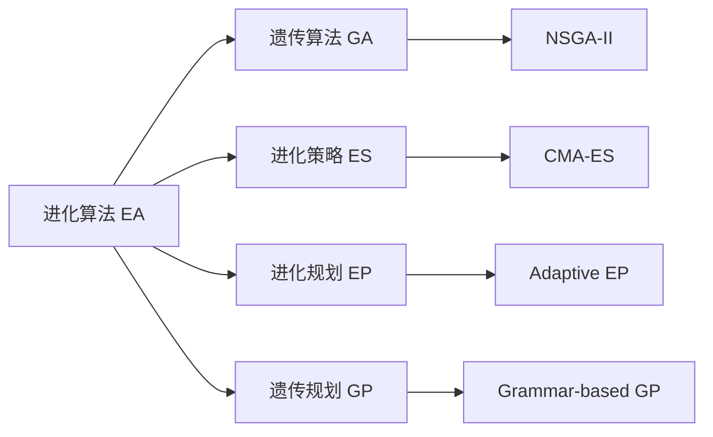
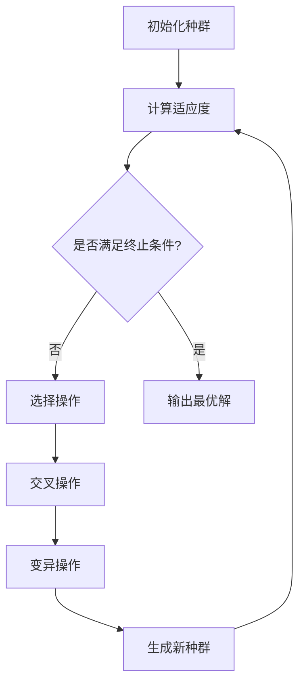
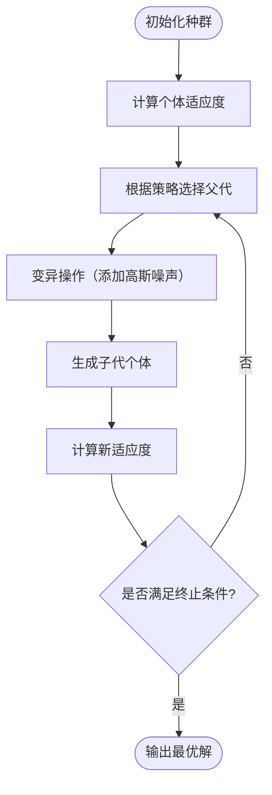
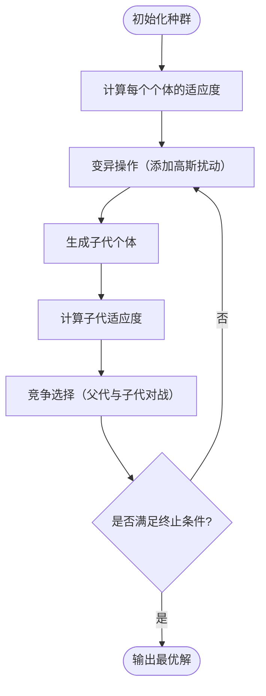

# 进化算法（EA）

进化算法（Evolutionary Algorithm，EA） 是一类基于自然界生物进化机制的随机优化算法，属于智能优化算法的重要分支。它通过 **“选择—重组—变异”** 等操作，模拟自然进化过程，用来寻找复杂问题的最优或近优解。

## 一、目前典型算法

- 遗传算法（GA）
- 进化策略（ES）
- 进化规划（EP）
- 遗传规划（GP）



核心思想概览

| 算法           | 主要优化对象   | 代表特征                  |
| ------------ | -------- | --------------------- |
| **GA（遗传算法）** | 通用优化问题   | 二进制编码 + 交叉为主          |
| **ES（进化策略）** | 连续优化问题   | 实数编码 + 高斯变异 + 自适应步长   |
| **EP（进化规划）** | 状态机与连续优化 | 无交叉 + 自适应变异 + 竞争选择    |
| **GP（遗传规划）** | 程序/表达式结构 | 树结构编码 + 子树交叉 + 自动生成程序 |

结构与操作机制对比

| 特征        | GA         | ES             | EP         | GP            |
| --------- | ---------- | -------------- | ---------- | ------------- |
| **编码方式**  | 二进制/实数向量   | 实数向量           | 实数向量       | 树结构（表达式）      |
| **适用问题**  | 离散/组合优化    | 连续优化           | 连续优化/噪声优化  | 程序、表达式生成      |
| **种群规模**  | 中          | 小-中            | 小          | 中             |
| **主要算子**  | 交叉 + 变异    | 变异（高斯噪声）       | 变异（高斯噪声）   | 子树交叉 + 变异     |
| **交叉操作**  | 关键操作       | 可选             | 无          | 树级交叉（核心）      |
| **变异操作**  | 位翻转 / 实数扰动 | 高斯扰动（含自适应）     | 高斯扰动（含自适应） | 子树替换          |
| **选择策略**  | 轮盘赌 / 锦标赛  | (μ, λ) 或 (μ+λ) | 随机竞争       | 轮盘赌 / 精英保留    |
| **参数自适应** | 弱（人工设定）    | 强（全局 + 局部）     | 强（个体自适应）   | 无固定参数，可自动学习结构 |
| **编码层级**  | 基因层        | 参数层            | 个体层        | 结构层           |

典型应用领域对比

| 特征        | GA         | ES             | EP         | GP            |
| --------- | ---------- | -------------- | ---------- | ------------- |
| **编码方式**  | 二进制/实数向量   | 实数向量           | 实数向量       | 树结构（表达式）      |
| **适用问题**  | 离散/组合优化    | 连续优化           | 连续优化/噪声优化  | 程序、表达式生成      |
| **种群规模**  | 中          | 小-中            | 小          | 中             |
| **主要算子**  | 交叉 + 变异    | 变异（高斯噪声）       | 变异（高斯噪声）   | 子树交叉 + 变异     |
| **交叉操作**  | 关键操作       | 可选             | 无          | 树级交叉（核心）      |
| **变异操作**  | 位翻转 / 实数扰动 | 高斯扰动（含自适应）     | 高斯扰动（含自适应） | 子树替换          |
| **选择策略**  | 轮盘赌 / 锦标赛  | (μ, λ) 或 (μ+λ) | 随机竞争       | 轮盘赌 / 精英保留    |
| **参数自适应** | 弱（人工设定）    | 强（全局 + 局部）     | 强（个体自适应）   | 无固定参数，可自动学习结构 |
| **编码层级**  | 基因层        | 参数层            | 个体层        | 结构层           |


## 二、遗传算法（GA）

遗传算法（Genetic Algorithm, GA）是一种基于 **达尔文进化论** 和 **遗传学原理** 的随机优化方法。  
它通过**自然选择、交叉与变异**等操作，在问题解空间中不断进化，最终获得最优或近似最优解。

### 2.1 基本思想

GA 的核心思想是：

::: info 生物启发
“适者生存，优胜劣汰。”
:::

通过模拟生物的进化过程（选择、交叉、变异），遗传算法不断优化个体的适应度，从而逼近全局最优解。

### 2.2 算法流程

遗传算法的基本执行过程如下：

1. **初始化种群**  
   随机生成若干个个体（候选解），形成初始种群。

2. **适应度评价**  
   使用目标函数计算每个个体的适应度值。

3. **选择操作（Selection）**  
   根据适应度值，选择优秀个体进入下一代（常用轮盘赌、锦标赛等方法）。

4. **交叉操作（Crossover）**  
   模拟基因重组，将两个个体的信息交换生成新个体。

5. **变异操作（Mutation）**  
   模拟基因突变，对个体的部分基因随机改变，以维持种群多样性。

6. **终止条件判断**  
   若达到最大代数或适应度收敛，则终止算法，输出最优解。

---

### 2.3 算法流程图



### 2.4 伪代码示例

``` :no-line-numbers
Algorithm GeneticAlgorithm
Input: 种群规模 N, 最大迭代次数 T, 交叉概率 Pc, 变异概率 Pm
Output: 最优个体 best

1: 初始化种群 P(0)
2: 计算每个个体的适应度 f(x)
3: t ← 0
4: while t < T do
5:     选择操作：从 P(t) 中按适应度选择个体
6:     交叉操作：以概率 Pc 对个体进行交叉，生成新个体
7:     变异操作：以概率 Pm 对个体进行基因突变
8:     计算新个体的适应度
9:     更新种群 P(t+1)
10:    t ← t + 1
11: end while
12: 返回最优个体 best
```

### 2.5 关键操作详解

#### 2.5.1 编码方式（Encoding）

遗传算法首先要将问题的解空间映射为基因序列，不同编码方式适用于不同类型的问题：

| 编码类型         | 表示方式           | 适用场景      | 示例                |
| ------------ | -------------- | --------- | ----------------- |
| **二进制编码**    | 用 `0` 和 `1` 表示 | 组合优化、离散问题 | `101001`          |
| **实数编码**     | 直接用浮点数表示基因     | 连续优化问题    | `[1.2, 3.5, 0.9]` |
| **符号或树结构编码** | 表达式或树状结构       | 程序进化（GP）  | `(x + sin(y))`    |

::: tip 说明
二进制编码是经典方法，易实现；实数编码更高效且避免了量化误差。
:::

#### 2.5.2 适应度函数（Fitness Function）

适应度函数用于衡量个体的优劣，即“生存能力”。
$$
Fitness(x) = \frac{1}{1+f(x)}
$$
或直接使用目标函数值（取决于是**最小化**还是**最大化**问题）。

::: tip 设计技巧
- 最小化问题：可用 1 / (1 + f(x)) 转化为最大化形式
- 归一化处理：确保不同量纲的变量能公平比较
- 惩罚函数法：对不满足约束的个体降低适应度
:::

#### 2.5.3 选择操作（Selection）

目标：保留优秀个体，让其基因得以延续。
常用方法如下：

| 方法        | 原理               | 特点          |
| --------- | ---------------- | ----------- |
| **轮盘赌选择** | 按适应度比例随机选取       | 实现简单，但可能早熟  |
| **锦标赛选择** | 随机抽取若干个体进行比较，选最优 | 控制选择压力方便    |
| **排序选择**  | 按排名分配选择概率        | 稳定性好，防止过快收敛 |

::: info 小技巧
锦标赛选择（Tournament Selection）在现代 GA 中最常用，兼顾多样性与选择效率。
:::

#### 2.5.4 交叉操作（Crossover）

交叉是产生新解的主要手段，模拟生物基因的重组过程。
它决定了算法的“探索能力”。

常见交叉算子：

| 算法类型     | 说明           |
| -------- | ------------ |
| **单点交叉** | 随机选一点交换两段基因  |
| **双点交叉** | 选择两个点，交换中间部分 |
| **均匀交叉** | 按概率交换每个位     |

::: tip 参数建议
交叉概率 $P_c$ 一般取 0.6~0.9。
过低 → 搜索缓慢；过高 → 稳定性下降。
:::

#### 2.5.5 变异操作（Mutation）

变异用于维持种群的多样性，防止陷入局部最优。

常见变异算子：

| 算法类型                           | 原理                  | 示例            |
| ------------------------------ | ------------------- | ------------- |
| **位翻转变异（Binary Mutation）**     | 将某个基因 `0→1` 或 `1→0` | `1010 → 1110` |
| **随机扰动（Real-valued Mutation）** | 在实数基因上加随机微小噪声       | `3.45 → 3.47` |
| **非均匀变异**                      | 随迭代次数减小变异范围         | 适合精细搜索        |

::: tip 参数建议
变异概率 $P_m$ 一般取 0.01~0.1，太高会破坏优秀基因。
:::

#### 2.5.6 精英策略（Elitism）

为防止最优个体丢失，可在每一代保留适应度最高的若干个体直接进入下一代。
这能显著提高算法稳定性和收敛性能。

### 2.6 常见变种

| 方法                  | 说明               |
| ------------------- | ---------------- |
| **自适应 GA**          | 动态调整交叉与变异概率      |
| **混合 GA**           | 与局部搜索算法结合（如模拟退火） |
| **并行 GA**           | 利用多个子种群并行进化      |
| **多目标 GA（NSGA-II）** | 处理多目标优化问题        |

### 2.7 优缺点

| 优点         | 缺点      |
| ---------- | ------- |
| 不依赖梯度信息    | 收敛速度较慢  |
| 全局搜索能力强    | 参数设置敏感  |
| 适用于复杂非线性问题 | 易陷入早熟收敛 |
| 易与其他算法结合   | 计算开销较大  |

## 三、进化策略（Evolution Strategy, ES）

进化策略（Evolution Strategy, ES）是一类基于**自然进化原理**的优化算法，  
与遗传算法（GA）同属进化计算（EA）范畴。  

ES 最初由德国学者 **Ingo Rechenberg** 和 **Hans-Paul Schwefel** 在 1960s 年代提出，  
主要用于**连续参数优化问题**，后来发展出多种形式（如 $(1+1)$-ES、$(μ,λ)$-ES、CMA-ES 等）。

---

### 3.1 算法基本思想

::: info 生物启发
进化策略强调“**变异驱动搜索、选择引导进化**”的思想。  
它模拟生物群体中个体通过**随机变异**、**自然选择**逐步适应环境的过程。
:::

与遗传算法不同，ES 更注重：
- **个体自适应能力**：每个个体可携带自身的“变异步长”参数；
- **连续搜索空间**：适合实数优化；
- **无交叉或弱交叉机制**：主要依靠变异与选择。

---

### 3.2 算法总体流程



### 3.3 伪代码示例

``` :no-line-numbers
Algorithm EvolutionStrategy
Input: 种群规模 μ, 子代数量 λ, 最大代数 T
Output: 最优个体 best

1: 初始化 μ 个个体 Xi 及其步长 σi
2: for t = 1 to T do
3:     选择 μ 个父代
4:     对每个父代进行变异，生成 λ 个子代：
           X' = X + σ * N(0, I)
           σ' = σ * exp(τ * N(0,1))
5:     计算所有个体的适应度
6:     根据策略选择新一代：
           - (μ, λ)-ES：从子代中选前 μ 个最优
           - (μ + λ)-ES：从父代与子代中选前 μ 个最优
7: end for
8: 输出最优解 best
```

### 3.4 关键机制详解

#### 3.4.1 个体表示（Representation）

每个个体由两部分组成：
$$
X_i=(\mathbf{x}_i, \sigma_i)
$$

- $\mathbf{x}_i$：解向量（即问题的变量）
- $\sigma_i$：变异强度（步长），控制搜索尺度

::: tip
相比 GA，ES 中的个体同时携带自适应参数（σ），
使得搜索范围可自动调整。
:::

#### 3.4.2 变异操作（Mutation）

变异是 ES 的核心。
通过在个体上添加高斯噪声来生成新解：
$$
\mathbf{x'} = \mathbf{x}+\sigma\cdot N(0,1)
$$
步长 $\sigma$ 也进行自适应调整：
$$
\sigma' = \sigma\cdot e^{\tau'\cdot N(0,1)+\tau\cdot N_i(0,1)}
$$
其中：

- $\tau', \tau$ 为学习率参数；
- $N(0,1)$ 为标准正态随机变量；
- $n$ 为问题维度。

::: info
这种“自适应步长变异”机制使算法能自动学习合适的搜索范围，
早期粗略搜索、后期精细探索。
:::

#### 3.4.3 选择策略（Selection）

ES 常见两种选择模型：

| 策略               | 说明                          | 特点          |
| ---------------- | --------------------------- | ----------- |
| **$(μ, λ)$-ES**  | 从 λ 个子代中选出最优的 μ 个个体         | 强选择压力，探索性强  |
| **$(μ + λ)$-ES** | 从父代与子代共 $(μ+λ)$ 个体中选最优的 μ 个 | 保留精英个体，收敛更稳 |

::: tip

- $(μ, λ)$ 模式 → 适合探索性问题
- $(μ + λ)$ 模式 → 适合需要保留优秀个体的情况
:::

#### 3.4.4 重组操作（Recombination, 可选）

尽管 ES 主要依靠变异，但也可使用简单的“重组”操作：

- 中值重组（Intermediate）
   $\mathbf{x'}=\frac{1}{\mu}\sum^\mu_{i=1}\mathbf{x_i}$
- 离散重组（Discrete）
   每个维度随机从不同父代中取值。

作用：**融合多个父代信息，提高搜索质量**。

### 3.5 常见变种

| 算法                   | 含义          | 特点            |
| -------------------- | ----------- | ------------- |
| **(1+1)-ES**         | 单父单子进化策略    | 简单、理论分析充分     |
| **(μ,λ)-ES**         | 多父多子策略      | 群体搜索能力强       |
| **CMA-ES**           | 协方差矩阵自适应 ES | 自动学习搜索方向，性能最强 |
| **Self-Adaptive ES** | 自适应进化策略     | 步长参数自动调整      |

### 3.6 优缺点

| 优点       | 缺点       |
| -------- | -------- |
| 适合连续优化问题 | 不适用于离散问题 |
| 参数自适应能力强 | 参数设置相对复杂 |
| 理论分析成熟   | 计算代价较高   |
| 收敛平稳稳定   | 可能陷入局部极值 |


## 四、进化规划（Evolutionary Programming, EP）

进化规划（Evolutionary Programming, EP）是**进化算法家族**中的重要成员，  
由美国学者 **Lawrence J. Fogel** 在 1960 年代提出，  
最初用于**自动生成有限状态机**，后来扩展为一种**通用连续优化算法**。

### 4.1 算法基本思想

::: info 生物启发
EP 模拟生物在进化过程中个体**变异与选择**的自然过程，  
核心思想是：
> “随机变异 + 竞争选择 = 逐步适应环境。”
:::

与 GA、ES 的主要区别：

| 对比项 | 遗传算法（GA） | 进化策略（ES） | 进化规划（EP） |
|---------|----------------|----------------|----------------|
| 编码 | 二进制/实数 | 实数 | 实数 |
| 核心操作 | 交叉 + 变异 | 变异 | 变异 |
| 选择机制 | 适应度比例 | 排序/淘汰 | 随机竞争（tournament） |
| 自适应性 | 弱 | 强（步长自适应） | 强（变异参数自学习） |

---

### 4.2 算法流程图



### 4.3 伪代码示例

``` :no-line-numbers
Algorithm EvolutionaryProgramming
Input: 种群规模 N, 最大代数 T
Output: 最优个体 best

1: 初始化种群 Xi 及其变异参数 σi
2: 计算每个个体的适应度 f(Xi)
3: for t = 1 to T do
4:     for each Xi do
5:         生成子代 Yi：
                Yi = Xi + σi * N(0, 1)
                σi' = σi * exp(τ * N(0,1))
6:     计算所有子代适应度 f(Yi)
7:     将父代与子代合并
8:     使用随机锦标赛选择 N 个最优个体组成新种群
9: end for
10: 返回最优解 best
```

### 4.4 关键机制详解

#### 4.4.1 个体表示（Representation）

同ES：
$$
X_i=(\mathbf{x}_i, \sigma_i)
$$

#### 4.4.2 变异操作（Mutation）

EP 的搜索主要靠变异进行：
$$
\mathbf{x'} = \mathbf{x}+\sigma\cdot N(0,1)
$$
并引入步长自适应机制：
$$
\sigma' = \sigma\cdot e^{\tau\cdot N(0,1)}
$$

- $\sigma$ 控制变异强度；
- 随代数变化，算法能自动调整搜索尺度。

::: tip
EP 的变异是多维高斯分布扰动，与 ES 十分类似，
但它没有固定的(μ,λ)选择机制。
:::

#### 4.4.3 竞争选择（Tournament Selection）

EP 的选择方式独具特色——**随机竞争选择**：

1. 将父代和子代合并，共 $2N$ 个体；
2. 每个个体随机与 $q$ 个其他个体竞争（通常 $q=10$）；
3. 统计胜利次数，按胜场数排序；
4. 选取前 $N$ 个作为下一代。

这种机制具有**强鲁棒性和全局搜索能力**，可以避免早熟收敛。

#### 4.4.4 自适应机制（Self-Adaptation）

每个个体的 $\sigma$ 参数会随着进化自动调整：

- 若大步长变异有助于提高适应度，则 $\sigma$ 会增大；
- 若小步长更有效，则 $\sigma$ 会逐步减小。

这使得 EP 能自我学习搜索策略，无需人工调参。

### 4.5 常见变种

| 变体                | 说明                   |
| ----------------- | -------------------- |
| **原始 EP**         | 用于有限状态机演化            |
| **实数编码 EP (REP)** | 适合连续优化问题             |
| **自适应 EP (AEP)**  | 变异参数自动调整             |
| **混合 EP**         | 与局部搜索算法结合（如 SA, PSO） |

### 4.6 优缺点

| 优点        | 缺点        |
| --------- | --------- |
| 结构简单，参数少  | 收敛速度较慢    |
| 无需梯度信息    | 对维度高问题较慢  |
| 适应连续与噪声问题 | 参数自适应不易控制 |
| 竞争选择鲁棒性强  | 不适合离散编码问题 |

## 五、遗传规划（Genetic Programming, GP）

GP 的目标是通过模拟自然选择和遗传机制，**自动生成计算机程序或数学表达式**，  
因此也被称为“**程序自动进化算法**”。

::: info 生物启发
遗传规划是遗传算法（GA）的扩展形式。  
它不再针对固定长度的染色体，而是直接在**树状结构的程序表示**上执行遗传操作。
:::

## 5.1 典型应用领域

- 符号回归（Symbolic Regression）
   自动生成数学公式拟合数据。
- 分类与预测模型构建
   自动演化决策规则或模型表达式。
- 控制与机器人策略生成
   自动演化控制逻辑或动作序列。
- 图像处理与特征生成
   自动生成图像滤波器或算子组合。
- 自动编程与算法生成
   “AI 编写程序”的早期形式。
