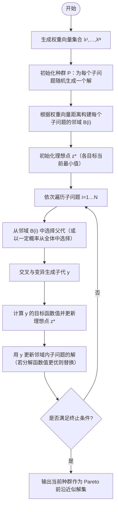

# 基于分解的多目标进化算法（MOEA/D）

**MOEA-D（Multi-Objective Evolutionary Algorithm based on Decomposition）** 是 Zhang 和 Li 于 2007 年提出的一类多目标进化算法。
其核心思想是：将一个多目标优化问题分解为多个标量子问题，并通过协同进化同时求解这些子问题。

与基于 Pareto 排序的算法（如 NSGA-II、SPEA2）不同，MOEA-D 不显式进行非支配排序，而是通过 分解函数 + 邻域协作机制 来实现收敛性与多样性的平衡。

## 算法流程图



## 一、算法原理与核心机制

### 1. 问题设定与基本符号

多目标优化问题定义为：

$$
\min_{x\in\Omega} F(x) = [f_1(x), f_2(x), ..., f_M(x)]
$$

其中：

- $\Omega$：可行解空间  
- $M$：目标函数个数  

MOEA-D 的核心思想是：  
**将一个多目标优化问题分解为多个标量子问题，并通过协同进化同时求解这些子问题**。

为此，引入一组权重向量：

$$
\boldsymbol{\lambda}^i = (\lambda_1^i,\dots,\lambda_M^i),
\quad \lambda_m^i \ge 0,\ \sum_{m=1}^M \lambda_m^i = 1
$$

每一个权重向量对应一个子问题。

---

### 2. 核心机制一：多目标分解（Decomposition）

MOEA-D 通过**标量化函数**将多目标问题转化为单目标子问题。

#### （1）加权和法（Weighted Sum）

$$
g^{ws}(x|\lambda) = \sum_{m=1}^M \lambda_m f_m(x)
$$

- 实现简单、易于理解  
- 只能处理凸 Pareto 前沿，对非凸前沿无效  

---

#### （2）Tchebycheff 分解（MOEA-D 默认）

$$
g^{te}(x|\lambda,z^*) =
\max_{1\le m\le M} \lambda_m |f_m(x)-z_m^*|
$$
或
$$
g^{te}(x|\lambda,z^*) =
\max_{1\le m\le M} \frac{|f_m(x)-z_m^*|}{\lambda_m}
$$


其中理想点定义为：

$$
z_m^* = \min_x f_m(x)
$$

:::info
它不是把多个目标“加起来”，而是关注“最差的那个目标表现”
:::

**特点：**

- 可覆盖非凸 Pareto 前沿  
- 强调对“最差目标”的优化  
- 收敛性强，稳定性好  

---

#### （3）PBI（Penalty-based Boundary Intersection）

$$
g^{pbi}(x|\lambda,z^*) = d_1 + \theta d_2
$$

其中：

- $d_1$：沿权重方向的投影距离（收敛性）  
- $d_2$：垂直于权重方向的距离（多样性）  
- $\theta$：平衡参数  

---

### 3. 核心机制二：权重向量与子问题映射

MOEA-D 将**一个子问题与一个解绑定**：

$$
P = \{x^1, x^2, \dots, x^N\}
$$

其中：

- $x^i$：子问题 $i$ 当前对应的解  
- 种群规模 = 子问题数量  

这种结构与基于 Pareto 排序的算法存在本质区别：

- 不维护精英档案  
- 不进行非支配排序  
- 多样性由权重向量分布自然保证  

---

### 4. 核心机制三：邻域协作（Neighborhood）

#### （1）邻域构建

在权重向量空间中计算欧氏距离，定义邻域：

$$
B(i) = \text{T 个与 } \lambda^i \text{ 最近的权重向量索引}
$$

- $T$：邻域大小（常取 10～30）  

---

#### （2）邻域进化思想

- 父代优先从邻域中选择  
- 子代主要用于更新邻域内子问题  
- 构成“局部竞争 + 全局覆盖”的搜索模式  

---

### 5. 核心机制四：邻域更新规则

对当前子问题 $i$，生成新解 $y$ 后：

若对某个邻域子问题 $j \in B(i)$ 有：

$$
g(y|\lambda^j) \le g(x^j|\lambda^j)
$$

则执行替换：

$$
x^j \leftarrow y
$$

**说明：**

- 一个新解可以同时改进多个子问题  
- 信息在邻域内快速传播，提高搜索效率  

---

### 6. MOEA-D 与 Pareto 排序算法的本质差异

| 维度 | MOEA-D | NSGA-II / SPEA2 |
|----|------|----------------|
| 选择依据 | 分解函数值 | Pareto 支配关系 |
| 多样性来源 | 权重向量分布 | 拥挤度 / 密度 |
| 进化方式 | 邻域协作 | 全局竞争 |
| 精英机制 | 隐式（子问题保留） | 显式精英档案 |
| 计算复杂度 | $O(NT)$ | $O(N^2)$ |

---

## 二、完整算法流程（MOEA-D）

1. **初始化权重向量**  
   在目标空间生成 $N$ 个均匀分布的权重向量  
   $\lambda^1,\dots,\lambda^N$

2. **初始化种群**  
   为每个子问题随机生成一个初始解  
   $P=\{x^1,\dots,x^N\}$

3. **构建邻域结构**  
   根据权重向量之间的距离，为每个子问题确定邻域 $B(i)$

4. **初始化理想点**  

$$
z_m^* = \min_i f_m(x^i), \quad m=1,\dots,M
$$

5. **进化迭代**  
   对每个子问题 $i=1,\dots,N$：
   - 从邻域 $B(i)$（或全局）选择父代  
   - 交叉与变异生成子代 $y$  
   - 计算 $y$ 的目标函数并更新理想点  
   - 用 $y$ 更新邻域内子问题的解  

6. **终止判断**  
   若达到最大迭代次数或满足收敛条件，则停止迭代

7. **输出结果**  
   当前种群作为 Pareto 前沿的近似解集输出

---

## 三、参数设置建议

| 参数 | 含义 | 推荐取值 | 说明 |
|----|----|----|----|
| $N$ | 子问题数量 | 100～300 | 决定 Pareto 前沿分辨率 |
| $T$ | 邻域大小 | 10～30 | 控制局部协作范围 |
| $\delta$ | 邻域选择概率 | 0.8～0.9 | 平衡局部与全局搜索 |
| $P_c$ | 交叉概率 | 0.9 | 提升全局探索能力 |
| $P_m$ | 变异概率 | $1/\text{dim}$ | 防止早熟收敛 |
| 分解函数 | Tchebycheff | 默认 | 非凸前沿友好 |
| 权重生成 | 均匀采样 | — | 影响解的分布质量 |

:::info
**经验提示：**  
- 邻域过小会降低信息共享效率，  
- 邻域过大则会退化为全局竞争；  
- 权重向量分布质量直接决定 Pareto 前沿的均匀性。
:::

## 四、算法实现（ZDT1 示例，简化版）

```py
import numpy as np
import random

def evaluate(x):
    f1 = x[0]
    g = 1 + 9 * np.mean(x[1:])
    f2 = g * (1 - np.sqrt(f1 / g))
    return np.array([f1, f2])

def tchebycheff(f, lam, z):
    return np.max(lam * np.abs(f - z))

def moead(dim=30, N=100, T=20, max_gen=200):
    # 权重向量
    lambdas = np.array([[i/(N-1), 1-i/(N-1)] for i in range(N)])

    # 邻域
    dist = np.linalg.norm(lambdas[:,None]-lambdas[None,:], axis=2)
    B = np.argsort(dist, axis=1)[:, :T]

    # 初始化种群
    pop = np.random.rand(N, dim)
    objs = np.array([evaluate(x) for x in pop])
    z = np.min(objs, axis=0)

    for _ in range(max_gen):
        for i in range(N):
            # 父代选择
            p1, p2 = random.sample(list(B[i]), 2)
            y = 0.5 * (pop[p1] + pop[p2])

            # 变异
            k = random.randint(0, dim-1)
            y[k] = random.random()

            fy = evaluate(y)
            z = np.minimum(z, fy)

            # 邻域更新
            for j in B[i]:
                if tchebycheff(fy, lambdas[j], z) < \
                   tchebycheff(objs[j], lambdas[j], z):
                    pop[j] = y
                    objs[j] = fy
    return objs
```

## 五、总结与思考

### 1. 核心思想

:::info
“分而治之 + 邻域协作”
:::

- 用权重向量控制多样性
- 用标量函数驱动收敛
- 用局部协作降低复杂度

### 2. 优缺点

优点：

- 计算效率高
- 前沿分布可控
- 易引入偏好信息

缺点：

- 权重向量设计敏感
- 高维目标下分布困难
- 不显式维护 Pareto 最优性

### 3. 改进方向

- MOEA-D-DE / MOEA-D-DRA
- 自适应权重向量
- 与偏好学习结合

### 4. 小结

MOEA-D 是从 “Pareto 排序范式”跳出的一次范式转变，
其思想深刻影响了后续多目标算法设计，
是理解现代多目标优化不可或缺的一块拼图。