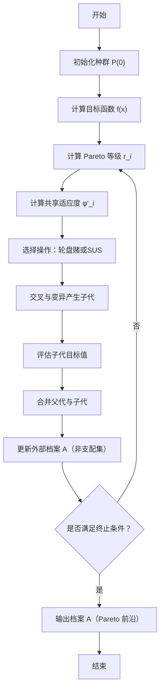

# 多目标遗传算法（MOGA）

**MOGA（Multi-Objective Genetic Algorithm）** 是 Fonseca & Fleming 于 1993 年提出的多目标进化算法。  
它在经典遗传算法基础上，通过 **Pareto 支配排序 + 适应度共享机制** 实现多目标优化。

---

## 🧩 算法流程图



## 一、算法原理与核心机制

### 1. Pareto 支配关系

在多目标优化问题中，我们通常希望同时最小化（或最大化）多个目标函数：

$$
\min_{x \in \Omega} F(x) = [f_1(x), f_2(x), \dots, f_m(x)]
$$

其中：
- $\Omega$ 是可行解空间；
- $F(x)$ 是目标向量。

对于两个解 $x_a, x_b \in \Omega$，定义 **Pareto 支配（Pareto dominance）** 关系：

$$
x_a \prec x_b \iff
\begin{cases}
\forall k \in \{1,\dots,m\},\ f_k(x_a) \le f_k(x_b), \\
\exists k \in \{1,\dots,m\},\ f_k(x_a) < f_k(x_b)
\end{cases}
$$

即 $x_a$ 在所有目标上不劣于 $x_b$，且至少在一个目标上优于 $x_b$。

若不存在任何其他解支配 $x^\ast$，则称 $x^\ast$ 为 **Pareto 最优解（Pareto optimal solution）**，  
所有此类解的集合称为 **Pareto 最优集（Pareto set）**，其目标空间对应为 **Pareto 前沿（Pareto front）**。

---

### 2. 等级分配（Pareto Rank）

MOGA 使用 **支配次数排名法（Dominance Count Ranking）** 来衡量每个个体的优劣程度。

设种群中共有 $N$ 个个体，第 $i$ 个个体被多少个个体支配，则它的等级定义为：

$$
r_i = 1 + \left|\{\, j \mid F_j \prec F_i \,\}\right|
$$

- 若个体 $i$ 没有被任何个体支配，则 $r_i = 1$；
- 若它被两个个体支配，则 $r_i = 3$，以此类推。

因此，$r_i$ 越小代表个体越优。

---

### 3. 等级适应度分配（Rank-based Fitness Assignment）

得到所有个体的等级 $r_i$ 后，为了将等级转化为选择概率，MOGA 使用线性缩放的适应度：

$$
\phi_i = \phi_{\max} - \frac{\phi_{\max} - \phi_{\min}}{r_{\max} - 1} (r_i - 1)
$$

其中：
- $\phi_{\max}$ 与 $\phi_{\min}$ 分别为最高与最低适应度（常取 $\phi_{\max}=2, \phi_{\min}=0$）；
- $r_{\max}$ 为最大等级。

这样：
- 等级最低（最优）的个体得到最大适应度；
- 等级最高（最劣）的个体得到最小适应度。

通过这种方式，避免了直接将多目标函数压缩为单目标函数所引入的偏差问题。

---

### 4. 适应度共享（Fitness Sharing）

在多目标优化中，若只考虑适应度大小，算法可能会在某一区域聚集，失去多样性。  
MOGA 引入了 **适应度共享机制**，通过在目标空间中测量个体之间的“距离”来平衡密度分布。

首先定义共享函数（Sharing Function）：

$$
\operatorname{sh}(d_{ij}) =
\begin{cases}
1 - \left(\dfrac{d_{ij}}{\sigma_{\text{share}}}\right)^{\alpha}, & d_{ij} < \sigma_{\text{share}} \\
0, & \text{否则}
\end{cases}
$$

其中：
- $d_{ij}$ 为个体 $i$ 与 $j$ 的距离；
- $\sigma_{\text{share}}$ 为共享半径；
- $\alpha$ 控制函数形状（常取 1 或 2）。

个体 $i$ 的邻域密度定义为：

$$
m_i = \sum_{j=1}^{N} \operatorname{sh}(d_{ij})
$$

再对其适应度进行“平滑”：

$$
\phi'_i = \frac{\phi_i}{m_i}
$$

因此，若个体处于密集区域（$m_i$ 较大），则 $\phi'_i$ 会被“削弱”，从而降低被选中概率，  
以此鼓励种群沿 Pareto 前沿均匀分布。

---

### 5. 共享距离度量

一般使用目标空间中的欧氏距离：

$$
d_{ij} = \sqrt{ \sum_{k=1}^{m} \left( \tilde{f}_k(i) - \tilde{f}_k(j) \right)^2 }
$$

其中 $\tilde{f}_k$ 表示目标归一化值：

$$
\tilde{f}_k(i) = \frac{f_k(i) - f_k^{\min}}{f_k^{\max} - f_k^{\min}}
$$

通过归一化处理，保证不同量纲的目标之间具有可比性。

---

## 二、完整算法流程（带精英档案）

MOGA 的完整执行步骤如下：

1. **初始化种群**：随机生成 $N$ 个体 $P^{(0)}$。  
2. **计算目标函数**：求取每个个体的 $F_i = [f_1(x_i), f_2(x_i), ...]$。  
3. **Pareto 排序**：计算每个个体的等级 $r_i$。  
4. **适应度计算**：按等级计算 $\phi_i$，再用共享函数修正为 $\phi'_i$。  
5. **选择操作**：根据 $\phi'_i$ 的概率进行父代选择（常用轮盘赌或 SUS）。  
6. **交叉与变异**：应用模拟二进制交叉（SBX）和多项式变异生成子代。  
7. **计算子代目标值**。  
8. **精英保留**：将父代、子代与当前外部档案 $A$ 合并，  
   取非支配集更新 $A$（若超限则按拥挤距离裁剪）。  
9. **形成下一代**：从合并集中按共享适应度选出新一代 $P^{(t+1)}$。  
10. **终止判断**：若达到迭代次数或收敛条件，输出档案 $A$。

最终输出的 $A$ 即为近似的 **Pareto 前沿**。

---

## 三、参数设置建议

| 参数 | 含义 | 建议取值 |
| ---- | ---- | -------- |
| $N$ | 种群规模 | 100–200 |
| $T$ | 最大迭代代数 | 200–500 |
| $\sigma_{\text{share}}$ | 共享半径 | 0.05–0.2 |
| $\alpha$ | 共享指数 | 1 或 2 |
| $p_c$ | 交叉概率 | 0.9 |
| $p_m$ | 变异概率 | $1/n$ |
| $\eta_c$ | SBX 交叉参数 | 10–20 |
| $\eta_m$ | 多项式变异参数 | 20 |

---

## 四、代码实现（ZDT1 示例）

::: code-tabs#MOGA

@tab Python

```python
"""
===============================================================
多目标遗传算法 MOGA (Multi-Objective Genetic Algorithm)
示例问题：ZDT1
依赖：numpy
===============================================================
"""

import numpy as np
from dataclasses import dataclass

# 随机数生成器
rng = np.random.default_rng()

# ===============================================================
# ZDT1 测试函数（两目标最小化问题）
# ===============================================================
def zdt1(x):
    """
    输入：
        x : ndarray, 个体的决策变量向量
    输出：
        np.array([f1, f2]) : 两个目标值
    """
    f1 = x[0]
    g  = 1 + 9 * np.mean(x[1:])          # 第二目标控制项
    h  = 1 - np.sqrt(f1 / g)
    f2 = g * h
    return np.array([f1, f2])


# ===============================================================
# 支配关系判断函数
# ===============================================================
def dominates(fi, fj):
    """
    判断个体 i 是否支配个体 j
    条件：所有目标不劣且至少一个目标更优
    """
    return np.all(fi <= fj) and np.any(fi < fj)


# ===============================================================
# Pareto 排名计算（支配次数法）
# ===============================================================
def pareto_rank(F):
    """
    输入：
        F : (N, m) 目标矩阵
    输出：
        r : (N,) 每个个体的等级，越小越优
    """
    N = len(F)
    r = np.ones(N, dtype=int)
    for i in range(N):
        for j in range(N):
            if i != j and dominates(F[j], F[i]):
                r[i] += 1  # 被支配一次等级加1
    return r


# ===============================================================
# 目标归一化
# ===============================================================
def normalize_objectives(F):
    """
    将各目标值线性归一化到 [0,1] 区间
    """
    fmin, fmax = F.min(0), F.max(0)
    return (F - fmin) / np.maximum(fmax - fmin, 1e-12)


# ===============================================================
# 计算邻域密度 (m_i)
# ===============================================================
def niche_count(F, sigma=0.1, alpha=1):
    """
    输入：
        F : 目标矩阵 (N, m)
        sigma : 共享半径
        alpha : 共享指数
    输出：
        m : 每个个体的邻域密度
    """
    Fn = normalize_objectives(F)
    N = len(F)
    m = np.zeros(N)
    for i in range(N):
        d = np.linalg.norm(Fn[i] - Fn, axis=1)  # 欧氏距离
        sh = np.maximum(0, 1 - (d / sigma) ** alpha)  # 共享函数
        sh[d >= sigma] = 0
        m[i] = sh.sum()
    return np.maximum(m, 1)  # 防止除零


# ===============================================================
# 计算共享适应度
# ===============================================================
def shared_fitness(F, r, sigma=0.1, alpha=1):
    """
    输入：
        F : 目标矩阵
        r : Pareto 等级
    输出：
        phi' : 修正后的适应度值
    """
    rmax = r.max()
    # 等级适应度映射
    phi = 2 - (2 - 0) * (r - 1) / (rmax - 1) if rmax > 1 else np.ones_like(r) * 2
    # 邻域共享修正
    return phi / niche_count(F, sigma, alpha)


# ===============================================================
# 随机均匀采样选择 (SUS)
# ===============================================================
def sus_select(weights, n):
    """
    输入：
        weights : 个体适应度
        n : 选择个数
    输出：
        索引数组 (被选中的个体索引)
    """
    w = np.maximum(weights, 0)
    w /= w.sum()
    cum = np.cumsum(w)
    step, start = 1 / n, np.random.random() / n
    points = start + step * np.arange(n)
    return np.searchsorted(cum, points)


# ===============================================================
# 模拟二进制交叉 (SBX)
# ===============================================================
def sbx_crossover(p1, p2, eta=15, pc=0.9):
    """
    输入：
        p1, p2 : 父代个体
        eta : 分布参数 (越大子代越接近父代)
        pc : 交叉概率
    输出：
        c1, c2 : 交叉后的两个子代
    """
    c1, c2 = p1.copy(), p2.copy()
    if np.random.random() < pc:
        for i in range(len(p1)):
            if np.random.random() < 0.5:
                x1, x2 = sorted([p1[i], p2[i]])
                u = np.random.random()
                beta = 1 + 2 * (x1) / (x2 - x1)
                alpha = 2 - beta ** (-(eta + 1))
                if u <= 1 / alpha:
                    betaq = (u * alpha) ** (1 / (eta + 1))
                else:
                    betaq = (1 / (2 - u * alpha)) ** (1 / (eta + 1))
                # 计算子代
                c1[i] = 0.5 * ((x1 + x2) - betaq * (x2 - x1))
                c2[i] = 0.5 * ((x1 + x2) + betaq * (x2 - x1))
    # 保证变量范围在 [0,1]
    return np.clip(c1, 0, 1), np.clip(c2, 0, 1)


# ===============================================================
# 多项式变异算子
# ===============================================================
def poly_mutation(x, eta=20, pm=None):
    """
    输入：
        x : 个体向量
        eta : 分布参数
        pm : 变异概率 (默认 1/n)
    输出：
        变异后的个体
    """
    n = len(x)
    pm = 1 / n if pm is None else pm
    y = x.copy()
    for i in range(n):
        if np.random.random() < pm:
            u = np.random.random()
            if u < 0.5:
                delta = (2 * u) ** (1 / (eta + 1)) - 1
            else:
                delta = 1 - (2 * (1 - u)) ** (1 / (eta + 1))
            y[i] += delta
    return np.clip(y, 0, 1)


# ===============================================================
# 配置参数结构体
# ===============================================================
@dataclass
class MOGAConfig:
    pop_size: int = 100        # 种群规模
    dim: int = 30              # 决策变量维度
    n_gen: int = 200           # 最大迭代代数
    sigma_share: float = 0.1   # 共享半径
    alpha_share: float = 1.0   # 共享指数
    pc: float = 0.9            # 交叉概率
    pm: float = None           # 变异概率（若None则1/n）
    eta_c: int = 15            # SBX交叉参数
    eta_m: int = 20            # 多项式变异参数


# ===============================================================
# MOGA 主函数
# ===============================================================
def moga(problem, cfg):
    """
    MOGA 主循环
    输入：
        problem : 目标函数
        cfg : 参数配置对象 MOGAConfig
    输出：
        Q : 最终种群矩阵
        F : 对应目标函数值矩阵
    """
    N, n = cfg.pop_size, cfg.dim
    # ---------- 初始化 ----------
    P = np.random.rand(N, n)                       # 初始化种群
    F = np.array([problem(x) for x in P])          # 计算目标值

    # ---------- 主循环 ----------
    for gen in range(cfg.n_gen):
        # 1. Pareto 排名
        r = pareto_rank(F)

        # 2. 计算共享适应度
        fit = shared_fitness(F, r, cfg.sigma_share, cfg.alpha_share)

        # 3. 选择操作
        parents = P[sus_select(fit, N)]

        # 4. 交叉与变异
        Q = []
        for i in range(0, N, 2):
            c1, c2 = sbx_crossover(
                parents[i],
                parents[(i + 1) % N],
                eta=cfg.eta_c
            )
            c1 = poly_mutation(c1, eta=cfg.eta_m)
            c2 = poly_mutation(c2, eta=cfg.eta_m)
            Q += [c1, c2]
        Q = np.array(Q)[:N]                        # 控制数量
        F = np.array([problem(x) for x in Q])      # 计算新目标值

        # 每 50 代打印一次进度
        if gen % 50 == 0:
            print(f"Generation {gen}/{cfg.n_gen} finished.")

    return Q, F


# ===============================================================
# 主程序入口
# ===============================================================
if __name__ == "__main__":
    cfg = MOGAConfig()             # 使用默认参数
    X, F = moga(zdt1, cfg)         # 运行算法
    print("Pareto 前沿样本数：", len(X))
    print("前 5 个目标值样本：\n", F[:5])
```

@tab MATLAB

```matlab
% ============================================================
% MOGA（Multi-Objective Genetic Algorithm，多目标遗传算法）
% 示例问题：ZDT1
% ============================================================

function moga_demo
    % ===================== 参数配置 =====================
    cfg.pop_size = 100;        % 种群规模 N
    cfg.dim = 30;              % 决策变量维度 n
    cfg.n_gen = 200;           % 最大迭代代数
    cfg.sigma_share = 0.1;     % 共享半径 σ_share
    cfg.alpha_share = 1.0;     % 共享指数 α
    cfg.pc = 0.9;              % 交叉概率
    cfg.pm = 1 / cfg.dim;      % 变异概率
    cfg.eta_c = 15;            % SBX交叉参数
    cfg.eta_m = 20;            % 多项式变异参数

    % ===================== 目标函数 =====================
    problem = @zdt1;  % 采用 ZDT1 测试函数

    % ===================== 运行算法 =====================
    [P, F] = moga(problem, cfg);

    % ===================== 绘制 Pareto 前沿 =====================
    scatter(F(:,1), F(:,2), 20, 'filled');
    xlabel('f_1'); ylabel('f_2'); grid on;
    title('MOGA 在 ZDT1 上的 Pareto 前沿');
end


% ============================================================
% ZDT1 测试函数（两目标最小化问题）
% ============================================================
function f = zdt1(x)
    f1 = x(1);
    g  = 1 + 9 * mean(x(2:end));
    h  = 1 - sqrt(f1 / g);
    f2 = g * h;
    f = [f1, f2];
end


% ============================================================
% 主算法函数：MOGA 主循环
% ============================================================
function [P, F] = moga(problem, cfg)
    % 输入:
    %   problem: 目标函数句柄
    %   cfg: 参数结构体（含N、交叉率等）
    % 输出:
    %   P: 最终种群矩阵 (N × n)
    %   F: 对应目标函数值 (N × m)

    % ---------- 初始化 ----------
    N = cfg.pop_size;
    n = cfg.dim;
    P = rand(N, n);                 % 种群初始化 [0,1]^n
    F = evalF(problem, P);          % 计算目标函数值

    % ---------- 迭代搜索 ----------
    for gen = 1:cfg.n_gen
        % --- 1. 计算 Pareto 等级 ---
        r = pareto_rank(F);

        % --- 2. 计算共享适应度 ---
        fit = shared_fit(F, r, cfg.sigma_share, cfg.alpha_share);

        % --- 3. 选择操作（SUS） ---
        parents = P(sus_select(fit, N), :);

        % --- 4. 交叉与变异 ---
        Q = zeros(N, n);
        for i = 1:2:N
            % SBX 交叉产生两个子代
            [c1, c2] = sbx(parents(i,:), ...
                           parents(mod(i, N) + 1, :), ...
                           cfg.eta_c, cfg.pc);
            % 多项式变异
            c1 = poly_mut(c1, cfg.eta_m, cfg.pm);
            c2 = poly_mut(c2, cfg.eta_m, cfg.pm);
            Q(i,:) = c1;
            Q(i+1,:) = c2;
        end

        % --- 5. 评估新种群目标值 ---
        F = evalF(problem, Q);
        P = Q;  % 更新种群

        % （可选）显示迭代进度
        if mod(gen, 50) == 0
            fprintf('迭代 %d / %d 完成\n', gen, cfg.n_gen);
        end
    end
end


% ============================================================
% 计算种群的目标函数值
% ============================================================
function F = evalF(problem, P)
    % 输入: P (N×n)
    % 输出: F (N×m)
    N = size(P, 1);
    F = zeros(N, 2);
    for i = 1:N
        F(i,:) = problem(P(i,:));
    end
end


% ============================================================
% Pareto 排名计算函数
% 支配次数排名法 (Dominance Count Ranking)
% ============================================================
function r = pareto_rank(F)
    % 输入: F (N×m)
    % 输出: r (N×1)
    N = size(F,1);
    r = ones(N,1);
    for i = 1:N
        for j = 1:N
            if i ~= j && all(F(j,:) <= F(i,:)) && any(F(j,:) < F(i,:))
                r(i) = r(i) + 1;  % 被支配一次则等级 +1
            end
        end
    end
end


% ============================================================
% 适应度共享机制
% 根据个体密度修正适应度值，保持解的多样性
% ============================================================
function phi = shared_fit(F, r, sigma, alpha)
    % 输入:
    %   F: 目标值矩阵 (N×m)
    %   r: 等级向量
    %   sigma, alpha: 共享参数
    % 输出:
    %   phi: 修正后的适应度

    % ---- 1. 等级适应度分配 ----
    rmax = max(r);
    phi = 2 - (2 - 0) * (r - 1) / (rmax - 1);

    % ---- 2. 目标归一化 ----
    Fn = normalizeF(F);

    % ---- 3. 计算邻域密度 m_i ----
    N = size(F, 1);
    m = zeros(N, 1);
    for i = 1:N
        d = sqrt(sum((Fn - Fn(i,:)).^2, 2));  % 欧氏距离
        sh = max(0, 1 - (d / sigma).^alpha);  % 共享函数
        sh(d >= sigma) = 0;
        m(i) = sum(sh);
    end
    m(m == 0) = 1;  % 防止除零

    % ---- 4. 修正适应度 ----
    phi = phi ./ m;
end


% ============================================================
% 目标归一化
% ============================================================
function Fn = normalizeF(F)
    % 输入: F (N×m)
    % 输出: 归一化目标矩阵
    fmin = min(F);
    fmax = max(F);
    Fn = (F - fmin) ./ (fmax - fmin + 1e-12);
end


% ============================================================
% SUS（Stochastic Universal Sampling）选择算子
% ============================================================
function idx = sus_select(w, n)
    % 输入:
    %   w: 适应度向量
    %   n: 选取数量
    % 输出:
    %   idx: 被选中的索引

    w = w / sum(w);
    cum = cumsum(w);
    step = 1 / n;
    start = rand * step;
    pts = start + step * (0:n-1);
    idx = arrayfun(@(p) find(cum >= p, 1), pts).';
end


% ============================================================
% 模拟二进制交叉 (SBX)
% ============================================================
function [c1, c2] = sbx(p1, p2, eta, pc)
    % 输入:
    %   p1, p2: 父代个体
    %   eta: 分布指数
    %   pc: 交叉概率
    % 输出:
    %   c1, c2: 两个子代个体

    c1 = p1;
    c2 = p2;
    if rand < pc
        for i = 1:length(p1)
            if rand < 0.5
                x1 = min(p1(i), p2(i));
                x2 = max(p1(i), p2(i));
                u = rand;
                beta = 1 + 2 * (x1) / (x2 - x1);
                alpha = 2 - beta^(-(eta + 1));
                if u <= 1 / alpha
                    betaq = (u * alpha)^(1 / (eta + 1));
                else
                    betaq = (1 / (2 - u * alpha))^(1 / (eta + 1));
                end
                c1(i) = 0.5 * ((x1 + x2) - betaq * (x2 - x1));
                c2(i) = 0.5 * ((x1 + x2) + betaq * (x2 - x1));
            end
        end
    end
    % 边界裁剪，保持在 [0,1]
    c1 = max(min(c1, 1), 0);
    c2 = max(min(c2, 1), 0);
end


% ============================================================
% 多项式变异算子
% ============================================================
function y = poly_mut(x, eta, pm)
    % 输入:
    %   x: 个体向量
    %   eta: 多项式分布参数
    %   pm: 变异概率
    % 输出:
    %   y: 变异后的个体

    y = x;
    for i = 1:length(x)
        if rand < pm
            u = rand;
            if u < 0.5
                delta = (2 * u)^(1 / (eta + 1)) - 1;
            else
                delta = 1 - (2 * (1 - u))^(1 / (eta + 1));
            end
            y(i) = y(i) + delta;
        end
    end
    % 边界裁剪
    y = max(min(y, 1), 0);
end

```

:::

---

## 五、总结与思考

- MOGA 将 **Pareto 支配关系** 融入遗传算法，实现多目标的同时优化；
- 通过 **共享适应度机制** 维持解的多样性；
- 缺点是复杂度较高，为 $O(mN^2)$；
- 后续算法（如 **NSGA-II**）在其基础上优化了非支配排序和精英保留机制，大幅提升了性能与稳定性。

---

