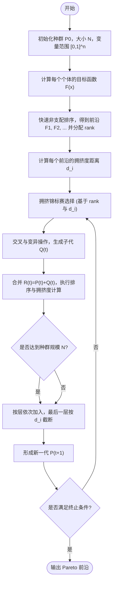

# 非支配遗传算法二代（NSGA Ⅱ）

**NSGA-II（Non-dominated Sorting Genetic Algorithm II）**：Deb 等于 2002 年提出，通过快速非支配排序、拥挤度距离与精英保留策略实现高效且分布均匀的多目标优化。

## 算法流程图



## 一、算法原理与核心机制

---

### 1. 多目标优化问题与帕累托支配

#### （1）问题定义

$$
\min_{\mathbf{x}\in\Omega} \mathbf{F}(\mathbf{x}) = [f_1(\mathbf{x}), f_2(\mathbf{x}), \dots, f_M(\mathbf{x})],
$$

其中：
- $\mathbf{x} = (x_1, \dots, x_n)$ 为决策变量；
- $\Omega \subseteq \mathbb{R}^n$ 为可行域；
- $M$ 为目标函数数量。

#### （2）Pareto 支配关系

对任意两个解 $\mathbf{u}, \mathbf{v}\in\Omega$，若满足：
$$
\forall m, f_m(\mathbf{u}) \le f_m(\mathbf{v}), \quad \text{且}\ \exists m, f_m(\mathbf{u}) < f_m(\mathbf{v}),
$$
则称 $\mathbf{u}$ **支配** $\mathbf{v}$，记作 $\mathbf{u}\prec\mathbf{v}$。

若不存在任何 $\mathbf{y}$ 使得 $\mathbf{y}\prec\mathbf{x}$，则 $\mathbf{x}$ 为 **非支配解（Pareto Optimal）**。  
所有非支配解的集合称为 **Pareto 最优集**，其映射到目标空间的点构成 **Pareto 前沿（PF）**。

---

### 2. 快速非支配排序（Fast Non-dominated Sorting）

NSGA-II 核心在于对种群快速划分为多个层级：

$$
F_1, F_2, \dots, F_K,
$$
其中 $F_1$ 为当前最优的非支配解集。

#### （1）计算步骤

对每个个体 $p$：
- 定义支配集：
  $$
  S_p = \{ q \mid p \prec q \},
  $$
  表示被 $p$ 支配的个体集合；
- 计数：
  $$
  n_p = |\{ q \mid q \prec p \}|,
  $$
  即支配 $p$ 的个体数量。

**算法过程：**

1. 初始化 $S_p$、$n_p$；
2. 若 $n_p = 0$，则 $p \in F_1$；
3. 对 $F_1$ 中的每个 $p$，执行：
   $$
   \forall q\in S_p,\quad n_q \leftarrow n_q - 1;
   $$
   若 $n_q=0$，则 $q\in F_2$；
4. 重复，直到所有个体分配 rank。

时间复杂度：$O(MN^2)$。

---

### 3. 拥挤度距离计算（Crowding Distance）

在每个前沿 $F_k$ 内，为维持多样性定义个体间“距离”度量 $d_i$：

#### （1）计算公式

对前沿 $F$（包含 $|F|$ 个个体）：
$$
d_i = \sum_{m=1}^M \frac{f_m^{(i+1)} - f_m^{(i-1)}}{f_m^{\max} - f_m^{\min}},
$$
其中：
- 个体按第 $m$ 个目标函数升序排序；
- 边界个体 $d_i = \infty$；
- $f_m^{\max}, f_m^{\min}$ 为该层在目标 $m$ 上的极值；
- 若 $f_m^{\max}=f_m^{\min}$，则令分母为 $1$ 避免除零。

#### （2）物理意义

- $d_i$ 越大 → 个体位于稀疏区域，应保留；
- $d_i$ 越小 → 个体靠近密集区域，可能被淘汰。

#### （3）拥挤度排序与截断

当最后一层 $F_L$ 的所有个体无法全部加入新种群时：
- 计算所有 $d_i$；
- 按 $d_i$ 降序排序；
- 取前 $K=N-|P_{t+1}|$ 个填充；
- 其余舍弃。

---

### 4. 拥挤锦标赛选择（Crowded Tournament Selection）

用于生成交叉父母的选择机制。  
每次随机选两个个体 $a,b$，选择规则：

$$
a \prec_N b \iff
\begin{cases}
\text{rank}(a) < \text{rank}(b), & \text{或} \\
\text{rank}(a) = \text{rank}(b)\ \text{且}\ d_a > d_b
\end{cases}
$$

- 若 $a \prec_N b$，则选择 $a$；
- 若相等，随机选取。  

这样实现了“低 rank 优先 + 稀疏优先”的双重筛选。

---

### 5. 交叉操作（Crossover）

交叉用于产生新解，NSGA-II 通常采用 **SBX（Simulated Binary Crossover）**：

> 详见 [SBX笔记](../../EA/SBX.md)

**核心思想**
模拟二进制编码中单点交叉的概率分布。

设两个父代为 $p_1, p_2$，第 $i$ 个基因为 $p_{1i}, p_{2i}$，  
则子代基因为：

$$
\begin{aligned}
c_{1i} &= 0.5\Big[(1+\beta_i)p_{1i} + (1-\beta_i)p_{2i}\Big],\\
c_{2i} &= 0.5\Big[(1-\beta_i)p_{1i} + (1+\beta_i)p_{2i}\Big],
\end{aligned}
$$

其中：
$$
\beta_i = 
\begin{cases}
(2u_i)^{1/(\eta_c+1)}, & u_i \le 0.5,\\
\big(1/[2(1-u_i)]\big)^{1/(\eta_c+1)}, & u_i > 0.5,
\end{cases}
$$
$u_i\sim U(0,1)$，$\eta_c$ 为分布指数，控制子代与父代差异程度。

- $\eta_c$ 大 → 子代接近父代；
- $\eta_c$ 小 → 子代分布更广。

交叉概率 $p_c$ 一般取 0.9。

---

### 6. 变异操作（Mutation）

用于维持种群多样性。  
NSGA-II 常用 **多项式变异（Polynomial Mutation）**：

> 详见 [多项式变异笔记](../../EA/PolynomialMutation.md)

$$
x_i' = x_i + \delta_i (u_i - l_i),
$$
其中：
$$
\delta_i =
\begin{cases}
(2r_i)^{1/(\eta_m+1)} - 1, & r_i < 0.5,\\
1 - [2(1 - r_i)]^{1/(\eta_m+1)}, & r_i \ge 0.5,
\end{cases}
$$
$r_i\sim U(0,1)$，$\eta_m$ 为分布指数。

变异概率一般取 $p_m = 1/n$。

---

### 7. 精英保留与合并排序机制

NSGA-II 引入“精英保留”防止优良解丢失。

每一代：
1. 合并父代与子代：  
   $$
   R_t = P_t \cup Q_t, \quad |R_t|=2N.
   $$
2. 对 $R_t$ 执行快速非支配排序；
3. 按层依次加入新种群 $P_{t+1}$；
4. 若将超过 $N$，在最后一层使用拥挤度排序截断。

这相当于对 $R_t$ 执行：

$$
P_{t+1} = \operatorname{arg\,min}_{|S|=N} \sum_{x\in S} \mathrm{rank}(x) - \lambda\,d(x),
$$

其中 $\lambda$ 用于平衡 rank 与距离。

---

### 8. 复杂度分析

| 模块 | 时间复杂度 | 说明 |
|------|-------------|------|
| 快速非支配排序 | $O(MN^2)$ | 主瓶颈 |
| 拥挤度计算 | $O(MN\log N)$ | 每层排序计算 |
| 交叉/变异 | $O(N)$ | 与维度成线性关系 |
| 总体复杂度 | $O(MN^2)$ | 可接受于 $N\le 500$ |

---

## 二、完整算法流程（带精英保留）

NSGA-II 的执行步骤如下（依据 Deb, 2002）：

1. **初始化种群**：  
   随机生成 $N$ 个体 $P^{(0)}$，每个个体 $\mathbf{x}_i \in [l,u]^n$。

2. **计算目标函数**：  
   对每个个体求多目标值 $\mathbf{F}_i = [f_1(\mathbf{x}_i), \dots, f_M(\mathbf{x}_i)]$。

3. **快速非支配排序**：  
   按 Pareto 支配关系划分前沿层 $F_1, F_2, \dots$，并分配等级 rank。

4. **计算拥挤度距离**：  
   对每层 $F_k$，按各目标排序计算邻域差值，得到每个个体的 $d_i$。

5. **拥挤锦标赛选择**：  
   在两个个体中优先选 rank 低、拥挤度大的个体作为父代。

6. **交叉与变异**：  
   对父代应用 SBX 交叉和多项式变异（$p_c=0.9$, $p_m=1/n$），生成子代 $Q^{(t)}$。

7. **计算子代目标值**：  
   对子代个体求取目标向量 $\mathbf{F}(\mathbf{x}')$。

8. **合并与精英保留**：  
   将父代与子代合并为 $R^{(t)} = P^{(t)} \cup Q^{(t)}$，  
   执行非支配排序并依次加入新种群 $P^{(t+1)}$；  
   若超过规模 $N$，则在最后一层按拥挤度降序截断。  
   *(此为 NSGA-II 的内置精英机制，无外部档案。)*

9. **形成下一代**：  
   令 $P^{(t+1)}$ 为新种群，继续演化。

10. **终止判断**：  
    达到最大迭代次数或收敛条件时，输出第一前沿 $F_1$。

最终的 $F_1$ 即为算法获得的 **Pareto 最优前沿近似解集**。

## 三、参数设置建议

NSGA-II 的常用参数设置如下（参考 Deb, 2002 及后续实验经验）：

| 参数 | 含义 | 建议值 | 说明 |
|------|------|--------|------|
| $N$ | 种群规模 | 100 | 适用于 ZDT 系列问题 |
| $T_{\max}$ | 最大迭代次数 | 200 | 复杂问题可增至 500~1000 |
| $p_c$ | 交叉概率 | 0.9 | SBX 通常取较高值 |
| $p_m$ | 变异概率 | $1/n$ | 每个基因约 3%~5% 变异 |
| $\eta_c$ | 交叉分布指数 | 15 | 控制子代接近父代的程度 |
| $\eta_m$ | 变异分布指数 | 20 | 控制变异扰动范围 |
| 编码方式 | 个体表示 | 实数编码 | 便于连续优化 |
| 选择方式 | 选择算子 | 拥挤锦标赛（规模 2） | rank 优先、距离次之 |
| 终止条件 | 停止标准 | 达最大迭代或收敛 | 依据问题精度设定 |
| 目标问题 | 测试函数 | ZDT1 / ZDT2 / DTLZ1 等 | 常用于验证性能 |

> 一般经验：较大的 $\eta_c$ 和 $\eta_m$ 有助于稳定收敛；  
> 若 Pareto 前沿分布不均匀，可适当调低 $\eta_c$ 或提高种群规模 $N$。


## 四、代码实现（ZDT1 示例）

::: code-tabs#NSGA2

@tab Python

```python
import numpy as np

# ==============================
#  ZDT1 目标函数定义
# ==============================
def zdt1(x):
    """ZDT1 测试函数：输入x为一维numpy数组"""
    f1 = x[0]
    g = 1 + 9 * np.mean(x[1:])
    f2 = g * (1 - np.sqrt(f1 / g))
    return np.array([f1, f2])

# ==============================
#  快速非支配排序
# ==============================
def fast_non_dominated_sort(F):
    """输入F为(N,M)矩阵，返回各层索引列表fronts"""
    N = F.shape[0]
    S = [[] for _ in range(N)]  # 支配集
    n = np.zeros(N, dtype=int)  # 被支配数量
    rank = np.zeros(N, dtype=int)
    fronts = [[]]

    # 支配关系计算
    for p in range(N):
        for q in range(N):
            if p == q:
                continue
            # p支配q
            if np.all(F[p] <= F[q]) and np.any(F[p] < F[q]):
                S[p].append(q)
            elif np.all(F[q] <= F[p]) and np.any(F[q] < F[p]):
                n[p] += 1
        # 若未被任何个体支配，则属于第一前沿
        if n[p] == 0:
            rank[p] = 1
            fronts[0].append(p)

    # 逐层划分
    i = 0
    while len(fronts[i]) > 0:
        next_front = []
        for p in fronts[i]:
            for q in S[p]:
                n[q] -= 1
                if n[q] == 0:
                    rank[q] = i + 2
                    next_front.append(q)
        i += 1
        fronts.append(next_front)
    fronts.pop()  # 删除最后空层
    return fronts, rank

# ==============================
#  拥挤度距离计算
# ==============================
def crowding_distance(F):
    """对一个前沿层计算拥挤度距离"""
    N, M = F.shape
    d = np.zeros(N)
    if N == 0:
        return d
    for m in range(M):
        idx = np.argsort(F[:, m])
        f_min, f_max = F[idx[0], m], F[idx[-1], m]
        d[idx[0]] = d[idx[-1]] = np.inf
        if f_max - f_min == 0:
            continue
        for i in range(1, N - 1):
            d[idx[i]] += (F[idx[i + 1], m] - F[idx[i - 1], m]) / (f_max - f_min)
    return d

# ==============================
#  拥挤锦标赛选择
# ==============================
def tournament_select(pop, F, rank, dist):
    """从种群中选择一个个体索引"""
    i, j = np.random.randint(len(pop), size=2)
    if rank[i] < rank[j]:
        return i
    elif rank[i] > rank[j]:
        return j
    else:
        return i if dist[i] > dist[j] else j

# ==============================
#  SBX 交叉
# ==============================
def sbx_crossover(p1, p2, eta_c=15):
    n = len(p1)
    c1, c2 = np.copy(p1), np.copy(p2)
    for i in range(n):
        if np.random.rand() <= 0.5:
            if abs(p1[i] - p2[i]) > 1e-14:
                x1, x2 = min(p1[i], p2[i]), max(p1[i], p2[i])
                u = np.random.rand()
                beta = (2 * u) ** (1 / (eta_c + 1)) if u <= 0.5 else (1 / (2 * (1 - u))) ** (1 / (eta_c + 1))
                c1[i] = 0.5 * ((1 + beta) * x1 + (1 - beta) * x2)
                c2[i] = 0.5 * ((1 - beta) * x1 + (1 + beta) * x2)
                # 保持在[0,1]
                c1[i] = np.clip(c1[i], 0, 1)
                c2[i] = np.clip(c2[i], 0, 1)
    return c1, c2

# ==============================
#  多项式变异
# ==============================
def polynomial_mutation(x, eta_m=20, p_m=None):
    n = len(x)
    if p_m is None:
        p_m = 1 / n
    y = np.copy(x)
    for i in range(n):
        if np.random.rand() < p_m:
            r = np.random.rand()
            if r < 0.5:
                delta = (2 * r) ** (1 / (eta_m + 1)) - 1
            else:
                delta = 1 - (2 * (1 - r)) ** (1 / (eta_m + 1))
            y[i] += delta
            y[i] = np.clip(y[i], 0, 1)
    return y

# ==============================
#  主程序：NSGA-II
# ==============================
def nsga2_zdt1(N=100, n_var=30, gen_max=200, p_c=0.9):
    """NSGA-II 主函数"""
    # 初始化种群
    pop = np.random.rand(N, n_var)
    F = np.array([zdt1(x) for x in pop])
    fronts, rank = fast_non_dominated_sort(F)
    dist = np.zeros(N)
    for front in fronts:
        dist[front] = crowding_distance(F[front])

    for gen in range(gen_max):
        # 生成子代
        offspring = []
        while len(offspring) < N:
            p1 = tournament_select(pop, F, rank, dist)
            p2 = tournament_select(pop, F, rank, dist)
            if np.random.rand() < p_c:
                c1, c2 = sbx_crossover(pop[p1], pop[p2])
            else:
                c1, c2 = pop[p1], pop[p2]
            c1 = polynomial_mutation(c1)
            c2 = polynomial_mutation(c2)
            offspring.append(c1)
            offspring.append(c2)
        offspring = np.array(offspring[:N])

        # 计算子代目标
        F_off = np.array([zdt1(x) for x in offspring])

        # 合并并精英保留
        R = np.vstack((pop, offspring))
        F_R = np.vstack((F, F_off))
        fronts, rank = fast_non_dominated_sort(F_R)

        new_pop = []
        new_F = []
        dist = np.zeros(len(F_R))
        for front in fronts:
            dist[front] = crowding_distance(F_R[front])
        for front in fronts:
            if len(new_pop) + len(front) <= N:
                new_pop.extend(front)
            else:
                # 拥挤度排序截断
                order = np.argsort(-dist[front])
                remain = N - len(new_pop)
                new_pop.extend(np.array(front)[order[:remain]])
                break
        pop = R[new_pop]
        F = F_R[new_pop]

    # 输出第一前沿
    fronts, _ = fast_non_dominated_sort(F)
    PF = F[fronts[0]]
    return PF

# ==============================
#  运行示例
# ==============================
if __name__ == "__main__":
    PF = nsga2_zdt1()
    print("Pareto Front Approximated Points:")
    print(PF[:10])  # 仅输出前10个结果
```

@tab MATLAB

```matlab
% ======================================
% NSGA-II 实现（ZDT1 测试函数）
% ======================================

function PF = nsga2_zdt1(N, nVar, MaxGen)
    if nargin < 3
        N = 100; nVar = 30; MaxGen = 200;
    end

    % 初始化种群
    Pop = rand(N, nVar);
    F = arrayfun(@(i) zdt1(Pop(i,:)), 1:N, 'UniformOutput', false);
    F = cell2mat(F'); % 转为矩阵形式

    [Fronts, Rank] = FastNonDominatedSort(F);
    Dist = zeros(N,1);
    for i = 1:length(Fronts)
        Dist(Fronts{i}) = CrowdingDistance(F(Fronts{i},:));
    end

    % 主循环
    for gen = 1:MaxGen
        Offspring = zeros(N, nVar);
        k = 1;
        while k <= N
            % 锦标赛选择
            p1 = TournamentSelect(Rank, Dist);
            p2 = TournamentSelect(Rank, Dist);
            % SBX 交叉
            if rand < 0.9
                [c1, c2] = SBX(Pop(p1,:), Pop(p2,:));
            else
                c1 = Pop(p1,:); c2 = Pop(p2,:);
            end
            % 多项式变异
            c1 = PolynomialMutation(c1);
            c2 = PolynomialMutation(c2);
            Offspring(k,:) = c1; Offspring(k+1,:) = c2;
            k = k + 2;
        end

        % 计算子代目标
        F_off = arrayfun(@(i) zdt1(Offspring(i,:)), 1:N, 'UniformOutput', false);
        F_off = cell2mat(F_off');

        % 合并父代与子代
        R = [Pop; Offspring];
        F_R = [F; F_off];

        % 非支配排序与精英保留
        [Fronts, Rank] = FastNonDominatedSort(F_R);
        Dist = zeros(size(F_R,1),1);
        for i = 1:length(Fronts)
            Dist(Fronts{i}) = CrowdingDistance(F_R(Fronts{i},:));
        end

        newPop = [];
        for i = 1:length(Fronts)
            if length(newPop) + length(Fronts{i}) <= N
                newPop = [newPop; Fronts{i}];
            else
                [~, order] = sort(Dist(Fronts{i}), 'descend');
                remain = N - length(newPop);
                newPop = [newPop; Fronts{i}(order(1:remain))];
                break;
            end
        end
        Pop = R(newPop,:);
        F = F_R(newPop,:);
    end

    % 输出第一前沿
    [Fronts, ~] = FastNonDominatedSort(F);
    PF = F(Fronts{1},:);
end

% ============= ZDT1函数 =============
function f = zdt1(x)
    f1 = x(1);
    g = 1 + 9 * mean(x(2:end));
    f2 = g * (1 - sqrt(f1 / g));
    f = [f1, f2];
end

% ============= 快速非支配排序 =============
function [Fronts, Rank] = FastNonDominatedSort(F)
    N = size(F,1);
    S = cell(N,1);
    n = zeros(N,1);
    Rank = zeros(N,1);
    Fronts{1} = [];

    for p = 1:N
        for q = 1:N
            if all(F(p,:) <= F(q,:)) && any(F(p,:) < F(q,:))
                S{p} = [S{p}, q];
            elseif all(F(q,:) <= F(p,:)) && any(F(q,:) < F(p,:))
                n(p) = n(p) + 1;
            end
        end
        if n(p) == 0
            Rank(p) = 1;
            Fronts{1} = [Fronts{1}, p];
        end
    end

    i = 1;
    while ~isempty(Fronts{i})
        Q = [];
        for p = Fronts{i}
            for q = S{p}
                n(q) = n(q) - 1;
                if n(q) == 0
                    Rank(q) = i + 1;
                    Q = [Q, q];
                end
            end
        end
        i = i + 1;
        Fronts{i} = Q;
    end
    Fronts = Fronts(1:end-1);
end

% ============= 拥挤度计算 =============
function d = CrowdingDistance(F)
    N = size(F,1);
    M = size(F,2);
    d = zeros(N,1);
    for m = 1:M
        [~, idx] = sort(F(:,m));
        fmin = F(idx(1),m); fmax = F(idx(end),m);
        d(idx(1)) = inf; d(idx(end)) = inf;
        for i = 2:N-1
            if fmax - fmin == 0
                continue;
            end
            d(idx(i)) = d(idx(i)) + (F(idx(i+1),m)-F(idx(i-1),m)) / (fmax - fmin);
        end
    end
end

% ============= 锦标赛选择 =============
function idx = TournamentSelect(Rank, Dist)
    i = randi(length(Rank)); j = randi(length(Rank));
    if Rank(i) < Rank(j)
        idx = i;
    elseif Rank(i) > Rank(j)
        idx = j;
    else
        if Dist(i) > Dist(j)
            idx = i;
        else
            idx = j;
        end
    end
end

% ============= SBX交叉 =============
function [c1, c2] = SBX(p1, p2)
    eta_c = 15; n = length(p1);
    c1 = p1; c2 = p2;
    for i = 1:n
        if rand <= 0.5
            if abs(p1(i)-p2(i)) > 1e-14
                x1 = min(p1(i),p2(i)); x2 = max(p1(i),p2(i));
                u = rand;
                if u <= 0.5
                    beta = (2*u)^(1/(eta_c+1));
                else
                    beta = (1/(2*(1-u)))^(1/(eta_c+1));
                end
                c1(i) = 0.5*((1+beta)*x1+(1-beta)*x2);
                c2(i) = 0.5*((1-beta)*x1+(1+beta)*x2);
                c1(i) = min(max(c1(i),0),1);
                c2(i) = min(max(c2(i),0),1);
            end
        end
    end
end

% ============= 多项式变异 =============
function y = PolynomialMutation(x)
    eta_m = 20; p_m = 1/length(x);
    y = x;
    for i = 1:length(x)
        if rand < p_m
            r = rand;
            if r < 0.5
                delta = (2*r)^(1/(eta_m+1)) - 1;
            else
                delta = 1 - (2*(1-r))^(1/(eta_m+1));
            end
            y(i) = y(i) + delta;
            y(i) = min(max(y(i),0),1);
        end
    end
end

```

:::

## 五、总结与思考

- **NSGA-II 的创新点**：  
  1. 引入了 *快速非支配排序*，提高了多目标处理效率；  
  2. 通过 *拥挤度距离* 实现无参数化的多样性保持；  
  3. 采用 *精英保留机制*，防止优良解丢失。  

- **优势**：  
  - 收敛性与分布性兼顾；  
  - 不依赖外部存档结构；  
  - 算法简单、稳定，适合连续与离散问题。  

- **局限**：  
  - 对高维目标（$M>3$）性能下降；  
  - 拥挤度距离在高维下不准确；  
  - 时间复杂度仍为 $O(MN^2)$。  

- **改进方向**：  
  - **NSGA-III**：基于参考点的多目标扩展；  
  - **R-NSGA-II**：引入偏好区域；  
  - **MOEA/D**：基于分解策略的协同优化；  
  - 使用 **KD-tree** 或 **排序网络** 加速非支配排序过程。  

> **总结**：  
> NSGA-II 是现代多目标进化算法的基石，其思想贯穿后续几乎所有 MOEA 的改进。  
> 理解其排序、拥挤度与精英机制，是学习多目标优化算法的关键起点。

