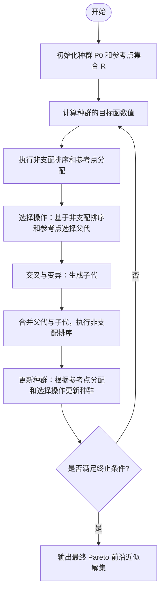

# 非支配遗传算法三代（NSGA Ⅲ）

**NSGA-III（Non-dominated Sorting Genetic Algorithm III）** 是 Deb 等人在 2014 年提出的多目标进化算法。  
它是在 NSGA-II 的基础上引入了 **参考点的概念**，以改进算法在**高维多目标优化问题中的表现**，特别是当目标数较大时，NSGA-III 能更好地处理解的分布和收敛问题。

---

## 算法流程图



## 一、算法原理与核心机制

### 1. 多目标优化问题与Pareto前沿

多目标优化问题一般形式为：

$$
\min_{x \in \Omega} F(x) = [f_1(x), f_2(x), \dots, f_M(x)]
$$

其中 $x$ 是决策变量，$F(x)$ 是目标函数的值，$M$ 为目标数。

**Pareto 最优解集**由一组解组成，这些解在每个目标上都是不可被其他解所支配的。

NSGA-III 的目标是通过**非支配排序**和**参考点引导**的方式，来优化多目标问题的解集，使其在高维目标空间内分布均匀且尽可能靠近 Pareto 前沿。

---

### 2. 核心机制：参考点引导

#### （1）参考点的定义

参考点是一个 **在目标空间中用于引导解分布的概念**。NSGA-III 通过在目标空间中均匀布置一组参考点，来为每个解分配一个参考点，从而保持解集在 Pareto 前沿上的均匀分布。

- 参考点 $\mathbf{r} = (r_1, r_2, \dots, r_M)$ 满足：  
  $$ 
  0 \le r_m \le 1, \quad \sum_{m=1}^M r_m = 1
  $$

#### （2）如何生成参考点？

参考点的生成通常基于 **均匀网格划分**，尤其是在高维目标空间时：

- 对于 $M$ 维目标，参考点通常在一个 **标准化的单位超立方体**内生成。
- 使用均匀网格划分单位超立方体，使得每个参考点代表目标空间的一个方向。
  
这种生成方式的优点是能够确保参考点在整个目标空间内均匀分布，避免解集被某些目标过度吸引。

#### （3）参考点分配与选择

在 NSGA-III 中，每个解都会与一个参考点进行匹配。通过计算每个解与参考点之间的 **距离**，NSGA-III 根据以下准则选择解：

- 每个解的目标是**最小化到最近参考点的距离**，而非单纯的目标函数值。
  
这种方式避免了传统方法中可能出现的聚集问题，确保解集在高维空间内**均匀分布**。

---

### 3. 非支配排序与拥挤度计算

#### （1）非支配排序

NSGA-III 中的非支配排序与 **NSGA-II** 类似，但不同之处在于，当有多个解具有相同非支配等级时，NSGA-III 使用参考点来决定它们的优先级：

- **第一层**：所有解的非支配排序是通过参考点与解的距离来决定的。
- **第二层**：如果某一层内有多个解，它们会被进一步排序，以保证解集在整个前沿上的均匀分布。

#### （2）拥挤度计算

在高维目标空间中，NSGA-III **不使用传统的拥挤度计算方法**（如 NSGA-II 中的拥挤距离），而是依赖于参考点的分配和选择来维持种群的多样性。

- 通过参考点与解的距离来调整种群的分布，从而保证解集在目标空间中的均匀性。

---

### 4. 核心机制：交叉与变异操作

NSGA-III 在 **交叉与变异**操作方面与 NSGA-II 保持一致：

- **交叉操作**：常用的交叉算子包括模拟二进制交叉（SBX）等。
- **变异操作**：采用多项式变异操作，以增强解的局部搜索能力。

这些操作与非支配排序、参考点引导机制结合，共同实现高效的多目标优化。

---

## 二、完整算法流程（NSGA-III）

1. **初始化种群与参考点**：  
   初始化种群 $P_0$ 和参考点集合 $\mathcal{R}$，生成均匀分布的参考点。

2. **计算种群的目标函数值**：  
   对于每个个体，计算其目标函数值 $F(x)$。

3. **非支配排序与参考点分配**：  
   根据参考点与个体的距离进行非支配排序，并通过参考点分配个体。

4. **选择操作**：  
   从当前种群和父代种群中选取个体，按照非支配等级和参考点距离进行选择。

5. **交叉与变异**：  
   对父代个体进行交叉和变异，生成新的子代。

6. **更新种群**：  
   合并父代和子代，执行非支配排序，并根据参考点分配和选择操作更新种群。

7. **终止判断**：  
   若满足最大代数或收敛条件，算法终止。

8. **输出结果**：  
   输出最终的 Pareto 最优解集。

---

## 三、参数设置建议

| 参数 | 含义 | 推荐值 | 说明 |
|------|------|--------|------|
| $N$  | 种群规模 | 100～300 | 影响算法的精度与计算量 |
| $M$  | 目标数 | 3～10 | 目标数较高时，需要更多参考点 |
| $P_c$ | 交叉概率 | 0.9 | 提升全局搜索能力 |
| $P_m$ | 变异概率 | 0.1 | 提高局部搜索能力 |
| $r$  | 参考点数 | $N$ | 参考点数通常与种群大小相同 |
| $t_{\max}$ | 最大代数 | 100～500 | 根据问题复杂度设置 |

---

## 四、算法实现（ZDT1 示例）

```python
import numpy as np
import random

# ========== 测试函数 (以 ZDT1 为例) ==========  
def evaluate(pop):
    # pop: 数组 shape=(N, dim)
    f1 = pop[:, 0]
    g = 1 + 9 * np.mean(pop[:, 1:], axis=1)
    f2 = g * (1 - np.sqrt(f1 / g))
    return np.vstack((f1, f2)).T  # shape = (N, 2)

# ========== NSGA-III 主函数 ==========  
def nsga3(dim=30, pop_size=100, max_gen=200):
    # 初始化种群
    pop = np.random.rand(pop_size, dim)
    archive = np.empty((0, dim))  # 用于存储 Pareto 解集
    reference_points = generate_reference_points(pop_size, dim)
    
    for gen in range(max_gen):
        # 计算目标函数值
        fitness = evaluate(pop)
        
        # 执行非支配排序与参考点分配
        fronts, assignments = non_dominated_sorting(fitness, reference_points)
        
        # 选择、交叉、变异生成新种群
        parents = select_parents(fronts)
        offspring = crossover_and_mutate(parents)
        
        # 合并父代和子代，更新种群
        pop = update_population(offspring, fronts, reference_points)
        
        # 输出进度
        if gen % 50 == 0:
            print(f"Generation {gen}, Pareto front size = {len(archive)}")
    
    return fitness, archive

# ========== 辅助函数 ==========  
def generate_reference_points(pop_size, dim):
    # 生成参考点
    return np.random.rand(pop_size, dim)

# 其他辅助函数：non_dominated_sorting, select_parents, crossover_and_mutate, update_population等
```

## 五、总结与思考

NSGA-III 在 NSGA-II 的基础上通过 参考点引导优化了种群的多样性管理，尤其在处理 高维多目标问题时，具有显著的优势。

### 1. 核心特点

参考点引导：保证解集在目标空间中均匀分布。
非支配排序：通过参考点距离来选择解的优先级，改善高维空间的表现。


### 2. 优缺点

优点：

- 适合高维多目标优化问题。
- 参考点方法确保了解的均匀分布。

缺点：

- 参考点的生成和分配可能会增加计算负担。
- 算法在某些情况下对参考点数量较为敏感。

### 3. 改进方向

- 动态参考点生成：使参考点数量根据目标空间的复杂度自适应调整。
- 结合机器学习：使用机器学习方法优化参考点的选择策略。

### 4. 小结

NSGA-III 是高维多目标优化的优秀选择，通过引入 参考点引导，成功解决了高维优化中常见的解分布不均和收敛困难的问题。
