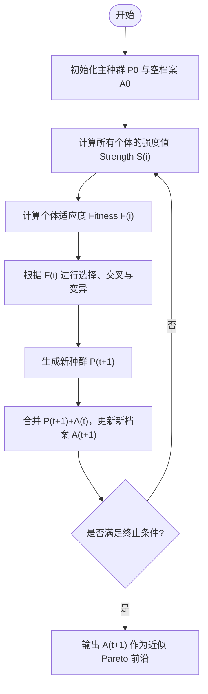

# 强化帕累托进化算法二代（SPEA2）

**SPEA2（Strength Pareto Evolutionary Algorithm 2）** 是 Zitzler、Laumanns 和 Thiele 于 2001 年提出的多目标进化算法。
它在 SPEA 的基础上改进了 适应度计算、外部精英集管理和密度估计机制，以更好地保持种群的多样性和收敛性。

## 算法流程图



## 一、算法原理与核心机制

### 1. 问题设定与基本符号

多目标优化问题定义为：

$$
\min_{x\in\Omega} F(x) = [f_1(x), f_2(x), ..., f_M(x)]
$$

其中 $\Omega$ 为可行解空间。

- **支配关系（Pareto Dominance）**：  
  $u \prec v \iff \forall m, u_m \le v_m \text{ 且 } \exists m, u_m < v_m$  
  即 $u$ 在所有目标上不差于 $v$，且至少在一个目标上更优。

每一代算法包含两个集合：
- **主种群** $P_t$：当前正在进化的候选解；
- **外部精英档案** $A_t$：存储最优的非支配解。

评估与选择都在其并集 $U_t = P_t \cup A_t$ 上进行。

---

### 2. 核心机制一：精细化适应度分配

SPEA2 的适应度机制包含三层：**强度 (Strength)** → **原始适应度 (Raw)** → **综合适应度 (Final)**。

#### （1）强度值 $S(i)$ —— “我能压多少人”

对每个个体 $i \in U_t$：

$$
S(i) = \big|\{ j \in U_t \mid F(i) \prec F(j) \}\big|
$$

即 $i$ 所支配的个体数量。  
越大表示该个体越强。

---

#### （2）原始适应度 $R(i)$ —— “我被多少强者压”

$$
R(i) = \sum_{j \in U_t, F(j) \prec F(i)} S(j)
$$

即所有支配 $i$ 的个体的强度值之和。  
越小越好，$R(i) = 0$ 表示 $i$ 不被任何个体支配。

---

#### （3）密度估计 $D(i)$ —— “我周围有多挤”

为保持多样性，SPEA2 使用 **K 近邻密度估计**：

- 计算每个个体在目标空间的欧氏距离；
- 找到第 $k$ 近邻距离 $\sigma_i^k$；
- 定义密度项：

$$
D(i) = \frac{1}{\sigma_i^k + 2}
$$

其中 "+2" 是防止 $\sigma_i^k \to 0$ 时数值发散的平移项。

若 $\sigma_i^k$ 小（即个体密集），则 $D(i)$ 大，从而惩罚拥挤区域。

---

#### （4）综合适应度 $F(i)$

$$
\boxed{F(i) = R(i) + D(i)}
$$

- **收敛性** 由 $R(i)$ 控制；
- **多样性** 由 $D(i)$ 控制；
- 最优个体应使 $F(i)$ 最小。

---

### 3. 核心机制二：精英档案管理（环境选择）

SPEA2 通过独立的精英档案实现稳定的**收敛性**与**多样性**。

#### （1）候选集合
合并主种群与档案：
$$
U_t = P_t \cup A_t
$$
在其上计算所有 $S(i), R(i), D(i), F(i)$。

---

#### （2）筛选规则

1. 提取非支配解集 $\mathcal{N}$；
2. 若 $|\mathcal{N}| < N_A$，按 $F(i)$ 升序补足至 $N_A$；
3. 若 $|\mathcal{N}| = N_A$，直接作为新档案；
4. 若 $|\mathcal{N}| > N_A$，执行 **密度截断 (Truncation)**。

---

#### （3）密度截断算法

当非支配解数量过多时，通过成对距离删除最拥挤的解。

伪代码如下：

```python
while len(N) > N_A:
    # 1. 计算距离矩阵（归一化目标空间）
    dist = pairwise_distance(N)
    # 2. 找到最小成对距离
    i, j = argmin(dist)
    # 3. 删除拥挤个体（依据字典序比较各行距离向量）
    remove(min(i, j))
```

该机制比 NSGA-II 的“拥挤距离”更全局，能有效均匀分布解集。

---

#### （4）主种群更新

下一代父代从新档案中以基于 $F(i)$ 的锦标赛选择方式产生，
并通过交叉、变异生成新一代 $P_{t+1}$。

---

### 4. 核心机制三：交配选择（Mating Selection）

- 使用基于综合适应度 $F(i)$ 的 **二元锦标赛选择**；
- 当个体 $F(i)$ 相近时，可用距离或随机策略打破平局；
- 保证既有收敛压力，又不丧失种群多样性。

### 5. 复杂度与工程实现

| 步骤     | 复杂度       | 说明         |
| ------ | --------- | ---------- |
| 支配关系计算 | $O(MN^2)$ | 常用向量化或并行计算 |
| 距离矩阵计算 | $O(MN^2)$ | 建议先对目标归一化  |
| 截断操作   | $O(N^2)$  | 迭代删除最拥挤个体  |

### 6. SPEA2 与 NSGA-II 的机制差异

| 特性    | NSGA-II    | SPEA2         |
| ----- | ---------- | ------------- |
| 收敛性度量 | 非支配等级 rank | 支配强度 + 原始适应度  |
| 多样性度量 | 拥挤距离       | KNN 密度 + 成对截断 |
| 精英策略  | 合并再筛选      | 独立档案，密度优先删    |
| 适应度类型 | 离散层级       | 连续加权          |
| 表现特点  | 简洁快速       | 分布更均匀但计算较重    |

## 二、完整算法流程（带精英档案）

SPEA2 的完整执行步骤如下：

1. **初始化种群**：  
   随机生成 $N$ 个体作为初始种群 $P^{(0)}$，并建立空档案 $A^{(0)}=\emptyset$。  
   设定参数：档案规模 $N_A$、交叉概率 $P_c$、变异概率 $P_m$、近邻参数 $k$ 等。

2. **计算目标函数**：  
   对每个个体 $x_i$ 计算 $F_i=[f_1(x_i),f_2(x_i),...,f_M(x_i)]$。

3. **适应度计算**（在合并集 $U_t = P_t \cup A_t$ 上）：  
   - **强度值**： $S(i)=|\{j|F(i)\prec F(j)\}|$  
   - **原始适应度**： $R(i)=\sum_{j, F(j)\prec F(i)} S(j)$  
   - **密度项**： $D(i)=1/(\sigma_i^k+2)$，其中 $\sigma_i^k$ 为第 $k$ 近邻距离  
   - **综合适应度**： $F(i)=R(i)+D(i)$  

4. **环境选择（更新档案）**：  
   合并 $P_t$ 与 $A_t$，提取非支配集 $\mathcal{N}$；  
   若 $|\mathcal{N}|>N_A$，按 K 近邻距离删除最拥挤个体；  
   若 $|\mathcal{N}|<N_A$，按 $F(i)$ 最小补足；  
   得到新档案 $A^{(t+1)}$。

5. **交配选择**：  
   从档案 $A^{(t+1)}$ 中基于 $F(i)$ 进行二元锦标赛选择，选出父代。

6. **交叉与变异**：  
   对父代应用模拟二进制交叉（SBX）与多项式变异，生成新子代 $P^{(t+1)}$。

7. **目标计算与档案更新**：  
   计算 $P^{(t+1)}$ 的目标函数值，并与 $A^{(t+1)}$ 合并，重复适应度计算与环境选择。

8. **终止判断**：  
   若达到最大迭代次数或满足收敛条件，  
   输出当前档案 $A^{(t)}$ 作为近似的 **Pareto 最优前沿**。

---

> **说明**  
> SPEA2 在每一代同时利用主种群与精英档案参与评价，  
> 通过“强度 + 密度”复合适应度实现收敛与多样性平衡。

## 三、参数设置建议

| 参数 | 含义 | 推荐取值或范围 | 说明 |
|------|------|----------------|------|
| $N$ | 主种群规模 | 50 ～ 200 | 影响搜索精度与计算量 |
| $N_A$ | 精英档案大小 | $N/2$ 或 50 | 保持收敛与多样性平衡 |
| $P_c$ | 交叉概率 | 0.8 ～ 0.9 | 控制全局搜索能力 |
| $P_m$ | 变异概率 | 0.05 ～ 0.2 | 防止过早收敛，增强局部搜索 |
| $k$ | K 近邻参数 | 1 或 $\sqrt{N}$ | 控制密度估计的平滑度 |
| $t_{\max}$ | 最大迭代次数 | 100 ～ 500 | 取决于问题复杂度 |
| 编码方式 | 个体表示形式 | 实数编码 | 常用于连续优化问题 |
| 交叉算子 | 模拟二进制交叉（SBX） | — | 生成连续型新解 |
| 变异算子 | 多项式变异 | — | 保持解空间探索性 |

---

> **提示：**  
> 档案规模不宜过小，否则损失多样性；  
> $k$ 值过大则密度估计失真，过小可能引起过强局部竞争。


## 四、算法实现（ZDT1 示例）

::: code-tabs#MOGA

@tab Python

```python
import numpy as np
import random

# ========== 测试函数 (以 ZDT1 为例) ==========
def evaluate(pop):
    # pop: 数组 shape=(N, dim)
    f1 = pop[:, 0]
    g = 1 + 9 * np.mean(pop[:, 1:], axis=1)
    f2 = g * (1 - np.sqrt(f1 / g))
    return np.vstack((f1, f2)).T  # shape = (N, 2)

def dominates(a, b):
    """判断 a 是否支配 b（目标皆最小化）"""
    return np.all(a <= b) and np.any(a < b)

# ========== SPEA2 主函数 ==========
def spea2(dim=30,
          pop_size=100,
          archive_size=50,
          max_gen=200,
          crossover_prob=0.9,
          mutation_prob=0.1,
          k=1):
    # 初始化主种群
    pop = np.random.rand(pop_size, dim)
    archive = np.empty((0, dim))
    
    for gen in range(max_gen):
        # 合并主种群与档案
        union = np.vstack((pop, archive))
        fitness = evaluate(union)
        N = len(union)
        
        # 强度 S(i)
        S = np.zeros(N, dtype=int)
        for i in range(N):
            for j in range(N):
                if dominates(fitness[i], fitness[j]):
                    S[i] += 1
        
        # 原始适应度 R(i)
        R = np.zeros(N, dtype=int)
        for i in range(N):
            for j in range(N):
                if dominates(fitness[j], fitness[i]):
                    R[i] += S[j]
        
        # 距离矩阵与密度估计 D(i)
        dist = np.linalg.norm(fitness[:, None, :] - fitness[None, :, :], axis=2)
        np.fill_diagonal(dist, np.inf)  # 自己到自己的距离设为无穷
        sorted_dist = np.sort(dist, axis=1)
        sigma_k = sorted_dist[:, k]
        D = 1.0 / (sigma_k + 2.0)
        
        # 综合适应度 F(i)
        F = R + D
        
        # ========== 环境选择：更新档案 ==========
        # 将 union 按 F 从小到大排序，先选择非支配解，再按 F 补足／截断至 archive_size
        # 首先提取非支配集
        nondominated_idx = []
        for i in range(N):
            dominated = False
            for j in range(N):
                if dominates(fitness[j], fitness[i]):
                    dominated = True
                    break
            if not dominated:
                nondominated_idx.append(i)
        
        # 构建新档案候选
        if len(nondominated_idx) < archive_size:
            # 补足
            # 先选所有非支配解
            sel = nondominated_idx.copy()
            # 再按 F 升序选取其余
            remaining_idx = list(set(range(N)) - set(sel))
            remaining_idx.sort(key=lambda i: F[i])
            sel.extend(remaining_idx[:(archive_size - len(sel))])
        elif len(nondominated_idx) == archive_size:
            sel = nondominated_idx.copy()
        else:
            # 超过：需要截断 — 删除“拥挤”个体
            sel = nondominated_idx.copy()
            # 计算子集 fitness_sel、distance 子矩阵
            while len(sel) > archive_size:
                # 重建距离子矩阵
                sub_fit = fitness[sel]
                sub_N = len(sel)
                sub_dist = np.linalg.norm(sub_fit[:, None, :] - sub_fit[None, :, :], axis=2)
                np.fill_diagonal(sub_dist, np.inf)
                # 找最小距离对（i,j）
                minval = np.min(sub_dist)
                # 找对应索引
                i_min, j_min = np.unravel_index(np.argmin(sub_dist), sub_dist.shape)
                # 哪个个体更“拥挤”删除？通常选距离向量更小者
                # 简化：删除 i_min
                del sel[i_min]
            # sel 最终为 archive_size 个体
        archive = union[sel]
        fitness_archive = fitness[sel]
        
        # ========== 交配选择 ==========
        # 采用二元锦标赛，候选池为 archive
        parents = []
        for _ in range(pop_size):
            i1, i2 = random.sample(range(len(archive)), 2)
            if F[sel[i1]] < F[sel[i2]]:
                parents.append(archive[i1].copy())
            else:
                parents.append(archive[i2].copy())
        parents = np.array(parents)
        
        # ========== 交叉与变异（简化形式） ==========
        # 对每对父代执行交叉、变异生成子代 pop
        new_pop = []
        for i in range(0, pop_size, 2):
            p1 = parents[i]
            p2 = parents[(i+1) % pop_size]
            # 交叉
            if random.random() < crossover_prob:
                # 简化：均匀交叉
                alpha = random.random()
                c1 = alpha * p1 + (1-alpha) * p2
                c2 = alpha * p2 + (1-alpha) * p1
            else:
                c1, c2 = p1.copy(), p2.copy()
            # 变异
            for c in [c1, c2]:
                if random.random() < mutation_prob:
                    idx = random.randrange(dim)
                    c[idx] = random.random()
                new_pop.append(c)
        # 保证新种群大小为 pop_size
        pop = np.array(new_pop[:pop_size])
        
        # 可选：打印进度
        if gen % 50 == 0:
            print(f"Generation {gen}, Archive size = {len(archive)}")
    
    # 输出结果
    print("Final Pareto-approx archive size:", len(archive))
    return fitness_archive, archive

# ========== 主程序 ==========
if __name__ == "__main__":
    fitness_archive, archive = spea2()
    # 打印部分结果
    for f in fitness_archive[:10]:
        print(f)
```

@tab MATLAB

```matlab
function SPEA2_main()
    % ============================================================
    %   Strength Pareto Evolutionary Algorithm 2 (SPEA2)
    %   经典实现示例 —— ZDT1 测试问题
    %   作者：Zitzler, Laumanns, Thiele (2001)
    % ============================================================

    % ========== 参数设置 ==========
    N = 100;          % 主种群规模
    N_A = 50;         % 精英档案规模
    MaxGen = 200;     % 最大迭代次数
    Dim = 30;         % 决策变量维数
    k = 1;            % 近邻参数（用于密度估计）
    Pc = 0.9;         % 交叉概率
    Pm = 0.1;         % 变异概率

    % ========== 初始化 ==========
    P = rand(N, Dim); % 主种群
    A = [];           % 档案为空

    % ========== 迭代进化 ==========
    for gen = 1:MaxGen
        % 合并主种群与档案
        U = [P; A];
        Obj = evaluate(U); % 计算目标函数
        NumU = size(U,1);

        % ========== (1) 计算强度值 S(i) ==========
        S = zeros(NumU,1);
        for i = 1:NumU
            for j = 1:NumU
                if dominates(Obj(i,:), Obj(j,:))
                    S(i) = S(i) + 1;
                end
            end
        end

        % ========== (2) 计算原始适应度 R(i) ==========
        R = zeros(NumU,1);
        for i = 1:NumU
            for j = 1:NumU
                if dominates(Obj(j,:), Obj(i,:))
                    R(i) = R(i) + S(j);
                end
            end
        end

        % ========== (3) 计算密度项 D(i) ==========
        dist = pdist2(Obj, Obj);
        dist(1:NumU+1:end) = inf;    % 对角线设为无穷
        sortedDist = sort(dist, 2);
        sigma_k = sortedDist(:, k);
        Dval = 1 ./ (sigma_k + 2);

        % ========== (4) 综合适应度 ==========
        Fit = R + Dval;

        % ========== (5) 环境选择（更新档案） ==========
        % 提取非支配解
        NonDom = [];
        for i = 1:NumU
            dominatedFlag = false;
            for j = 1:NumU
                if dominates(Obj(j,:), Obj(i,:))
                    dominatedFlag = true; break;
                end
            end
            if ~dominatedFlag
                NonDom = [NonDom; i];
            end
        end

        if length(NonDom) < N_A
            % 补足
            [~, idx] = sort(Fit);
            A_idx = unique([NonDom; idx(1:N_A-length(NonDom))]);
        elseif length(NonDom) == N_A
            A_idx = NonDom;
        else
            % 截断操作：密度删除
            A_idx = NonDom;
            while length(A_idx) > N_A
                subObj = Obj(A_idx, :);
                subDist = pdist2(subObj, subObj);
                subDist(1:length(subDist)+1:end) = inf;
                [~, ind] = min(subDist(:));
                [row, ~] = ind2sub(size(subDist), ind);
                A_idx(row) = []; % 删除最拥挤个体
            end
        end

        % 更新档案
        A = U(A_idx, :);
        ObjA = Obj(A_idx, :);

        % ========== (6) 交配选择 ==========
        % 二元锦标赛选择
        Parents = zeros(N, Dim);
        for i = 1:N
            i1 = randi(size(A,1));
            i2 = randi(size(A,1));
            if Fit(A_idx(i1)) < Fit(A_idx(i2))
                Parents(i,:) = A(i1,:);
            else
                Parents(i,:) = A(i2,:);
            end
        end

        % ========== (7) 交叉与变异 ==========
        Offspring = zeros(N, Dim);
        for i = 1:2:N
            p1 = Parents(i,:);
            p2 = Parents(mod(i,N)+1,:);
            % 模拟二进制交叉 (SBX)
            if rand < Pc
                beta = rand;
                c1 = 0.5*((1+beta)*p1 + (1-beta)*p2);
                c2 = 0.5*((1-beta)*p1 + (1+beta)*p2);
            else
                c1 = p1; c2 = p2;
            end
            % 多项式变异
            for c = [1 2]
                if rand < Pm
                    idx = randi(Dim);
                    if c==1, c1(idx)=rand; else, c2(idx)=rand; end
                end
            end
            Offspring(i,:) = c1;
            if i+1<=N, Offspring(i+1,:) = c2; end
        end

        % ========== (8) 新种群 ==========
        P = Offspring;

        % 可视化当前档案（可选）
        if mod(gen, 50)==0
            scatter(ObjA(:,1), ObjA(:,2), 25, 'filled');
            title(['Generation ', num2str(gen)]);
            xlabel('f1'); ylabel('f2');
            drawnow;
        end
    end

    % ========== 输出结果 ==========
    figure;
    scatter(ObjA(:,1), ObjA(:,2), 40, 'filled');
    title('Final Pareto Front (ZDT1, SPEA2)');
    xlabel('f_1'); ylabel('f_2');
end

% ======== ZDT1 目标函数 ========
function f = evaluate(pop)
    f1 = pop(:,1);
    g = 1 + 9*mean(pop(:,2:end),2);
    f2 = g .* (1 - sqrt(f1 ./ g));
    f = [f1, f2];
end

% ======== 支配关系判断函数 ========
function flag = dominates(a,b)
    flag = all(a <= b) && any(a < b);
end
```

:::

---

## 五、总结与思考

SPEA2 是第二代多目标进化算法的代表，通过 **强度评价 + 密度估计 + 精英档案** 实现了收敛性与多样性的统一。

---

### 1. 核心特点
- 以支配强度衡量竞争力，适应度连续而稳定；  
- 基于 K 近邻的密度保持种群分布均匀；  
- 独立精英档案确保非支配解不丢失。

---

### 2. 优缺点
**优点：**  
- 收敛性好，前沿分布均匀；  
- 档案机制稳健、易扩展。  

**缺点：**  
- 计算复杂度较高 ($O(N^2)$)；  
- 在高维多目标下效果下降；  
- 对参数略敏感。

---

### 3. 改进方向
- 引入 **SDE 密度估计** 提升高维性能；  
- 结合 **参考点或偏好引导** 改善目标聚焦；  
- 使用 **并行计算** 加速支配与距离计算。

---

### 4. 小结
SPEA2 以“**强度衡量竞争，密度保持多样**”为核心思想，  
在多目标优化中兼顾了精英性与分布性，  
是理解和研究现代多目标进化算法的重要基础。

