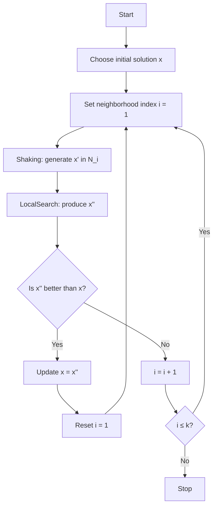

# 可变邻域搜索 (VNS) 

## 1. 概念简介
**VNS（Variable Neighborhood Search，可变邻域搜索）** 是一种元启发式算法，通过系统性地改变邻域结构来摆脱局部最优，从而找到更优解。

它依赖两个核心观察：

1. **局部最优依赖邻域定义**：不同邻域下的局部最优不同。
2. **全局最优往往在某个邻域中是局部最优**：系统探索多个邻域有助于发现全局更优解。

---

## 2. 算法思想与框架

### 2.1 核心步骤
1. **扰动（Shaking）**：从当前邻域中随机产生新解以跳出局部最优。
2. **局部搜索（Local Search）**：对扰动后的解进行优化。
3. **邻域切换（Neighborhood Change）**：
   - 若找到更优解 → 回到最小邻域  
   - 否则 → 进入下一个更大的邻域

### 2.2 基本框架伪代码
```text
Repeat until stop condition:
    i = 1
    while i ≤ k:
        x' = Shaking(x, N_i)
        x'' = LocalSearch(x')
        if f(x'') < f(x):
            x = x''
            i = 1
        else:
            i = i + 1
```

## 3. 邻域设计（VNS 的关键）

邻域（Neighborhood）的选择与组织是 VNS 成败的核心。  
好的邻域结构应满足：

- 便于搜索（可枚举或可随机生成）
- 能有效跳出局部最优
- 复杂度与解质量之间取得平衡

### 3.1 基于规模的邻域（常用于路径类问题）
- **2-opt**：交换路径中两段的连接方式  
- **Or-opt**：移动连续 1～3 个节点到新位置  
- **3-opt**：移除三条边并重新连接  

示例邻域序列：

$N_1 = \text{2-opt},\; N_2 = \text{Or-opt},\; N_3 = \text{3-opt}$

### 3.2 基于扰动强度的邻域
- 小扰动：交换两个元素  
- 中扰动：交换多个位置  
- 大扰动：部分随机重构  

用于逐步打破局部最优结构。

### 3.3 基于结构变化的邻域（用于聚类/分区）
- 移动一个对象到其他子集  
- 移动两个对象  
- 合并或拆分簇  
- 随机重划分  

这些邻域更强调结构形态变化。

### 3.4 邻域多样化策略
- **同构邻域**：相同操作但规模递增  
- **异构邻域**：完全不同类型的操作  
- **问题特定邻域**：结合业务逻辑的专用操作  

---

## 4. VNS 的主要变体

### 4.1 BVNS（Basic VNS）
标准的 VNS 框架，最常见的基线版本。

### 4.2 RVNS（Random VNS）
只执行扰动，不执行局部搜索：

- 优点：速度快  
- 缺点：解质量一般  

适用于极大规模问题的粗略探索。

### 4.3 GVNS（Generalized VNS）
最强的增强型 VNS，包括：

- Shaking（扰动）
- VND（Variable Neighborhood Descent，多邻域下降）
- 邻域递增策略

通常是 VNS 在工业应用中的主力版本。

### 4.4 Skewed VNS
允许接受略差的解（类似模拟退火）帮助跳出“陷阱式”局部最优。

### 4.5 Parallel VNS
多个邻域/多个初始解并行搜索，适合多核与分布式环境。

---

## 5. 优点与缺点

### 5.1 优点
- **结构简单**：相比 GA/SA 参数极少  
- **跳出局部最优能力强**：多邻域策略天然具备探索性  
- **高度可组合**：能与 TS、SA、GA 任意结合  
- **适应性强**：几乎适用于所有 NP-hard 问题  

### 5.2 缺点
- **邻域设计需要经验**：设计不佳会影响效果  
- **局部搜索开销较大**：尤其是复杂邻域下  

---

## 6. 应用场景

### 6.1 车辆路径规划（VRP）
常用邻域：
- relocate  
- swap  
- 2-opt  
- Or-opt  

可有效减少路线总长度并提升运行效率。

### 6.2 排班与调度（Scheduling）
可应用于：
- Job Shop  
- Flow Shop  
- Open Shop  

邻域如：
- 工件交换  
- 块移动  
- 区段重排  

### 6.3 旅行商问题（TSP）
典型邻域组合：
- 2-opt → Or-opt → 3-opt  

随着邻域增强跳出局部最优。

### 6.4 其他组合优化（NP-hard）
- 背包问题（Knapsack）  
- 最大割（Max-Cut）  
- SAT  
- 网络设计与布线  

VNS 为这些问题提供了高效且鲁棒的近似最优解。

---

## 7. TSP 示例（邻域序列）

### 7.1 邻域设置
- $N_1$: 2-opt  
- $N_2$: Or-opt  
- $N_3$: 3-opt  

### 7.2 搜索流程
1. 从 2-opt 找到局部最优  
2. 用 Or-opt 扰动跳出局部模式  
3. 用 3-opt 找到更优路线  
4. 若解被改进 → 回到 $N_1$  
5. 否则继续扩大邻域  

这种策略通过“逐级升级扰动”有效避免陷入局部最优。

---

## 8. Mermaid 流程图（VNS 主流程）


---

## 9. 总结

VNS 通过“系统改变邻域”机制获得强大的全局搜索能力：

- 多邻域组合 → 跳出局部最优
- 局部搜索增强 → 提升解质量
- 扰动强度逐渐增强 → 保证搜索的全面性

它是现代优化算法中结构最清晰、扩展性最高的元启发式之一，广泛用于工业与学术领域。
