# 分布式异构混合流水车间调度问题（DHFS）

## 一、问题描述

在智能制造与绿色生产的背景下，制造企业通常分布在不同的地理区域。为了实现多工厂协同生产与能源优化，提出了**分布式异构混合流水车间调度问题（Distributed Heterogeneous Hybrid Flow Shop Scheduling, DHFS）**。  
该问题综合考虑**多工厂协作、异构机器、能耗优化与多目标决策**，是对传统混合流水车间调度（Hybrid Flow Shop Scheduling, HFS）问题的拓展。

在 DHFS 问题中：
- 存在多个地理分散的工厂，每个工厂包含多个加工阶段；
- 每个阶段拥有若干台性能不同的并行机器；
- 每个工件需经过所有阶段加工，且加工顺序固定；
- 需要确定：
  1. 每个工件分配到哪个工厂；
  2. 每个阶段使用哪台机器；
  3. 工件在每台机器上的加工顺序；
- 目标是**同时最小化最大完工时间（Makespan）和总能耗（Total Energy Consumption, TEC）**。

由于工厂、机器和工序间存在复杂的耦合关系，该问题属于**多目标组合优化问题（NP-hard）**。  
通常采用启发式与智能优化算法（如模因算法、分布估计算法、强化学习等）进行求解。

---

## 二、符号定义

| 类型 | 符号 | 含义 |
|------|------|------|
| 集合 | $F = \{1,2,\dots,f_{max}\}$ | 工厂集合 |
|  | $K = \{1,2,\dots,m\}$ | 加工阶段集合 |
|  | $M_{f,k} = \{1,2,\dots,m_{f,k}\}$ | 工厂 $f$ 在阶段 $k$ 的机器集合 |
|  | $J = \{1,2,\dots,n\}$ | 工件集合 |
| 参数 | $p_{j,k}$ | 工件 $j$ 在阶段 $k$ 的标准加工时间 |
|  | $v_{f,k,i}$ | 工厂 $f$、阶段 $k$、机器 $i$ 的加工速度因子 |
|  | $PP_{f,k,i}$ | 机器加工功率（Processing Power）|
|  | $SP_{f,k,i}$ | 机器空闲功率（Standby Power）|
|  | $U$ | 足够大的常数，用于线性化逻辑约束 |
| 决策变量 | $x_{f,j} \in \{0,1\}$ | 工件 $j$ 是否分配到工厂 $f$ |
|  | $y_{f,k,j,i} \in \{0,1\}$ | 工件 $j$ 是否分配给工厂 $f$ 的阶段 $k$ 上机器 $i$ |
|  | $z_{f,k,j,j'} \in \{0,1\}$ | 在工厂 $f$、阶段 $k$ 上，工件 $j$ 是否在 $j'$ 之前加工 |
|  | $S_{j,k}$ | 工件 $j$ 在阶段 $k$ 的开始时间 |
|  | $C_{j,k}$ | 工件 $j$ 在阶段 $k$ 的完成时间 |
|  | $C_{max}$ | 所有工件的最大完工时间 |
|  | $TEC$ | 总能耗（Total Energy Consumption）|

---

## 三、目标函数

### (1) 最小化最大完工时间
$$
\min F_1 = C_{max}
$$

### (2) 最小化总能耗
总能耗包括加工能耗（Processing Energy Consumption, PEC）与空闲能耗（Standby Energy Consumption, SEC）：
$$
\min F_2 = TEC = 
\sum_{f\in F}\sum_{k\in K}\sum_{i\in M_{f,k}}
\big( PEC_{f,k,i} + SEC_{f,k,i} \big)
$$

其中：
$$
PEC_{f,k,i} = \sum_{j\in J} y_{f,k,j,i} \cdot PP_{f,k,i} \cdot \frac{p_{j,k}}{v_{f,k,i}}
$$

$$
SEC_{f,k,i} = SP_{f,k,i} \cdot
\left[
\max_{j}(C_{j,k}y_{f,k,j,i}) -
\min_{j}(S_{j,k}y_{f,k,j,i})
-
\sum_{j} y_{f,k,j,i}\frac{p_{j,k}}{v_{f,k,i}}
\right]
$$

### (3) 多目标优化模型
$$
\min \; F(x) = (F_1, F_2) = (C_{max}, TEC)
$$

在实际求解中，可采用帕累托支配（Pareto Dominance）或加权分解方法（如 Tchebycheff 或 PBI）处理。

---

## 四、约束条件

### (1) 工件分配约束
$$
\sum_{f\in F} x_{f,j} = 1, \quad \forall j\in J
$$

### (2) 机器分配约束
$$
\sum_{i\in M_{f,k}} y_{f,k,j,i} = x_{f,j}, \quad \forall f,j,k
$$

### (3) 工序衔接约束
$$
S_{j,k+1} \ge C_{j,k}, \quad \forall j, k<m
$$

### (4) 加工时间定义
$$
C_{j,k} = S_{j,k} + 
\sum_{f}\sum_{i} y_{f,k,j,i}\frac{p_{j,k}}{v_{f,k,i}}
$$

### (5) 同机顺序约束
$$
S_{j',k} \ge C_{j,k} - U(1 - z_{f,k,j,j'} - y_{f,k,j,i} - y_{f,k,j',i}), \quad \forall j\neq j',f,k,i
$$
并且
$$
z_{f,k,j,j'} + z_{f,k,j',j} = 1, \quad \forall j\neq j'
$$

### (6) 最大完工时间定义
$$
C_{max} \ge C_{j,m}, \quad \forall j
$$

### (7) 非负性约束
$$
S_{j,k} \ge 0, \quad y_{f,k,j,i},x_{f,j},z_{f,k,j,j'} \in \{0,1\}
$$

---

## 五、模型扩展（可选）

### (1) 序列相关准备时间（SDST）
$$
S_{j',k} \ge C_{j,k} + setup_{k,j,j'}
$$

### (2) 批量流（Lot-Streaming）
$$
S_{j,l,k+1} \ge C_{j,l,k}, \quad l=1,\dots,L_j
$$

### (3) 加工速度控制（Speed Scaling）
$$
p_{j,k,i}(v) = \frac{p_{j,k}}{v_{f,k,i}}, \quad
E_{j,k,i}(v) = PP_{f,k,i} \cdot \frac{p_{j,k}}{v_{f,k,i}}
$$

---

## 六、问题性质与求解策略

- **问题类型**：多目标、组合优化、混合整数线性规划（MILP）  
- **复杂度**：NP-hard  
- **主要子问题**：
  1. 工厂分配（Factory Assignment）  
  2. 机器分配（Machine Selection）  
  3. 工序排序（Job Sequencing）  
  4. 能耗优化（Energy Optimization）

**典型求解方法：**
- 模因算法（Memetic Algorithm, MA）  
- 强化学习辅助模因算法（RLMA）  
- 分布估计算法（EDA）  
- 共进化与合作优化（Co-Evolutionary Algorithms）  
- 基于分解的多目标优化（MOEA/D, PBI）

---

## 七、算例与甘特图示例

下面展示一个简单的两工厂三工件两阶段调度示例：

| 工厂 | 阶段 | 机器 | 可加工工件 | 加工时间（单位：h） |
|------|------|-------|--------------|---------------------|
| F1 | Stage1 | M1 | J1, J2 | 3, 4 |
| F1 | Stage2 | M2 | J1, J3 | 2, 5 |
| F2 | Stage1 | M3 | J2, J3 | 4, 3 |
| F2 | Stage2 | M4 | J1, J2, J3 | 3, 2, 4 |

调度方案（假设部分分配如下）：

- 工厂 F1：加工 J1, J3  
- 工厂 F2：加工 J2  
- 加工顺序为 J1 → J3 在 F1，J2 在 F2 独立加工

### 甘特图（Mermaid）

```mermaid
gantt
    title 分布式混合流水车间调度示例
    dateFormat  HH:mm
    axisFormat  %H:%M
    section 工厂 F1
    J1-Stage1 :done, des1, 00:00, 03:00
    J1-Stage2 :done, des2, 03:00, 05:00
    J3-Stage1 :active, des3, 05:00, 08:00
    J3-Stage2 :active, des4, 08:00, 13:00

    section 工厂 F2
    J2-Stage1 :done, des5, 00:00, 04:00
    J2-Stage2 :done, des6, 04:00, 06:00
```

结果：

- $C_{max} = 13$
- 若能耗功率均为 $1,kW$，则 $TEC = 13,kWh$

## 八、强化学习辅助模因算法（RLMA）求解框架

说明：

- 全局搜索：通过交叉与变异生成新的解以保持多样性；
- 局部搜索：结合工厂负载、关键工序与能耗分布优化；
- 强化学习模块：自动学习哪种算子（插入、交换、迁移）在当前搜索阶段最有效；
- 能耗优化：基于设备状态动态调整机器速度，实现能效均衡；
- 非支配排序选择：根据帕累托支配与多样性指标筛选下一代。

## 九、优化目标总结

在保证生产效率的前提下，通过智能调度与能耗建模，实现多工厂协同生产的能效优化与绿色制造。