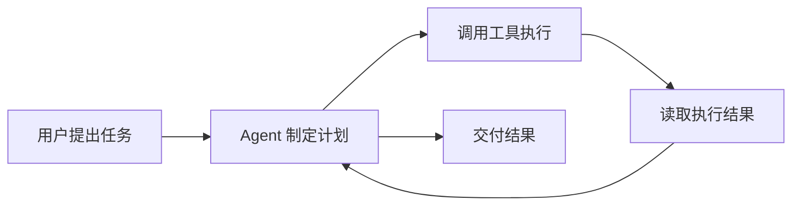

# 一文看懂主流 AI Agent 工具

Codex、Claude Code、Cursor、OpenClaw、Hermes 都被称为 Agent，但它们并不是同一类产品。

简单来说：

- **Codex、Claude Code**：在终端中编写和修改代码；
- **Cursor、Devin Desktop**：集成 Agent 的代码编辑器；
- **Devin、OpenHands**：可以独立处理开发任务的软件工程 Agent；
- **ChatGPT Agent、Manus**：处理网页、文档和办公任务；
- **OpenClaw、Hermes Agent**：长期运行的个人 AI 助手。

本文按照实际用途，对目前具有代表性的 Agent 工具进行分类。

> 产品信息核对时间为 2026 年 6 月 7 日。本文列举的是具有代表性的产品，不是严格的市场份额排名。

## 什么是 Agent

普通大模型主要负责理解和生成内容，而 Agent 还能够调用工具执行操作，例如：

- 读取和修改文件；
- 执行终端命令；
- 浏览网页；
- 运行测试；
- 操作邮件、文档和第三方服务；
- 根据执行结果继续调整计划。

因此，评价一个 Agent 不能只看它使用了什么模型，还要看它的工具、上下文、权限控制和执行环境。

## Agent 工具的主要分类

| 类型 | 代表工具 | 主要用途 |
| --- | --- | --- |
| 终端编程 Agent | Codex、Claude Code、Gemini CLI、Aider | 在终端中修改代码和执行命令 |
| Agent 编辑器 | Cursor、Devin Desktop、GitHub Copilot | 在 IDE 中完成代码编写与项目操作 |
| 软件工程 Agent | Devin、OpenHands | 独立处理 Issue、测试和 Pull Request |
| 通用工作 Agent | ChatGPT Agent、Claude Cowork、Manus | 处理网页、文件、表格和办公任务 |
| 常驻个人 Agent | OpenClaw、Hermes Agent | 长期运行，通过聊天软件或定时任务工作 |
| Agent 开发框架 | LangGraph、AutoGen、CrewAI | 开发自己的 Agent 应用 |

## 终端编程 Agent

### Codex

[Codex](https://openai.com/codex/) 是 OpenAI 推出的编程 Agent，目前覆盖 CLI、IDE、桌面端和云端任务。

它可以读取代码仓库、修改文件、运行命令、执行测试，并使用 MCP、Skills 和子 Agent。

适合：

- OpenAI 和 ChatGPT 用户；
- 喜欢终端开发；
- 需要同时处理多个编程任务；
- 需要本地与云端协作。

### Claude Code

[Claude Code](https://code.claude.com/docs/en/overview) 是 Anthropic 推出的终端编程 Agent。

它擅长理解大型代码仓库，可以修改代码、执行命令、操作 Git，并支持 MCP、Skills、Hooks 和子 Agent。

适合：

- Claude 用户；
- 复杂代码阅读与重构；
- 希望深度自定义 Agent 工作流；
- 以终端为主要开发环境的用户。

### Gemini CLI

[Gemini CLI](https://developers.google.com/gemini-code-assist/docs/gemini-cli) 是 Google 推出的开源终端 Agent，支持文件操作、终端命令和 MCP。

它更适合 Gemini 和 Google Cloud 用户。

### Aider

[Aider](https://aider.chat/docs/) 是轻量级终端编程工具，强调与 Git 配合，并支持多种模型供应商。

它适合希望接入国产模型、本地模型或自定义 API 的用户。

## Agent 编辑器

### Cursor

[Cursor](https://cursor.com/docs/agent/overview) 是目前较有代表性的 AI 代码编辑器。

它在编辑器中集成了：

- 代码补全；
- 项目索引；
- Agent 模式；
- 终端和浏览器工具；
- MCP 与 Skills；
- 本地和云端 Agent。

Cursor 的优点是安装后即可使用，适合不想花费太多时间配置环境的开发者。

### Devin Desktop

Devin Desktop 原名 Windsurf，是集编辑器、本地 Agent 和云端 Devin 于一体的开发环境。

它更强调同时管理本地与云端 Agent，而不只是代码补全。

### GitHub Copilot

[GitHub Copilot](https://docs.github.com/copilot) 已经从代码补全工具发展为完整的编程 Agent。

它支持 IDE Agent、命令行工具、代码审查和云端 Agent，适合代码主要托管在 GitHub 的个人或团队。

### Cline 与 Roo Code

[Cline](https://docs.cline.bot/cline-overview) 和 [Roo Code](https://docs.roocode.com/) 都是较受欢迎的开源 VS Code Agent。

它们支持多种模型供应商、MCP、终端和文件操作，适合：

- 接入国产模型；
- 使用本地模型；
- 自行控制 API 成本；
- 深度配置提示词和权限。

缺点是配置复杂度通常高于 Cursor。

## 软件工程 Agent

### Devin

[Devin](https://docs.devin.ai/get-started/devin-intro) 是面向完整软件工程任务的云端 Agent。

用户可以直接把 Issue、依赖升级、代码迁移或测试任务交给它，完成后检查代码和 Pull Request。

它更适合目标明确、验收标准清晰的工程任务。

### OpenHands

[OpenHands](https://docs.openhands.dev/overview/introduction) 是开源软件开发 Agent 平台，提供 CLI、Web 界面、云端服务和 SDK。

它支持多种模型，适合希望自行部署或开发 Agent 的用户。

## 通用工作 Agent

### ChatGPT Agent

ChatGPT Agent 主要处理网页和办公任务，例如：

- 搜集资料；
- 浏览网站；
- 编辑文档和表格；
- 处理上传文件；
- 使用连接的第三方服务。

它面向普通用户和知识工作者，而不是专门针对代码仓库。

### Claude Cowork

Claude Cowork 可以操作授权的本地文件和应用，适合整理资料、制作文档和执行跨应用工作流。

### Manus

[Manus](https://manus.im/docs/introduction/welcome) 是通用云端 Agent，可以进行网络调研、数据整理、网页制作、幻灯片生成和浏览器自动化。

它更接近“提出目标后等待交付结果”的使用方式。

## 常驻个人 Agent

### OpenClaw

[OpenClaw](https://github.com/openclaw/openclaw) 是可以自行部署的开源个人 Agent。

它能够长期运行，并接入 Telegram、Discord、Slack、飞书、微信等通信渠道。用户可以直接通过聊天软件远程下达任务。

OpenClaw 的重点是：

- 多聊天渠道接入；
- 长期在线；
- 文件、终端和浏览器操作；
- 多模型支持；
- 自托管和设备连接。

它更像一个私人 AI 助手网关，而不是专门的编程工具。

### Hermes Agent

[Hermes Agent](https://hermes-agent.nousresearch.com/) 是 Nous Research 开发的开源常驻 Agent。

它强调：

- 持久化记忆；
- 自动生成 Skills；
- 定时任务；
- 子 Agent；
- 跨会话保存项目知识；
- 多种聊天和命令行入口。

Hermes Agent 更适合需要长期记忆、自动化任务和 Agent 自我积累能力的用户。

### OpenClaw 与 Hermes 的区别

| 对比项 | OpenClaw | Hermes Agent |
| --- | --- | --- |
| 核心定位 | 多渠道个人助手 | 长期记忆型自主 Agent |
| 主要特色 | 聊天软件、设备和服务连接 | 记忆、Skills、定时任务和子 Agent |
| 使用场景 | 远程控制个人 AI 助手 | 长期项目和自动化工作流 |
| 是否编程优先 | 否 | 否 |

## 主流工具快速对照

| 工具 | 主要形态 | 模型自由度 | 适合场景 |
| --- | --- | --- | --- |
| Codex | CLI、IDE、Cloud | 较低 | OpenAI 生态编程 |
| Claude Code | CLI | 较低 | 代码理解与重构 |
| Gemini CLI | CLI | 较低 | Gemini 与 Google Cloud |
| Aider | CLI | 高 | 多模型轻量编程 |
| Cursor | IDE | 中等 | 开箱即用的 AI 开发 |
| Cline | IDE 插件 | 高 | 自定义模型和权限 |
| Roo Code | IDE 插件 | 高 | 高自由度 Agent |
| Devin | 云端 Agent | 较低 | 独立完成工程任务 |
| OpenHands | Web、CLI、SDK | 高 | 开源软件 Agent 平台 |
| ChatGPT Agent | 通用云端 Agent | 较低 | 网页和办公任务 |
| Manus | 通用云端 Agent | 较低 | 调研和内容交付 |
| OpenClaw | 常驻个人 Agent | 高 | 多渠道私人助手 |
| Hermes Agent | 常驻个人 Agent | 高 | 记忆和自动化任务 |

## 应该如何选择

### 主要使用终端开发

选择 Codex、Claude Code、Gemini CLI 或 Aider。

### 希望安装后直接使用

选择 Cursor、Devin Desktop 或 GitHub Copilot。

### 希望接入国产模型

选择 Cline、Roo Code、Aider 或 OpenHands。

### 希望把完整开发任务交给 Agent

选择 Devin、Codex Cloud、Cursor Cloud Agents 或 OpenHands。

### 希望处理网页和办公任务

选择 ChatGPT Agent、Claude Cowork 或 Manus。

### 希望部署长期在线的个人助手

选择 OpenClaw 或 Hermes Agent。

OpenClaw 更强调聊天渠道和服务连接，Hermes Agent 更强调记忆、Skills 和自动化。

## 常见误区

### Cursor、Codex 不是大模型

Cursor 是 AI 编辑器，Codex 是编程 Agent 产品体系。它们背后仍然需要调用大语言模型。

### MCP 不是 Agent

MCP 是 Agent 连接工具和数据源的协议，本身并不能独立完成任务。

### 开源不等于免费

开源 Agent 仍可能产生模型 API、服务器、搜索服务和存储费用。

### 使用同一个模型，效果也可能不同

不同 Agent 的代码搜索、提示词、上下文压缩、文件编辑和错误恢复方式不同，因此即使使用同一个模型，实际效果也可能有明显差异。

## 安全建议

::: warning Agent 拥有真实操作权限

允许 Agent 修改文件、执行命令或控制浏览器时，建议：

- 使用 Git 管理项目；
- 在独立分支中运行；
- 对删除、覆盖和发布操作保留人工确认；
- 不在配置文件中明文保存 API Key；
- 只授予完成任务所需的最小权限；
- 谨慎安装来源不明的 MCP Server、插件和 Skills。

:::

Agent 并不是完全替代开发者，而是让开发者逐渐从“亲自完成每一步”，转向“描述目标、提供上下文、审查计划和验收结果”。

## 参考资料

- [OpenAI Codex](https://openai.com/codex/)
- [Claude Code](https://code.claude.com/docs/en/overview)
- [Cursor Agent](https://cursor.com/docs/agent/overview)
- [GitHub Copilot](https://docs.github.com/copilot)
- [Cline](https://docs.cline.bot/cline-overview)
- [Roo Code](https://docs.roocode.com/)
- [Devin](https://docs.devin.ai/get-started/devin-intro)
- [OpenHands](https://docs.openhands.dev/overview/introduction)
- [OpenClaw](https://github.com/openclaw/openclaw)
- [Hermes Agent](https://hermes-agent.nousresearch.com/)