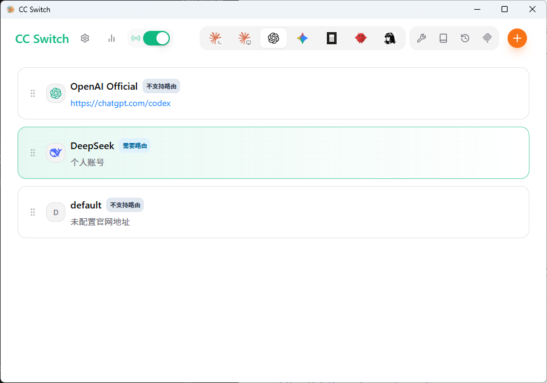
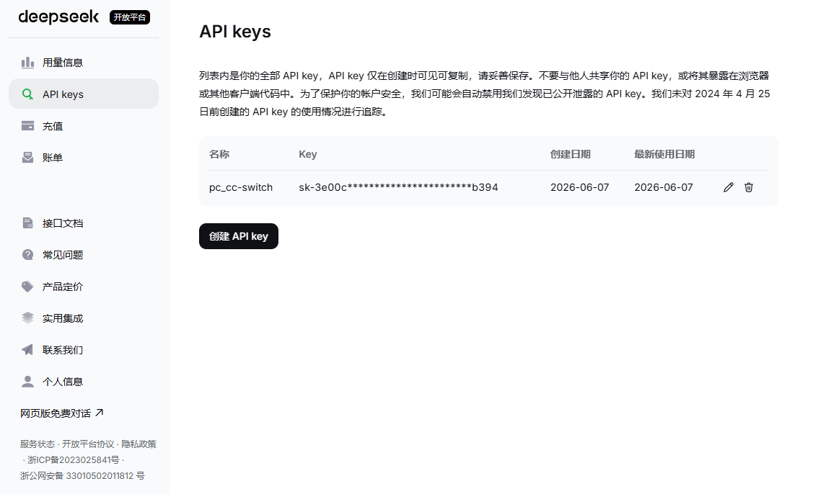
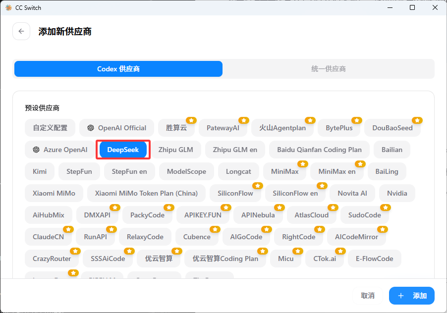
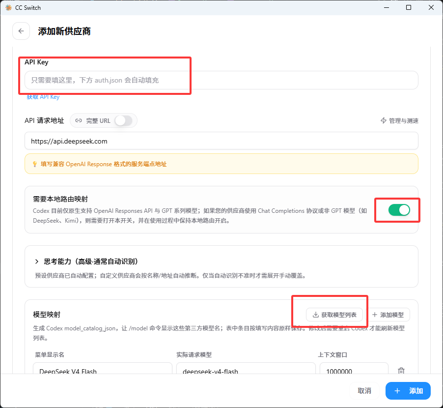
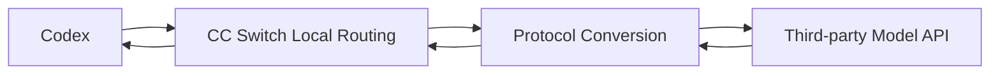

---
icon: brain
date: 2026-06-07
order: 1
category:
  - AI 编程
  - Agent 工具
tag:
  - CC Switch
  - Codex
  - DeepSeek
  - 模型供应商
  - 配置

---

# 使用 CC Switch 为 Codex 等 AI Agent 接入第三方模型

Claude Code、Codex、Gemini CLI 等 AI 编程 Agent 通常都有自己的配置文件和供应商接入方式。如果同时使用多个 Agent，或者需要在官方模型、国产模型和第三方中转服务之间切换，就要反复修改 JSON、TOML、YAML 或环境变量，管理起来比较麻烦。

[CC Switch](https://github.com/farion1231/cc-switch) 是一款开源、跨平台的 AI Agent 配置管理工具。它可以在一个桌面应用中统一管理不同 Agent 的模型供应商、API Key、接口地址、模型名称和本地路由，并提供 MCP、Skills、提示词、用量统计和配置备份等辅助功能。

目前，CC Switch 可以管理以下工具：

- Claude Code；
- Claude Desktop；
- Codex；
- Gemini CLI；
- OpenCode；
- OpenClaw；
- Hermes。

它还内置了大量供应商预设，可以接入 DeepSeek、智谱 GLM、Kimi、MiniMax、阿里云百炼、ModelScope、SiliconFlow、OpenRouter、AWS Bedrock、NVIDIA NIM 以及各种兼容接口的中转服务。

本文只以 **Codex 接入 DeepSeek** 为例，介绍从安装到正常使用的完整流程。其他 Agent 和其他模型供应商的配置思路基本相同：在 CC Switch 中切换到目标应用，选择供应商预设，填写 API Key，然后启用配置即可。

> 本文基于 CC Switch 3.16.1 编写。软件界面、预设名称和功能入口可能随版本更新，请以实际安装版本为准。

## 一、CC Switch 能做什么

CC Switch 并不是模型服务商，也不会提供模型额度。它的主要作用是统一管理本机 AI Agent 的配置，并帮助不同 Agent 对接官方 API、第三方模型平台或 API 中转服务。

它主要解决以下问题：

1. 在多个 Agent 中统一管理模型供应商；
2. 在官方模型和第三方模型之间快速切换；
3. 避免手动修改复杂的配置文件；
4. 为协议不同的模型接口提供本地格式转换；
5. 统一管理部分 Agent 的 MCP、Skills 和提示词；
6. 备份、同步和迁移供应商配置。

对于同时使用多个 Agent 的用户，还可以创建“统一供应商”，将同一套 API Key 和端点配置同步到 Claude Code、Codex 和 Gemini CLI。

本文的目标比较简单：先让 Codex 能够通过 CC Switch 正常调用 DeepSeek，其他高级功能后续按需使用即可。

## 二、开始前的准备

需要提前准备：

1. Codex App / Codex CLI / 其他AI agent；
2. CC Switch；
3. DeepSeek API Key / 其他大模型API；
4. 能够正常访问 DeepSeek API 的网络环境。

如果已经安装并能够运行 Codex，可以直接跳到下一节。

### 安装 Codex CLI

请选择自己的系统查看安装方法：

::: tabs

@tab Windows

在 PowerShell 中执行：

```powershell
powershell -ExecutionPolicy ByPass -c "irm https://chatgpt.com/codex/install.ps1 | iex"
```

@tab macOS / Linux

在终端中执行：

```bash
curl -fsSL https://chatgpt.com/codex/install.sh | sh
```

@tab npm

如果本机已经安装 Node.js，也可以使用 npm：

```bash
npm install -g @openai/codex
```

@tab Homebrew

macOS 也可以通过 Homebrew 安装：

```bash
brew install --cask codex
```

:::

安装完成后检查版本：

```bash
codex --version
```

能够正常输出版本号，说明 Codex CLI 已经安装完成。

## 三、下载和安装 CC Switch

请通过以下官方渠道下载 CC Switch：

- [CC Switch 官方网站](https://ccswitch.io/)
- [CC Switch GitHub 仓库](https://github.com/farion1231/cc-switch)
- [CC Switch GitHub Releases](https://github.com/farion1231/cc-switch/releases)

::: warning 安全提示
CC Switch 是免费开源软件。不要从不明网站下载，也不要向任何人提供自己的 API Key、ChatGPT 密码、Claude 账号凭据或完整配置备份。
:::

请选择自己的操作系统查看安装方法：

::: tabs

@tab Windows

Windows 10 或更高版本可以选择安装版或绿色版。

**安装版**

从 GitHub Releases 页面下载：

```text
CC-Switch-v{版本号}-Windows.msi
```

双击安装包并按照提示完成安装。

如果双击后没有反应，可以右键打开安装包的“属性”，在“常规”页面勾选“解除锁定”，然后重新运行。

**绿色版**

下载：

```text
CC-Switch-v{版本号}-Windows-Portable.zip
```

解压后运行：

```text
CC-Switch.exe
```

@tab macOS

推荐使用 Homebrew 安装：

```bash
brew tap farion1231/ccswitch
brew install --cask cc-switch
```

后续可以通过以下命令更新：

```bash
brew upgrade --cask cc-switch
```

也可以从 GitHub Releases 页面下载 `.dmg` 安装包，然后将 CC Switch 拖入“应用程序”目录。

@tab Ubuntu / Debian

下载与系统架构对应的 `.deb` 安装包，然后执行：

```bash
sudo dpkg -i CC-Switch-v{版本号}-Linux-*.deb
```

如果提示缺少依赖，执行：

```bash
sudo apt-get install -f
```

@tab Arch Linux

可以通过 AUR 安装：

```bash
paru -S cc-switch-bin
```

或者：

```bash
yay -S cc-switch-bin
```

@tab AppImage

下载与系统架构对应的 AppImage 文件，添加执行权限：

```bash
chmod +x CC-Switch-v{版本号}-Linux-*.AppImage
```

然后运行：

```bash
./CC-Switch-v{版本号}-Linux-*.AppImage
```

:::

## 四、首次启动 CC Switch

启动 CC Switch 后，程序会检测本机已经安装的 Agent 及其现有配置。

如果之前使用过 Codex，可以按照提示导入当前配置。导入后，原有配置会作为一个供应商保留下来，之后仍然可以切换回 OpenAI 官方登录或官方 API。

在顶部的应用切换区域选择：

```text
Codex
```



CC Switch 的顶部还可以切换到 Claude Code、Gemini CLI、OpenCode、OpenClaw、Hermes 等应用。不同应用的配置文件格式不同，但添加供应商的整体操作基本相同。

本文后续只演示 Codex。

## 五、获取 DeepSeek API Key

访问 [DeepSeek 开放平台](https://platform.deepseek.com/)，注册并登录账号，然后进入 API Key 管理页面创建密钥。

基本流程如下：

1. 创建新的 API Key；
2. 输入便于识别的名称；
3. 复制生成的密钥；
4. 将密钥保存在安全的位置；
5. 确认账户中存在可用余额。

API Key 通常类似：

```text
sk-xxxxxxxxxxxxxxxxxxxxxxxx
```

::: warning API Key 安全
API Key 通常只在创建时完整显示一次。不要将其上传到 GitHub，也不要让完整密钥出现在博客截图、终端日志或公开配置文件中。
:::



使用 GLM、Kimi、MiniMax、百炼等其他模型供应商时，也需要先前往对应平台申请 API Key。

## 六、在 Codex 中添加 DeepSeek

### 1. 选择 Codex

在 CC Switch 顶部确认当前应用为：

```text
Codex
```

然后点击右上角的 `+` 按钮，打开添加供应商窗口。

### 2. 选择 DeepSeek 预设

在“应用专属供应商”中选择：

```text
DeepSeek
```



预设会自动填写常用接口地址、协议类型和路由配置，一般不需要手动编辑 JSON 或 TOML。

### 3. 填写 API Key

为供应商设置一个容易识别的名称，例如：

```text
DeepSeek for Codex
```

然后将前面创建的 DeepSeek API Key 填入对应输入框，然后点击添加。



### 4. 选择模型

点击模型映射旁的“获取模型”按钮，从返回的列表中选择需要使用的模型。

如果供应商没有开放模型列表接口，也可以根据其官方文档手动填写模型 ID。模型名称可能随平台更新，不建议直接照抄旧教程中的固定名称。

### 5. 保持本地路由映射开启

Codex 主要使用 OpenAI Responses API，而 DeepSeek 等模型平台通常提供 Chat Completions 接口。两者的请求和响应格式不同，因此需要 CC Switch 在本地完成协议转换。

使用 DeepSeek 预设时，通常会自动开启：

```text
需要本地路由映射
```

### 6. 保存并启用

填写完成后保存供应商，然后在 DeepSeek 供应商卡片上点击“启用”。

CC Switch 会自动管理 Codex 的相关配置，例如：

```text
~/.codex/auth.json
~/.codex/config.toml
```

正常使用时不需要手动修改这些文件。

::: tip 其他 Agent 和供应商
CC Switch 不仅能为 Codex 配置 DeepSeek，也可以为 Claude Code、Claude Desktop、Gemini CLI、OpenCode、OpenClaw 和 Hermes 管理各自的模型供应商。操作方式基本相同，只需要先切换到目标应用，再选择对应预设并填写 API Key。

在 Codex 中添加 GLM、Kimi、MiniMax、百炼等供应商时，也可以直接重复本节操作。
:::

## 七、启动本地路由

打开：

```text
设置 → 路由 → 本地路由 → 路由总开关
```

依次完成以下操作：

1. 启动路由服务；
2. 在“应用路由”中开启 `Codex 路由`；
3. 返回 Codex 页面；
4. 确认 DeepSeek 供应商显示为“路由活跃”。

本地路由地址通常为：

```text
http://127.0.0.1:15721/v1
```

使用需要本地路由的供应商时，CC Switch 必须保持运行。可以在设置中开启“关闭窗口后最小化到托盘”，避免误退出程序。

## 八、启动 Codex 并验证配置

进入一个测试项目：

```bash
cd /path/to/project
codex
```

可以先输入一个不会修改文件的简单任务：

```text
分析当前项目的目录结构，告诉我主要入口文件在哪里。不要修改任何文件。
```

如果 Codex 能够正常读取项目并返回结果，说明 DeepSeek 已经接入成功。

还可以在 CC Switch 中查看请求日志，确认实际使用的供应商和模型。相比直接询问模型“你是什么模型”，请求日志更加可靠。

## 九、自定义模型供应商

CC Switch 已经内置大量供应商预设，大多数情况下只需要选择预设并填写 API Key，不必自己编写配置。

只有目标平台不在预设列表中时，才需要选择“自定义供应商”，手动填写：

- API Key；
- Base URL；
- 模型 ID；
- API 协议；
- 必要的请求头或模型映射。

详细配置方法请参考官方教程：

- [CC Switch：添加供应商](https://github.com/farion1231/cc-switch/blob/main/docs/user-manual/zh/2-providers/2.1-add.md)
- [Codex：高级配置](https://developers.openai.com/codex/config-advanced)
- [Codex：配置项参考](https://developers.openai.com/codex/config-reference)

## 十、常见问题

### Codex 启动后仍然使用原来的供应商

确认目标供应商已经启用，并检查是否显示“路由活跃”。如果 Codex 已经在运行，可以关闭后重新启动。

修改模型映射表后，也需要重启 Codex，才能刷新可选模型列表。

### 请求返回 404

常见原因是上游只支持 Chat Completions，但 Codex 按 Responses API 发送请求。请使用 CC Switch 内置预设，并确认“需要本地路由映射”和 `Codex 路由` 已经开启。

### Codex 无法连接本地路由

检查以下项目：

- CC Switch 是否仍在运行；
- 路由服务是否已经启动；
- `Codex 路由` 是否开启；
- 本地端口是否被其他程序占用；
- 防火墙是否拦截本地连接。

Windows 可以执行：

```powershell
netstat -ano | findstr :15721
```

macOS 或 Linux 可以执行：

```bash
lsof -i :15721
```

### 获取模型失败

`401` 或 `403` 通常表示 API Key 不正确、已经失效或没有调用权限；`404` 或 `405` 可能表示供应商没有提供模型列表接口。

此时可以根据供应商官方文档手动填写模型 ID，然后重新测试。

## 十一、工作原理

在本文的配置中，请求流程可以概括为：

```text
Codex
    ↓ Responses API 请求
CC Switch 本地路由
    ↓ 协议转换与模型映射
DeepSeek API
```

CC Switch 将 Codex 发出的 Responses API 请求转换为上游模型支持的格式，再把模型响应转换为 Codex 可以识别的格式，同时负责注入 API Key、映射模型名称和记录请求日志。



对于不需要协议转换的供应商，CC Switch 也可以直接管理配置文件并完成供应商切换。

## 十二、总结

使用 CC Switch 为 Codex 接入第三方模型的基本流程如下：

```text
安装 Codex
    ↓
安装 CC Switch
    ↓
申请模型供应商 API Key
    ↓
在 CC Switch 中选择 Codex
    ↓
添加供应商预设并填写 API Key
    ↓
启用供应商和 Codex 路由
    ↓
启动 Codex 进行测试
```

CC Switch 的价值不只是在 Codex 中接入 DeepSeek。它更适合作为一个多 Agent 配置中心，在 Claude Code、Codex、Gemini CLI、OpenCode、OpenClaw、Hermes 等工具之间统一管理第三方模型供应商、MCP、Skills 和相关配置。

初次使用时不必一次配置所有功能。先按照本文完成一个 Codex 供应商的接入，确认能够正常调用模型，之后再根据需要添加其他供应商或同步到其他 Agent。

## 参考资料

1. [CC Switch 官方网站](https://ccswitch.io/)
2. [CC Switch GitHub 仓库](https://github.com/farion1231/cc-switch)
3. [CC Switch 中文用户手册](https://github.com/farion1231/cc-switch/blob/main/docs/user-manual/zh/README.md)
4. [CC Switch 安装指南](https://github.com/farion1231/cc-switch/blob/main/docs/user-manual/zh/1-getting-started/1.2-installation.md)
5. [CC Switch 添加供应商](https://github.com/farion1231/cc-switch/blob/main/docs/user-manual/zh/2-providers/2.1-add.md)
6. [CC Switch 应用路由](https://github.com/farion1231/cc-switch/blob/main/docs/user-manual/zh/4-proxy/4.2-routing.md)
7. [Codex CLI 官方文档](https://developers.openai.com/codex/cli)
8. [Codex 快速开始](https://developers.openai.com/codex/quickstart)
9. [DeepSeek 开放平台](https://platform.deepseek.com/)