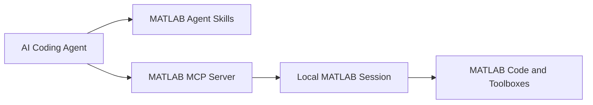

# MATLAB Agentic Toolkit：让 AI Agent 直接操作 MATLAB

MATLAB Agentic Toolkit 是 MathWorks 推出的开源工具包，用于将 Codex、Claude Code、GitHub Copilot、Gemini CLI 等 AI 编程 Agent 连接到本地 MATLAB。

安装后，AI Agent 不再只是根据训练数据“猜测”MATLAB 代码，而是可以调用本机 MATLAB，运行代码、检查报错、执行测试，并根据真实结果继续修改程序。

::: info 文章版本说明
本文初稿编写于 **2026 年 6 月 8 日**，并根据 **2026 年 6 月 11 日** 的实际安装流程重新整理。内容主要基于 MATLAB Agentic Toolkit 仓库的 **2026.06.04** 发行版，以及实际安装时下载的 MATLAB MCP Server **v0.10.1**。

该项目仍在持续开发。安装方式、最低 MATLAB 版本、支持的 AI Agent、Skill Groups、MCP Server 名称和配置文件格式都可能变化。实际安装时，请优先参考项目的 [官方 README](https://github.com/matlab/matlab-agentic-toolkit) 和 [GitHub Releases](https://github.com/matlab/matlab-agentic-toolkit/releases)。
:::

::: important 一句话理解
MATLAB Agentic Toolkit 相当于在 AI Agent 和本地 MATLAB 之间增加了一条可执行通道，并给 Agent 补充 MATLAB 专用的开发规范、工具箱知识和工作流程。
:::

## 一、它由什么组成

MATLAB Agentic Toolkit 主要由两部分组成：

1. **MATLAB MCP Server**：让 AI Agent 能够调用本地 MATLAB。
2. **MATLAB Agent Skills**：告诉 Agent 应该如何编写、测试、调试和优化 MATLAB 程序。



其中，MCP Server 负责“能不能真正操作 MATLAB”，Agent Skills 负责“会不会按照 MATLAB 的方式做事”。

只有 Skills 而没有 MCP Server 时，Agent 仍然不能真正运行 MATLAB；只有 MCP Server 而没有 Skills 时，Agent 虽然可以执行代码，但不一定了解 MATLAB 推荐的开发方式。

::: note 关于 MATLAB R2026a
安装 MATLAB R2026a 并不会自动安装 MATLAB Agentic Toolkit，也不会自动替 Codex 或 Claude Code 配置 MCP Server。即使已经安装新版 MATLAB，仍然需要单独安装和配置 Toolkit。
:::

### 1. MCP Server 提供什么能力

MATLAB MCP Server 是 Agent 和 MATLAB 之间的连接层。安装完成后，Agent 可以通过 MCP 工具让 MATLAB 执行真实操作。

目前常用的 MCP 工具包括：

| MCP 工具                  | 作用                               |
| ------------------------- | ---------------------------------- |
| `evaluate_matlab_code`    | 执行 MATLAB 代码并返回命令行输出   |
| `run_matlab_file`         | 运行 `.m` 文件                     |
| `run_matlab_test_file`    | 使用 `runtests` 执行测试           |
| `check_matlab_code`       | 调用 MATLAB Code Analyzer 检查代码 |
| `detect_matlab_toolboxes` | 获取 MATLAB 版本和已安装工具箱     |

因此，可以让 Agent 完成以下任务：

- 编写并运行 MATLAB 脚本；
- 根据真实报错自动修改代码；
- 检查函数是否属于已经安装的工具箱；
- 生成并执行单元测试；
- 使用 Code Analyzer 检查代码质量；
- 重构和现代化旧版 MATLAB 代码；
- 优化程序运行速度和内存占用；
- 调用专业工具箱完成科研计算。

例如，可以直接向 Codex 提出：

```text
分析当前目录中的 MATLAB 项目，运行 main.m，根据运行结果修复报错。
```

或者：

```text
检查 optimize.m 的代码质量，运行 Code Analyzer，并修改能够确认的问题。
```

Agent 可以在修改文件后调用 MATLAB 验证结果，而不是将未经测试的代码直接交给用户。

::: warning MCP Server 名称变化
本文实际安装时使用的是 MATLAB MCP Server v0.10.1，二进制文件名仍然类似 `matlab-mcp-core-server.exe`。官方 Release 已提示，2026 年 6 月 18 日的 v0.11.0 起，MATLAB MCP Core Server 会更名为 MATLAB MCP Server，后续二进制文件名和配置项可能变化。实际使用时以官方 Release 说明为准。
:::

### 2. Agent Skills 提供什么能力

Agent Skills 是一组以 `SKILL.md` 为核心的工作流说明文件。它们会指导 Agent 使用更符合 MATLAB 习惯的代码结构、测试方式和工具箱 API。

常见 Skill Groups 包括：

| 技能组                               | 主要用途                                   |
| ------------------------------------ | ------------------------------------------ |
| MATLAB Core                          | 编写、调试、测试、审查和管理 MATLAB 代码   |
| MATLAB Programming                   | 编写稳健的 MATLAB 函数、验证输入参数       |
| MATLAB App Building                  | 使用 UI 组件、布局和回调构建 App           |
| MATLAB Data Import and Analysis      | 表格、时间表、筛选、聚合和时间序列分析     |
| MATLAB Software Development          | 项目管理、性能优化、文档和工具箱打包       |
| AI and Statistics                    | 深度学习、统计建模和 AI 相关工作流         |
| Parallel Computing                   | GPU、并行池、集群和 MATLAB Parallel Server |
| Image Processing and Computer Vision | 图像处理和计算机视觉                       |
| Signal Processing                    | 数字滤波、信号处理和 DSP 相关任务          |
| Robotics and Autonomous Systems      | Navigation Toolbox、UAV Toolbox 等         |
| Wireless Communications              | 5G、WLAN、蓝牙、卫星通信等                 |
| Radar                                | 雷达、声呐、传感器融合相关工作流           |

::: tip 不要安装所有 Skills
官方建议只安装当前会使用的 Skill Groups。Skills 太多会占用 Agent 的上下文，也可能降低技能自动触发的可靠性。
:::

对于一般科研和算法开发，可以优先选择：

- `matlab-core`
- `matlab-programming`
- `matlab-software-development`
- `matlab-data-import-and-analysis`
- `parallel-computing`
- `ai-and-statistics`

再根据研究方向添加信号处理、图像处理、雷达、通信或其他专业技能。

## 二、安装要求

截至本文修订时，官方要求大致如下：

| 项目        | 要求                                   |
| ----------- | -------------------------------------- |
| MATLAB      | R2021a 或更高版本                      |
| Git         | 需要安装                               |
| AI Agent    | 支持 MCP Server 和 Skills              |
| MATLAB 授权 | 需要有效的本地 MATLAB 安装和授权       |
| AI 服务     | 需要相应 Agent 的账号、订阅或 API 服务 |

官方可以自动配置的 Agent 包括：

- Claude Code
- GitHub Copilot
- OpenAI Codex
- Gemini CLI
- Sourcegraph Amp

其他 Agent 只要支持 MCP 和 Skills，理论上也可以手动配置，但不一定能够使用官方自动安装流程。

::: note 关于旧版要求
部分早期介绍文章写的是 MATLAB R2020b 或更高版本，但 MATLAB Agentic Toolkit 当前官方 README 写的是 **MATLAB R2021a 或更高版本**。如果后续版本再次调整，请以官方说明为准。
:::

## 三、适合哪些场景

MATLAB Agentic Toolkit 比较适合：

- 使用 Codex、Claude Code 或 GitHub Copilot 开发 MATLAB 项目；
- 需要让 Agent 根据真实运行结果修改程序；
- MATLAB 文件较多，需要项目级分析；
- 需要自动生成和运行单元测试；
- 需要调用专业工具箱完成科研计算；
- 需要将旧版 MATLAB 代码迁移到新 API；
- 需要使用 GPU、并行池或集群完成实验。

对于只需要询问 MATLAB 语法、解释单段代码的用户，普通 AI 对话已经能够满足大部分需求，没有必要额外配置 Agentic Toolkit。

::: warning 保持人工确认
MCP Server 允许 Agent 启动 MATLAB、运行代码和访问项目文件。对于删除文件、覆盖数据、修改环境变量、长时间训练或批量实验等操作，应先人工确认。
:::

## 四、安装方式概览

目前有几种安装思路：

| 安装方式                  | 适合人群                       | 说明                                                         |
| ------------------------- | ------------------------------ | ------------------------------------------------------------ |
| Agentic Toolkit Installer | 大多数用户                     | 当前推荐方式，通过 MATLAB 中的 `setupAgenticToolkit` 完成安装、配置和更新 |
| Agent 驱动安装            | 已经熟悉 Agent 工作流的用户    | 克隆仓库后让 Agent 自己执行安装，但通常会安装全部 Skill Groups |
| 手动配置 MCP Server       | 高级用户                       | 自己下载 MCP Server、写入 Agent 配置、配置 Skills            |
| 只安装 Skills             | 已经单独装好 MCP Server 的用户 | 不改 MCP 配置，只补充 MATLAB Skills                          |

本文重点讲 **Agentic Toolkit Installer**。其他方式建议直接看官方文档：

- [MATLAB Agentic Toolkit README](https://github.com/matlab/matlab-agentic-toolkit)
- [Configuration and Troubleshooting](https://github.com/matlab/matlab-agentic-toolkit/blob/main/Configuration_and_Troubleshooting.md)
- [MATLAB MCP Core Server](https://github.com/matlab/matlab-mcp-core-server)
- [Simulink Agentic Toolkit](https://github.com/matlab/simulink-agentic-toolkit)

## 五、使用 Agentic Toolkit Installer 安装

下面以 **Windows + MATLAB R2024b + Codex** 为例，整理一次实际安装流程。

本文实际测试环境如下：

| 项目                   | 实际环境       |
| ---------------------- | -------------- |
| 系统                   | Windows x86_64 |
| MATLAB                 | R2024b         |
| MATLAB Agentic Toolkit | 2026.06.04     |
| MATLAB MCP Server      | v0.10.1        |
| AI Agent               | Codex          |
| 配置方式               | 全局配置       |

### 1. 安装 Agentic Toolkit Installer

先从官方 Release 下载 `agenticToolkitInstaller.mltbx`：

- [agenticToolkitInstaller.mltbx](https://github.com/matlab/simulink-agentic-toolkit/releases/latest/download/agenticToolkitInstaller.mltbx)

下载后双击打开，MATLAB 会将其作为 Add-On 安装。

安装完成后，MATLAB 中会出现 `setupAgenticToolkit` 命令。后面的安装、配置、更新、卸载都通过这个命令完成。

::: note 为什么安装器在 Simulink 仓库里
虽然安装器目前通过 Simulink Agentic Toolkit 的 Release 提供，但它可以安装 MATLAB Agentic Toolkit、Simulink Agentic Toolkit，或者同时安装两者。
:::

### 2. 运行安装命令

打开 MATLAB，在命令窗口执行：

```matlab
setupAgenticToolkit("install")
```

安装器会先检测平台和 MATLAB 版本。本文测试时显示：

```text
MathWorks Agentic Toolkit Setup — Install
—————————————————————————————————————————

Detected:
  Platform:     Windows x86_64
  MATLAB:       R2024b (D:\Program Files\MATLAB\R2024b)
```

如果启动时看到类似下面的提示：

```text
无法访问使用“最后一个工作文件夹”预设项选定的某个目录。
将改为使用 Documents\MATLAB 作为初始工作文件夹。
```

这通常只是 MATLAB 的启动目录不可访问，和 Agentic Toolkit 本身没有直接关系。可以先继续安装，后续再修改 MATLAB 的启动目录。

### 3. 选择要安装的 Toolkit

安装器会让你选择要安装的 Toolkit：

```text
Select toolkits to install:
  1. MATLAB Agentic Toolkit
  2. Simulink Agentic Toolkit
  3. Both

Enter selection:
```

如果只需要让 Codex 操作 MATLAB，输入：

```text
1
```

随后安装器会给出安装计划：

```text
Plan:
  - Download and install the MATLAB MCP Server
  - Install the MATLAB MCP Core Server Toolbox (enables agents to connect to a running MATLAB session)
  - Download the MATLAB Agentic Toolkit

Proceed? [Y/n]:
```

确认继续，输入：

```text
y
```

这一步会做三件事：

1. 下载适合当前系统的 MATLAB MCP Server 二进制文件；
2. 运行 `--setup-matlab`，安装 MATLAB MCP Core Server Toolbox；
3. 下载 MATLAB Agentic Toolkit 的 Skills 和相关文件。

### 4. 等待 MCP Server 和 Toolkit 下载

正常情况下，会看到类似输出：

```text
Checking for latest MCP server version...
Downloading MATLAB MCP Server v0.10.1 for Windows x86_64...
MCP server binary installed to: C:\Users\<用户名>\.matlab\agentic-toolkits\bin\matlab-mcp-core-server.exe
Running --setup-matlab...
MATLAB MCP Core Server Toolbox installed.
```

随后继续下载 MATLAB Agentic Toolkit：

```text
Downloading MATLAB Agentic Toolkit 2026.06.04...
MATLAB Agentic Toolkit installed to: C:\Users\<用户名>\.matlab\agentic-toolkits\matlab
Merged marketplace.json written (18 plugins).

Artifacts installed.
```

如果看到 `Artifacts installed.`，说明 Toolkit 文件已经安装完成。

### 5. 遇到 GitHub 连接失败怎么办

安装器需要从 GitHub 下载 MCP Server 和 Toolkit，因此在网络不稳定时可能失败。

常见错误之一是连接被重置：

```text
Failed to reach github.com for matlab/matlab-mcp-core-server:
连接到 https://github.com/matlab/matlab-mcp-core-server/releases/latest 时出错: Recv failure: Connection was reset
```

也可能是连接超时：

```text
Failed to connect to github.com port 443
Couldn't connect to server
```

如果已经成功下载了 MCP Server，但下载 MATLAB Agentic Toolkit 时失败，可能看到：

```text
Failed to reach github.com for matlab/matlab-agentic-toolkit:
Recv failure: Connection was reset
```

这类问题通常不是 MATLAB 代码错误，而是 **MATLAB 进程访问 GitHub 不稳定**。

如果使用本地代理，可以在 MATLAB 中临时设置代理环境变量：

```matlab
setenv("HTTP_PROXY", "http://127.0.0.1:7897")
setenv("HTTPS_PROXY", "http://127.0.0.1:7897")
setenv("ALL_PROXY", "http://127.0.0.1:7897")

setenv("http_proxy", "http://127.0.0.1:7897")
setenv("https_proxy", "http://127.0.0.1:7897")
setenv("all_proxy", "http://127.0.0.1:7897")
```

其中 `7897` 需要改成自己代理软件实际监听的端口。

可以先测试 MATLAB 是否能访问 GitHub API：

```matlab
webread("https://api.github.com/repos/matlab/matlab-mcp-core-server/releases/latest")
```

如果 GitHub 页面访问较慢，可以临时提高 `webread` 的超时时间：

```matlab
opts = weboptions("Timeout", 60);
webread("https://github.com/matlab/matlab-mcp-core-server/releases/latest", opts)
```

::: tip 失败后可以直接重试
如果中途因为网络失败，可以再次运行：

```matlab
setupAgenticToolkit("install")
```

安装器会识别已经完成的部分。例如 MCP Server 已经安装成功时，再次运行会显示：

```text
MCP server binary already at v0.10.1, skipping download.
MATLAB MCP Core Server Toolbox already installed (skipping).
```

也就是说，它具有一定的断点续装能力，不需要一失败就手动删除目录。
:::

### 6. 配置 Codex

Toolkit 文件安装完成后，安装器会询问是否现在配置 AI Agent：

```text
Would you like to configure your coding agent now? [Y/n]:
```

输入：

```text
y
```

接着进入配置界面：

```text
MathWorks Agentic Toolkit Setup — Configure
——————————————————————————————————————————

Installed:    MATLAB Agentic Toolkit 2026.06.04

Select agent platforms to configure:
  1. Claude Code
  2. GitHub Copilot
  3. Codex
  4. Amp
  5. Gemini CLI

Enter selection (e.g., 1 or 1,3,5):
```

本文使用 Codex，因此输入：

```text
3
```

如果同时要配置多个 Agent，可以按提示输入多个编号，例如 `1,3`。

### 7. 选择全局配置还是项目配置

接着安装器会询问配置范围：

```text
Where should the agent config be installed?
  1. Globally — works for all projects on this machine
  2. A specific project

Enter selection:
```

如果希望所有 Codex 项目都能调用 MATLAB，输入：

```text
1
```

这会写入 Codex 的全局配置文件。Windows 下通常类似：

```text
C:\Users\<用户名>\.codex\config.toml
```

如果只希望某个项目使用 MATLAB Agentic Toolkit，可以选择 `2`，然后按提示选择具体项目路径。

::: warning 关于全局配置
如果选择全局配置，Codex 在所有项目中都可以看到 MATLAB MCP Server。它不会自动把所有 MATLAB 内容塞进每次对话，但会让 MATLAB 相关工具和 Skills 成为全局可用能力。若只在少数 MATLAB 项目中使用，建议选择项目级配置，减少非 MATLAB 项目的上下文和工具干扰。
:::

::: warning 修改前建议备份
如果你已经手动改过 Codex 的 MCP 配置，建议先备份：

```text
C:\Users\<用户名>\.codex\config.toml
```

安装器通常会合并配置，但备份可以避免误改后不好恢复。
:::

### 8. 选择 Skill Groups

这是安装流程中最需要认真选择的一步。

安装器会列出可选 Skill Groups，其中 `matlab-core` 总是启用：

```text
Select which MATLAB Agentic Toolkit skill groups you'd like to enable:
  (always included) matlab-core

  1. ai-and-statistics
  2. automotive
  3. computational-biology
  4. image-processing-and-computer-vision
  5. matlab-app-building
  6. matlab-data-import-and-analysis
  7. matlab-programming
  8. matlab-software-development
  9. parallel-computing
  10. radar
  11. reporting-and-database-access
  12. rf-and-mixed-signal
  13. robotics-and-autonomous-systems
  14. signal-processing
  15. test-and-measurement
  16. wireless-communications

Enter selection (e.g., 1,3,5, "all", or "none") [none]:
```

本文面向一般科研、算法实验和 MATLAB 项目开发，因此输入：

```text
1,6,7,8,9
```

对应启用：

| 编号 | Skill Group                       | 适合场景                             |
| ---- | --------------------------------- | ------------------------------------ |
| 1    | `ai-and-statistics`               | 深度学习、统计建模、AI 相关实验      |
| 6    | `matlab-data-import-and-analysis` | 表格、时间序列、数据导入与分析       |
| 7    | `matlab-programming`              | MATLAB 函数编写、输入参数验证        |
| 8    | `matlab-software-development`     | 项目管理、测试、性能优化、工具箱打包 |
| 9    | `parallel-computing`              | GPU、并行池、集群计算                |

确认后会显示：

```text
Enabled: ai-and-statistics, matlab-data-import-and-analysis, matlab-programming, matlab-software-development, parallel-computing
```

同时安装器会显示当前 Session mode：

```text
Session mode: auto (connects to running MATLAB, or launches new)
```

`auto` 表示 Agent 会优先连接已经共享的 MATLAB 会话，如果没有可用会话，再启动新的 MATLAB。

接着安装器会给出配置计划：

```text
Plan:
  - Configure Codex to use the MATLAB MCP Server, for all projects (global)
  - Enable MATLAB Agentic Toolkit skill groups: ai-and-statistics, matlab-core, matlab-data-import-and-analysis, matlab-programming, matlab-software-development, parallel-computing

Proceed? [Y/n]:
```

确认继续，输入：

```text
y
```

配置成功后会看到：

```text
Writing MCP config:
  Codex: C:\Users\<用户名>\.codex\config.toml

Registering skills:
Skills registered (26 skills).

Configure complete!
```

到这里，Codex 的 MCP 配置和 MATLAB Skills 已经注册完成。

### 9. 共享当前 MATLAB 会话

配置完成后，安装器会提示：

```text
Tip: For faster startup, run shareMATLABSession in MATLAB
(or add it to startup.m). Without it, the agent will launch
a new MATLAB session each time.

Would you like to run shareMATLABSession now? [Y/n]:
```

建议输入：

```text
y
```

也可以之后在 MATLAB 中手动执行：

```matlab
shareMATLABSession
```

这样 Codex 调用 MATLAB 时可以复用当前 MATLAB 会话，而不是每次重新启动一个 MATLAB 实例。

如果你经常使用 Codex 操作 MATLAB，可以把它加入 `startup.m`：

```matlab
edit startup
```

然后写入：

```matlab
shareMATLABSession
```

::: tip 建议
如果 MATLAB 启动本身比较慢，建议使用 `shareMATLABSession`。这样 Agent 第一次调用 MATLAB 时通常会更快。
:::

### 10. 关于 P-code 警告

实际安装时，可能出现类似警告：

```text
P-code file setupAgenticToolkit.p is older than source code file setupAgenticToolkit.m
```

这表示 `.p` 文件比对应的 `.m` 源文件旧。本文实际安装中，该警告没有阻止安装流程。

如果安装器仍然能进入 `MathWorks Agentic Toolkit Setup — Install` 界面，并且后续流程正常，可以先继续安装。

如果后续出现异常，建议重新下载最新的 `agenticToolkitInstaller.mltbx` 并重新安装 Add-On。

## 六、Toolkit 的常用操作

安装器提供的核心入口是：

```matlab
setupAgenticToolkit
```

它不只用于安装，也用于后续配置、查看状态、更新和卸载。

### 1. 安装

下载 Toolkit 文件和 MATLAB MCP Server：

```matlab
setupAgenticToolkit("install")
```

执行后会提示选择：

- 安装 MATLAB Agentic Toolkit；
- 安装 Simulink Agentic Toolkit；
- 同时安装两者。

安装器会将 MCP Server 二进制文件和 Toolkit 内容下载到默认目录：

```text
~/.matlab/agentic-toolkits
```

Windows 下通常对应：

```text
C:\Users\<用户名>\.matlab\agentic-toolkits
```

如果需要非交互式安装，例如 CI 环境，可以显式指定选项：

```matlab
setupAgenticToolkit("install", Toolkit="simulink", Prompt=false)
```

### 2. 配置 Agent

安装完成后，可以单独运行配置命令：

```matlab
setupAgenticToolkit("configure")
```

它会提示你选择：

- 要配置哪些 Agent；
- 配置为全局还是项目级；
- 启用哪些 Skill Groups；
- MCP Server 如何连接 MATLAB 会话。

如果要非交互式配置某个 Agent，可以使用：

```matlab
setupAgenticToolkit("configure", Agents="claude-code", Scope="global", Prompt=false)
```

Codex 用户可以根据官方当前支持的参数写法调整 `Agents` 的值。具体可在 MATLAB 中查看：

```matlab
help setupAgenticToolkit
```

### 3. 查看状态

查看当前安装和配置状态：

```matlab
setupAgenticToolkit("status")
```

这个命令适合在以下场景使用：

- 忘记是否已经安装 Toolkit；
- 不确定当前安装目录；
- 想确认哪些 Agent 已经配置；
- 想检查当前安装版本。

### 4. 更新

检查新版本并应用更新：

```matlab
setupAgenticToolkit("update")
```

更新内容通常包括：

- MATLAB Agent Skills；
- MCP Server 配置；
- MATLAB MCP Server 二进制文件；
- 已安装的 MATLAB 和 Simulink Agentic Toolkit 内容。

::: note 安装器本身需要单独更新
`setupAgenticToolkit("update")` 会更新 Toolkit 和 MCP Server，但安装器 Add-On 本身需要单独更新。需要新版安装器时，应重新下载并打开最新的 `agenticToolkitInstaller.mltbx`。
:::

### 5. 卸载

移除 Toolkit、Agent 配置或全部内容：

```matlab
setupAgenticToolkit("uninstall")
```

卸载前建议确认：

- 是否还需要 Codex 的 MATLAB MCP 配置；
- 是否有其他 Agent 共用同一套 MCP Server；
- 是否保留 `.matlab/agentic-toolkits` 下的文件；
- 是否需要备份 Codex、Claude Code 或 VS Code 的配置文件。

### 6. 从本地源码安装

如果你已经克隆了 Toolkit 仓库，或者正在开发本地版本，可以使用 `Source` 参数，让安装器从本地源码建立链接，而不是重新下载：

```matlab
setupAgenticToolkit("install", Toolkit="simulink", Source="/path/to/simulink-agentic-toolkit")
```

Windows 路径可以写成类似：

```matlab
setupAgenticToolkit("install", Toolkit="matlab", Source="D:\project\matlab-agentic-toolkit")
```

### 7. 常见高级选项

常见选项如下：

| 选项          | 作用                                                         |
| ------------- | ------------------------------------------------------------ |
| `InstallRoot` | 自定义安装目录，默认是 `~/.matlab/agentic-toolkits`          |
| `SessionMode` | 指定 MCP Server 如何连接 MATLAB，可选 `"auto"`、`"existing"` 或 `"new"` |
| `SkillGroups` | 配置时启用指定 Skill Groups                                  |
| `AgentCLI`    | 覆盖 Agent 可执行文件路径，例如使用组织内部封装的 Claude Code 命令 |
| `Prompt`      | 是否启用交互式提示，适合 CI 或自动化脚本中关闭               |

例如，自定义安装目录：

```matlab
setupAgenticToolkit("install", InstallRoot="D:\MATLABAgenticToolkits")
```

例如，指定连接已有 MATLAB 会话：

```matlab
setupAgenticToolkit("configure", SessionMode="existing")
```

例如，指定 Skill Groups：

```matlab
setupAgenticToolkit("configure", SkillGroups=["matlab-programming","parallel-computing"])
```

如果组织内部使用 Agent CLI 包装器，可以指定路径：

```matlab
setupAgenticToolkit("configure", AgentCLI="claude-code=/usr/local/bin/my-claude")
```

完整参数以 MATLAB 中的帮助为准：

```matlab
help setupAgenticToolkit
```

## 七、验证是否安装成功

安装完成后，需要重新启动 Codex，让它读取新的 MCP 配置和 Skills。

可以在 Codex 中提问：

```text
What version of MATLAB is running? List the installed toolboxes.
```

如果配置正常，Codex 应该会调用 MATLAB MCP Server，并返回当前 MATLAB 版本和已安装工具箱。

也可以让 Codex 做一个简单任务：

```text
使用 MATLAB 生成一个正弦信号，绘制时域图，并运行代码验证。
```

更适合项目开发的测试方式是：

```text
检查当前目录中的 MATLAB 代码，运行 main.m，如果有报错，根据 MATLAB 的真实输出修复。
```

如果 Agent 能够运行 MATLAB 代码并根据输出继续修改，说明 MCP Server 已经工作。

## 八、使用时需要注意的问题

### 1. 它不能替代 MATLAB 授权

Toolkit 本身是开源项目，但运行 MATLAB 代码仍然需要本地 MATLAB 及相关工具箱授权。

如果 Agent 生成的程序依赖未安装或未授权的工具箱，代码仍然无法运行。

### 2. 它不提供大语言模型

Toolkit 不包含 AI 模型，也不提供免费 Token。实际推理仍由 Codex、Claude Code、GitHub Copilot、Gemini CLI 或其他 AI 服务完成。

### 3. Agent 具有执行本地代码的能力

MCP Server 允许 Agent 启动 MATLAB、运行代码和访问项目文件。因此，在执行删除文件、覆盖数据、修改环境或长时间计算等操作前，应检查 Agent 准备执行的命令。

::: warning 不要在重要数据目录中无限制运行 Agent
建议使用 Git 管理代码，并将原始数据单独备份。对于重要实验数据，可以设置只读副本，避免被 Agent 误覆盖。
:::

### 4. 复杂任务可能出现超时

MATLAB 启动、长时间仿真、大型测试和深度学习训练可能超过 Agent 默认的 MCP 调用时间。

Codex 用户可以在 `~/.codex/config.toml` 的 MATLAB MCP 配置中增加：

```toml
[mcp_servers.matlab]
tool_timeout_sec = 600
```

对于运行时间更长的优化算法或仿真实验，可以继续提高该数值。

### 5. Skills 不是越多越好

安装太多 Skill Groups 会占用 Agent 上下文，也可能影响自动触发的准确性。

一般建议先选最常用的：

- `matlab-core`
- `matlab-programming`
- `matlab-software-development`
- `matlab-data-import-and-analysis`

然后按实际研究方向补充：

- 深度学习：`ai-and-statistics`
- 并行计算：`parallel-computing`
- 图像方向：`image-processing-and-computer-vision`
- 信号方向：`signal-processing`
- 通信方向：`wireless-communications`

## 参考资料

- [MATLAB Agentic Toolkit 官方产品页](https://www.mathworks.com/products/matlab-agentic-toolkit.html)
- [MATLAB Agentic Toolkit GitHub 仓库](https://github.com/matlab/matlab-agentic-toolkit)
- [MATLAB Agentic Toolkit README](https://github.com/matlab/matlab-agentic-toolkit/blob/main/README.md)
- [MATLAB Agentic Toolkit Releases](https://github.com/matlab/matlab-agentic-toolkit/releases)
- [Configuration and Troubleshooting](https://github.com/matlab/matlab-agentic-toolkit/blob/main/Configuration_and_Troubleshooting.md)
- [MATLAB MCP Core Server](https://github.com/matlab/matlab-mcp-core-server)
- [MATLAB MCP Core Server Releases](https://github.com/matlab/matlab-mcp-core-server/releases)
- [Simulink Agentic Toolkit](https://github.com/matlab/simulink-agentic-toolkit)