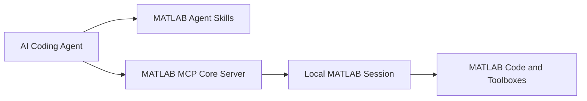

# MATLAB Agentic Toolkit：让 AI Agent 直接操作 MATLAB

MATLAB Agentic Toolkit 是 MathWorks 于 2026 年推出的开源工具包，用于将 Codex、Claude Code、GitHub Copilot 等 AI 编程 Agent 连接到本地 MATLAB。

安装后，AI Agent 不再只是根据训练数据“猜测”MATLAB 代码，而是可以直接调用本机 MATLAB，运行代码、检查报错、执行测试，并根据真实结果继续修改程序。

::: info 文章版本说明 
本文编写于 **2026 年 6 月 8 日**，内容基于 MATLAB Agentic Toolkit 仓库的 **2026.06.04** 发行版。 

该项目仍在持续开发，安装方式、最低 MATLAB 版本、支持的 AI Agent、Skills 分类以及配置命令都可能在后续版本中发生变化。实际安装和使用时，请优先参考项目的 [官方 README](https://github.com/matlab/matlab-agentic-toolkit) 和 [GitHub Releases](https://github.com/matlab/matlab-agentic-toolkit/releases)。
:::

::: important 一句话理解
MATLAB Agentic Toolkit 相当于在 AI Agent 和本地 MATLAB 之间增加了一条可执行通道，并为 Agent 补充 MATLAB 专用的开发规范和工作流程。
:::

## 一、它由什么组成

MATLAB Agentic Toolkit 主要包含两个部分：

1. **MATLAB MCP Core Server**：让 AI Agent 可以调用本地 MATLAB。
2. **MATLAB Agent Skills**：告诉 Agent 应该如何编写、测试、调试和优化 MATLAB 程序。



其中，MCP Server 负责提供实际操作能力，Agent Skills 负责提供 MATLAB 领域知识。

只有 Skills 而没有 MCP Server 时，Agent 仍然不能真正运行 MATLAB；只有 MCP Server 而没有 Skills 时，Agent 虽然可以执行代码，但不一定了解推荐的 MATLAB 开发方式。

## 二、它能做什么

MATLAB MCP Core Server 当前向 Agent 提供五个主要工具：

| MCP 工具 | 作用 |
|---|---|
| `evaluate_matlab_code` | 执行 MATLAB 代码并返回命令行输出 |
| `run_matlab_file` | 运行 `.m` 文件 |
| `run_matlab_test_file` | 使用 `runtests` 执行测试 |
| `check_matlab_code` | 调用 MATLAB Code Analyzer 检查代码 |
| `detect_matlab_toolboxes` | 获取 MATLAB 版本和已安装工具箱 |

因此，可以让 Agent 完成以下任务：

- 编写并运行 MATLAB 脚本；
- 根据真实报错自动修改代码；
- 检查函数是否属于已经安装的工具箱；
- 生成并执行单元测试；
- 使用 Code Analyzer 检查代码质量；
- 重构和现代化旧版 MATLAB 代码；
- 优化程序运行速度和内存占用；
- 创建 MATLAB App；
- 完成信号处理、图像处理、深度学习、并行计算等领域任务。

例如，可以直接向 Codex 提出：

```text
分析当前目录中的 MATLAB 项目，运行 main.m，根据运行结果修复报错。
```

或者：

```text
检查 optimize.m 的代码质量，运行 Code Analyzer，并修改能够确认的问题。
```

Agent 可以在修改文件后调用 MATLAB 验证结果，而不是将未经测试的代码直接交给用户。

## 三、Agent Skills 包含哪些内容

Agent Skills 是一组以 `SKILL.md` 为核心的工作流说明文件。它们会指导 Agent 使用更符合 MATLAB 习惯的代码结构和工具。

目前主要包括以下技能组：

| 技能组 | 主要用途 |
|---|---|
| MATLAB Core | 编写、调试、测试和审查 MATLAB 代码 |
| MATLAB Programming | 编写函数、验证输入参数 |
| MATLAB App Building | 使用 UI 组件和回调构建 App |
| Data Import and Analysis | 表格、时间表、筛选、聚合和时间序列分析 |
| MATLAB Software Development | 项目管理、性能优化、文档和工具箱打包 |
| AI and Statistics | Deep Learning Toolbox 等机器学习工作流 |
| Parallel Computing | GPU、并行池和集群配置 |
| Signal Processing | 数字滤波器、信号处理相关任务 |
| Image Processing and Computer Vision | 图像处理和计算机视觉 |
| Robotics and Autonomous Systems | Navigation Toolbox、UAV Toolbox |
| Wireless Communications | 5G、WLAN、卫星通信等 |
| Radar | 雷达、声呐、传感器融合相关工作流 |

::: tip 不要安装所有 Skills
官方建议只安装当前会使用的技能组。Skills 太多会占用 Agent 的上下文，并可能降低技能自动触发的可靠性。
:::

对于一般科研和算法开发，可以优先选择：

- `matlab-core`
- `matlab-programming`
- `matlab-software-development`
- `parallel-computing`
- `ai-and-statistics`

再根据研究方向添加信号处理、图像处理或其他专业技能。

## 四、安装要求

截至 2026 年 6 月，最新官方要求如下：

| 项目 | 要求 |
|---|---|
| MATLAB | R2021a 或更高版本 |
| Git | 需要安装 |
| AI Agent | 支持 MCP Server 和 Agent Skills |
| MATLAB 授权 | 需要有效的本地 MATLAB 安装和授权 |
| AI 服务 | 需要相应 Agent 的账号、订阅或 API 服务 |

官方可以自动配置的 Agent 包括：

- Claude Code
- GitHub Copilot
- OpenAI Codex
- Gemini CLI
- Sourcegraph Amp

其他 Agent 只要支持 MCP 和 Skills，理论上也可以手动配置，但不一定能够使用官方自动安装流程。

::: note 关于旧版要求
部分早期介绍文章写的是 MATLAB R2020b 或更高版本，但 MATLAB Agentic Toolkit 在 2026 年 6 月的更新中已经将最低版本调整为 **R2021a**。
:::

## 五、推荐安装方法

当前官方推荐使用 MATLAB 内的 **Agentic Toolkit Installer**，而不是让 AI Agent 自己完成全部安装。

### 1. 下载安装器

从官方 GitHub Release 下载：

- [Agentic Toolkit Installer](https://github.com/matlab/simulink-agentic-toolkit/releases/latest/download/agenticToolkitInstaller.mltbx)

虽然安装器目前通过 Simulink Agentic Toolkit 的 Release 提供，但它同时支持 MATLAB Agentic Toolkit 和 Simulink Agentic Toolkit。

### 2. 安装 `.mltbx` 文件

双击下载的 `agenticToolkitInstaller.mltbx`，根据 MATLAB 提示完成 Add-On 安装。

### 3. 运行安装命令

在 MATLAB 命令窗口执行：

```matlab
setupAgenticToolkit("install")
```

安装器会引导完成以下配置：

- 下载 MATLAB MCP Core Server；
- 选择 MATLAB 或 Simulink Agentic Toolkit；
- 选择需要安装的技能组；
- 选择全局配置或项目级配置；
- 配置 Codex、Claude Code 等 AI Agent；
- 设置 MATLAB 启动和连接方式。

安装过程中只选择实际需要的技能组即可。

### 4. 验证是否成功

重新启动 AI Agent，然后提问：

```text
What version of MATLAB is running? List the installed toolboxes.
```

如果安装成功，Agent 会调用 `detect_matlab_toolboxes`，返回本机 MATLAB 版本和已经安装的工具箱。

也可以进一步测试：

```text
使用 MATLAB 生成一个正弦信号，绘制时域图，并运行代码验证。
```

## 六、更新 Toolkit

在 MATLAB 中执行：

```matlab
setupAgenticToolkit("update")
```

该命令会更新：

- MATLAB Agent Skills；
- MCP Server 配置；
- MATLAB MCP Core Server；
- 已安装的 MATLAB 和 Simulink Agentic Toolkit。

安装器 Add-On 本身需要单独更新。需要新版安装器时，应重新下载并打开最新的 `agenticToolkitInstaller.mltbx`。

## 七、另一种安装方式

也可以让 Agent 自动完成安装。

首先克隆仓库：

```bash
git clone https://github.com/matlab/matlab-agentic-toolkit.git
cd matlab-agentic-toolkit
```

然后从该目录启动 Codex、Claude Code 或 Gemini CLI，并输入：

```text
Set up the MATLAB Agentic Toolkit
```

Agent 会尝试：

- 检测最新的 MATLAB 安装；
- 下载 MCP Server；
- 写入 Agent 的 MCP 配置；
- 注册 MATLAB Skills；
- 验证连接。

不过这种方式通常会安装全部技能组，并消耗一定的 Agent Token。因此，对大多数用户而言，MATLAB 内置安装器更加合适。

## 八、MATLAB R2026a 会自动安装吗

**不会。**

安装 MATLAB R2026a 并不会自动安装 MATLAB Agentic Toolkit，也不会自动替 Codex 或 Claude Code 配置 MCP Server。

即使已经安装 MATLAB R2026a，仍然需要：

1. 下载 `agenticToolkitInstaller.mltbx`；
2. 安装 Agentic Toolkit Installer；
3. 执行 `setupAgenticToolkit("install")`；
4. 选择需要连接的 AI Agent；
5. 重新启动 Agent 并验证 MCP 连接。

MATLAB Agentic Toolkit 是独立维护的开源项目，更新频率也可能高于 MATLAB 主版本，因此没有与 R2026a 安装程序直接绑定。

## 九、与其他 MATLAB AI 工具的区别

| 工具 | 主要定位 | 使用位置 | 是否能执行 MATLAB |
|---|---|---|---|
| MATLAB Copilot | MATLAB 内置的生成式 AI 助手 | MATLAB Desktop | 可以辅助生成和修改代码 |
| MATLAB MCP Core Server | 向外部 Agent 暴露 MATLAB 执行能力 | MCP 服务 | 可以 |
| MATLAB Agentic Toolkit | MCP Server 加 MATLAB Skills 和自动配置 | Codex、Claude Code 等 | 可以 |
| Simulink Agentic Toolkit | 面向 Simulink 和模型化设计 | 外部 AI Agent | 可以操作和测试 Simulink 模型 |

MATLAB Copilot 更接近 MATLAB Desktop 内的聊天助手和代码补全工具。

MATLAB Agentic Toolkit 面向外部 AI Agent。它更适合让 Codex 或 Claude Code读取整个项目、修改多个文件、运行测试，并持续迭代。

MATLAB MCP Core Server 则是底层连接组件。单独安装它也能让 Agent 调用 MATLAB，但 MATLAB Agentic Toolkit 在此基础上增加了 Skills、自动配置和更新管理。

## 十、适合哪些场景

MATLAB Agentic Toolkit 比较适合：

- 使用 Codex 或 Claude Code 开发 MATLAB 项目；
- 需要让 Agent 根据真实运行结果修改程序；
- MATLAB 文件较多，需要进行项目级分析；
- 需要自动生成和运行单元测试；
- 需要调用专业工具箱完成科研计算；
- 需要将旧版 MATLAB 代码迁移到新 API；
- 需要使用 GPU、并行池或集群完成实验。

对于只需要询问 MATLAB 语法、解释单段代码的用户，普通 AI 对话或 MATLAB Copilot 已经能够满足大部分需求，没有必要额外配置 Agentic Toolkit。

## 十一、目前需要注意的问题

### 1. Agent 具有执行本地代码的能力

MCP Server 允许 Agent 启动 MATLAB、运行代码和访问项目文件。因此，在执行删除文件、覆盖数据、修改环境或长时间计算等操作前，应检查 Agent 准备执行的命令。

::: warning 保持人工确认
不要在包含重要实验数据的目录中允许 Agent 无限制执行操作。建议使用 Git 管理代码，并将原始数据设置为只读或单独备份。
:::

### 2. 它不能替代 MATLAB 授权

Toolkit 本身是开源项目，但运行代码仍然需要本地 MATLAB 及相关工具箱授权。

如果 Agent 生成的程序依赖未安装的工具箱，代码仍然无法运行。

### 3. 它不提供大语言模型

Toolkit 不包含 AI 模型，也不提供免费 Token。实际推理仍由 Codex、Claude Code、Gemini CLI 或其他 AI 服务完成。

### 4. 复杂任务可能出现超时

MATLAB 启动、长时间仿真和大型测试可能超过 Agent 默认的 MCP 调用时间。

Codex 用户可以在 `~/.codex/config.toml` 的 MATLAB MCP 配置中增加：

```toml
[mcp_servers.matlab]
tool_timeout_sec = 600
```

对于运行时间更长的优化算法或仿真实验，可以继续提高该数值。

## 参考资料

- [MATLAB Agentic Toolkit 官方产品页](https://www.mathworks.com/products/matlab-agentic-toolkit.html)
- [MATLAB Agentic Toolkit GitHub 仓库](https://github.com/matlab/matlab-agentic-toolkit)
- [MATLAB Agentic Toolkit README](https://github.com/matlab/matlab-agentic-toolkit/blob/main/README.md)
- [配置与故障排除](https://github.com/matlab/matlab-agentic-toolkit/blob/main/Configuration_and_Troubleshooting.md)
- [MATLAB Agentic Toolkit Releases](https://github.com/matlab/matlab-agentic-toolkit/releases)
- [MATLAB MCP Core Server](https://github.com/matlab/matlab-mcp-core-server)
- [MATLAB Copilot](https://www.mathworks.com/products/matlab-copilot.html)
- [Simulink Agentic Toolkit](https://github.com/matlab/simulink-agentic-toolkit)