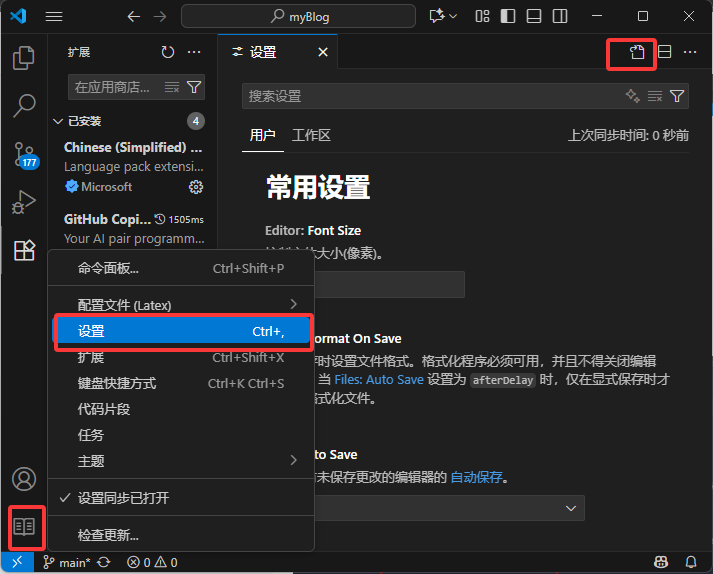

# Latex环境配置

## 一、TeX Live 下载与安装

- 途径1
    - [TeX Live官网](https://tug.org/texlive/)
- 途径2
    - [清华镜像Latex安装帮助](https://mirror.tuna.tsinghua.edu.cn/help/CTAN/)
    - [清华镜像Latex下载网址](https://mirror.tuna.tsinghua.edu.cn/help/CTAN/)

## 二、创建新的配置文件用于Latex

[跳转到相关教程](/实用工具教程/VSCode/VSCode多语言环境配置.html#二、vscode多配置文件)

## 三、下载必备插件


## 四、编辑Latex环境设置

### 1. 打开设置文件

依次点击：

左下角齿轮 ⚙️ → 设置
在右上角点击 “打开设置 (JSON)”

如下图所示：



### 2. 粘贴配置内容

将以下配置粘贴到 settings.json 文件中（原有配置不要删除，可以合并）：

```json
{
 //------------------------------LaTeX 配置----------------------------------
    // 设置是否自动编译
    "latex-workshop.latex.autoBuild.run":"onSave",
    //右键菜单
    "latex-workshop.showContextMenu":true,
    //从使用的包中自动补全命令和环境
    "latex-workshop.intellisense.package.enabled": true,
    //编译出错时设置是否弹出气泡设置
    "latex-workshop.message.error.show": false,
    "latex-workshop.message.warning.show": false,
    // 编译工具和命令
    "latex-workshop.latex.tools": [
        {
            "name": "xelatex",
            "command": "xelatex",
            "args": ["-synctex=1","-interaction=nonstopmode","-file-line-error","%DOCFILE%"]
        },
        {
            "name": "pdflatex",
            "command": "pdflatex",
            "args": ["-synctex=1","-interaction=nonstopmode","-file-line-error","%DOCFILE%"]
        },
        {
            "name": "latexmk",
            "command": "latexmk",
            "args": ["-synctex=1","-interaction=nonstopmode","-file-line-error","-pdf","-outdir=%OUTDIR%","%DOCFILE%"]
        },
        {
            "name": "bibtex",
            "command": "bibtex",
            "args": ["%DOCFILE%"]
        },
        {
            "name": "biber",
            "command": "biber",
            "args": ["%DOCFILE%"]
        }
    ],
    // 用于配置编译链
    "latex-workshop.latex.recipes": [
        {
            "name": "XeLaTeX（中文文档快速编译）",
            "tools": ["xelatex"]
        },
        {
            "name": "PDFLaTeX（英文文档快速编译）",
            "tools": ["pdflatex"]
        },
        {
            "name": "BibTeX（仅运行 BibTeX，用于调试引用）",
            "tools": ["bibtex"]
        },
        {
            "name": "LaTeXmk（英文文档自动多次编译）",
            "tools": ["latexmk"]
        },
        {
            "name": "XeLaTeX×2（两次编译，生成目录与交叉引用）",
            "tools": ["xelatex", "xelatex"]
        },
        {
            "name": "XeLaTeX→Biber→XeLaTeX×2（★推荐★ 中文论文 + biblatex + biber）",
            "tools": ["xelatex", "biber", "xelatex", "xelatex"]
        },
        {
            "name": "XeLaTeX→BibTeX→XeLaTeX×2（旧模板 中文论文 + bibtex）",
            "tools": ["xelatex", "bibtex", "xelatex", "xelatex"]
        },
        {
            "name": "PDFLaTeX→BibTeX→PDFLaTeX×2（英文论文）",
            "tools": ["pdflatex", "bibtex", "pdflatex", "pdflatex"]
        }
    ],
    //文件清理。此属性必须是字符串数组
    "latex-workshop.latex.clean.fileTypes": [
        "*.aux",
        "*.bbl",
        "*.blg",
        "*.idx",
        "*.ind",
        "*.lof",
        "*.lot",
        "*.out",
        "*.toc",
        "*.acn",
        "*.acr",
        "*.alg",
        "*.glg",
        "*.glo",
        "*.gls",
        "*.ist",
        "*.fls",
        "*.log",
        "*.fdb_latexmk"
    ],
    //设置为onFaild 在构建失败后清除辅助文件
    "latex-workshop.latex.autoClean.run": "never",
    // 使用上次的recipe编译组合
    "latex-workshop.latex.recipe.default": "lastUsed",
    // 用于反向同步的内部查看器的键绑定。ctrl/cmd +点击(默认)或双击
    "latex-workshop.view.pdf.internal.synctex.keybinding": "double-click",
    // 使用VSCode内置pdf查看器
    "latex-workshop.view.pdf.viewer": "tab",
}
```

### 3. 使用外部PDF查看器（可选）

如果你不喜欢 VSCode 内置的 PDF 预览器，可以改用 SumatraPDF 等外部工具。

只需要在配置中添加如下内容（注意修改路径）：

```json
    //使用 SumatraPDF 预览编译好的PDF文件
    "latex-workshop.view.pdf.viewer": "external",
    // PDF查看器用于在\ref上的[View on PDF]链接
    "latex-workshop.view.pdf.ref.viewer":"auto",
    // 使用外部查看器时要执行的命令。此功能不受官方支持。
    // "latex-workshop.view.pdf.external.viewer.command": "F:/SumatraPDF/SumatraPDF.exe", // 注意修改路径
    // 使用外部查看器时，latex-workshop.view.pdf.external.view .command的参数。此功能不受官方支持。%PDF%是用于生成PDF文件的绝对路径的占位符。
    "latex-workshop.view.pdf.external.viewer.args": [
        "%PDF%"
    ],
    // 将synctex转发到外部查看器时要执行的命令。此功能不受官方支持。
    // "latex-workshop.view.pdf.external.synctex.command": "F:/SumatraPDF/SumatraPDF.exe", // 注意修改路径
    // latex-workshop.view.pdf.external.synctex的参数。当同步到外部查看器时。%LINE%是行号，%PDF%是生成PDF文件的绝对路径的占位符，%TEX%是触发syncTeX的扩展名为.tex的LaTeX文件路径。
    "latex-workshop.view.pdf.external.synctex.args": [
        "-forward-search",
        "%TEX%",
        "%LINE%",
        "-reuse-instance",
        "-inverse-search",
        "\"F:/Microsoft VS Code/Code.exe\" \"F:/Microsoft VS Code/resources/app/out/cli.js\" -r -g \"%f:%l\"", // 注意修改路径
        "%PDF%"
    ],
```

**📌 配置文件重点说明**

以上配置比较长，但主要关注以下几个核心点即可：

- 自动编译：
  "latex-workshop.latex.autoBuild.run":"onSave"
  保存时自动编译，省去手动触发的麻烦。

- 编译工具 & 编译链：
  定义了 xelatex、pdflatex、latexmk、bibtex 等工具。
  提供了多种 编译链 recipes，可以直接选择 **“XeLaTeX2”** 或 “xelatex -> bibtex -> xelatex2”。
  **推荐中文用户用 XeLaTeX**。

- 文件清理：
  "latex-workshop.latex.clean.fileTypes": [...]
  指定编译产生的临时文件类型，一键清理，保持项目整洁。

- PDF 预览与同步：
  默认 VSCode 内置预览器支持 正向/反向搜索。
  如果需要，可以切换到 外部查看器（SumatraPDF） 并开启同步。

**👉 其他配置（如错误提示、补全等）都有详细注释，读者可按需调整。**

## 五、VSCode 编译 `.tex` 文件

### 1. 激活 LaTeX 插件

在项目文件夹中新建一个以 .tex 为后缀的文件，VSCode 会自动激活 LaTeX Workshop 插件：


### 2. 选择编译配方

首次编译时，点击右上角或使用快捷键 Ctrl+Alt+B（Mac：Cmd+Alt+B），选择所需的 编译配方（Recipe），如 XeLaTeX 或 xelatex → bibtex → xelatex*2。


### 3. 自动编译

配置文件中已设置 onSave 模式，之后只需保存文件（Ctrl+S），就会自动触发编译，接着手动双击打开编译后的pdf文件，将其改成“左代码右pdf”的布局后就能实现实时编译查看结果了。

## 六、使用技巧

### 1. 代码 & PDF 分屏

可以选择**手动** 左右分屏 或 上下分屏，一边写代码，一边预览 PDF，提升效率。

### 2. 自动换行

`Alt+Z` → 打开/关闭自动换行，避免长公式或注释超出屏幕。

### 3. 查看编译错误

`.log` 文件：编译后生成的 `.log` 文件会记录详细错误信息。

输出面板：在 VSCode 底部选择 输出 → LaTeX Compiler 查看编译过程与报错位置。

### 4. tex代码与pdf双向跳转

- pdf跳tex：双击pdf要跳转的位置
- tex跳pdf：将光标移至需要跳转的位置，按下 `Ctrl+Alt+J`，实现跳转到pdf指定位置

<!-- ### 4. 快捷键提升效率

`Ctrl+Alt+B`：手动编译

`Ctrl+Alt+V`：切换 PDF 预览

`Ctrl+Shift+P` → LaTeX Workshop: SyncTeX from cursor：正向搜索 → 从源码跳到 PDF 对应位置 -->
