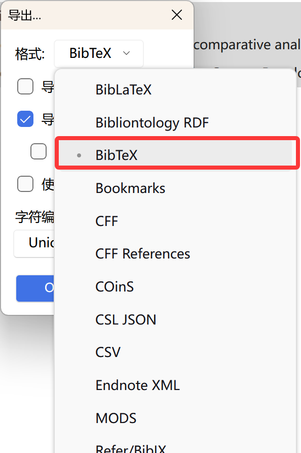
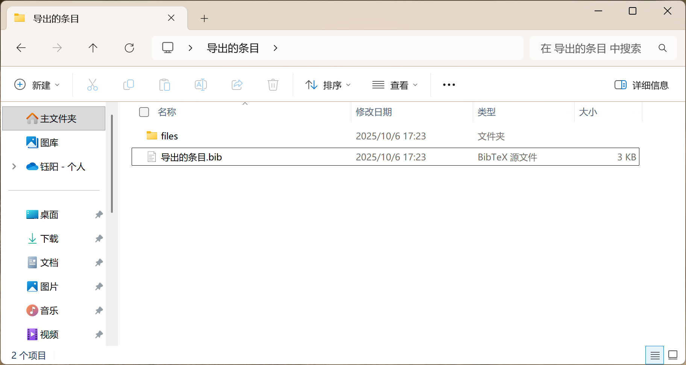

# Zotero教程

Zotero 是一款免费开源的文献管理工具，能帮研究者高效收集、组织、注释和引用研究资料。它可通过浏览器插件一键抓取网页、数据库中的文献信息与 PDF 全文，也能自动识别本地 PDF 的元数据。

写作时，它能与 Word、Google Docs 、 Latex 等深度集成，一键插入引用并按 APA、MLA 等上万种格式自动生成参考文献列表。同时支持跨设备同步、团队协作共享，还可通过丰富插件拓展功能，且由非营利组织开发保障数据安全。

## 下载与安装

[官网下载地址连接](https://www.zotero.org/download/)

按安装包流程安装完成后，打开，内置快速入门指南。

[官方快速指南链接](https://www.zotero.org/start)

## 同步功能

编辑 -> 设置 -> 同步 ，创建账号并登录即可使用同步功能

## 插件下载推荐

[插件市场链接](https://www.zotero.org/support/plugins)

## 导出文献引用文件

在撰写论文或报告时，我们常常需要在 LaTeX 中插入引用，而 Zotero 能非常方便地导出符合要求的 .bib 文献数据库文件。以下是详细步骤。

1. 选中文献并打开导出菜单
在 Zotero 主界面中，选中需要导出的文献条目（可多选），右击后点击 “导出条目…”。

系统将弹出导出设置窗口。

2. 选择导出格式
在“格式”选项中选择 BibTeX，并勾选 “导出文件”。这样不仅会生成 .bib 文献数据库文件，还会同时导出与条目关联的 PDF 文献。

3. 保存导出结果
点击“确定”后，选择保存位置。建议将 .bib 文件放在 LaTeX 项目文件夹中，方便引用。导出完成后，可以看到生成的 .bib 文件以及 files 文件夹：

其中 .bib 文件是文献数据库文件，files 文件夹中存放了对应的 PDF 原文。

## ==其他进阶使用方法博主正在探索中==
