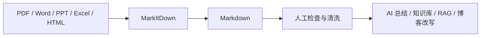

# MarkItDown：把 PDF、Office 和网页转成 Markdown 的文档解析工具

在使用 AI 工具整理资料时，经常会遇到一个问题：资料分散在 PDF、Word、PPT、Excel、网页、图片甚至音频里，直接丢给模型不一定好读，也不方便后续做知识库、检索或笔记整理。

[MarkItDown](https://github.com/microsoft/markitdown) 是 Microsoft 开源的一个 Python 工具，核心用途是把多种文件格式转换成 Markdown。它不是为了做“版式完全还原”的文档转换，而是更偏向把文件内容提取成适合 LLM、文本分析、索引和知识库处理的结构化文本。

::: info 本文适用版本
本文编写于 **2026 年 6 月 8 日**，内容基于 MarkItDown **v0.1.6** 整理。

MarkItDown 仍在持续开发，后续版本可能调整安装方式、命令参数、Python API、插件机制和支持的文件格式。实际使用时，请以 [官方 README](https://github.com/microsoft/markitdown)、[GitHub Releases](https://github.com/microsoft/markitdown/releases) 和 [PyPI 页面](https://pypi.org/project/markitdown/) 中的最新说明为准。
:::

::: important 一句话推荐
如果你经常需要把 PDF、Word、PPT、Excel、网页等资料整理成可以喂给 AI 的 Markdown，MarkItDown 值得放进工具箱。
:::

## 它能做什么

MarkItDown 目前支持的格式比较广，官方 README 中列出的典型格式包括：

| 类型 | 示例 |
| --- | --- |
| 文档 | PDF、Word、PowerPoint、Excel、EPUB |
| 图片 | 图片 EXIF 元数据、OCR |
| 音频 | 音频元数据、语音转写 |
| 网页 | HTML、YouTube URL |
| 文本数据 | CSV、JSON、XML |
| 压缩包 | ZIP 文件，会遍历其中内容 |

它的输出是 Markdown，因此更适合下面这些场景：

- 把论文、报告、课件转成 AI 更容易读取的上下文；
- 把文档资料整理进 Obsidian、VuePress、知识库或 RAG 系统；
- 批量提取 Office 文件中的文本、表格和链接；
- 给 Agent、ChatGPT、Claude、Codex 等工具准备上下文材料；
- 把非 Markdown 资料快速变成可搜索、可复制、可二次编辑的文本。

## 它不适合什么

MarkItDown 的定位需要说清楚：它不是 Pandoc 那类强调文档格式转换的工具，也不是专业 OCR 排版还原软件。

不太适合的场景包括：

- 要求 PDF、Word、PPT 版式完全一致；
- 需要精确保留字体、页眉页脚、复杂表格样式；
- 扫描版 PDF 质量很差，且没有额外 OCR 或视觉模型支持；
- 在服务端直接处理不可信用户输入，但没有做路径、URL、权限隔离。

官方也提醒，MarkItDown 会以当前进程权限进行 I/O 操作，类似 `open()` 或 `requests.get()`，在不可信环境中应该限制输入来源，并优先使用更窄的转换接口。

## 安装要求

MarkItDown 要求 Python 3.10 或更高版本。建议使用虚拟环境，避免和全局 Python 包冲突。

::: tabs#os

@tab Windows

```powershell
python -m venv .venv
.\.venv\Scripts\Activate.ps1
pip install "markitdown[all]"
```

@tab macOS / Linux

```bash
python -m venv .venv
source .venv/bin/activate
pip install "markitdown[all]"
```

@tab Conda

```bash
conda create -n markitdown python=3.12
conda activate markitdown
pip install "markitdown[all]"
```

:::

安装完成后，可以查看命令是否可用：

```bash
markitdown --help
```

如果能看到命令帮助信息，就说明安装成功。

## 基本用法

最常见的用法是直接把文件转成 Markdown：

```bash
markitdown input.pdf -o output.md
```

也可以使用重定向：

```bash
markitdown input.pdf > output.md
```

如果只是想转换 Word、PDF、PPT 这几类文件，也可以不安装全部依赖，而是按需安装：

```bash
pip install "markitdown[pdf,docx,pptx]"
```

这种方式更轻量，适合只处理固定格式的场景。

## 在 Python 中使用

MarkItDown 不只是命令行工具，也可以作为 Python 包使用：

```python
from markitdown import MarkItDown

md = MarkItDown(enable_plugins=False)
result = md.convert("test.xlsx")

print(result.text_content)
```

这个用法适合写批处理脚本，例如把一个文件夹中的 PDF、DOCX、PPTX 全部转成 Markdown。

一个简单的批量转换示例：

```python
from pathlib import Path
from markitdown import MarkItDown

md = MarkItDown(enable_plugins=False)

input_dir = Path("docs")
output_dir = Path("markdown")
output_dir.mkdir(exist_ok=True)

for file_path in input_dir.iterdir():
    if file_path.suffix.lower() not in [".pdf", ".docx", ".pptx", ".xlsx", ".html"]:
        continue

    result = md.convert(str(file_path))
    output_path = output_dir / f"{file_path.stem}.md"
    output_path.write_text(result.text_content, encoding="utf-8")

    print(f"converted: {file_path.name} -> {output_path.name}")
```

## 常见使用场景

### 1. 给 AI 准备资料

很多时候，直接上传 PDF 或 PPT 给模型，效果不稳定。先用 MarkItDown 转成 Markdown，可以让文本结构更清楚：

```bash
markitdown lecture.pdf -o lecture.md
```

然后再把 `lecture.md` 作为上下文提供给 AI，用来做总结、问答、知识点提取或博客改写。

### 2. 整理知识库

如果你在维护个人知识库，可以把各种格式的资料统一转成 Markdown，再放进 Obsidian、VuePress 或其他静态站点中。

例如把报告文档转成 Markdown：

```bash
markitdown report.docx -o report.md
```

后续只需要手动检查标题层级、表格和图片说明即可。

### 3. 处理表格和结构化数据

MarkItDown 也可以处理 Excel、CSV、JSON、XML 等文件。对于需要交给 LLM 分析的数据，Markdown 往往比原始二进制文件更方便查看和修改。

```bash
markitdown data.xlsx -o data.md
```

需要注意的是，如果表格非常复杂，转换后的 Markdown 可能还需要人工整理。

### 4. 处理带图片的文档

MarkItDown 支持通过 LLM 生成图片描述。对于 PPTX 和图片文件，可以传入 `llm_client` 和 `llm_model`：

```python
from markitdown import MarkItDown
from openai import OpenAI

client = OpenAI()

md = MarkItDown(
    llm_client=client,
    llm_model="gpt-4o",
    llm_prompt="Describe this image for document understanding.",
)

result = md.convert("example.jpg")
print(result.text_content)
```

这里需要配置对应模型服务的 API Key。不要把 API Key 写进代码仓库，建议使用环境变量管理。

## 插件机制

MarkItDown 支持插件，但插件默认不启用。可以先列出当前安装的插件：

```bash
markitdown --list-plugins
```

启用插件转换文件：

```bash
markitdown --use-plugins input.pdf -o output.md
```

官方还提供了 `markitdown-ocr` 插件，用于通过 LLM Vision 从 PDF、DOCX、PPTX、XLSX 中的图片提取文字。

安装：

```bash
pip install markitdown-ocr
pip install openai
```

Python 用法示例：

```python
from markitdown import MarkItDown
from openai import OpenAI

md = MarkItDown(
    enable_plugins=True,
    llm_client=OpenAI(),
    llm_model="gpt-4o",
)

result = md.convert("document_with_images.pdf")
print(result.text_content)
```

::: warning API Key 安全
涉及视觉模型、云端 OCR 或 Azure 服务时，文件内容可能会被发送到外部 API。处理论文、合同、课题材料、隐私文件前，需要先确认数据是否允许上传。
:::

## 和 Pandoc 的区别

Pandoc 更像是通用文档格式转换器，适合在 Markdown、LaTeX、HTML、DOCX、EPUB 等格式之间转换，并关注文档结构与发布格式。

MarkItDown 的重点不同：它更像是“面向 AI 和文本分析的内容抽取器”。它会尽量保留标题、列表、表格、链接等结构，但目标不是生成精美排版，而是生成模型和程序更容易消费的 Markdown。

简单来说：

| 工具 | 更适合 |
| --- | --- |
| Pandoc | 文档格式转换、写作发布、LaTeX / Word / HTML 互转 |
| MarkItDown | 文件内容抽取、AI 上下文整理、知识库导入、RAG 预处理 |

## 推荐工作流

我更推荐把 MarkItDown 放在“资料进入 AI 工作流之前”的位置：



这个流程的好处是：先把资料变成可读、可复制、可版本管理的 Markdown，再进行二次加工。这样比直接把各种文件丢给 AI 更可控，也更方便复用。

## 使用建议

如果只是个人使用，可以直接安装：

```bash
pip install "markitdown[all]"
```

如果是在项目中使用，建议按需安装依赖，例如：

```bash
pip install "markitdown[pdf,docx,pptx,xlsx]"
```

如果是在服务端处理用户上传文件，需要重点注意：

- 限制文件类型和文件大小；
- 不要直接处理用户传入的任意路径或 URL；
- 对网络访问、私有地址和元数据地址做限制；
- 对转换结果进行人工或规则校验；
- 涉及外部 LLM / OCR 服务时确认数据合规性。

## 总结

MarkItDown 的价值不在于“把所有文件完美转成 Markdown”，而在于它为 AI 时代的资料处理提供了一个很实用的中间层：把复杂文件尽量转成结构清晰、方便检索、方便喂给模型的 Markdown。

对于经常整理论文、课件、报告、网页资料，或者正在搭建个人知识库、RAG、Agent 工作流的人来说，它是一个值得收藏的开源工具。

## 参考资料

- [microsoft/markitdown GitHub 仓库](https://github.com/microsoft/markitdown)
- [MarkItDown PyPI 页面](https://pypi.org/project/markitdown/)
- [MarkItDown OCR Plugin README](https://github.com/microsoft/markitdown/blob/main/packages/markitdown-ocr/README.md)
- [MarkItDown Releases](https://github.com/microsoft/markitdown/releases)