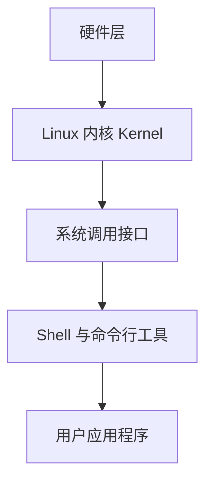
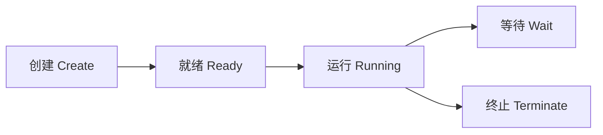

# Linux 入门

Linux 是一套稳定、安全、强大的开源操作系统，它支撑着世界上绝大多数服务器、云计算平台和开发环境。  
本篇旨在帮助初学者建立对 Linux 的整体认识，理解它的思想、结构与使用方式。

---

## 🧭 一、Linux 是什么？

### 1️⃣ 起源
- Linux 起源于 1991 年，由芬兰程序员 **Linus Torvalds** 编写内核。  
- 它受 **Unix** 启发，完全开源，全球开发者共同维护。

### 2️⃣ 特点
- **开源自由**：任何人都可使用、修改和分发。
- **稳定可靠**：广泛用于服务器、嵌入式、科研集群。
- **安全多用户**：权限控制严格，用户隔离。
- **高度可定制**：命令行驱动，可自由配置系统。

### 3️⃣ 与 Windows 的区别
| 对比项 | Linux | Windows |
|--------|--------|----------|
| 内核类型 | 开源 | 闭源 |
| 操作方式 | 命令行为主 | 图形界面为主 |
| 文件系统 | 一切皆文件 | 文件 + 注册表 |
| 用户体系 | 多用户严格区分 | 单用户为主 |
| 软件安装 | 包管理器（apt、yum 等） | 安装程序（.exe） |
| 应用场景 | 服务器 / 开发 / 云计算 | 桌面办公 / 游戏 |

---

## 🧩 二、Linux 的核心组成

Linux 并不是一个单独的程序，而是多个部分协同工作的系统：

| 模块 | 说明 |
|------|------|
| **内核 (Kernel)** | 系统核心，负责内存、进程、设备等底层管理 |
| **Shell** | 用户与系统的交互层（命令行解释器） |
| **文件系统 (File System)** | 组织与存储数据的结构体系 |
| **用户空间 (User Space)** | 运行应用程序的区域 |
| **系统工具** | 提供配置、维护与开发的命令工具 |

### 📊 结构示意图


## 📁 三、文件系统与路径哲学

Linux 的一大理念是：**“一切皆文件”**。  
无论是硬盘、设备、进程、网络接口，甚至内存，都以文件的形式存在。

---

### 📂 目录层级结构

Linux 使用树状文件系统结构，根目录 `/` 是所有路径的起点。

| 目录 | 说明 |
|------|------|
| `/` | 根目录，系统的起点 |
| `/bin` | 基本命令，如 `ls`、`cp`、`mv` |
| `/sbin` | 系统管理命令（需 root 权限） |
| `/etc` | 配置文件目录 |
| `/home` | 普通用户的主目录 |
| `/root` | 超级用户 root 的家目录 |
| `/var` | 可变数据，如日志、缓存等 |
| `/tmp` | 临时文件（重启后清空） |
| `/dev` | 设备文件（硬盘、USB、终端等） |
| `/proc` | 虚拟文件系统，保存内核与进程信息 |
| `/usr` | 用户安装的软件与库文件 |

📘 示例：
```
/etc/ssh/sshd_config → SSH 服务配置文件
/home/goatyang/ → 用户主目录
/var/log/syslog → 系统日志
```

---

## 🧠 四、Linux 的核心思想

### 🧱 1. 一切皆文件
系统中的一切资源都抽象为文件：
- 文件（普通文件）
- 目录（文件夹）
- 设备（如 `/dev/sda`）
- 网络接口（如 `/proc/net/`）
- 进程（如 `/proc/1234`）

📘 示例：
```bash
cat /proc/cpuinfo     # 以文件方式查看 CPU 信息
cat /proc/meminfo     # 查看内存使用情况
```

### 🔧 2. 小而精的工具哲学

Linux 倡导“让每个程序只做一件事，并且做好”。
命令通过管道 `|` 串联，构成强大的操作流。

📘 示例：
```bash
ps aux | grep nginx | wc -l
```

→ 查找正在运行的 nginx 进程数量。

### 🔗 3. 一切可组合

简单命令可通过脚本或管道组合成复杂操作。
这使 Linux 拥有极高的灵活性和可扩展性。

📘 示例：
```bash
cat access.log | grep "404" | sort | uniq -c | sort -nr | head
```

→ 统计网站 404 错误最多的访问路径。

---

### 🧍 4. 权限与安全至上

Linux 是严格的多用户系统，每个文件、进程和端口都有访问控制。
普通用户与管理员（root）权限隔离，安全性远高于单用户系统。

---

## 👥 五、用户与角色体系

Linux 系统区分不同用户类型，每类用户拥有不同权限。

| 用户类型 | 权限级别     | 用途                    |
| ---- | -------- | --------------------- |
| root | 最高权限     | 系统管理、驱动、配置修改          |
| 普通用户 | 受限       | 日常操作与开发               |
| 系统用户 | 特定服务运行账户 | 运行守护进程（如 nginx、mysql） |

### 🔐 提权与切换
```bash
sudo command     # 临时以管理员权限执行
su root          # 切换到 root 用户
```

💡 建议：

- 不长期登录 root。
- 使用 sudo 执行高权限命令更安全。
---

## ⚙️ 六、Shell 与命令行交互
### 💬 什么是 Shell？

Shell 是用户与系统内核之间的交互层，负责解析命令、执行操作、输出结果。
常见类型：

| Shell | 特点                     |
| ----- | ---------------------- |
| bash  | 默认最常见，功能全面             |
| zsh   | 个性化强，配合 oh-my-zsh 美观实用 |
| fish  | 智能提示，交互体验优良            |
---

### ⚡ Shell 的职责

1. 接收命令输入
2. 调用系统接口执行操作
3. 将结果输出至终端
---

## 🔄 七、进程与系统运行

在 Linux 中，**一切运行的程序都是进程（Process）**。
每个进程都有唯一的 **PID（进程号）** 来标识。

### 🧩 进程生命周期



📘 示例：
```bash
ps -ef | grep nginx
kill -9 1234
```

→ 查看并终止进程。

### 🧠 守护进程（Daemon）

后台持续运行、提供系统服务的进程。
命名惯例常以 `d` 结尾：

| 守护进程      | 功能         |
| --------- | ---------- |
| `sshd`    | 远程登录服务     |
| `systemd` | 系统初始化与服务管理 |
| `crond`   | 定时任务服务     |


## 🧰 八、软件与包管理体系

Linux 的软件安装与更新并非通过 `.exe` 安装程序完成，而是依靠 **包管理系统（Package Manager）**。  
包管理器负责统一安装、升级、卸载与依赖管理，让系统软件始终保持一致性与可控性。

---

### 📦 1. 软件包的概念

软件包（Package）是一个包含程序、配置、依赖描述和安装脚本的归档文件。  
包管理系统通过这些信息完成自动安装与配置，而无需手动操作文件。

---

### 🧩 2. 常见的包管理体系

不同 Linux 发行版使用不同的包管理工具与格式：

| 发行版 | 包管理器 | 包格式 |
|---------|-----------|--------|
| Ubuntu / Debian | `APT` | `.deb` |
| Fedora / RHEL / CentOS | `DNF` / `YUM` | `.rpm` |
| Arch Linux | `pacman` | `.pkg.tar.zst` |
| openSUSE | `zypper` | `.rpm` |

这些包管理器都能通过命令行或图形界面执行安装、更新与删除操作。

---

### ⚙️ 3. 软件源（Repository）

包管理器依赖软件仓库（Repository）来获取和验证软件包。  
软件源相当于一个集中分发的服务器，包含经过签名的程序集合。  
用户可切换镜像源以提升下载速度，或添加第三方源以安装非官方软件。

---

### 🔧 4. 依赖管理机制

Linux 软件往往依赖多个库文件。  
包管理器能：
- 自动安装依赖项  
- 阻止冲突版本共存  
- 清理不再需要的依赖  

这种依赖树式的机制，是 Linux 系统稳定运行的关键。

---

### 💡 5. 包管理的意义

包管理系统让 Linux：
- 保持一致性与可追踪性  
- 支持批量更新与版本回退  
- 提升安全性（所有包都有签名与校验）  
- 降低维护复杂度  

在现代 Linux 中，包管理系统是系统维护的中枢组件。

---

## 🌐 九、远程与网络操作

Linux 从设计之初就面向网络环境，具备强大的远程控制与网络通信能力。  
服务器、云计算与集群管理的基础都是建立在这些机制之上。

---

### 🌍 1. 网络体系基础

Linux 将网络接口、设备与连接统一抽象为文件或虚拟节点。  
系统通过内核网络栈（Network Stack）处理数据包，实现 IP、端口、协议等多层通信。

- 网络接口通常命名为 `eth0`、`ens33`、`wlan0` 等。  
- 每个接口可绑定多个 IP 地址与端口。  
- 内核维护路由表与防火墙规则，以控制通信流向。

---

### 🔐 2. 远程访问与控制（SSH）

SSH（Secure Shell）是 Linux 最常用的远程连接协议。  
它支持加密通信、密钥认证与端口转发，是运维与开发环境的核心工具。

- 可安全登录远程主机并执行命令  
- 支持密钥登录、隧道代理与自动化脚本调用  
- 取代传统的 Telnet 与 FTP，提供更高安全性

SSH 不仅用于登录服务器，也可实现安全的文件传输与代理功能。

---

### 📦 3. 文件传输机制

Linux 提供多种基于加密的文件传输方式：

- **SCP（Secure Copy）**：使用 SSH 协议进行安全文件复制  
- **SFTP（Secure File Transfer Protocol）**：提供交互式传输接口  
- **rsync**：支持断点续传、差异同步和批量备份  

这些工具广泛用于数据迁移、备份与远程部署。

---

### 🧩 4. 端口与网络服务

在 Linux 中，几乎所有网络通信都基于端口进行。  
常见端口示例：
- 22：SSH  
- 80 / 443：HTTP / HTTPS  
- 3306：MySQL  
- 6379：Redis  

系统通过守护进程（Daemon）监听端口提供服务，管理员可通过防火墙规则控制访问范围。

---

### 🚪 5. 防火墙与网络安全

Linux 的防火墙框架（如 **iptables**、**nftables**、**ufw**）允许管理员：
- 允许或拒绝指定端口访问  
- 定义入站与出站流量策略  
- 实现 NAT、端口映射与限流规则  

安全性是 Linux 网络管理的核心目标，因此防火墙通常默认启用。

---

### 💼 6. 网络调试与监控

Linux 内置强大的网络诊断与监控工具，可用于：
- 检查网络连通性与路由  
- 追踪数据包传输路径  
- 分析端口占用与连接状态  
- 实时查看带宽使用与流量统计  

这些工具是排查网络异常、优化连接性能的重要手段。

---

### 💡 7. 网络理念与优势

Linux 在网络管理上的优势体现为：
- 全命令行可控，无需图形界面  
- 网络层完全开放，适合开发与调试  
- 系统级服务（如 SSH、Firewall、Routing）高度集成  
- 可靠、安全、灵活，适合服务器与云环境  

---
