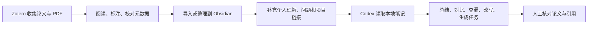

# Obsidian + Zotero + Codex：AI 辅助科研工作流

Zotero、Obsidian 和 Codex 分别解决三个不同问题：Zotero 管论文和引用，Obsidian 管自己的理解和知识网络，Codex 帮你在本地文件基础上做整理、检查、改写和研究辅助。

这套流程的关键不是把所有资料都丢给 AI，而是先把资料整理成可追溯的本地文本，再让 Codex 在明确范围内处理这些内容。这样既能利用 AI 的归纳和重组能力，也能保留论文来源、批注和人工判断。

> 本文写作与验证时间为 **2026-07-06**。Zotero、Obsidian 插件和 Codex 客户端更新较快，具体入口以官方文档和当前客户端为准。

## 核心分工

| 工具 | 负责什么 | 不建议负责什么 |
|---|---|---|
| Zotero | 收集论文、管理 PDF、校对元数据、做批注、插入引用、导出参考文献 | 承担长期知识网络和项目主线 |
| Obsidian | 保存论文理解、概念关系、项目脉络、实验记录和阶段总结 | 替代 Zotero 管 PDF 与引用格式 |
| Codex | 读取本地笔记，辅助总结、对比、查漏、改写和生成研究任务 | 替你确认论文结论或虚构引用 |

推荐的基本链路是：



## 第一步：用 Zotero 管论文源头

Zotero 中要尽量保证每篇论文是一个完整条目，而不是一堆散落的 PDF。

建议流程：

1. 用 Zotero Connector 从期刊页面、数据库、Google Scholar 或 DOI 页面保存条目；
2. 检查标题、作者、年份、期刊或会议、DOI 等元数据；
3. 把 PDF 作为条目的附件保存，而不是单独放一个孤立文件；
4. 阅读时在 Zotero PDF Reader 中做高亮、批注和笔记；
5. 写作或导出时再使用 Zotero 的引用和参考文献功能。

Zotero 官方文档建议通过浏览器连接器添加条目，以获得更可靠的文献信息；PDF 等文件也最好作为文献条目的附件管理，因为孤立附件缺少引用所需的书目信息。

## 第二步：把论文内容进入 Obsidian

把 Zotero 内容放进 Obsidian 有两种方式。

### 方式一：用 Zotero Integration 自动导入

如果你希望从 Zotero 中搜索条目、导入引用、参考文献、笔记或 PDF 批注，可以使用 Obsidian 社区插件 **Zotero Integration**。该插件项目说明中写明，它用于把 Zotero 中的 citations、bibliographies、notes 和 PDF annotations 导入 Obsidian，并依赖 Better BibTeX for Zotero。

大致流程：

1. 在 Zotero 中安装并配置 Better BibTeX；
2. 在 Obsidian 中开启 Community plugins；
3. 搜索并安装 `Zotero Integration`；
4. 在插件设置中选择 Zotero 数据库、导入位置和引用格式；
5. 通过插件提供的搜索或导入命令，把目标论文的信息和批注写入 Obsidian。

这种方式适合已经大量使用 Zotero 批注，或者希望论文笔记中保留 citation key、Zotero 链接和原始批注的人。

::: warning 版本兼容
Zotero、Better BibTeX 和 Obsidian 插件版本会变化。配置前先确认当前插件说明、Zotero 版本和 Better BibTeX 版本是否兼容。
:::

### 方式二：手动整理

如果不想引入社区插件，可以先用更保守的方式：

1. 在 Zotero 中读论文并做批注；
2. 在 Obsidian 中新建一篇论文笔记；
3. 手动复制论文题目、作者、年份、DOI 或 Zotero 链接；
4. 把真正有用的高亮改写成自己的理解；
5. 用双链连接到相关概念、项目和实验记录。

手动方式慢一些，但结构更可控，也更适合刚开始建立流程的人。

## 第三步：在 Obsidian 中写“可被 AI 使用”的笔记

Codex 要发挥作用，前提是本地笔记本身足够清楚。论文笔记至少应该包含：

- 论文解决什么问题；
- 方法核心是什么；
- 实验如何设计；
- 结果是否支持作者结论；
- 对自己当前课题有什么启发；
- 哪些地方还没看懂；
- 这篇论文和哪些概念、项目、实验有关。

不建议只保存摘要、标题和高亮。那样 Codex 只能帮你重新复述资料，很难帮你做研究判断。

一篇论文笔记最好区分三类内容：

| 内容 | 说明 |
|---|---|
| 原文信息 | 标题、作者、年份、DOI、引用键、Zotero 链接 |
| 阅读记录 | 批注、高亮、作者的方法和结果 |
| 个人加工 | 自己的理解、质疑、启发、后续行动 |

后续让 Codex 处理时，要优先让它基于“个人加工”和“阅读记录”工作，并要求它保留来源文件名。

## 第四步：把 Obsidian Vault 连接给 Codex

Obsidian Vault 本质上是一个本地文件夹，因此可以把它当作 Codex 的工作区。连接方式取决于你使用的是 Codex App、Codex CLI 还是 IDE 扩展，原则相同：

1. 只打开需要处理的 Vault 或子目录；
2. 让 Codex 先读取相关文件列表和笔记；
3. 明确告诉 Codex 哪些文件可以修改、哪些只能读取；
4. 要求 Codex 输出可检查的来源、假设和未确认点；
5. 修改笔记前先让 Codex 说明修改范围。

如果你的 Vault 很大，建议不要一次性让 Codex 扫描全部内容。可以先指定一个项目目录、一组论文笔记，或者一篇综述草稿。

也建议在知识库根目录放一个简短的 `AGENTS.md`，写清楚以下规则：

- 不要改写原始摘录和原始批注；
- 不要虚构论文、作者、年份、DOI 和引用；
- 总结必须标注来源笔记文件名；
- 不确定的内容要写成“待核对”，不要写成结论；
- 涉及批量修改前先列出计划和影响范围。

Codex 官方文档把 `AGENTS.md` 作为可复用项目指令，它适合保存这类长期规则。

## 第五步：让 Codex 做适合它的事

Codex 更适合处理已经进入本地知识库的材料。下面这些任务比较适合：

| 任务 | 示例 |
|---|---|
| 多篇论文对比 | 按研究问题、方法、实验和局限整理成表格 |
| 综述大纲 | 根据已有笔记生成章节结构和论证顺序 |
| 查漏 | 找出草稿中没有来源支持的判断 |
| 研究问题整理 | 从论文不足和实验现象中提炼后续问题 |
| 实验计划 | 把项目笔记和实验记录整理成下一轮实验清单 |
| 写作辅助 | 把零散笔记改成更连贯的小节初稿 |

可以直接这样提问：

```text
请只读取当前文件夹中的论文笔记，按“研究问题、方法核心、实验设置、主要结论、局限”做对比表。
每一行必须标注来源文件名。
如果某个信息在笔记中没有出现，请写“未记录”，不要补全。
```

或者：

```text
请根据这些 Obsidian 笔记，为我的文献综述生成一个三级大纲。
要求：
1. 每个二级标题后列出支持它的来源笔记；
2. 标出目前材料不足的部分；
3. 不要新增我笔记中不存在的论文。
```

再比如：

```text
请读取项目笔记和实验记录，整理下一轮实验计划。
输出包括：实验目的、需要固定的变量、需要比较的方法、评价指标、预期风险。
不要修改文件，先给我计划。
```

## 第六步：把 AI 输出重新沉淀回知识库

Codex 的输出不要直接当成结论。更稳妥的做法是：

1. 先把输出作为草稿；
2. 回到 Zotero 或原 PDF 核对关键结论；
3. 把确认后的内容写回 Obsidian；
4. 把未确认内容标成待核对；
5. 对重要草稿保留修改记录。

如果你用 Git 管理 Obsidian Vault，每次大规模整理前先提交一次快照。这样即使 Codex 批量修改了笔记，也能通过 diff 检查改动。

## 使用边界

这套工作流最容易出问题的地方是“来源断裂”。只要 AI 输出脱离了 Zotero 条目、原始论文或 Obsidian 笔记，就很容易出现看似合理但无法引用的内容。

建议遵守几条边界：

- 不让 Codex 编造参考文献；
- 不让 Codex 直接替代论文阅读；
- 不把未公开数据、敏感材料或不该上传的全文交给在线服务；
- 不把 AI 生成的推断写成已验证事实；
- 不在没有备份的情况下让 Codex 批量改整个 Vault。

AI 辅助科研的价值在于加快整理、比较、查漏和表达，不在于替代判断。

## 最小可行流程

如果从零开始，可以先跑通这个闭环：

1. 用 Zotero 收集 3 到 5 篇同一方向的论文；
2. 阅读时在 Zotero 中做高亮和批注；
3. 把每篇论文的关键信息整理到 Obsidian；
4. 用双链连接相关概念和项目；
5. 让 Codex 只基于这些笔记生成对比表；
6. 人工核对对比表，把可靠内容写回项目笔记；
7. 根据缺口继续读下一批论文。

这比一开始追求完整自动化更稳。等手动流程跑顺后，再逐步增加 Zotero Integration、Better BibTeX、Bases、Git 和更复杂的 Codex 规则。

## 参考资料

- [Zotero：Adding Items to Zotero](https://www.zotero.org/support/adding_items_to_zotero)
- [Zotero：Adding Files to your Zotero Library](https://www.zotero.org/support/attaching_files)
- [Obsidian：How Obsidian stores data](https://obsidian.md/help/data-storage)
- [Obsidian：Core plugins](https://obsidian.md/help/plugins)
- [Obsidian Zotero Integration 项目说明](https://github.com/obsidian-community/obsidian-zotero-integration)
- [Better BibTeX for Zotero](https://retorque.re/zotero-better-bibtex/)
- [Codex：Prompting](https://developers.openai.com/codex/prompting)
- [Codex：AGENTS.md](https://developers.openai.com/codex/guides/agents-md)
- [Codex：Best practices](https://developers.openai.com/codex/learn/best-practices)
