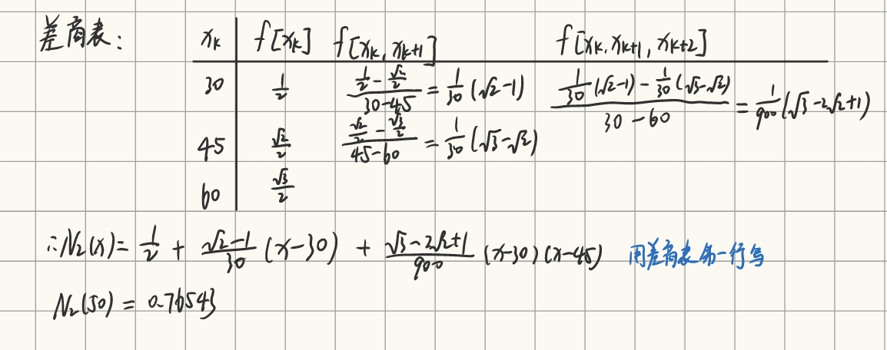

# 计算方法必考题

## 1. 误差的分类

```markmap
---
markmap:
  colorFreezeLevel: 2
---
# 误差的分类

## 模型误差

- 在将实际问题抽象为数学模型时，由于 ==对问题的简化或假设== 而产生的误差

## 观测误差

- 通过仪器或人工对物理量进行测量时，由于 ==仪器精度、环境干扰或人为操作== 等因素导致的误差

## 截断误差（方法误差）

- 在数值计算中，用 ==近似方法替代精确算法== 时产生的误差（如无穷级数求和时取前若干项）

## 舍入误差

- 由于计算机或计算器对数值进行 ==有限位存储和运算== （如四舍五入）而产生的误差
```

:::info 填空题
误差的分类
:::

## 2. 求近似值的有效数字位数

**定义:**  若 $| x-x^* | \leq 0.5 \times 10^{-k}$ , 则 x 从左起第一个非零数字到第 k 位数字均为有效数字，共 k 位。

**判定规则：**
1. 非零开头数：从左起第一个非零数字开始，到最末一位数字为止，所有数字均为有效数字
2. 科学计数法表示的数：形如 $a \times 10^n$ 时，有效数字由数字 a 决定
3. 整数末尾的零：需说明精度
    - 如果末尾零是有效数字
    - 如果仅为定位作用，不算有效数字
4. 运算结果的有效数字：
    - 加法与减法：结果应保留到小数点后最少位数的那个数的小数位数。例如，$3.14 + 2.5 = 5.6$（因为 $2.5$ 只有一位小数）。
    - 乘法与除法：结果应保留与参与运算中有效数字最少的数相同的有效数字位数。例如，$1.23 \times 0.0045 = 0.0055$（因为 $0.0045$ 有 2 位有效数字，结果也应保留 2 位有效数字）。
:::info 填空题
求近似值有效位数
:::

## 3. 秦九韶法求多项式的值

:::important 计算题
求 $f(x)=2+x-x^2+3x^4$ 在点 $x_0=2$ 处的值

:::

## 4. LU分解法求方程的解

:::important 计算题
$$
\begin{bmatrix}
2 & 2 & -1 \\
1 & -1 & 0 \\
4 & -2 & -1
\end{bmatrix}
\begin{bmatrix}
x_1 \\ x_2 \\ x_3
\end{bmatrix}
=
\begin{bmatrix}
-4 \\ 0 \\ -6
\end{bmatrix}
$$


:::

## 5. 向量范数与矩阵范数

| 类型       | 向量 $1$ 范数 $\|\mathbf{x}\|_1$             | 向量 $\infty$ 范数 $\|\mathbf{x}\|_\infty$      | 矩阵 $1$ 范数 $\|\mathbf{A}\|_1$               | 矩阵 $\infty$ 范数 $\|\mathbf{A}\|_\infty$     |
|------------|--------------------------------------------|-----------------------------------------------|----------------------------------------------|-----------------------------------------------|
| **公式**   | $\sum\limits_{i=1}^{n}\|x_i\|$            |   $\max\limits_i \|x_i\|$                         | $\max\limits_j \sum\limits_i \|a_{ij}\|$      | $\max\limits_i \sum\limits_j \|a_{ij}\|$        |
| **本质**   | 元素绝对值之和                                | 最大元素绝对值                                 | 最大列元素绝对值之和                         | 最大行元素绝对值之和                          |
| **示例**   | $\lVert[2,-3,0,5]\rVert_1 = 10$             | $\lVert[2,-3,0,5]\rVert_{\infty} = 5$                 | $\left\lVert\begin{bmatrix}1 & -2 \\ 3 & 4 \\ -1 & 0\end{bmatrix}\right\rVert_1 = 6$ | $\left\lVert\begin{bmatrix}1 & -2 \\ 3 & 4 \\ -1 & 0\end{bmatrix}\right\rVert_{\infty} = 7$ |

| 类型         | 公式                          | 本质                                                                 | 计算示例（以向量 $\mathbf{x} = [2, -3, 5]$ 和矩阵 $A = \begin{bmatrix}1&-2\\3&4\end{bmatrix}$ 为例）                |
|--------------|-------------------------------|----------------------------------------------------------------------|-----------------------------------------------------------------------------|
| **向量二范数** | $\lVert \mathbf{x} \rVert_2 = \sqrt{\sum_{i=1}^{n} \|x_i\|^2}$ | 欧氏空间中向量的长度（模长） | $\lVert \mathbf{x} \rVert_2 = \sqrt{2^2 + (-3)^2 + 5^2} = \sqrt{38} \approx 6.16$ |  
| **矩阵二范数（谱范数）** | $\lVert A \rVert_2 = \sqrt{\lambda_{\text{max}}(A^T A)}$ | 矩阵 $A^T A$ 的最大特征值的平方根，反映矩阵对向量的最大“拉伸”能力 | 1. 计算 $A^T A = \begin{bmatrix}1&3\\-2&4\end{bmatrix}\begin{bmatrix}1&-2\\3&4\end{bmatrix} = \begin{bmatrix}10&10\\10&20\end{bmatrix}$ <br> 2. 求特征值：$\lambda_1 = 30, \lambda_2 = 0$ <br> 3. $\lVert A \rVert_2 = \sqrt{30} \approx 5.48$ |

:::info 填空题
向量范数和矩阵范数的一范数和无穷范数
:::

## 6. 雅可比迭代法与高斯-赛德尔迭代法

### 迭代矩阵

设线性方程组为 $Ax = b$，其中 $A \in \mathbb{R}^{n \times n}$ 为非奇异矩阵。将 $A$ 分解为：
- $D = \mathrm{diag}(a_{11}, a_{22}, \dots, a_{nn})$，对角元素构成的对角矩阵；
- $L$ 为严格下三角矩阵（主对角线元素为 $0$）；
- $U$ 为严格上三角矩阵（主对角线元素为 $0$）；满足：$A = D + L + U$

==雅可比迭代矩阵== : 
$$J=-D^{-1}(L+U)$$

雅可比迭代格式：
$$x^{(k+1)} = Jx^{(k)}+D^{-1}b$$

==高斯-赛德尔迭代矩阵== ：
$$G=-(D+L)^{-1}U$$

高斯赛德尔迭代公式：
$$x^{(k+1)} = Gx^{(k)}+(D+L)^{-1}b$$

:::info 填空题
雅可比迭代法和高斯-赛德尔迭代法的迭代矩阵
:::

## 7. 拉格朗日插值多项式

### 公式

拉格朗日插值基函数：
$$l_i(x) = \prod\limits_{\substack{j=0 \\ j \ne i}}^{n} \frac{x - x_j}{x_i - x_j}$$

n次拉格朗日插值多项式（n+1个点）：
$$L_n(x) = \sum\limits_{i=0}^{n} f(x_i) \cdot l_i(x)$$

:::tabs
@tab 二次 3个点
$$
L_2(x) = f(x_0)l_0(x) + f(x_1)l_1(x) + f(x_2)l_2(x) \\
l_0(x) = \frac{(x - x_1)(x - x_2)}{(x_0 - x_1)(x_0 - x_2)} \\
l_1(x) = \frac{(x - x_0)(x - x_2)}{(x_1 - x_0)(x_1 - x_2)} \\
l_2(x) = \frac{(x - x_0)(x - x_1)}{(x_2 - x_0)(x_2 - x_1)}
$$
@tab 三次 4个点
$$
L_3(x) = f(x_0)l_0(x) + f(x_1)l_1(x) + f(x_2)l_2(x) + f(x_3)l_3(x) \\
l_0(x) = \frac{(x - x_1)(x - x_2)(x - x_3)}{(x_0 - x_1)(x_0 - x_2)(x_0 - x_3)} \\
l_1(x) = \frac{(x - x_0)(x - x_2)(x - x_3)}{(x_1 - x_0)(x_1 - x_2)(x_1 - x_3)} \\
l_2(x) = \frac{(x - x_0)(x - x_1)(x - x_3)}{(x_2 - x_0)(x_2 - x_1)(x_2 - x_3)} \\
l_3(x) = \frac{(x - x_0)(x - x_1)(x - x_2)}{(x_3 - x_0)(x_3 - x_1)(x_3 - x_2)}
$$
:::

### 插值余项（误差估计）

n+1阶导数存在时：
$$
R_n(x) = f(x) - L_n(x) = \frac{f^{(n+1)}(\xi)}{(n+1)!} \cdot \prod_{i=0}^{n}(x - x_i)
$$

:::important 计算题
已知 $f(x)=\sin x, x\in[0,\pi]$。
(1)以 $x_0 = 0, x_1=\frac{\pi}{2}, x_2 = \pi$ 为插值节点，求 $f(x)$ 的 2 次插值多项式 $L_2(x)$，并作出 $f(x)$ 和 $L_2(x)$ 的图像；
(2)以 $x_0 = 0, x_1=\frac{\pi}{3}, x_2=\frac{2\pi}{3}, x_3 = \pi$ 为插值节点，求 $f(x)$ 的 3 次插值多项式 $L_3(x)$，并作出 $f(x)$ 和 $L_3(x)$ 的图像；
(3)估计插值误差 $|f(x) - L_2(x)|$ 和 $|f(x) - L_3(x)|$ 的上界。


:::

## 8. 差商及牛顿插值公式
一阶差商：2个点 
$$f[x_0, x_1] = \frac{f(x_1) - f(x_0)}{x_1 - x_0}$$

二阶差商：3个点 
$$f[x_0, x_1, x_2] = \frac{f[x_1, x_2] - f[x_0, x_1]}{x_2 - x_0}$$

三阶差商：4个点 
$$f[x_0, x_1, x_2, x_3] = \frac{f[x_1, x_2, x_3] - f[x_0, x_1, x_2]}{x_3 - x_0}$$

k阶差商：k+1个点 
$$f[x_0, x_1, \dots, x_k] = \frac{f[x_1, \dots, x_k] - f[x_0, \dots, x_{k-1}]}{x_k - x_0}$$

差商表：
$$
\begin{array}{c|c|c|c|c}
x_i & f[x_i] & f[x_i, x_{i+1}] & f[x_i, x_{i+1}, x_{i+2}] & f[x_i, x_{i+1}, x_{i+2}, x_{i+3}] \\
\hline
x_0 & f(x_0) & f[x_0,x_1]      & f[x_0,x_1,x_2]           & f[x_0,x_1,x_2,x_3] \\
x_1 & f(x_1) & f[x_1,x_2]      & f[x_1,x_2,x_3]           & \\
x_2 & f(x_2) & f[x_2,x_3]      &                         & \\
x_3 & f(x_3) &                &                         & \\
\end{array}
$$

:::info 填空题
计算差商
:::

牛顿插值多项式：
$$P_n(x) = f[x_0] + f[x_0,x_1](x - x_0) + f[x_0,x_1,x_2](x - x_0)(x - x_1) + \cdots + f[x_0,\dots,x_n](x - x_0)\cdots(x - x_{n-1})
$$

:::important 计算题
给定数据如下：
$$
\begin{array}{c|ccc}
x & 30 & 45 & 60 \\
\hline
f(x) & \frac{1}{2} & \frac{\sqrt{2}}{2} & \frac{\sqrt{3}}{2} \\
\end{array}
$$
求二次牛顿插值多项式 $N_2(x)$，并求 $N_2(50)$。


:::

## 9. 最小二乘法曲线拟合

解法：
1. 算正规方程组：
:::tabs
@tab 二次多项式
$$
\begin{bmatrix}
n & \sum x_i & \sum x_i^2 \\
\sum x_i & \sum x_i^2 & \sum x_i^3 \\
\sum x_i^2 & \sum x_i^3 & \sum x_i^4
\end{bmatrix}
\begin{bmatrix}
a_0 \\
a_1 \\
a_2
\end{bmatrix}
=
\begin{bmatrix}
\sum y_i \\
\sum x_i y_i \\
\sum x_i^2 y_i
\end{bmatrix}
$$

@tab m次多项式
$$
\begin{bmatrix}
n & \sum x_i & \sum x_i^2 & \cdots & \sum x_i^m \\
\sum x_i & \sum x_i^2 & \sum x_i^3 & \cdots & \sum x_i^{m+1} \\
\vdots & \vdots & \vdots & \ddots & \vdots \\
\sum x_i^m & \sum x_i^{m+1} & \sum x_i^{m+2} & \cdots & \sum x_i^{2m}
\end{bmatrix}
\begin{bmatrix}
a_0 \\
a_1 \\
\vdots \\
a_m
\end{bmatrix}
=
\begin{bmatrix}
\sum y_i \\
\sum x_i y_i \\
\vdots \\
\sum x_i^m y_i
\end{bmatrix}
$$
:::

2. 用列主元高斯消去法解正规方程组，其解为曲线系数

:::important 计算题
假设实验测得关于变量 $x$ 和 $y$ 的一组数据如表6.2所示，求一个代数多项式曲线（二次），使其最好地拟合这组给定数据。  

| $i$ | 1 | 2 | 3 | 4 | 5 | 6 | 7 | 8 | 9 |  
| ---- | ---- | ---- | ---- | ---- | ---- | ---- | ---- | ---- | ---- |  
| $x_i$ | 1 | 3 | 4 | 5 | 6 | 7 | 8 | 9 | 10 |  
| $y_i$ | 10 | 5 | 4 | 2 | 1 | 1 | 2 | 3 | 4 | 


:::

:::important 计算题
设有如下实验数据：
| $x$ | 1.36 | 1.49 | 1.73 | 1.81 | 1.95 | 2.16 | 2.28 | 2.48 |
| ------- | ---- | ---- | ---- | ---- | ---- | ---- | ---- | ---- |
| $y$ | 14.094 | 15.096 | 16.844 | 17.378 | 18.435 | 19.949 | 20.963 | 22.494 |

试用最小二乘法求一个一次多项式拟合以上数据。

略
:::

## 10. 数值积分

数值积分：核心思想是用插值多项式近似被积函数并积分
代数精度：若求积公式对所有次数≤m 的多项式精确成立，而对 m+1 次多项式不成立，则称其代数精度为 m

### 插值型
> 这里n表示多项式次数

梯形公式（n=1，2个节点）：
$$\int_a^b f(x)dx \approx \frac{b-a}{2}[f(a) + f(b)]$$

Simpson(辛普生)公式（n=2，3个节点）：
$$\int_a^b f(x)dx \approx \frac{b-a}{6}\left[f(a) + 4f\left(\frac{a+b}{2}\right) + f(b)\right]$$

Simpson 3/8 公式（n=3，4 个节点）：
$$\int_a^b f(x)dx \approx \frac{3(b-a)}{8}\left[f(a) + 3f\left(a+\frac{b-a}{3}\right) + 3f\left(a+\frac{2(b-a)}{3}\right) + f(b)\right]$$

......

一般形式：n阶Cotes公式
$$
\int_a^b f(x) \, dx \approx (b-a) \sum_{k=0}^n C_k^{(n)} f(x_k)
$$
Cotes 系数表

| $n$ | $C_0^{(n)}$                | $C_1^{(n)}$                | $C_2^{(n)}$                | $C_3^{(n)}$                | $C_4^{(n)}$                | $C_5^{(n)}$                | $C_6^{(n)}$                |  
|------|-----------------------------|-----------------------------|-----------------------------|-----------------------------|-----------------------------|-----------------------------|-----------------------------|  
| 1    | $\dfrac{1}{2}$             | $\dfrac{1}{2}$             | -                           | -                           | -                           | -                           | -                           |  
| 2    | $\dfrac{1}{6}$             | $\dfrac{4}{6}$             | $\dfrac{1}{6}$             | -                           | -                           | -                           | -                           |  
| 3    | $\dfrac{1}{8}$             | $\dfrac{3}{8}$             | $\dfrac{3}{8}$             | $\dfrac{1}{8}$             | -                           | -                           | -                           |  
| 4    | $\dfrac{7}{90}$            | $\dfrac{32}{90}$           | $\dfrac{12}{90}$           | $\dfrac{32}{90}$           | $\dfrac{7}{90}$            | -                           | -                           |  
| 5    | $\dfrac{19}{288}$          | $\dfrac{75}{288}$          | $\dfrac{50}{288}$          | $\dfrac{50}{288}$          | $\dfrac{75}{288}$          | $\dfrac{19}{288}$          | -                           |  
| 6    | $\dfrac{41}{840}$          | $\dfrac{216}{840}$         | $\dfrac{27}{840}$          | $\dfrac{272}{840}$         | $\dfrac{27}{840}$          | $\dfrac{216}{840}$         | $\dfrac{41}{840}$          |  

> 高阶系数（n≥7）因可能出现负数且数值不稳定，实际应用较少

### 复化型

将区间 [a,b] 分成 n 个子区间，每个子区间应用低阶求积公式，提高计算精度

复化梯形公式
$$T_n(f) = \frac{h}{2}\left[f(a) + 2\sum_{k=1}^{n-1}f(a+kh) + f(b)\right] \quad (h=\frac{b-a}{n})$$

:::important 计算题
对于 $f(x)=\frac{4}{1 + x^2}$，利用数据表7.1计算积分 $I = \int_{0}^{1}\frac{4}{1 + x^2}\text{d}x$。  

| $x_k$ | 0       | 1/8     | 1/4     | 3/8     | 1/2     |
|----------|---------|---------|---------|---------|---------|
| $f(x_k)$ | 4.00000000 | 3.93846154 | 3.76470588 | 3.50684932 | 3.20000000 |

| $x_k$ | 5/8     | 3/4     | 7/8     | 1       |
|----------|---------|---------|---------|---------|
| $f(x_k)$ | 2.87640449 | 2.56000000 | 2.26548673 | 2.00000000 |

> 只考梯形公式


:::

### 余项

插值型
$$
R(f) = \int_a^b f(x) dx - \int_a^b P_n(x) dx = \frac{f^{(n+1)}(\xi)}{(n+1)!} \int_a^b \omega(x) dx, \quad \xi \in (a, b)
$$

其中，$\omega(x) = \prod_{i=0}^{n} (x - x_i)$ 是插值节点对应的基函数乘积。

特别的：
梯形公式（$n = 1$）余项：

$$
R_T = -\frac{(b - a)^3}{12} f''(\xi), \quad \xi \in (a, b)
$$

Simpson公式（$n = 2$）余项：

$$
R_S = -\frac{(b - a)^5}{2880} f^{(4)}(\xi), \quad \xi \in (a, b)
$$

复化型

复化梯形公式误差：
$$
R_T = -\frac{(b - a) h^2}{12} f''(\xi), \quad \xi \in (a, b)
$$

复化Simpson公式误差：
$$
R_S = -\frac{(b - a) h^4}{180} f^{(4)}(\xi), \quad \xi \in (a, b)
$$

### 代数精度

==当取等距节点数为 $n+1$（即公式阶数为 $n$）时：==
$$
\text{代数精度} = 
\begin{cases} 
n+1, & \text{当 } n \text{ 为偶数} \\
n, & \text{当 } n \text{ 为奇数}
\end{cases}
$$

| **公式类型**       | **节点数** | **代数精度** | **收敛阶数** |
|--------------------|------------|--------------|--------------|
| 梯形公式           | 2          | 1            | 2            |
| Simpson公式        | 3          | 3            | 4            |
| Simpson 3/8公式    | 4          | 3            | 4            |
| 柯特斯公式         | 5          | 5            | 6            |
| 复化梯形公式       | n+1        | 1            | 2            |
| 复化Simpson公式    | 2n+1       | 3            | 4            |
| 复化柯特斯公式     | 4n+1       | 5            | 6            |

> 表中n表示分成子区间个数

复化求积公式中：
- 收敛阶数 = 代数精度 + 1
- 代数精度同插值型

:::info 填空题
各种公式的代数精度
:::

## 11. 欧拉方法

用差分近似导数，将连续的微分方程转化为离散的递推公式，通过逐步迭代计算出解的近似值。

### 公式

一阶常微分方程初值问题：
$$
\begin{cases}
y'(x) = f(x, y) \\
y(x_0) = y_0
\end{cases}
$$

导数的差分近似：
$$y'(x_n) \approx \frac{y(x_{n+1}) - y(x_n)}{h}$$

向前欧拉递推公式（单步显式）：
$$y_{n+1} = y_n + h \cdot f(x_n, y_n)$$

向后欧拉递推公式（单步隐式）：
$$y_{n+1} = y_n + h \cdot f(x_{n+1}, y_{n+1})$$

梯形法（单步隐式）：
$$y_{n+1} = y_n + \frac{h}{2} \left[ f(x_n, y_n) + f(x_{n+1}, y_{n+1}) \right]$$

改进欧拉方法：
$$
\begin{cases}
\text{预测步：} \quad k_1 = f(x_n, y_n) \\
\text{校正步：} \quad k_2 = f(x_n + h, y_n + h \cdot k_1) \\
y_{n+1} = y_n + \frac{h}{2} \cdot (k_1 + k_2)
\end{cases}
$$

<!-- $$y(x_{n+1}) = y(x_n) + h y'(x_n) + \frac{h^2}{2} y''(\xi) \quad (\xi \in (x_n, x_{n+1}))$$ -->

:::important 计算题
求解初值问题
$$
\begin{cases} 
y' = -2xy, & 0 \leqslant x \leqslant 1.8, \\ 
y(0) = 1, 
\end{cases}
$$  
取步长 $h = 0.1$。  

普通欧拉公式（向前欧拉）


改进欧拉公式

:::

### 截断误差

局部截断误差：在单步计算中，假设前一步解精确时，当前步近似解与精确解的偏差

整体截断误差：经过 n 步计算后，近似解与精确解的累积偏差

| 方法名称           | 局部截断误差 $T_n$                                                              | 整体截断误差 $E_n$           |
|--------------------|----------------------------------------------------------------------------------|------------------------------|
| 前向欧拉法         | $T_n = \frac{h^2}{2} y''(\xi_n),\ \xi_n \in (x_n, x_{n+1}),\ \mathcal{O}(h^2)$    | $\mathcal{O}(h)$             |
| 后向欧拉法         | $T_n = \frac{h^2}{2} y''(\xi_n),\ \xi_n \in (x_n, x_{n+1}),\ \mathcal{O}(h^2)$    | $\mathcal{O}(h)$             |
| 改进欧拉法（Heun法） | $T_n = \frac{h^3}{3} y'''(\xi_n),\ \xi_n \in (x_n, x_{n+1}),\ \mathcal{O}(h^3)$  | $\mathcal{O}(h^2)$           |
| 梯形法             | $T_n = -\frac{h^3}{12} y'''(\xi_n),\ \xi_n \in (x_n, x_{n+1}),\ \mathcal{O}(h^3)$ | $\mathcal{O}(h^2)$           |

:::info 填空题
各种方法的局部截断误差
:::

