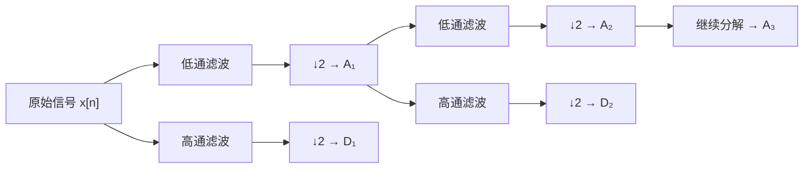
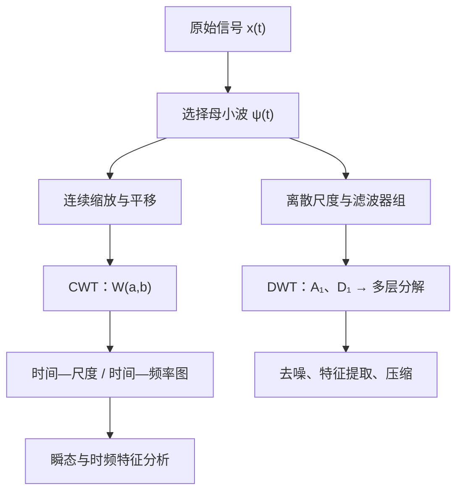

# 小波分析基础：从傅里叶变换到 CWT 与 DWT

小波分析（Wavelet Analysis）用于分析**非平稳信号、瞬态信号和局部变化特征**。它把一个具有局部性的波形不断缩放、平移，并在不同时间位置和尺度上与信号匹配，从而回答“什么时候出现了什么样的局部频率特征”。

## 一、为什么有傅里叶变换还需要小波

对信号 $x(t)$，傅里叶变换为：

$$
X(f) = \int_{-\infty}^{+\infty} x(t)e^{-j2\pi ft}\,dt
$$

它主要回答“信号包含哪些频率成分”。例如：

$$
x(t)=\sin(2\pi10t)+0.5\sin(2\pi50t)
$$

可以在频谱中看到 $10\ \text{Hz}$ 与 $50\ \text{Hz}$。但若信号分段变化：

$$
x(t)=
\begin{cases}
\sin(2\pi10t), & 0<t<1\\
\sin(2\pi50t), & 1<t<2
\end{cases}
$$

傅里叶变换仍会显示两个频率，却不告诉我们它们各在何时出现。因此，它有良好的频率分辨能力，却没有时间定位能力。

## 二、从傅里叶变换到 STFT

短时傅里叶变换（Short-Time Fourier Transform，STFT）把信号乘以随时间移动的窗口：

$$
\operatorname{STFT}_x(\tau,f)=\int x(t)w(t-\tau)e^{-j2\pi ft}\,dt
$$

其中 $w(t-\tau)$ 是位于 $\tau$ 附近的窗口函数。STFT 因而能描述时间和频率，例如判断某个 $50\ \text{Hz}$ 成分是否在 $1.2\ \text{s}$ 附近出现。

它的局限也很明确：窗口长度固定。高频周期短，通常希望短窗口以提升时间定位；低频周期长，通常希望长窗口以提升频率分辨。固定窗口无法同时适配这两类需求。

## 三、小波分析的核心思想

小波不使用固定大小的分析窗口，而是让窗口随尺度变化：

$$
\boxed{\text{高频使用短窗口，低频使用长窗口}}
$$

也就是说，高频侧优先时间分辨率，低频侧优先频率分辨率。这种按尺度组织信息的思路称为**多分辨率分析**（Multi-Resolution Analysis，MRA）。小波没有突破时间—频率不确定性约束，而是以更适合信号特征的方式分配这种分辨能力。

## 四、什么是“小波”

普通正弦波 $\sin(\omega t)$ 理论上无限延伸；小波则集中在有限的时间邻域内，同时具有振荡性和时间局部性。以 Morlet 小波为例，可粗略写为：

$$
\psi(t)=e^{-\frac{t^2}{2}}e^{j\omega_0t}
$$

即“振荡波形 × 局部包络”。这使它适合描述瞬态冲击、局部振荡、突变等非平稳特征。

## 五、母小波、尺度和平移

选定的基本小波函数 $\psi(t)$ 称为**母小波**（Mother Wavelet）。主要对它做两种操作：

- 平移：$\psi(t-b)$。$b$ 是时间位置；将模板移动到信号不同位置以寻找局部特征。
- 缩放：$\psi(t/a)$。$a$ 是尺度；$a$ 越小，小波越压缩、振荡越快，通常对应高频；$a$ 越大，小波越拉长，通常对应低频。

因此有近似关系：

$$
f\propto\frac{1}{a}
$$

## 六、连续小波变换 CWT

一种常见的连续小波变换（Continuous Wavelet Transform，CWT）归一化写法为：

$$
W(a,b)=\frac{1}{\sqrt{|a|}}\int_{-\infty}^{+\infty}x(t)\psi^*\left(\frac{t-b}{a}\right)dt
$$

其中 $x(t)$ 为原始信号，$\psi(t)$ 为母小波，$a$ 为尺度，$b$ 为时间位置，$\psi^*$ 为复共轭，$W(a,b)$ 为小波系数。不同资料也会因归一化约定使用 $1/a$；核心含义不变：它衡量信号与某个缩放、平移后小波的匹配程度。

### CWT 如何“匹配”

可把 CWT 直观地看作内积：

$$
\boxed{W(a,b)=\langle x,\psi_{a,b}\rangle}
$$

离散地说，就是对齐、逐点相乘、再求和。若

$$
x=[1,2,1,-1,-2,-1],\qquad \psi=[1,2,1,-1,-2,-1]
$$

则内积为 $12$，表示结构高度匹配；若正负项相互抵消，$W(a,b)\approx0$，则匹配较弱。

::: important CWT 不是寻找一个“最佳小波”

CWT 用同一个母小波的不同尺度和位置，计算整个时间—尺度平面的匹配强度；它不是选出一个小波来替代原信号。

:::

## 七、尺度为何可对应频率

若母小波主要振荡频率为 $f_0$，缩放后有：

$$
\cos\left(2\pi f_0\frac{t}{a}\right)=\cos\left(2\pi\frac{f_0}{a}t\right)
$$

所以频率随 $a$ 的增大而降低。在采样间隔为 $\Delta t$ 的实际计算中，常将尺度换算为伪频率：

$$
f_a=\frac{f_c}{a\Delta t}=\frac{f_cf_s}{a}
$$

其中 $f_c$ 是母小波中心频率，$f_s=1/\Delta t$ 是采样频率。之所以称为“伪频率”，是因为小波覆盖一定频带，而非理想单频正弦波。

::: info 尺度不等于频率

CWT 直接改变的是尺度 $a$。尺度与频率通常呈反比，但它们的换算依赖所选母小波及采样间隔。

:::

## 八、CWT 时频图与瞬态特征

对尺度 $a_1,\ldots,a_m$ 和时间位置 $b_1,\ldots,b_n$ 分别计算系数，可得到二维矩阵：

$$
W=\begin{bmatrix}
W(a_1,b_1)&\cdots&W(a_1,b_n)\\
\vdots&\ddots&\vdots\\
W(a_m,b_1)&\cdots&W(a_m,b_n)
\end{bmatrix}
$$

绘制 $|W(a,b)|$ 或 $|W(a,b)|^2$，就是常见的 scalogram（小波时频图）。若 $t=1.2\ \text{s}$、约 $80\ \text{Hz}$ 的区域颜色很亮，表示该处有较强的对应局部特征。

短时冲击会包含丰富的高频成分，因此常在时频图中呈现为时间上集中的高频能量。小波分析常用于机械振动与故障诊断、地震、生物医学、雷达和通信中的非平稳信号。

## 九、为什么还需要离散小波变换 DWT

CWT 要扫描大量 $(a,b)$ 组合，结果冗余、计算量较大。离散小波变换（Discrete Wavelet Transform，DWT）只在规则的离散尺度和位置上采样；经典正交 DWT 常使用二进尺度 $a=2^j$。

工程实现通常采用 Mallat 滤波器组：

```text
                    ┌── 低通滤波 ── ↓2 ── A₁
原始信号 x[n] ──────┤
                    └── 高通滤波 ── ↓2 ── D₁
```

- $A_1$ 是**近似系数**（Approximation Coefficients），表示较低频的整体趋势。
- $D_1$ 是**细节系数**（Detail Coefficients），表示较高频的快速变化和局部细节。
- $\downarrow2$ 表示二倍下采样。

随后只继续分解低频支路：

```text
x
├── D₁
└── A₁
    ├── D₂
    └── A₂
        ├── D₃
        └── A₃
```

因此 $x$ 可按层写为：

$$
x\rightarrow A_J+D_J+D_{J-1}+\cdots+D_1
$$



## 十、DWT 的频带如何理解

若采样频率 $f_s=1000\ \text{Hz}$，奈奎斯特频率为 $500\ \text{Hz}$。在理想二叉滤波器组的近似下：

| 系数 | 对应频带（Hz） |
| --- | --- |
| $D_1$ | $250\sim500$ |
| $D_2$ | $125\sim250$ |
| $D_3$ | $62.5\sim125$ |
| $A_3$ | $0\sim62.5$ |

::: note 频带是理想化理解

真实小波滤波器不是理想砖墙滤波器；不同小波、边界延拓方法和滤波器响应都会带来过渡带。因此这些频段适合建立直觉，不能替代实际频率响应分析。

:::

## 十一、为什么滤波后要下采样

一层滤波后，有效频带约缩小一半，因此可以二倍下采样而不必保留原始采样率。例如 $[1,2,3,4,5,6,7,8]$ 二倍下采样后为 $[1,3,5,7]$。这让每层的系数数量大约减半，是 DWT 计算效率高、冗余低的重要原因。

## 十二、用 Haar 小波直观理解 DWT

Haar 小波最简单的分析滤波器为：

$$
h=\left[\frac{1}{\sqrt2},\frac{1}{\sqrt2}\right],\qquad
g=\left[\frac{1}{\sqrt2},-\frac{1}{\sqrt2}\right]
$$

忽略归一化后，可粗略看成低通 $[1,1]$、高通 $[1,-1]$。对 $x=[4,6,10,12]$，两组样本的和与差分别为：

$$
A_1=[10,22],\qquad D_1=[-2,-2]
$$

所以近似系数可理解为局部平均趋势，细节系数可理解为局部变化程度。这也解释了 DWT 细节系数对突变、冲击、边缘和高频噪声通常较敏感。

## 十三、母小波与滤波器的关系

DWT 的计算形式是低通、高通滤波与下采样，但母小波并未消失：高通滤波器 $g[n]$ 对应小波函数 $\psi(t)$，低通滤波器 $h[n]$ 对应尺度函数 $\phi(t)$。选择 Haar、Daubechies、Symlet 或 Coiflet，实质上就是选择不同的滤波器系数和局部特征描述方式。

## 十四、CWT 和 DWT 的区别

| 对比 | CWT | DWT |
| --- | --- | --- |
| 尺度与位置 | 连续或密集采样 | 规则的离散采样 |
| 输出 | 时间—尺度二维系数矩阵 | 各层近似与细节系数 |
| 冗余与计算量 | 较高、较大 | 较低、较小 |
| 典型用途 | 时频分析、瞬态定位 | 去噪、压缩、特征提取、多尺度分析 |

可简记为：CWT 关注“局部频率特征何时出现”，DWT 关注“信号在不同尺度和频带上分别有什么信息”。



## 十五、几个容易混淆的地方

::: info CWT 中的“卷积”可先理解为相关匹配

小波变换与卷积关系紧密；建立直觉时，把它理解为信号与当前小波模板做内积、衡量局部相似程度通常更直接。

:::

::: important 分辨率存在权衡

时间和频率之间存在类似 $\Delta t\Delta f\ge C$ 的约束。小波的优势不是同时无限提高两种分辨率，而是让高频侧优先时间定位、低频侧优先频率辨别。

:::

## 十六、一句话理解小波分析

傅里叶变换问“信号里有什么频率”；CWT 问“这些局部频率特征何时出现”；DWT 则把信号逐层拆成不同尺度上的近似信息和细节信息。

归根结底，小波分析使用具有时间局部性的基函数，从不同时间尺度观察同一个信号；这正是它与普通傅里叶分析的关键区别。

## 参考资料

- [MathWorks：Continuous Wavelet Transform and Scale-Based Analysis](https://www.mathworks.com/help/wavelet/gs/continuous-wavelet-transform-and-scale-based-analysis.html)
- [MathWorks：Continuous and Discrete Wavelet Transforms](https://www.mathworks.com/help/wavelet/gs/continuous-and-discrete-wavelet-transforms.html)
- [PyWavelets：Discrete Wavelet Transform](https://pywavelets.readthedocs.io/en/latest/ref/dwt-discrete-wavelet-transform.html)
- S. Mallat, *A Wavelet Tour of Signal Processing*
- I. Daubechies, *Ten Lectures on Wavelets*
