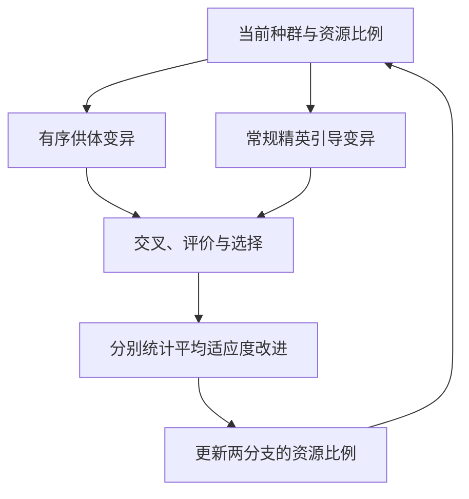
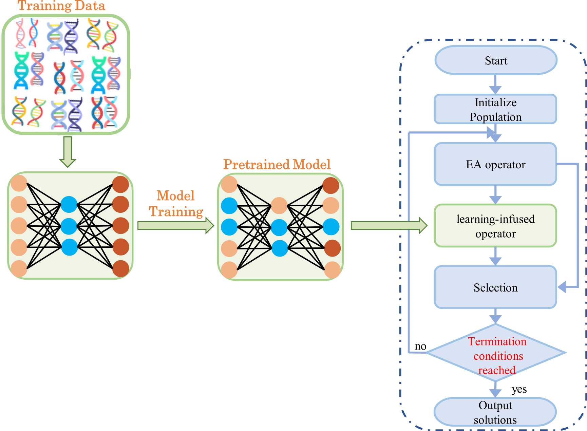
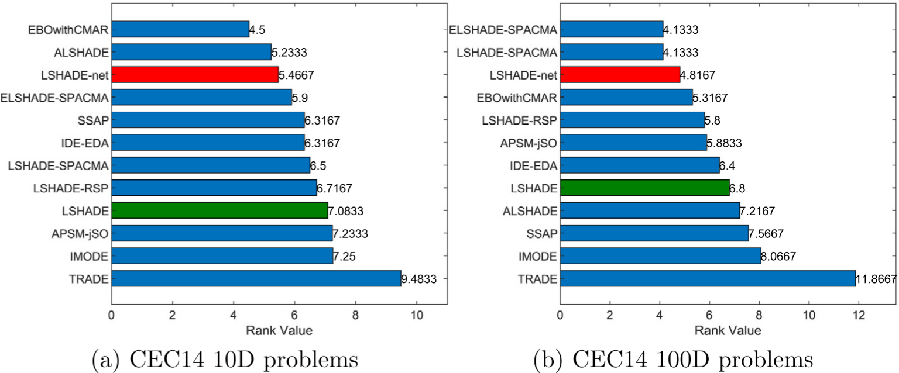

# 一周论文分享：RDE 与 LIO，进化算法怎样利用搜索经验

进化算法每次搜索都会留下经验：哪些参数产生过好解，哪种策略最近更有效，以及一个较差的解怎样变成了较好的解。这些信息除了用于保留当前最优解，还能怎样帮助下一次搜索？

这篇记录整理自 **2026 年 9 月 17 日的组会分享**，对应 9 月 14—20 日这一周。两篇论文给出了不同的回答：RDE 把反馈用于协调已有搜索策略，LIO 则从历史进化数据中训练一个能够直接提出候选解的网络。把它们放在一起读，关注点就从“又增加了什么组件”转向了“经验以什么形式留下，又影响了哪个搜索环节”。

## 本周读的两篇论文

1. **RDE：重构差分进化。** Tao 等，2024，[arXiv:2404.16280v1](https://arxiv.org/abs/2404.16280v1)。关注如何重组已有机制，并根据收益分配搜索资源。
2. **LIO：将学习融入进化计算。** Bian 等，[Swarm and Evolutionary Computation 95 (2025), 101930](https://doi.org/10.1016/j.swevo.2025.101930)。关注如何从成功进化样本中学习，直接生成候选解。

LIO 的正式发表年份是 **2025**；阅读材料文件名中的 2024 不能作为正式引用年份。下文实验结果均来自论文，未另行复现。

如果还不熟悉差分进化，可以先看[经典 DE](/ai-algorithms/optimization/frontier-algorithms/de-series/de.html)。本文只保留理解两篇论文所需的机制；JADE、SHADE 等方法的关系另见 [DE 系列](/ai-algorithms/optimization/frontier-algorithms/de-series/)。

## RDE：让有效策略协同工作

### 重构的动机：组件越多，效果未必越好

差分进化已经积累了很多有效机制：让搜索参考优秀个体、记录成功参数、保存历史个体、逐渐缩小种群，以及改变供体的选择概率。RDE 提出的出发点是，这些机制分别有效，不代表全部叠在一起就能获得最好的组合。

例如，一个机制已经让种群向优秀区域集中，再增加一个偏向开发的机制，可能进一步加快局部改进，也可能使探索不足。这里的关键是组件如何配合，以及有限评价预算怎样分给不同搜索行为。

RDE 保留了成功历史参数自适应、外部档案和线性种群缩减等机制，又组合两种变异策略，扩展基于排名的选择压力，并采用 Cauchy 扰动。它的价值需要放在这套组合中理解，不能把每个组成部分都说成 RDE 首创。（原文第 II 节）

### 两种变异，利用供体的方式不同

第一种是常见的 `current-to-pbest/1`：

$$
\mathbf v_i=\mathbf x_i
+F_i(\mathbf x_{pbest}-\mathbf x_i)
+F_i(\mathbf x_{r_1}-\mathbf x_{r_2}).
$$

其中，$\mathbf x_i$ 是当前个体，$F_i$ 控制差分的尺度，$\mathbf x_{pbest}$ 从优秀个体集合中选取；$\mathbf x_{r_1}$ 和 $\mathbf x_{r_2}$ 提供差分信息，后者还可以来自外部档案。直观上，前一项差分把搜索引向优秀区域，后一项带来扰动。

第二种 `current-to-order-pbest/1` 将选出的三个供体按目标值排序，分别记为 $\mathbf x_b,\mathbf x_m,\mathbf x_w$，再构造：

$$
\mathbf v_i=\mathbf x_i
+F_i(\mathbf x_b-\mathbf x_i)
+F_i(\mathbf x_m-\mathbf x_w).
$$

这里的 $b,m,w$ 只是**这三个供体中的较好、中间和较差者**，不是全种群的固定名次。排序后，差分向量的角色与适应度联系起来，更明确地利用了供体之间的优劣关系。不过，“从较差点指向较好点”并不等于目标函数的负梯度，也不能保证新点一定改善。（原文式 (2)、(5)）

### 经验怎样决定下一轮资源

RDE 没有一直让两个分支各占一半，而是观察它们带来的平均适应度改进，再调整下一代的资源比例。首代或两个分支都没有改进时，论文给出的回退是各占 $0.5$。（原文第 II-B.3 节）

这张图只概括双策略反馈，不是完整算法流程。

用一个假设例子理解“平均”为什么重要：分支 A 执行 80 次，累计改善 8；分支 B 执行 20 次，累计改善 4。A 的总收益更大，但每次平均收益分别为 $0.1$ 和 $0.2$。按平均收益判断，B 更值得获得后续资源。这个例子用于说明统计口径，不是论文实验数据，也不替代原算法的实现细节。

这里可以看到 RDE 使用经验的方式：**更新规则由人设计，规则读取的统计量由搜索过程提供。** 它能在一次运行中适应搜索状态，但并没有因此得到一个跨问题预训练的候选解生成模型。

### 实验支持什么，尚不能支持什么

论文第 III 节在 CEC2024 竞赛基准上比较了 RDE、LSHADE-RSP、iLSHADE-RSP、HSES、EBOwithCMAR 和 LSHADE。基准含 29 个函数，评价预算为 $10000D$，$D$ 表示问题维数；搜索范围为 $[-100,100]^D$。作者使用均值、标准差和 Wilcoxon 秩和检验讨论结果。

Table I 中可以看到，RDE 在一些问题上有优势，但并非逐题领先。例如 F29 上，RDE 与 LSHADE 的平均误差分别约为 $8.48\times10^2$ 和 $1.98\times10^3$；在 F4 上则分别为 $7.65$ 和 $6.70$。这两个例子说明效果依赖问题，也不能仅凭均值大小替代统计检验。

::: note 阅读这份预印本时的核对点
实验设置写了 25 次独立运行，统计检验段又写了 51 次；Table I 列出 29 个函数，底部 W/T/L 汇总却合计为 30。式 (8) 的迭代代次下标和式 (11)–(12) 的参数标签也存在不一致。因此本文不据其汇总计算“胜率”，不把有歧义的公式直接当成实现规范。进一步复现需要核对作者代码和采用的版本。
:::

作者的[竞赛发布仓库](https://github.com/SichenTao/IEEE-WCCI-CEC-2024-Competition-RDE)另记录了 RDE 后续获得 IEEE WCCI / CEC 2024 数值优化精度与速度竞赛有界单目标赛道亚军奖。这是后续参赛方案的成绩，不代表预印本与最终竞赛代码逐行一致。

我的理解是，RDE 展示了重组已有机制的实际价值，但这些比较尚不足以分离每个组件的贡献。若要回答“真正起作用的是有序供体，还是资源分配”，仍需要控制其他因素的消融实验。更详细的机制笔记见 [RDE 专题](/ai-algorithms/optimization/frontier-algorithms/de-series/rde.html)。

## LIO：把成功进化变成可学习的数据

### 从记录参数，转向学习解到解的映射

LIO 进一步利用了进化过程留下的另一种信息：**一个解怎样变成另一个更好的解。** 对最小化问题，若父代 $\mathbf x$ 与子代 $\mathbf x^+$ 满足

$$
f(\mathbf x^+)<f(\mathbf x),
$$

就可以把 $(\mathbf x,\mathbf x^+)$ 当作成功进化样本。将许多这样的样本汇集起来，网络学习的目标是

$$
\operatorname{Net}_{\theta}(\mathbf x)\approx\mathbf x^+.
$$

作者把从数据中提取的综合规律称为 *synthesis patterns*。在实现层面，可以把它理解为用成功解对监督训练一个映射，再将这个映射作为搜索算子使用。（原文第 3.1—3.3 节）

论文从三个算法在 CEC14 的搜索过程中收集数据，分别构建约 270 万对的 10 维数据集和约 1200 万对的 100 维数据集。网络采用带残差连接的 MLP，以均方误差拟合目标解；其主体包含五个双隐藏层块，输入、输出维度与问题维度一致。

值得区分两个目标：训练时缩小的是预测解与样本目标解之间的距离；优化时关心的是目标函数值。这两者并不等价，所以网络输出仍然需要真实评价。

### 网络参与提议，目标函数负责筛选

*图源：Bian 等，原文 Fig. 2；使用组会材料中的图示。左侧是训练过程，右侧是网络接入后的进化过程。*

以原文 Algorithm 2 的 LSHADE-net 为例，原有算法先生成试验向量 $\mathbf u_i$。轮到被选中的个体时，网络再提出

$$
\mathbf u'_i=\operatorname{Net}(\mathbf u_i).
$$

经过边界处理，只有 $f(\mathbf u'_i)<f(\mathbf u_i)$ 时，才用网络输出替换原试验向量。之后还要将保留下来的试验向量与父代比较，决定是否进入下一代。这里有两次不同的比较，不能简写成“网络输出直接替换父代”。

网络调用由 $\operatorname{mod}(i,n_p)=0$ 触发，默认 $n_p=5$。它是**每代内部按个体索引设置的调用间隔**，不是每五代调用一次，也不是给每个个体独立抛一次概率为 $1/5$ 的硬币。

这一设计把学习模型放到了候选解生成环节：网络输出的是解向量，而非 $F$、$CR$ 或算子编号。真实目标函数仍然决定是否接受它。因此，即使某次网络建议失效，也可以保留原试验解；但额外评价和推理的成本仍然存在。

## LIO 的结果：有效性、迁移和成本要分开看

论文第 4.1 节给出的优化评价预算为 $10000D$，每个基准函数独立运行 51 次，并使用 Friedman 检验、Wilcoxon 秩和检验与 Bonferroni 校正分析结果。理解这些实验时，可以依次问三个问题。

### 能否接到不同算法上

在 CEC14 的 10 维问题上，作者分别给 ABC、ACO、BSO、CSA、GWO、PSO 和 TLBO 接入学习算子。Fig. 4 中，七组 EA-net 的平均秩都低于原 EA；原文报告的七组 Friedman 检验均达到 $0.05$ 显著性水平。（第 4.2 节）

它支持“同一个学习框架可以帮助多种搜索算法”这一判断。不过，这组测试仍在构建训练数据所用的 CEC14 问题集上进行。**跨算法有效与跨问题分布泛化是两个问题。**

### 面对更强的基线，提升还在不在

接着，作者构造 LSHADE-net，与原 LSHADE 及十个有竞争力的方法比较。

*图源：Bian 等，原文 Fig. 5；使用组会材料中的图示。平均秩越低，表示在这组比较中的整体排序越靠前。*

| 设置 | LSHADE 平均秩 | LSHADE-net 平均秩 | 图中仍排在 LSHADE-net 前的方法 |
| --- | ---: | ---: | --- |
| CEC14，10 维 | 7.0833 | 5.4667 | EBOwithCMAR、ALSHADE |
| CEC14，100 维 | 6.8000 | 4.8167 | ELSHADE-SPACMA、LSHADE-SPACMA |

结合原文第 4.3 节及 Fig. 6 的逐函数比较，学习算子对 LSHADE 的增强是有实验支持的；但平均秩更低不等于每个函数都更好，也不能把多算法 Friedman 总体检验的显著性直接当作任意两算法之间的显著差异。两幅图更直观地说明：LIO 可以增强强基线，同时仍有其他方法在整体排序上领先。

### 换一组问题时，是否还需要学习

面对 CEC17，作者没有仅用冻结模型做零样本测试，而是设计了 *self-evolving*：先用当前算法与网络产生新问题上的数据，再微调网络，重复三轮。微调冻结前六层，更新后四层；10 维与 100 维设置分别使用约 6000 对和 11 万对数据。（第 3.5、4.4 节）

因此，这部分证据更适合表述为：**在相关连续优化基准之间，预训练知识经过目标问题数据微调后仍能发挥作用。** 它还不能直接保证从 CEC 基准迁移到工程问题，也没有证明完全不接触新问题数据就能保持收益。

成本同样不能忽略。第 5.3 节报告，CPU 上 LSHADE 和 LSHADE-net 的总运行时间分别为 203.1599 秒和 472.5301 秒，按报告总值计算约为原来的 2.33 倍。这是论文实验环境中的算法运行时间比较，不应视为含数据生成、预训练和微调的完整成本。

对这类方法而言，相同函数评价预算、相同墙钟时间和包含训练开销的总成本，是三种不同的公平性口径。网络建议只有带来足够收益，才值得消耗这些资源。

## 放在一起看：经验改变了什么

| 比较角度 | RDE | LIO |
| --- | --- | --- |
| 主要利用的信息 | 运行中的成功参数、个体排名与分支改进收益 | 历史搜索中的成功解对，以及新问题上的微调数据 |
| 经验的保存形式 | 档案、统计量与参数记忆 | 数据集与训练后的网络参数 |
| 直接影响的环节 | 供体选择、参数采样和策略资源分配 | 候选解生成 |
| 规则从哪里来 | 人工设计更新形式，运行反馈更新数值 | 人工设计训练框架，数据拟合解到解的映射 |
| 阅读时的主要追问 | 组合收益来自哪个组件，资源分配是否稳健 | 学到的映射能迁移多远，额外成本能否回收 |

这不是“RDE 必然进化成 LIO”的技术谱系，也不是神经网络一定优于自适应规则的判断。两篇论文测试设置不同，没有直接对照实验，不能用各自的排名判断谁更强。

它们共同提示了一个值得继续追的问题：进化算法产生的数据，究竟应该被压缩成少量反馈统计，还是值得训练成可以复用的搜索知识？前者容易嵌入算法，后者可能表达更复杂的关系，但也引入数据、泛化与计算成本问题。

## 留给后续的三个问题

**第一，学习输入是否足够描述当前搜索？** LIO 的网络主要接收单个解向量。相同坐标在不同目标函数、不同种群状态下，合理的下一步可能不同。能否引入相对位置、种群多样性或搜索阶段，是从这次阅读产生的研究问题，不是本文已经验证的改进方案。

**第二，怎样衡量一次网络调用值不值得？** 可以同时观察被接受的比例、带来的改进、额外函数评价数和推理时间。只看成功次数，可能忽略少量大改进；只看最终误差，又可能掩盖很高的时间成本。

**第三，怎样更有说服力地检验迁移？** 后续实验应明确区分训练问题、用于微调的问题与最终测试问题，并对比不微调、微调和从零训练。对于目标评价昂贵的任务，还要把生成学习数据的费用计入总预算。

这周先留下的认识是：判断“学习是否帮助了进化”，需要同时说清楚学了什么、改变了哪里，以及付出了多少代价。下一步阅读可以沿着[学习驱动的 DE](/ai-algorithms/optimization/frontier-algorithms/de-series/learning-driven-de.html)继续展开，比较学习参数、选择算子与直接生成解这几种介入方式。

## 参考资料

1. Tao, S.; Zhao, R.; Wang, K.; Gao, S. (2024). [An Efficient Reconstructed Differential Evolution Variant by Some of the Current State-of-the-art Strategies for Solving Single Objective Bound Constrained Problems](https://arxiv.org/abs/2404.16280v1). arXiv:2404.16280v1。本文依据第 II—III 节及 Table I 讨论机制与结果。
2. Bian, K.; Zhang, J.; Han, H.; Zhou, J.; Sun, Y.; Cheng, S. (2025). [Learning-infused optimization for evolutionary computation](https://doi.org/10.1016/j.swevo.2025.101930). *Swarm and Evolutionary Computation*, 95, 101930。本文依据第 3—5 节、Algorithm 2—3、Fig. 2、4—6 讨论方法、实验与成本。
3. Tao 等：[RDE 竞赛发布仓库](https://github.com/SichenTao/IEEE-WCCI-CEC-2024-Competition-RDE)，用于核对后续参赛成绩与代码入口，查阅于 2026-09-21。
