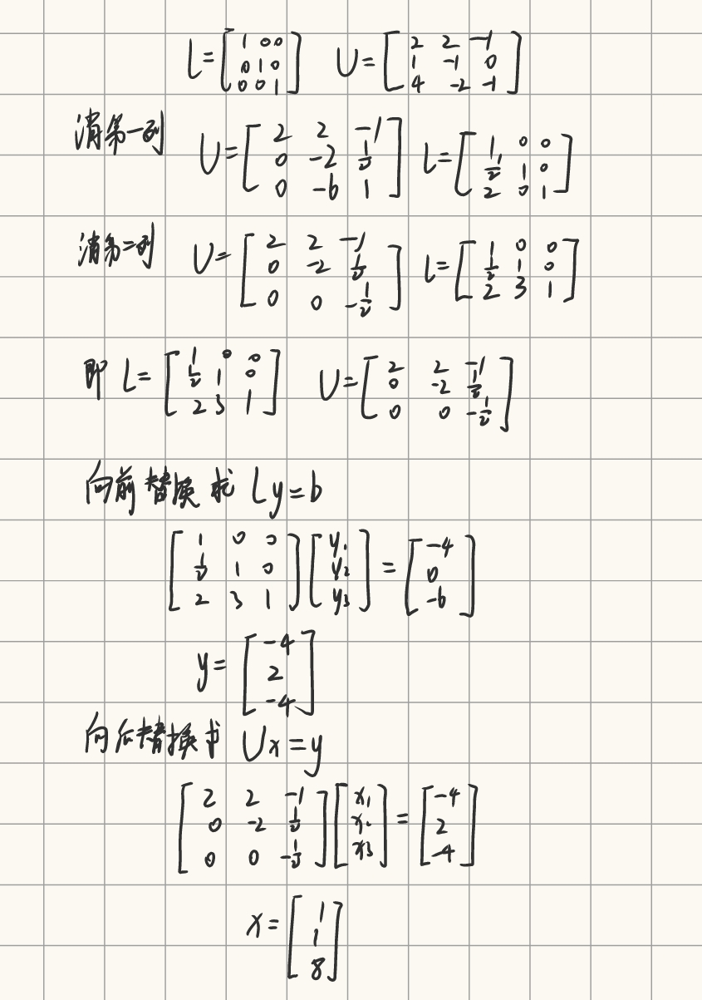
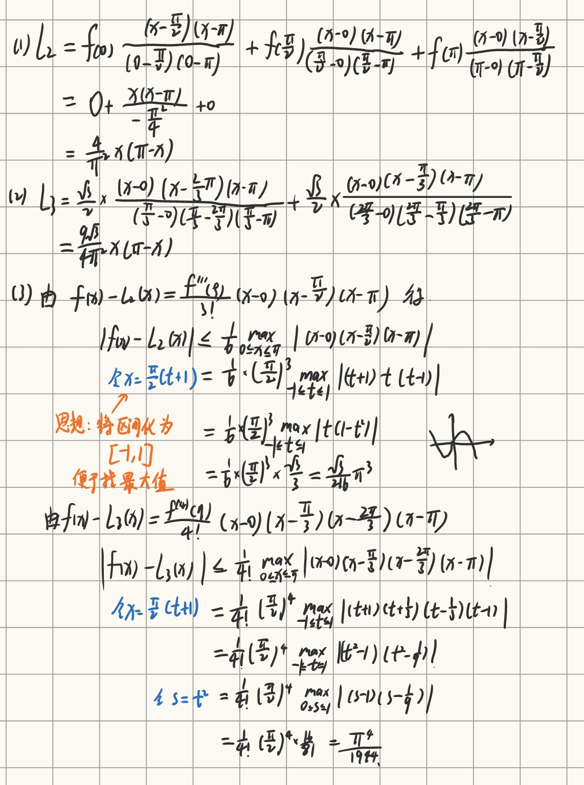

# 计算方法·期末考试版

## 1. 误差的分类

```markmap
---
markmap:
  colorFreezeLevel: 2
---
# 误差的分类

## 模型误差

- 在将实际问题抽象为数学模型时，由于 ==对问题的简化或假设== 而产生的误差

## 观测误差

- 通过仪器或人工对物理量进行测量时，由于 ==仪器精度、环境干扰或人为操作== 等因素导致的误差

## 截断误差（方法误差）

- 在数值计算中，用 ==近似方法替代精确算法== 时产生的误差（如无穷级数求和时取前若干项）

## 舍入误差

- 由于计算机或计算器对数值进行 ==有限位存储和运算== （如四舍五入）而产生的误差
```

## 2. 求近似值的有效数字位数

定义:  若 $| x-x^* | \leq 0.5 \times 10^{-k}$ , 则 x 从左起第一个非零数字到第 k 位数字均为有效数字，共 k 位。

判定规则：

1. 非零开头数：从左起第一个非零数字开始，到最末一位数字为止，所有数字均为有效数字
2. 科学计数法表示的数：形如 $a \times 10^n$ 时，有效数字由数字 a 决定
3. 整数末尾的零：需说明精度
    - 如果末尾零是有效数字
    - 如果仅为定位作用，不算有效数字
4. 运算结果的有效数字：
    - 加减：以参与运算中精度最低的数为准，如：$3.14+2.5=5.64$
    - 乘除：以参与运算中有效数字位数最少的数为准，如：$1.23 \times 0.0045=0.0055$

## 3. 秦九韶法求多项式的值

:::important 计算题
求 $f(x)=2+x-x^2+3x^4$ 在点 $x_0=2$ 处的值

:::

## 4. LU分解法求方程的解

:::important 计算题
$$
\begin{bmatrix}
2 & 2 & -1 \\
1 & -1 & 0 \\
4 & -2 & -1
\end{bmatrix}
\begin{bmatrix}
x_1 \\ x_2 \\ x_3
\end{bmatrix}
=
\begin{bmatrix}
-4 \\ 0 \\ -6
\end{bmatrix}
$$


:::

## 5. 向量范数与矩阵范数

| 类型       | 向量 $1$ 范数 $\|\mathbf{x}\|_1$             | 向量 $\infty$ 范数 $\|\mathbf{x}\|_\infty$      | 矩阵 $1$ 范数 $\|\mathbf{A}\|_1$               | 矩阵 $\infty$ 范数 $\|\mathbf{A}\|_\infty$     |
|------------|--------------------------------------------|-----------------------------------------------|----------------------------------------------|-----------------------------------------------|
| **公式**   | $\sum\limits_{i=1}^{n}\|x_i\|$            |   $\max\limits_i \|x_i\|$                         | $\max\limits_j \sum\limits_i \|a_{ij}\|$      | $\max\limits_i \sum\limits_j \|a_{ij}\|$        |
| **本质**   | 元素绝对值之和                                | 最大元素绝对值                                 | 最大列元素绝对值之和                         | 最大行元素绝对值之和                          |
| **示例**   | $\lVert[2,-3,0,5]\rVert_1 = 10$             | $\lVert[2,-3,0,5]\rVert_{\infty} = 5$                 | $\left\lVert\begin{bmatrix}1 & -2 \\ 3 & 4 \\ -1 & 0\end{bmatrix}\right\rVert_1 = 6$ | $\left\lVert\begin{bmatrix}1 & -2 \\ 3 & 4 \\ -1 & 0\end{bmatrix}\right\rVert_{\infty} = 7$ |

| 类型         | 公式                          | 本质                                                                 | 计算示例（以向量 $\mathbf{x} = [2, -3, 5]$ 和矩阵 $A = \begin{bmatrix}1&-2\\3&4\end{bmatrix}$ 为例）                |
|--------------|-------------------------------|----------------------------------------------------------------------|-----------------------------------------------------------------------------|
| **向量二范数** | $\lVert \mathbf{x} \rVert_2 = \sqrt{\sum_{i=1}^{n} \|x_i\|^2}$ | 欧氏空间中向量的长度（模长） | $\lVert \mathbf{x} \rVert_2 = \sqrt{2^2 + (-3)^2 + 5^2} = \sqrt{38} \approx 6.16$ |  
| **矩阵二范数（谱范数）** | $\lVert A \rVert_2 = \sqrt{\lambda_{\text{max}}(A^T A)}$ | 矩阵 $A^T A$ 的最大特征值的平方根，反映矩阵对向量的最大“拉伸”能力 | 1. 计算 $A^T A = \begin{bmatrix}1&3\\-2&4\end{bmatrix}\begin{bmatrix}1&-2\\3&4\end{bmatrix} = \begin{bmatrix}10&10\\10&20\end{bmatrix}$ <br> 2. 求特征值：$\lambda_1 = 30, \lambda_2 = 0$ <br> 3. $\lVert A \rVert_2 = \sqrt{30} \approx 5.48$ |

## 6. 雅可比迭代法与高斯-赛德尔迭代法

### 迭代矩阵

设线性方程组为 $Ax = b$，其中 $A \in \mathbb{R}^{n \times n}$ 为非奇异矩阵。将 $A$ 分解为：
- $D = \mathrm{diag}(a_{11}, a_{22}, \dots, a_{nn})$，对角元素构成的对角矩阵；
- $L$ 为严格下三角矩阵（主对角线元素为 $0$）；
- $U$ 为严格上三角矩阵（主对角线元素为 $0$）；满足：$A = D + L + U$

==雅可比迭代矩阵: $J=-D^{-1}(L+U)$==

雅可比迭代格式：$x^(k+1) = Jx^{(k)}+D^{-1}b$

==高斯-赛德尔迭代矩阵：$G=-(D+L)^{-1}U$==

高斯赛德尔迭代公式：$x^(k+1) = Gx^{(k)}+(D+L)^{-1}b$

## 7. 拉格朗日插值多项式

### 公式

拉格朗日插值基函数：$l_i(x) = \prod\limits_{\substack{j=0 \\ j \ne i}}^{n} \frac{x - x_j}{x_i - x_j}$

n次拉格朗日插值多项式（n+1个点）：$L_n(x) = \sum\limits_{i=0}^{n} f(x_i) \cdot l_i(x)$

2次拉格朗日插值多项式（3个点）：
$$
L_2(x) = f(x_0)l_0(x) + f(x_1)l_1(x) + f(x_2)l_2(x) \\
l_0(x) = \frac{(x - x_1)(x - x_2)}{(x_0 - x_1)(x_0 - x_2)} \\
l_1(x) = \frac{(x - x_0)(x - x_2)}{(x_1 - x_0)(x_1 - x_2)} \\
l_2(x) = \frac{(x - x_0)(x - x_1)}{(x_2 - x_0)(x_2 - x_1)}
$$
3次拉格朗日插值多项式（4个点）：
$$
L_3(x) = f(x_0)l_0(x) + f(x_1)l_1(x) + f(x_2)l_2(x) + f(x_3)l_3(x) \\
l_0(x) = \frac{(x - x_1)(x - x_2)(x - x_3)}{(x_0 - x_1)(x_0 - x_2)(x_0 - x_3)} \\
l_1(x) = \frac{(x - x_0)(x - x_2)(x - x_3)}{(x_1 - x_0)(x_1 - x_2)(x_1 - x_3)} \\
l_2(x) = \frac{(x - x_0)(x - x_1)(x - x_3)}{(x_2 - x_0)(x_2 - x_1)(x_2 - x_3)} \\
l_3(x) = \frac{(x - x_0)(x - x_1)(x - x_2)}{(x_3 - x_0)(x_3 - x_1)(x_3 - x_2)}
$$

### 插值余项（误差估计）
n+1阶导数存在时：
$$
R_n(x) = f(x) - L_n(x) = \frac{f^{(n+1)}(\xi)}{(n+1)!} \cdot \prod_{i=0}^{n}(x - x_i)
$$

:::important 计算题
已知 $f(x)=\sin x, x\in[0,\pi]$。
(1)以 $x_0 = 0, x_1=\frac{\pi}{2}, x_2 = \pi$ 为插值节点，求 $f(x)$ 的 2 次插值多项式 $L_2(x)$，并作出 $f(x)$ 和 $L_2(x)$ 的图像；
(2)以 $x_0 = 0, x_1=\frac{\pi}{3}, x_2=\frac{2\pi}{3}, x_3 = \pi$ 为插值节点，求 $f(x)$ 的 3 次插值多项式 $L_3(x)$，并作出 $f(x)$ 和 $L_3(x)$ 的图像；
(3)估计插值误差 $|f(x) - L_2(x)|$ 和 $|f(x) - L_3(x)|$ 的上界。


:::

## 8. 埃尔米特插值

